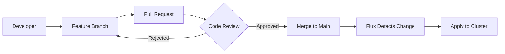

# How to Implement GitOps Approval Workflows with Flux CD

Author: [nawazdhandala](https://github.com/nawazdhandala)

Tags: Flux CD, GitOps, Kubernetes, Approval Workflow, Pull Requests, CI/CD

Description: A practical guide to implementing approval workflows with Flux CD using Git-based review processes and gating mechanisms.

---

GitOps means Git is the source of truth. That also means Git's collaboration features - pull requests, reviews, and branch protections - become your deployment approval workflow. This guide shows how to implement structured approval workflows with Flux CD.

## The Approval Model

In a GitOps approval workflow, no change reaches the cluster without going through a pull request. Flux CD watches a specific branch, and only changes merged to that branch are applied.



## Branch Protection Rules

The foundation of approval workflows is branch protection. Configure your main branch to require reviews before merging.

```bash
# GitHub CLI: configure branch protection
gh api repos/my-org/fleet-infra/branches/main/protection \
  --method PUT \
  --field required_status_checks='{"strict":true,"contexts":["validate-manifests","policy-check"]}' \
  --field enforce_admins=true \
  --field required_pull_request_reviews='{"required_approving_review_count":2,"dismiss_stale_reviews":true,"require_code_owner_reviews":true}' \
  --field restrictions=null
```

## CODEOWNERS for Routing Reviews

Use CODEOWNERS to automatically assign reviewers based on which files are changed.

```bash
# .github/CODEOWNERS

# Platform team owns infrastructure changes
/infrastructure/                @my-org/platform-team

# Security team must review RBAC and network policies
/infrastructure/rbac/           @my-org/security-team
/infrastructure/network-policies/ @my-org/security-team

# Each tenant team owns their own apps
/tenants/team-alpha/            @my-org/team-alpha
/tenants/team-beta/             @my-org/team-beta

# Production cluster configs require platform team approval
/clusters/production/           @my-org/platform-team @my-org/sre-team

# Staging is more relaxed - team leads can approve
/clusters/staging/              @my-org/team-leads

# Flux system configuration requires admin approval
/clusters/*/flux-system/        @my-org/platform-admins
```

## CI Validation Before Approval

Set up CI checks that must pass before a pull request can be approved. This prevents invalid manifests from reaching the cluster.

```yaml
# .github/workflows/validate.yaml
name: Validate Manifests
on:
  pull_request:
    branches: [main]

jobs:
  validate:
    runs-on: ubuntu-latest
    steps:
      - uses: actions/checkout@v4

      - name: Setup Flux CLI
        uses: fluxcd/flux2/action@main

      - name: Validate Flux manifests
        run: |
          # Validate all Kustomization and HelmRelease resources
          find . -name "*.yaml" -type f | while read file; do
            if grep -q "kind: Kustomization" "$file"; then
              echo "Validating $file"
              flux build kustomization --path "$(dirname $file)" --dry-run || exit 1
            fi
          done

      - name: Run Kubernetes schema validation
        uses: instrumenta/kubeval-action@master
        with:
          files: .

      - name: Run Kustomize build
        run: |
          # Build each kustomization overlay to catch errors
          for dir in apps/staging apps/production; do
            if [ -d "$dir" ]; then
              echo "Building $dir"
              kustomize build "$dir" > /dev/null || exit 1
            fi
          done

  policy-check:
    runs-on: ubuntu-latest
    steps:
      - uses: actions/checkout@v4

      - name: Run OPA/Gatekeeper policy checks
        uses: open-policy-agent/opa-github-action@v2
        with:
          input: .
          policy: policies/
```

```yaml
# policies/deployment.rego - OPA policy for deployments
package kubernetes.deployment

# Deny deployments without resource limits
deny[msg] {
  input.kind == "Deployment"
  container := input.spec.template.spec.containers[_]
  not container.resources.limits
  msg := sprintf("Container %s in Deployment %s must have resource limits", [container.name, input.metadata.name])
}

# Deny deployments without liveness probes
deny[msg] {
  input.kind == "Deployment"
  container := input.spec.template.spec.containers[_]
  not container.livenessProbe
  msg := sprintf("Container %s in Deployment %s must have a liveness probe", [container.name, input.metadata.name])
}
```

## Staged Approval with Environment Promotion

Use separate directories for each environment. A pull request to staging does not affect production.

```yaml
# Repository structure:
# fleet-infra/
#   apps/
#     base/
#       my-app/
#         deployment.yaml
#         service.yaml
#     staging/
#       kustomization.yaml    (PR reviewed by team leads)
#     production/
#       kustomization.yaml    (PR reviewed by SRE + platform)

# Flux watches different paths for different clusters

# Staging cluster Kustomization
apiVersion: kustomize.toolkit.fluxcd.io/v1
kind: Kustomization
metadata:
  name: apps
  namespace: flux-system
spec:
  interval: 5m
  sourceRef:
    kind: GitRepository
    name: fleet-infra
  path: ./apps/staging
  prune: true
```

```yaml
# Production cluster Kustomization
apiVersion: kustomize.toolkit.fluxcd.io/v1
kind: Kustomization
metadata:
  name: apps
  namespace: flux-system
spec:
  interval: 10m
  sourceRef:
    kind: GitRepository
    name: fleet-infra
  path: ./apps/production
  prune: true
  # Health checks must pass
  healthChecks:
    - apiVersion: apps/v1
      kind: Deployment
      name: my-app
      namespace: production
  timeout: 5m
```

## Manual Gating with Flux Suspend

For critical deployments, you can suspend Flux reconciliation and resume it only after explicit approval.

```yaml
# Suspend a Kustomization to prevent automatic reconciliation
apiVersion: kustomize.toolkit.fluxcd.io/v1
kind: Kustomization
metadata:
  name: production-apps
  namespace: flux-system
spec:
  interval: 10m
  # Suspend reconciliation - changes won't be applied
  suspend: true
  sourceRef:
    kind: GitRepository
    name: fleet-infra
  path: ./apps/production
  prune: true
```

```bash
# Resume reconciliation via CLI after manual approval
# This could be triggered by a ChatOps bot or a CI/CD pipeline
flux resume kustomization production-apps

# Or suspend it again before the next deployment
flux suspend kustomization production-apps
```

## ChatOps Approval Integration

Integrate Flux with Slack or Teams for approval-based deployments.

```yaml
# Notification provider for sending deployment requests
apiVersion: notification.toolkit.fluxcd.io/v1beta3
kind: Provider
metadata:
  name: slack-approvals
  namespace: flux-system
spec:
  type: slack
  channel: deployment-approvals
  secretRef:
    name: slack-webhook
---
# Alert on pending deployments
apiVersion: notification.toolkit.fluxcd.io/v1beta3
kind: Alert
metadata:
  name: deployment-notifications
  namespace: flux-system
spec:
  providerRef:
    name: slack-approvals
  eventSeverity: info
  eventSources:
    - kind: Kustomization
      name: "*"
    - kind: HelmRelease
      name: "*"
  # Only alert on specific events
  eventMetadata:
    summary: "Deployment requires approval"
```

## Webhook Receivers for External Approvals

Configure Flux to accept webhooks from external approval systems.

```yaml
# Webhook receiver that triggers reconciliation
apiVersion: notification.toolkit.fluxcd.io/v1
kind: Receiver
metadata:
  name: approval-webhook
  namespace: flux-system
spec:
  type: generic
  secretRef:
    name: webhook-secret
  resources:
    - kind: Kustomization
      name: production-apps
      namespace: flux-system
```

```bash
# External system triggers reconciliation after approval
curl -X POST \
  https://flux-webhook.my-org.com/hook/approval-webhook \
  -H "Content-Type: application/json" \
  -H "X-Signature: sha256=$(echo -n '{}' | openssl dgst -sha256 -hmac 'webhook-secret-value')" \
  -d '{}'
```

## Complete Approval Workflow Example

Here is a complete workflow combining all the techniques.

```bash
# 1. Developer creates a feature branch
git checkout -b update-my-app-v2

# 2. Developer makes changes
# Edit apps/production/my-app/deployment.yaml

# 3. Developer pushes and creates a PR
git push origin update-my-app-v2
gh pr create \
  --title "Deploy my-app v2 to production" \
  --body "Updates image tag to v2.0.0 with new caching layer" \
  --reviewer "@my-org/sre-team"

# 4. CI validates manifests automatically

# 5. CODEOWNERS routes to appropriate reviewers

# 6. Reviewers approve (requires 2 approvals for production)

# 7. PR is merged to main

# 8. Flux detects the change and applies it

# 9. Notification sent to Slack confirming deployment

# 10. Health checks confirm the deployment is healthy
```

## Best Practices

1. Always require at least two approvals for production changes.
2. Use CODEOWNERS to ensure the right people review the right changes.
3. Run automated validation in CI before human review.
4. Separate staging and production paths so approvals can differ per environment.
5. Use Flux suspend/resume for additional manual gating when needed.
6. Keep audit trails by never deleting pull request history.
7. Use signed commits for compliance-sensitive environments.
