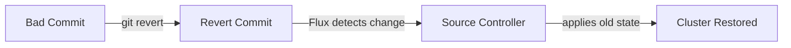

# How to Implement GitOps Rollback Strategies with Flux CD

Author: [nawazdhandala](https://github.com/nawazdhandala)

Tags: flux cd, rollback, gitops, deployment strategy, kubernetes, disaster recovery

Description: A comprehensive guide to implementing rollback strategies in Flux CD for safe and reliable Kubernetes deployments.

---

Rollbacks are a critical part of any deployment pipeline. In GitOps with Flux CD, rolling back means reverting Git to a previous known-good state. This guide covers multiple rollback strategies, from simple Git reverts to automated rollback triggers.

## GitOps Rollback Philosophy

In traditional deployments, you roll back by deploying a previous artifact. In GitOps, you roll back by reverting the Git repository to a previous state. Flux CD then reconciles the cluster to match.



Key principle: **never modify the cluster directly to roll back.** Always go through Git.

## Strategy 1: Git Revert

The simplest and most common rollback strategy. Create a new commit that undoes the problematic changes.

```bash
# Identify the bad commit
git log --oneline -10

# Revert the specific commit
git revert abc123 --no-edit

# Push the revert
git push origin main

# Flux will automatically reconcile within the configured interval
# To speed things up, force reconciliation:
flux reconcile source git flux-system -n flux-system
flux reconcile kustomization apps -n flux-system
```

### Automating Git Revert with a Script

```bash
#!/bin/bash
# rollback-revert.sh - Revert a commit and trigger Flux reconciliation
set -euo pipefail

COMMIT_TO_REVERT=$1
REPO_PATH=$2

if [ -z "$COMMIT_TO_REVERT" ] || [ -z "$REPO_PATH" ]; then
  echo "Usage: $0 <commit-sha> <repo-path>"
  exit 1
fi

cd "$REPO_PATH"

# Verify the commit exists
if ! git cat-file -t "$COMMIT_TO_REVERT" > /dev/null 2>&1; then
  echo "Error: Commit $COMMIT_TO_REVERT does not exist"
  exit 1
fi

# Create the revert commit
echo "Reverting commit $COMMIT_TO_REVERT..."
git revert "$COMMIT_TO_REVERT" --no-edit

# Push to trigger Flux
git push origin main

echo "Revert pushed. Triggering Flux reconciliation..."
flux reconcile source git flux-system -n flux-system
flux reconcile kustomization flux-system -n flux-system

echo "Waiting for reconciliation..."
flux get kustomization flux-system -n flux-system --watch
```

## Strategy 2: Git Reset to a Known-Good Tag

For larger rollbacks involving multiple commits, reset to a tagged release.

### Tagging Releases for Rollback Points

```yaml
# .github/workflows/tag-release.yaml
name: Tag Release
on:
  push:
    branches: [main]
    paths:
      - "clusters/production/**"

jobs:
  tag:
    runs-on: ubuntu-latest
    steps:
      - uses: actions/checkout@v4
        with:
          fetch-depth: 0

      - name: Create release tag
        run: |
          # Generate a timestamp-based tag
          TAG="release-$(date +%Y%m%d-%H%M%S)"
          git tag "$TAG"
          git push origin "$TAG"
          echo "Tagged as $TAG"
```

### Rolling Back to a Tag

```bash
# List available release tags
git tag -l "release-*" --sort=-creatordate | head -10

# Create a new branch from the good tag
git checkout -b rollback-branch release-20260305-143022

# Merge the rollback branch into main
git checkout main
git merge rollback-branch -m "Rollback to release-20260305-143022"
git push origin main
```

## Strategy 3: Flux Suspend and Manual Intervention

For emergencies when you need to stop Flux from applying changes while you fix things.

```bash
# Step 1: Suspend all Kustomizations to stop reconciliation
flux suspend kustomization --all -n flux-system

# Step 2: Suspend HelmReleases to prevent Helm operations
flux suspend helmrelease --all -A

# Step 3: Fix the issue in Git
cd /path/to/fleet-infra
git revert HEAD --no-edit
git push origin main

# Step 4: Resume Flux
flux resume kustomization --all -n flux-system
flux resume helmrelease --all -A

# Step 5: Force reconciliation
flux reconcile source git flux-system -n flux-system
```

## Strategy 4: Automated Rollback on Health Check Failure

Configure Flux Kustomizations to automatically roll back when health checks fail.

```yaml
# clusters/production/apps.yaml
apiVersion: kustomize.toolkit.fluxcd.io/v1
kind: Kustomization
metadata:
  name: apps
  namespace: flux-system
spec:
  interval: 10m
  sourceRef:
    kind: GitRepository
    name: flux-system
  path: ./clusters/production/apps
  prune: true
  wait: true
  # Timeout for health checks - if workloads are not healthy
  # within this window, the change is considered failed
  timeout: 5m
  # Health checks determine if the deployment is successful
  healthChecks:
    - apiVersion: apps/v1
      kind: Deployment
      name: my-app
      namespace: default
    - apiVersion: apps/v1
      kind: Deployment
      name: api-server
      namespace: default
  # Retry on failure before giving up
  retryInterval: 2m
```

### HelmRelease Automated Rollback

```yaml
# clusters/production/apps/my-app/helmrelease.yaml
apiVersion: helm.toolkit.fluxcd.io/v2
kind: HelmRelease
metadata:
  name: my-app
  namespace: default
spec:
  interval: 30m
  chart:
    spec:
      chart: my-app
      version: "1.x"
      sourceRef:
        kind: HelmRepository
        name: my-charts
        namespace: flux-system
  # Install configuration
  install:
    # Automatically roll back if install fails
    remediation:
      retries: 3
  # Upgrade configuration
  upgrade:
    # Automatically roll back if upgrade fails
    remediation:
      retries: 3
      # Roll back to the last successful release
      strategy: rollback
    # Clean up failed releases
    cleanupOnFail: true
  # Configure rollback behavior
  rollback:
    timeout: 5m
    # Re-enable hooks during rollback
    disableHooks: false
    # Clean up new resources created during the failed upgrade
    cleanupOnFail: true
  # Health checks for the release
  test:
    enable: true
    ignoreFailures: false
  values:
    replicaCount: 3
    image:
      repository: registry.example.com/my-app
      tag: v1.2.3
```

## Strategy 5: Canary Rollback with Flagger

Use Flagger with Flux CD for automated canary analysis and rollback.

```yaml
# clusters/production/apps/my-app/canary.yaml
apiVersion: flagger.app/v1beta1
kind: Canary
metadata:
  name: my-app
  namespace: default
spec:
  targetRef:
    apiVersion: apps/v1
    kind: Deployment
    name: my-app
  # Service mesh or ingress configuration
  service:
    port: 80
    targetPort: 8080
  analysis:
    # Run canary analysis every 60 seconds
    interval: 60s
    # Maximum number of failed analysis before rollback
    threshold: 5
    # Percentage of traffic to shift per step
    stepWeight: 10
    # Maximum traffic percentage for the canary
    maxWeight: 50
    metrics:
      # Success rate must be above 99%
      - name: request-success-rate
        thresholdRange:
          min: 99
        interval: 60s
      # P99 latency must be under 500ms
      - name: request-duration
        thresholdRange:
          max: 500
        interval: 60s
    # Webhooks for custom checks
    webhooks:
      - name: load-test
        url: http://loadtester.flagger-system/
        timeout: 5s
        metadata:
          type: cmd
          cmd: "hey -z 1m -q 10 -c 2 http://my-app-canary.default:80/"
```

## Strategy 6: Blue-Green Rollback

```yaml
# clusters/production/apps/my-app/blue-green.yaml
apiVersion: apps/v1
kind: Deployment
metadata:
  name: my-app-blue
  namespace: default
  labels:
    app: my-app
    version: blue
spec:
  replicas: 3
  selector:
    matchLabels:
      app: my-app
      version: blue
  template:
    metadata:
      labels:
        app: my-app
        version: blue
    spec:
      containers:
        - name: my-app
          image: registry.example.com/my-app:v1.2.3
          ports:
            - containerPort: 8080
---
apiVersion: apps/v1
kind: Deployment
metadata:
  name: my-app-green
  namespace: default
  labels:
    app: my-app
    version: green
spec:
  # Green starts at 0 replicas
  replicas: 0
  selector:
    matchLabels:
      app: my-app
      version: green
  template:
    metadata:
      labels:
        app: my-app
        version: green
    spec:
      containers:
        - name: my-app
          image: registry.example.com/my-app:v1.3.0
          ports:
            - containerPort: 8080
---
# Service points to the active version
apiVersion: v1
kind: Service
metadata:
  name: my-app
  namespace: default
spec:
  selector:
    app: my-app
    # Switch this label to swap between blue and green
    version: blue
  ports:
    - port: 80
      targetPort: 8080
```

### Switching and Rolling Back Blue-Green

```bash
# To deploy green: update replicas and service selector in Git
# To rollback: revert the service selector change in Git

# The Git diff for a rollback looks like:
# -    version: green
# +    version: blue
```

## Monitoring Rollbacks

### Alert on Rollback Events

```yaml
# alerts/rollback-alert.yaml
apiVersion: notification.toolkit.fluxcd.io/v1beta3
kind: Alert
metadata:
  name: rollback-alert
  namespace: flux-system
spec:
  providerRef:
    name: slack-alert
  eventSeverity: info
  eventSources:
    - kind: HelmRelease
      name: "*"
    - kind: Kustomization
      name: "*"
  # Filter for rollback-related events
  inclusionList:
    - ".*[Rr]ollback.*"
    - ".*[Rr]evert.*"
    - ".*remediat.*"
```

## Summary

Flux CD supports multiple rollback strategies:

| Strategy | Speed | Complexity | Use Case |
|----------|-------|------------|----------|
| Git Revert | Fast | Low | Single bad commit |
| Tag Reset | Medium | Low | Multi-commit rollback |
| Suspend + Fix | Immediate | Medium | Emergency stop |
| Auto Remediation | Automatic | Medium | Helm upgrade failures |
| Canary + Flagger | Automatic | High | Gradual rollouts |
| Blue-Green | Fast | Medium | Zero-downtime switch |

Choose the strategy that matches your deployment requirements and team capabilities. For most teams, Git revert combined with HelmRelease remediation provides a solid foundation.
