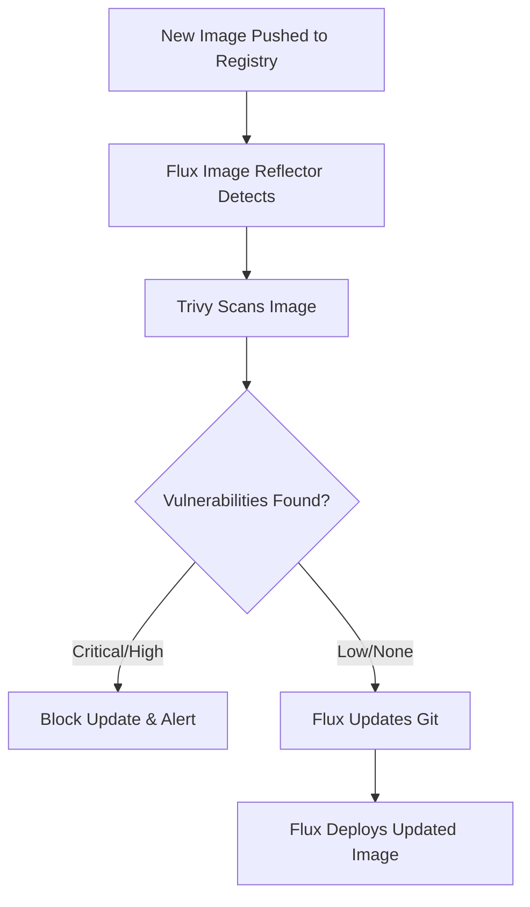

# How to Implement Image Vulnerability Scanning with Flux CD

Author: [nawazdhandala](https://github.com/nawazdhandala)

Tags: Flux CD, Image Scanning, Vulnerability, Trivy, Security, GitOps, Containers

Description: A practical guide to implementing automated container image vulnerability scanning in your Flux CD GitOps pipeline using Trivy and policy enforcement.

---

## Introduction

Container image vulnerabilities are one of the most common attack vectors in Kubernetes environments. By integrating image vulnerability scanning into your Flux CD pipeline, you can automatically detect and block vulnerable images before they are deployed. This guide shows how to combine Flux CD image automation with Trivy scanning and Kyverno policy enforcement.

## Prerequisites

- A Kubernetes cluster (v1.25+)
- Flux CD installed with image automation controllers
- A container registry (Docker Hub, GHCR, ECR, etc.)
- kubectl access to your cluster

## How Image Scanning Fits in the GitOps Flow



## Setting Up Flux Image Automation

### Configure Image Repository Scanning

Tell Flux to watch your container registry for new images:

```yaml
# clusters/my-cluster/image-automation/image-repository.yaml
apiVersion: image.toolkit.fluxcd.io/v1
kind: ImageRepository
metadata:
  name: my-app
  namespace: flux-system
spec:
  # Container image to watch
  image: ghcr.io/myorg/my-app
  # How often to check for new images
  interval: 5m
  # Registry authentication
  secretRef:
    name: ghcr-credentials
```

### Define Image Policy

Set rules for which image tags Flux should consider:

```yaml
# clusters/my-cluster/image-automation/image-policy.yaml
apiVersion: image.toolkit.fluxcd.io/v1
kind: ImagePolicy
metadata:
  name: my-app
  namespace: flux-system
spec:
  imageRepositoryRef:
    name: my-app
  policy:
    semver:
      # Only consider stable semver versions
      range: ">=1.0.0"
  filterTags:
    # Only consider tags matching this pattern
    pattern: '^(?P<version>[0-9]+\.[0-9]+\.[0-9]+)$'
    extract: '$version'
```

### Configure Image Update Automation

Automatically update Git when new images pass scanning:

```yaml
# clusters/my-cluster/image-automation/image-update.yaml
apiVersion: image.toolkit.fluxcd.io/v1
kind: ImageUpdateAutomation
metadata:
  name: my-app-update
  namespace: flux-system
spec:
  interval: 5m
  sourceRef:
    kind: GitRepository
    name: flux-system
  git:
    checkout:
      ref:
        branch: main
    commit:
      author:
        name: flux-bot
        email: flux@myorg.com
      messageTemplate: |
        chore: update image {{.Changed.Name}} to {{.Changed.NewValue}}
    push:
      branch: main
  update:
    path: ./clusters/my-cluster
    strategy: Setters
```

## Installing the Trivy Operator

### Deploy Trivy via Flux

```yaml
# clusters/my-cluster/security/trivy/helm-repository.yaml
apiVersion: source.toolkit.fluxcd.io/v1
kind: HelmRepository
metadata:
  name: aqua
  namespace: flux-system
spec:
  interval: 1h
  url: https://aquasecurity.github.io/helm-charts/
```

```yaml
# clusters/my-cluster/security/trivy/helm-release.yaml
apiVersion: helm.toolkit.fluxcd.io/v2
kind: HelmRelease
metadata:
  name: trivy-operator
  namespace: trivy-system
spec:
  interval: 30m
  chart:
    spec:
      chart: trivy-operator
      version: "0.x"
      sourceRef:
        kind: HelmRepository
        name: aqua
        namespace: flux-system
  install:
    createNamespace: true
  values:
    trivy:
      # Only report critical and high vulnerabilities
      severity: "CRITICAL,HIGH"
      # Skip vulnerabilities without fixes available
      ignoreUnfixed: true
      # Use a persistent vulnerability database
      dbRepository: ghcr.io/aquasecurity/trivy-db
      # Timeout for scanning large images
      timeout: "10m"
    operator:
      # Limit concurrent scan jobs
      scanJobsConcurrentLimit: 5
      # Automatically scan new workloads
      vulnerabilityScannerEnabled: true
      # Scan configs for misconfigurations
      configAuditScannerEnabled: true
      # Re-scan on schedule
      vulnerabilityScannerReportTTL: "24h"
```

## Enforcing Scan Results with Kyverno

### Block Images with Critical Vulnerabilities

```yaml
# security-policies/block-vulnerable-images.yaml
apiVersion: kyverno.io/v1
kind: ClusterPolicy
metadata:
  name: block-vulnerable-images
  annotations:
    policies.kyverno.io/title: Block Vulnerable Images
    policies.kyverno.io/severity: critical
spec:
  validationFailureAction: Enforce
  background: true
  rules:
    - name: check-vulnerability-report
      match:
        any:
          - resources:
              kinds:
                - Pod
      # Wait for scan results before admitting
      preconditions:
        all:
          - key: "{{request.operation}}"
            operator: In
            value: ["CREATE", "UPDATE"]
      validate:
        message: >-
          Image {{request.object.spec.containers[0].image}} has critical
          vulnerabilities. Check the VulnerabilityReport for details.
        deny:
          conditions:
            any:
              - key: "{{ request.object.spec.containers[].image }}"
                operator: AnyNotIn
                # List of pre-approved scanned images
                value: "{{ configmap_lookup('trivy-system', 'approved-images', 'images') }}"
```

### Require Image Signatures

Ensure images are signed before deployment:

```yaml
# security-policies/require-signed-images.yaml
apiVersion: kyverno.io/v1
kind: ClusterPolicy
metadata:
  name: require-signed-images
spec:
  validationFailureAction: Enforce
  rules:
    - name: verify-signature
      match:
        any:
          - resources:
              kinds:
                - Pod
      verifyImages:
        - imageReferences:
            # Apply to all images from your registry
            - "ghcr.io/myorg/*"
          attestors:
            - count: 1
              entries:
                - keys:
                    # Public key for cosign verification
                    publicKeys: |-
                      -----BEGIN PUBLIC KEY-----
                      MFkwEwYHKoZIzj0CAQYIKoZIzj0DAQcDQgAE...
                      -----END PUBLIC KEY-----
```

## Building an Image Approval Pipeline

### ConfigMap for Approved Images

Maintain a list of scanned and approved images:

```yaml
# security/approved-images.yaml
apiVersion: v1
kind: ConfigMap
metadata:
  name: approved-images
  namespace: trivy-system
data:
  # This list is updated by the scan pipeline
  images: |
    ghcr.io/myorg/my-app@sha256:abc123...
    ghcr.io/myorg/my-api@sha256:def456...
```

### Automated Scan Job

Create a Job that scans images and updates the approved list:

```yaml
# security/scan-job.yaml
apiVersion: batch/v1
kind: CronJob
metadata:
  name: image-scanner
  namespace: trivy-system
spec:
  # Scan every 30 minutes
  schedule: "*/30 * * * *"
  jobTemplate:
    spec:
      template:
        spec:
          serviceAccountName: image-scanner
          containers:
            - name: scanner
              image: aquasec/trivy:latest
              command:
                - /bin/sh
                - -c
                - |
                  # Scan the image for critical vulnerabilities
                  RESULT=$(trivy image --severity CRITICAL \
                    --exit-code 1 \
                    --format json \
                    --quiet \
                    ghcr.io/myorg/my-app:latest 2>&1)
                  EXIT_CODE=$?

                  if [ $EXIT_CODE -eq 0 ]; then
                    echo "Image passed scan - no critical vulnerabilities"
                  else
                    echo "Image failed scan - critical vulnerabilities found"
                    echo "$RESULT" | jq '.Results[].Vulnerabilities[] | {VulnerabilityID, Severity, Title}'
                    exit 1
                  fi
              resources:
                limits:
                  cpu: 500m
                  memory: 1Gi
          restartPolicy: OnFailure
```

## Monitoring Vulnerability Reports

### View Current Vulnerabilities

```bash
# List all vulnerability reports across namespaces
kubectl get vulnerabilityreports -A

# Get details for a specific workload
kubectl get vulnerabilityreports -n default \
  -l trivy-operator.resource.name=my-app \
  -o jsonpath='{.items[0].report.summary}'

# Find all workloads with critical vulnerabilities
kubectl get vulnerabilityreports -A \
  -o jsonpath='{range .items[?(@.report.summary.criticalCount>0)]}{.metadata.namespace}/{.metadata.labels.trivy-operator\.resource\.name}: {.report.summary.criticalCount} critical{"\n"}{end}'
```

### Alert on New Vulnerabilities

```yaml
# clusters/my-cluster/security/vuln-alert.yaml
apiVersion: notification.toolkit.fluxcd.io/v1beta3
kind: Alert
metadata:
  name: vulnerability-alert
  namespace: flux-system
spec:
  providerRef:
    name: slack-security
  eventSeverity: error
  eventSources:
    - kind: HelmRelease
      name: trivy-operator
      namespace: trivy-system
    - kind: Kustomization
      name: '*'
      namespace: flux-system
  summary: "New image vulnerability detected"
```

## RBAC for Image Scanning

```yaml
# security/rbac.yaml
apiVersion: v1
kind: ServiceAccount
metadata:
  name: image-scanner
  namespace: trivy-system
---
apiVersion: rbac.authorization.k8s.io/v1
kind: ClusterRole
metadata:
  name: image-scanner
rules:
  # Read vulnerability reports
  - apiGroups: ["aquasecurity.github.io"]
    resources: ["vulnerabilityreports"]
    verbs: ["get", "list", "watch"]
  # Update approved images configmap
  - apiGroups: [""]
    resources: ["configmaps"]
    verbs: ["get", "update", "patch"]
    resourceNames: ["approved-images"]
  # Read pod specs to find images
  - apiGroups: [""]
    resources: ["pods"]
    verbs: ["get", "list"]
  - apiGroups: ["apps"]
    resources: ["deployments", "statefulsets", "daemonsets"]
    verbs: ["get", "list"]
---
apiVersion: rbac.authorization.k8s.io/v1
kind: ClusterRoleBinding
metadata:
  name: image-scanner
subjects:
  - kind: ServiceAccount
    name: image-scanner
    namespace: trivy-system
roleRef:
  kind: ClusterRole
  name: image-scanner
  apiGroup: rbac.authorization.k8s.io
```

## Best Practices

### Use Image Digests Over Tags

Tags are mutable and can be overwritten. Always reference images by digest in production to ensure you deploy exactly the image that was scanned:

```yaml
# Use this
image: ghcr.io/myorg/my-app@sha256:abc123def456...

# Not this
image: ghcr.io/myorg/my-app:v1.2.3
```

### Maintain a Vulnerability Exceptions List

Not all vulnerabilities are exploitable in your context. Maintain a `.trivyignore` file for known false positives:

```yaml
# security/trivy-ignore-configmap.yaml
apiVersion: v1
kind: ConfigMap
metadata:
  name: trivy-ignore
  namespace: trivy-system
data:
  .trivyignore: |
    # CVE with no fix available, not exploitable in our context
    CVE-2023-12345
    # Disputed vulnerability
    CVE-2023-67890
```

### Scan Base Images Separately

Scan your base images in CI before building application images. This catches vulnerabilities early and reduces scan time in the cluster.

### Set Up Vulnerability SLAs

Define response times for different severity levels: critical vulnerabilities should be patched within 24 hours, high within 7 days, and medium within 30 days.

## Conclusion

Image vulnerability scanning with Flux CD creates a continuous security feedback loop. By combining Flux image automation with Trivy scanning and Kyverno policy enforcement, you ensure that only scanned, approved images reach your Kubernetes cluster. This approach shifts security left while maintaining the automation benefits of GitOps.
