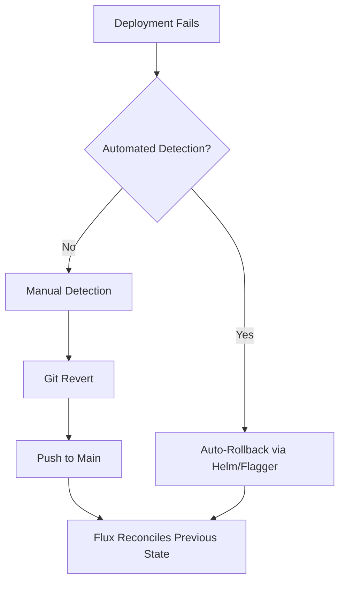

# How to Implement Rollback Automation with Flux CD

Author: [nawazdhandala](https://github.com/nawazdhandala)

Tags: Flux CD, GitOps, Kubernetes, Rollback, Automation, Disaster Recovery

Description: A practical guide to implementing automated and manual rollback strategies with Flux CD to recover quickly from failed deployments.

---

Failed deployments happen. The difference between a minor inconvenience and a major outage is how fast you can roll back. Flux CD provides multiple rollback mechanisms - from automatic Helm rollbacks to Git reverts. This guide covers how to implement each approach.

## Rollback Philosophy in GitOps

In GitOps, the desired state lives in Git. A rollback means restoring Git to a previous state. This is fundamentally different from imperative rollbacks where you run commands against the cluster directly.



## Automatic Rollback with HelmRelease

Flux's HelmRelease resource supports automatic rollback when a Helm upgrade fails.

```yaml
# HelmRelease with automatic rollback configuration
apiVersion: helm.toolkit.fluxcd.io/v2
kind: HelmRelease
metadata:
  name: my-app
  namespace: production
spec:
  interval: 10m
  chart:
    spec:
      chart: my-app
      version: "2.0.0"
      sourceRef:
        kind: HelmRepository
        name: my-charts
  values:
    replicaCount: 3
    image:
      repository: ghcr.io/my-org/my-app
      tag: "2.0.0"
  # Installation remediation
  install:
    # Create the namespace if it doesn't exist
    createNamespace: true
    remediation:
      # Retry installation up to 3 times
      retries: 3
  # Upgrade remediation - this is where rollback happens
  upgrade:
    remediation:
      # Retry the upgrade up to 3 times
      retries: 3
      # Rollback to the last successful release after all retries fail
      remediateLastFailure: true
    # Clean up failed resources
    cleanupOnFail: true
    # Force resource updates if needed
    force: false
  # Rollback configuration
  rollback:
    # Clean up new resources created during the failed upgrade
    cleanupOnFail: true
    # Recreate resources that were modified
    recreate: false
    # Disable hooks during rollback for speed
    disableHooks: false
    # Timeout for the rollback operation
    timeout: 5m
  # Run Helm tests after upgrade
  test:
    enable: true
    ignoreFailures: false
  # Total timeout for the upgrade operation
  timeout: 10m
```

## Git-Based Rollback

The most reliable rollback method is reverting the Git commit that caused the issue.

```bash
# Step 1: Identify the bad commit
git log --oneline -10 -- apps/production/
# Output:
# a1b2c3d Deploy my-app v2.0.0 to production    <-- this broke things
# e5f6g7h Update resource limits
# i9j0k1l Deploy my-app v1.9.0 to production

# Step 2: Revert the bad commit
git revert a1b2c3d --no-edit

# Step 3: Push the revert
git push origin main

# Step 4: Flux detects the change and applies the previous state
# Watch the rollback happen
flux get kustomizations --watch
```

```bash
# For urgent rollbacks, force reconciliation immediately
# After pushing the revert commit:
flux reconcile source git fleet-infra
flux reconcile kustomization production-apps --with-source
```

## Automated Rollback with Health Checks

Configure Flux Kustomizations with health checks that trigger automatic remediation.

```yaml
# Kustomization with health-check-based rollback
apiVersion: kustomize.toolkit.fluxcd.io/v1
kind: Kustomization
metadata:
  name: production-apps
  namespace: flux-system
spec:
  interval: 10m
  sourceRef:
    kind: GitRepository
    name: fleet-infra
  path: ./apps/production
  prune: true
  wait: true
  # Health checks that must pass
  healthChecks:
    - apiVersion: apps/v1
      kind: Deployment
      name: my-app
      namespace: production
    - apiVersion: apps/v1
      kind: Deployment
      name: my-api
      namespace: production
  # If health checks don't pass within this timeout,
  # the reconciliation is marked as failed
  timeout: 10m
  # Force apply to ensure clean state
  force: false
```

When health checks fail, Flux marks the Kustomization as not ready and sends an alert. The next reconciliation will attempt to reapply the desired state.

## Canary Rollback with Flagger

Flagger automatically rolls back canary deployments when metrics degrade.

```yaml
# Canary with automatic rollback on metric failure
apiVersion: flagger.app/v1beta1
kind: Canary
metadata:
  name: my-app
  namespace: production
spec:
  targetRef:
    apiVersion: apps/v1
    kind: Deployment
    name: my-app
  service:
    port: 80
    targetPort: 8080
  analysis:
    interval: 1m
    # Number of failed checks before rollback
    threshold: 3
    maxWeight: 50
    stepWeight: 10
    metrics:
      # Rollback if success rate drops below 99%
      - name: request-success-rate
        thresholdRange:
          min: 99
        interval: 1m
      # Rollback if latency exceeds 500ms
      - name: request-duration
        thresholdRange:
          max: 500
        interval: 1m
    # Custom metrics from Prometheus
    metrics:
      - name: error-rate
        templateRef:
          name: error-rate
          namespace: flagger-system
        thresholdRange:
          max: 1
        interval: 1m
```

```yaml
# Custom metric template for Flagger
apiVersion: flagger.app/v1beta1
kind: MetricTemplate
metadata:
  name: error-rate
  namespace: flagger-system
spec:
  provider:
    type: prometheus
    address: http://prometheus.monitoring:9090
  query: |
    100 - sum(
      rate(http_requests_total{
        destination_workload="{{ target }}",
        destination_workload_namespace="{{ namespace }}",
        response_code!~"5.*"
      }[{{ interval }}])
    )
    /
    sum(
      rate(http_requests_total{
        destination_workload="{{ target }}",
        destination_workload_namespace="{{ namespace }}"
      }[{{ interval }}])
    ) * 100
```

## Rollback Notifications

Get immediately notified when a rollback occurs.

```yaml
# Notification provider
apiVersion: notification.toolkit.fluxcd.io/v1beta3
kind: Provider
metadata:
  name: slack-rollbacks
  namespace: flux-system
spec:
  type: slack
  channel: production-alerts
  secretRef:
    name: slack-webhook
---
# Alert on rollback events
apiVersion: notification.toolkit.fluxcd.io/v1beta3
kind: Alert
metadata:
  name: rollback-alerts
  namespace: flux-system
spec:
  providerRef:
    name: slack-rollbacks
  # Alert on errors - these include failed reconciliations
  eventSeverity: error
  eventSources:
    - kind: HelmRelease
      name: "*"
      namespace: production
    - kind: Kustomization
      name: production-apps
```

## Rollback Runbook

Create a standardized rollback procedure for your team.

```bash
#!/bin/bash
# rollback.sh - Standardized rollback script
# Usage: ./rollback.sh <commit-to-revert>

set -euo pipefail

COMMIT=$1
REPO_PATH="/path/to/fleet-infra"

echo "=== Starting Rollback ==="
echo "Reverting commit: $COMMIT"

cd "$REPO_PATH"

# Pull latest changes
git pull origin main

# Verify the commit exists and affects production
if ! git log --oneline "$COMMIT" -- apps/production/ | head -1; then
  echo "ERROR: Commit $COMMIT does not affect production apps"
  exit 1
fi

# Show what will be reverted
echo ""
echo "Changes to be reverted:"
git show --stat "$COMMIT" -- apps/production/
echo ""

# Create the revert commit
git revert "$COMMIT" --no-edit

# Push the revert
git push origin main

# Force Flux reconciliation
echo "Forcing Flux reconciliation..."
flux reconcile source git fleet-infra
flux reconcile kustomization production-apps --with-source

# Wait for reconciliation
echo "Waiting for reconciliation..."
flux get kustomization production-apps

echo ""
echo "=== Rollback Complete ==="
echo "Monitor deployment status with: flux get kustomizations --watch"
```

## Version Pinning for Safe Rollbacks

Pin specific versions so you always know what to roll back to.

```yaml
# HelmRelease with explicit version pinning
apiVersion: helm.toolkit.fluxcd.io/v2
kind: HelmRelease
metadata:
  name: my-app
  namespace: production
  annotations:
    # Track the previous known-good version
    rollback/previous-version: "1.9.0"
    rollback/previous-chart: "1.5.2"
spec:
  interval: 10m
  chart:
    spec:
      chart: my-app
      # Pin to an exact chart version
      version: "1.6.0"
      sourceRef:
        kind: HelmRepository
        name: my-charts
  values:
    image:
      repository: ghcr.io/my-org/my-app
      # Pin to an exact image tag - never use 'latest'
      tag: "2.0.0"
```

```yaml
# Kustomization referencing a specific Git tag for safety
apiVersion: source.toolkit.fluxcd.io/v1
kind: GitRepository
metadata:
  name: stable-release
  namespace: flux-system
spec:
  interval: 5m
  url: https://github.com/my-org/fleet-infra.git
  ref:
    # Pin to a known-good tag
    tag: release-2024-01-14
```

## Testing Rollback Procedures

Regularly test your rollback procedures to ensure they work.

```bash
# Rollback drill checklist
# 1. Deploy a known-bad version to staging
# 2. Verify detection (alerts fire)
# 3. Execute rollback procedure
# 4. Verify recovery (health checks pass)
# 5. Measure time to recovery

# Trigger a test rollback in staging
flux suspend kustomization staging-apps
# Deploy the bad version manually for testing
flux resume kustomization staging-apps

# Verify health checks fail
flux get kustomization staging-apps

# Execute rollback
git revert HEAD --no-edit
git push origin main
flux reconcile kustomization staging-apps --with-source

# Measure recovery time
flux events --for kustomization/staging-apps
```

## Best Practices

1. Always use `remediateLastFailure: true` on HelmReleases for automatic rollback.
2. Never use `latest` image tags - pin exact versions so rollbacks have a clear target.
3. Use Git reverts for rollbacks instead of force-pushing or deleting commits.
4. Configure health checks on all production Kustomizations with appropriate timeouts.
5. Set up rollback notifications so the team is immediately aware of issues.
6. Document the previous known-good version in annotations for quick reference.
7. Test rollback procedures regularly in non-production environments.
8. Use Flagger for canary deployments that automatically roll back on metric degradation.
9. Force Flux reconciliation after a revert push to speed up recovery.
