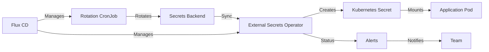

# How to Implement Secret Rotation Automation with Flux CD

Author: [nawazdhandala](https://github.com/nawazdhandala)

Tags: flux cd, secret rotation, kubernetes, gitops, security, sops, sealed secrets, external secrets

Description: A practical guide to implementing automated secret rotation in Kubernetes using Flux CD with External Secrets Operator, SOPS, and scheduled rotation workflows.

---

## Introduction

Secret rotation is a fundamental security practice that limits the window of exposure if credentials are compromised. In traditional environments, secret rotation is often manual and infrequent. With Flux CD and GitOps, you can automate the entire secret lifecycle including creation, rotation, distribution, and verification.

This guide covers multiple approaches to automated secret rotation with Flux CD, including External Secrets Operator integration, SOPS-encrypted secrets, and custom rotation workflows.

## Prerequisites

- A Kubernetes cluster (v1.24+)
- Flux CD v2 installed and bootstrapped
- A secrets management backend (AWS Secrets Manager, HashiCorp Vault, or Azure Key Vault)
- kubectl configured to access your cluster

## Architecture Overview



## Setting Up External Secrets Operator with Flux CD

External Secrets Operator (ESO) syncs secrets from external backends into Kubernetes, making rotation seamless.

### Deploying ESO via Flux CD

```yaml
# infrastructure/external-secrets/helmrelease.yaml
# Deploy External Secrets Operator using Flux HelmRelease
apiVersion: helm.toolkit.fluxcd.io/v2
kind: HelmRelease
metadata:
  name: external-secrets
  namespace: external-secrets
spec:
  interval: 30m
  chart:
    spec:
      chart: external-secrets
      version: "0.9.11"
      sourceRef:
        kind: HelmRepository
        name: external-secrets
        namespace: flux-system
  values:
    # Install CRDs with the chart
    installCRDs: true
    # Enable webhook for validation
    webhook:
      port: 9443
    # Resource limits for the operator
    resources:
      requests:
        cpu: 50m
        memory: 128Mi
      limits:
        cpu: 200m
        memory: 256Mi
```

```yaml
# infrastructure/external-secrets/helmrepo.yaml
# Helm repository source for External Secrets
apiVersion: source.toolkit.fluxcd.io/v1
kind: HelmRepository
metadata:
  name: external-secrets
  namespace: flux-system
spec:
  interval: 24h
  url: https://charts.external-secrets.io
```

### Configuring the Secret Store

```yaml
# infrastructure/external-secrets/cluster-secret-store.yaml
# ClusterSecretStore connects ESO to AWS Secrets Manager
apiVersion: external-secrets.io/v1beta1
kind: ClusterSecretStore
metadata:
  name: aws-secrets-manager
spec:
  provider:
    aws:
      service: SecretsManager
      region: us-east-1
      auth:
        jwt:
          serviceAccountRef:
            name: external-secrets-sa
            namespace: external-secrets
```

```yaml
# infrastructure/external-secrets/vault-store.yaml
# ClusterSecretStore for HashiCorp Vault backend
apiVersion: external-secrets.io/v1beta1
kind: ClusterSecretStore
metadata:
  name: hashicorp-vault
spec:
  provider:
    vault:
      server: "https://vault.mycompany.com"
      path: "secret"
      version: "v2"
      auth:
        kubernetes:
          mountPath: "kubernetes"
          role: "external-secrets"
          serviceAccountRef:
            name: external-secrets-sa
            namespace: external-secrets
```

## Configuring External Secrets with Auto-Rotation

```yaml
# apps/production/api-server/external-secret.yaml
# ExternalSecret syncs database credentials from AWS Secrets Manager
apiVersion: external-secrets.io/v1beta1
kind: ExternalSecret
metadata:
  name: database-credentials
  namespace: production
spec:
  # How frequently to check for secret rotation in the backend
  refreshInterval: 1h
  secretStoreRef:
    name: aws-secrets-manager
    kind: ClusterSecretStore
  target:
    # Name of the Kubernetes Secret that will be created
    name: database-credentials
    # Recreate the secret if it is deleted
    creationPolicy: Owner
    # Delete the Kubernetes secret if the ExternalSecret is deleted
    deletionPolicy: Delete
  data:
    - secretKey: DB_HOST
      remoteRef:
        key: production/api-server/database
        property: host
    - secretKey: DB_USERNAME
      remoteRef:
        key: production/api-server/database
        property: username
    - secretKey: DB_PASSWORD
      remoteRef:
        key: production/api-server/database
        property: password
---
# ExternalSecret for API keys with more frequent rotation checks
apiVersion: external-secrets.io/v1beta1
kind: ExternalSecret
metadata:
  name: api-keys
  namespace: production
spec:
  # Check every 15 minutes for rotated API keys
  refreshInterval: 15m
  secretStoreRef:
    name: aws-secrets-manager
    kind: ClusterSecretStore
  target:
    name: api-keys
    creationPolicy: Owner
  data:
    - secretKey: STRIPE_API_KEY
      remoteRef:
        key: production/api-server/stripe
        property: api_key
    - secretKey: SENDGRID_API_KEY
      remoteRef:
        key: production/api-server/sendgrid
        property: api_key
```

## Implementing Automated Secret Rotation with CronJobs

Create CronJobs managed by Flux CD to trigger secret rotation in your backends.

```yaml
# infrastructure/secret-rotation/rotate-db-credentials.yaml
# CronJob to rotate database credentials in AWS Secrets Manager
apiVersion: batch/v1
kind: CronJob
metadata:
  name: rotate-db-credentials
  namespace: secret-rotation
spec:
  # Rotate database credentials every 30 days
  schedule: "0 2 1 * *"
  concurrencyPolicy: Forbid
  jobTemplate:
    spec:
      template:
        spec:
          serviceAccountName: secret-rotator
          containers:
            - name: rotator
              image: amazon/aws-cli:2.15.0
              command:
                - /bin/sh
                - -c
                - |
                  # Trigger rotation for the database secret
                  aws secretsmanager rotate-secret \
                    --secret-id production/api-server/database \
                    --rotation-lambda-arn arn:aws:lambda:us-east-1:123456789:function:rotate-db-creds

                  echo "Secret rotation triggered successfully"

                  # Wait for rotation to complete
                  for i in $(seq 1 30); do
                    STATUS=$(aws secretsmanager describe-secret \
                      --secret-id production/api-server/database \
                      --query 'RotationEnabled' --output text)
                    if [ "$STATUS" = "True" ]; then
                      echo "Rotation completed"
                      exit 0
                    fi
                    sleep 10
                  done

                  echo "WARNING: Rotation may still be in progress"
              env:
                - name: AWS_REGION
                  value: us-east-1
          restartPolicy: OnFailure
```

## Restarting Pods After Secret Rotation

When secrets are rotated, pods consuming them need to be restarted. Use Reloader or annotations to handle this.

```yaml
# infrastructure/reloader/helmrelease.yaml
# Deploy Reloader to automatically restart pods when secrets change
apiVersion: helm.toolkit.fluxcd.io/v2
kind: HelmRelease
metadata:
  name: reloader
  namespace: kube-system
spec:
  interval: 30m
  chart:
    spec:
      chart: reloader
      version: "1.0.63"
      sourceRef:
        kind: HelmRepository
        name: stakater
        namespace: flux-system
  values:
    reloader:
      watchGlobally: true
      # Only watch resources with the annotation
      ignoreSecrets: false
      ignoreConfigMaps: true
```

```yaml
# apps/production/api-server/deployment.yaml
# Deployment configured to restart when secrets are rotated
apiVersion: apps/v1
kind: Deployment
metadata:
  name: api-server
  namespace: production
  annotations:
    # Reloader watches this annotation and triggers rolling restart
    # when the referenced secret changes
    secret.reloader.stakater.com/reload: "database-credentials,api-keys"
spec:
  replicas: 3
  selector:
    matchLabels:
      app: api-server
  template:
    spec:
      containers:
        - name: api-server
          image: myregistry.io/myapp/api-server:1.2.3
          envFrom:
            # Mount database credentials as environment variables
            - secretRef:
                name: database-credentials
            # Mount API keys as environment variables
            - secretRef:
                name: api-keys
```

## Using SOPS-Encrypted Secrets with Flux CD

For secrets stored directly in Git, use SOPS encryption with automated rotation.

```yaml
# clusters/production/flux-system/gotk-sync.yaml
# Flux Kustomization configured to decrypt SOPS-encrypted secrets
apiVersion: kustomize.toolkit.fluxcd.io/v1
kind: Kustomization
metadata:
  name: apps
  namespace: flux-system
spec:
  interval: 10m
  path: ./apps/production
  prune: true
  sourceRef:
    kind: GitRepository
    name: flux-system
  # Enable SOPS decryption
  decryption:
    provider: sops
    secretRef:
      # Secret containing the age key or AWS KMS reference
      name: sops-age-key
```

```yaml
# .sops.yaml
# SOPS configuration file defining encryption rules
creation_rules:
  # Encrypt secrets for production with AWS KMS
  - path_regex: apps/production/.*secret.*\.yaml$
    kms: "arn:aws:kms:us-east-1:123456789:key/mrk-abc123"
    encrypted_regex: "^(data|stringData)$"

  # Encrypt secrets for staging with a different key
  - path_regex: apps/staging/.*secret.*\.yaml$
    kms: "arn:aws:kms:us-east-1:123456789:key/mrk-def456"
    encrypted_regex: "^(data|stringData)$"
```

## Monitoring Secret Rotation Health

Set up alerts for secret rotation failures and expiration warnings.

```yaml
# clusters/production/notifications/secret-alerts.yaml
# Alert configuration for secret rotation events
apiVersion: notification.toolkit.fluxcd.io/v1beta3
kind: Provider
metadata:
  name: secrets-slack
  namespace: flux-system
spec:
  type: slack
  channel: security-alerts
  secretRef:
    name: slack-webhook-url
---
apiVersion: notification.toolkit.fluxcd.io/v1beta3
kind: Alert
metadata:
  name: secret-rotation-alerts
  namespace: flux-system
spec:
  providerRef:
    name: secrets-slack
  eventSeverity: error
  eventSources:
    - kind: Kustomization
      name: "*"
      namespace: flux-system
    - kind: HelmRelease
      name: external-secrets
      namespace: external-secrets
  inclusionList:
    - ".*secret.*"
    - ".*decrypt.*"
    - ".*external-secret.*"
```

```yaml
# infrastructure/secret-rotation/check-expiry.yaml
# CronJob to check for secrets approaching expiration
apiVersion: batch/v1
kind: CronJob
metadata:
  name: check-secret-expiry
  namespace: secret-rotation
spec:
  # Run daily at 9 AM
  schedule: "0 9 * * *"
  jobTemplate:
    spec:
      template:
        spec:
          serviceAccountName: secret-checker
          containers:
            - name: checker
              image: bitnami/kubectl:1.28
              command:
                - /bin/sh
                - -c
                - |
                  # Check ExternalSecret sync status
                  echo "=== ExternalSecret Status Report ==="
                  kubectl get externalsecrets --all-namespaces \
                    -o json | jq -r '
                    .items[] |
                    select(.status.conditions[] |
                      select(.type == "Ready" and .status != "True")) |
                    "FAILED: \(.metadata.namespace)/\(.metadata.name) - \(.status.conditions[0].message)"'

                  # List secrets that have not been refreshed recently
                  echo ""
                  echo "=== Stale Secrets (not refreshed in 48h) ==="
                  kubectl get externalsecrets --all-namespaces \
                    -o json | jq -r '
                    .items[] |
                    select(.status.refreshTime |
                      fromdateiso8601 < (now - 172800)) |
                    "STALE: \(.metadata.namespace)/\(.metadata.name) - Last refresh: \(.status.refreshTime)"'
          restartPolicy: OnFailure
```

## Summary

Automated secret rotation with Flux CD ensures that credentials are regularly refreshed without manual intervention. The key practices covered include:

- Deploying External Secrets Operator via Flux CD for seamless backend integration
- Configuring ExternalSecrets with automatic refresh intervals for rotation detection
- Creating CronJobs to trigger rotation in secrets backends on a schedule
- Using Reloader to automatically restart pods when their secrets change
- Managing SOPS-encrypted secrets in Git with Flux CD decryption
- Monitoring secret rotation health with expiry checks and alerting

By treating secret rotation as an automated, GitOps-managed process, you significantly reduce security risk while eliminating the operational burden of manual credential management.
