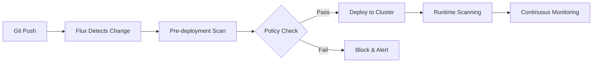

# How to Implement Security Scanning in GitOps Pipeline with Flux CD

Author: [nawazdhandala](https://github.com/nawazdhandala)

Tags: Flux CD, Security Scanning, GitOps, Kubernetes, Trivy, kubeaudit, Policy, Best Practices

Description: A practical guide to integrating security scanning tools into your Flux CD GitOps pipeline for continuous security validation of Kubernetes manifests and configurations.

---

## Introduction

Security scanning in a GitOps pipeline ensures that every change deployed to your cluster meets your security standards. With Flux CD, you can integrate tools like Trivy, kubeaudit, and Kyverno to scan manifests, enforce policies, and block insecure configurations before they reach your cluster.

This guide covers how to set up a multi-layered security scanning approach within your Flux CD pipeline.

## Prerequisites

- A Kubernetes cluster (v1.25+)
- Flux CD installed and bootstrapped
- A Git repository connected to Flux
- kubectl access to your cluster

## Architecture Overview

A robust security scanning pipeline with Flux CD operates at multiple layers:



## Installing Kyverno for Policy Enforcement

Kyverno is a Kubernetes-native policy engine that validates resources before they are admitted to the cluster.

### Deploy Kyverno via Flux

```yaml
# clusters/my-cluster/security/kyverno/helm-repository.yaml
apiVersion: source.toolkit.fluxcd.io/v1
kind: HelmRepository
metadata:
  name: kyverno
  namespace: flux-system
spec:
  interval: 1h
  url: https://kyverno.github.io/kyverno/
```

```yaml
# clusters/my-cluster/security/kyverno/helm-release.yaml
apiVersion: helm.toolkit.fluxcd.io/v2
kind: HelmRelease
metadata:
  name: kyverno
  namespace: kyverno
spec:
  interval: 30m
  chart:
    spec:
      chart: kyverno
      version: "3.x"
      sourceRef:
        kind: HelmRepository
        name: kyverno
        namespace: flux-system
  install:
    createNamespace: true
  values:
    # Run in enforce mode to block non-compliant resources
    admissionController:
      replicas: 3
    # Enable background scanning of existing resources
    backgroundController:
      enabled: true
      resources:
        limits:
          cpu: 500m
          memory: 512Mi
```

## Defining Security Policies

### Require Non-Root Containers

```yaml
# security-policies/require-non-root.yaml
apiVersion: kyverno.io/v1
kind: ClusterPolicy
metadata:
  name: require-non-root
  annotations:
    # Policy documentation
    policies.kyverno.io/title: Require Non-Root Containers
    policies.kyverno.io/severity: high
    policies.kyverno.io/category: Security
spec:
  # Block resources that violate this policy
  validationFailureAction: Enforce
  background: true
  rules:
    - name: check-containers
      match:
        any:
          - resources:
              kinds:
                - Pod
      validate:
        message: "Containers must run as non-root. Set securityContext.runAsNonRoot to true."
        pattern:
          spec:
            containers:
              - securityContext:
                  runAsNonRoot: true
    - name: check-init-containers
      match:
        any:
          - resources:
              kinds:
                - Pod
      validate:
        message: "Init containers must run as non-root."
        pattern:
          spec:
            =(initContainers):
              - securityContext:
                  runAsNonRoot: true
```

### Disallow Privileged Containers

```yaml
# security-policies/disallow-privileged.yaml
apiVersion: kyverno.io/v1
kind: ClusterPolicy
metadata:
  name: disallow-privileged
  annotations:
    policies.kyverno.io/title: Disallow Privileged Containers
    policies.kyverno.io/severity: critical
spec:
  validationFailureAction: Enforce
  background: true
  rules:
    - name: deny-privileged
      match:
        any:
          - resources:
              kinds:
                - Pod
      validate:
        message: "Privileged containers are not allowed."
        pattern:
          spec:
            containers:
              - =(securityContext):
                  =(privileged): false
```

### Require Resource Limits

```yaml
# security-policies/require-resource-limits.yaml
apiVersion: kyverno.io/v1
kind: ClusterPolicy
metadata:
  name: require-resource-limits
  annotations:
    policies.kyverno.io/title: Require Resource Limits
    policies.kyverno.io/severity: medium
spec:
  validationFailureAction: Enforce
  background: true
  rules:
    - name: check-resource-limits
      match:
        any:
          - resources:
              kinds:
                - Pod
      validate:
        message: "All containers must have CPU and memory limits defined."
        pattern:
          spec:
            containers:
              - resources:
                  limits:
                    # CPU limit must be set
                    cpu: "?*"
                    # Memory limit must be set
                    memory: "?*"
```

### Require Image Digests

```yaml
# security-policies/require-image-digest.yaml
apiVersion: kyverno.io/v1
kind: ClusterPolicy
metadata:
  name: require-image-digest
  annotations:
    policies.kyverno.io/title: Require Image Digests
    policies.kyverno.io/severity: high
spec:
  validationFailureAction: Enforce
  rules:
    - name: check-image-digest
      match:
        any:
          - resources:
              kinds:
                - Pod
      validate:
        message: "Images must use digests instead of tags for immutability."
        pattern:
          spec:
            containers:
              # Image reference must contain @ for digest
              - image: "*@sha256:*"
```

## Deploying Trivy for Runtime Scanning

### Install Trivy Operator

```yaml
# clusters/my-cluster/security/trivy/helm-repository.yaml
apiVersion: source.toolkit.fluxcd.io/v1
kind: HelmRepository
metadata:
  name: aqua
  namespace: flux-system
spec:
  interval: 1h
  url: https://aquasecurity.github.io/helm-charts/
```

```yaml
# clusters/my-cluster/security/trivy/helm-release.yaml
apiVersion: helm.toolkit.fluxcd.io/v2
kind: HelmRelease
metadata:
  name: trivy-operator
  namespace: trivy-system
spec:
  interval: 30m
  chart:
    spec:
      chart: trivy-operator
      version: "0.x"
      sourceRef:
        kind: HelmRepository
        name: aqua
        namespace: flux-system
  install:
    createNamespace: true
  values:
    trivy:
      # Scan for vulnerabilities, misconfigurations, and secrets
      severity: "CRITICAL,HIGH"
      ignoreUnfixed: true
    operator:
      # Scan images when workloads are created or updated
      scanJobsConcurrentLimit: 3
      # Scan existing workloads on a schedule
      vulnerabilityScannerScanOnlyCurrentRevisions: true
    # Generate compliance reports
    compliance:
      cron: "0 */6 * * *"
```

## Flux Kustomization for Security Components

Organize security scanning with proper dependencies:

```yaml
# clusters/my-cluster/security/kustomization.yaml
apiVersion: kustomize.toolkit.fluxcd.io/v1
kind: Kustomization
metadata:
  name: security-policies
  namespace: flux-system
spec:
  interval: 10m
  # Deploy policies after Kyverno is installed
  dependsOn:
    - name: kyverno
  sourceRef:
    kind: GitRepository
    name: flux-system
  path: ./security-policies
  prune: true
  # Validate that policies are accepted
  healthChecks:
    - apiVersion: kyverno.io/v1
      kind: ClusterPolicy
      name: require-non-root
    - apiVersion: kyverno.io/v1
      kind: ClusterPolicy
      name: disallow-privileged
    - apiVersion: kyverno.io/v1
      kind: ClusterPolicy
      name: require-resource-limits
```

## Scanning ConfigMaps and Secrets

Prevent sensitive data from being committed in plain text:

```yaml
# security-policies/block-plaintext-secrets.yaml
apiVersion: kyverno.io/v1
kind: ClusterPolicy
metadata:
  name: block-plaintext-secrets
spec:
  validationFailureAction: Enforce
  rules:
    - name: require-sealed-secrets
      match:
        any:
          - resources:
              kinds:
                - Secret
      exclude:
        any:
          - resources:
              # Allow secrets created by the system
              namespaces:
                - kube-system
                - flux-system
      validate:
        message: >-
          Plain Kubernetes Secrets are not allowed. Use SealedSecrets
          or SOPS-encrypted secrets instead.
        deny:
          conditions:
            all:
              # Check if the secret is managed by Flux SOPS
              - key: "{{request.object.metadata.annotations.\"kustomize.toolkit.fluxcd.io/decryptor\" || ''}}"
                operator: Equals
                value: ""
```

## Alerting on Security Violations

```yaml
# clusters/my-cluster/security/alerts.yaml
apiVersion: notification.toolkit.fluxcd.io/v1
kind: Alert
metadata:
  name: security-alert
  namespace: flux-system
spec:
  providerRef:
    name: slack-security
  eventSeverity: error
  eventSources:
    - kind: Kustomization
      name: security-policies
      namespace: flux-system
    - kind: Kustomization
      name: '*'
      namespace: flux-system
  summary: "Security policy violation detected in GitOps pipeline"
---
apiVersion: notification.toolkit.fluxcd.io/v1
kind: Provider
metadata:
  name: slack-security
  namespace: flux-system
spec:
  type: slack
  channel: security-alerts
  secretRef:
    name: slack-security-webhook
```

## Generating Security Reports

Create a CronJob to generate periodic security reports:

```yaml
# security/reporting/cronjob.yaml
apiVersion: batch/v1
kind: CronJob
metadata:
  name: security-report
  namespace: trivy-system
spec:
  # Generate reports every 6 hours
  schedule: "0 */6 * * *"
  jobTemplate:
    spec:
      template:
        spec:
          serviceAccountName: security-reporter
          containers:
            - name: reporter
              image: bitnami/kubectl:latest
              command:
                - /bin/sh
                - -c
                - |
                  echo "=== Vulnerability Report ==="
                  kubectl get vulnerabilityreports -A \
                    -o jsonpath='{range .items[*]}{.metadata.namespace}/{.metadata.name}: Critical={.report.summary.criticalCount}, High={.report.summary.highCount}{"\n"}{end}'
                  echo "=== Policy Report ==="
                  kubectl get policyreport -A \
                    -o jsonpath='{range .items[*]}{.metadata.namespace}: Pass={.summary.pass}, Fail={.summary.fail}{"\n"}{end}'
          restartPolicy: OnFailure
```

## Best Practices

### Layer Your Security Controls

Use multiple tools at different stages: Kyverno for admission control, Trivy for vulnerability scanning, and Flux notifications for alerting. No single tool catches everything.

### Start with Audit Mode

When introducing new policies, start with `validationFailureAction: Audit` to understand the impact before switching to `Enforce`. This prevents disrupting existing workloads.

### Exclude System Namespaces

Always exclude system namespaces (kube-system, flux-system) from strict policies to avoid breaking cluster operations.

### Automate Policy Updates

Keep your security policies in Git and let Flux manage them. When new CVEs or compliance requirements emerge, update policies through pull requests for proper review.

## Conclusion

Security scanning in a Flux CD GitOps pipeline provides continuous, automated security validation. By combining admission control with Kyverno, vulnerability scanning with Trivy, and Flux notifications for alerting, you create a defense-in-depth approach that catches security issues at every stage of deployment.
