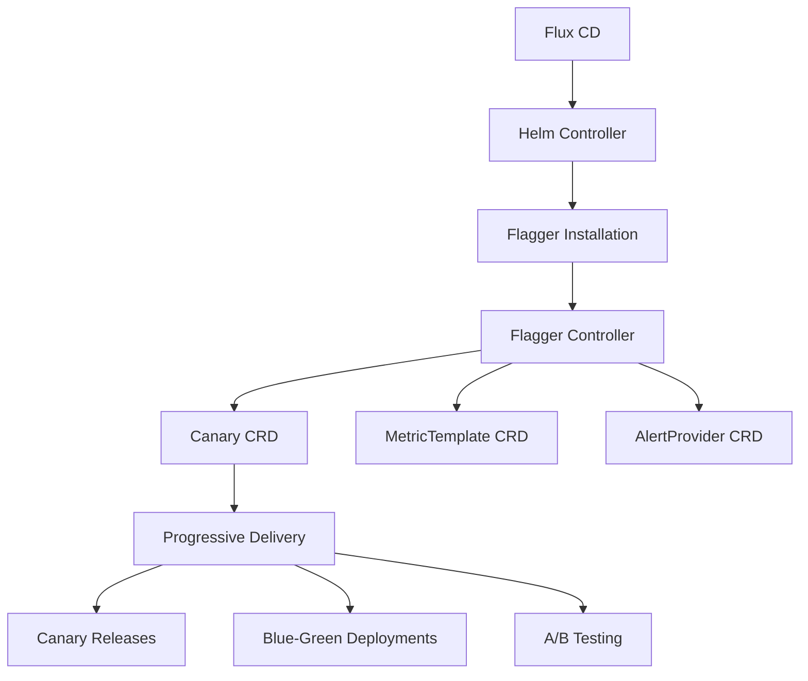

# How to Install Flagger with Flux CD

Author: [nawazdhandala](https://github.com/nawazdhandala)

Tags: Flagger, Flux CD, Progressive Delivery, Canary Deployment, Kubernetes, GitOps, Service Mesh

Description: A step-by-step guide to installing and configuring Flagger with Flux CD for progressive delivery on Kubernetes.

---

## Introduction

Flagger is a progressive delivery tool that automates the release process for applications running on Kubernetes. It reduces the risk of introducing new software versions by gradually shifting traffic to the new version while measuring metrics and running conformance tests. Flagger works with Flux CD to provide GitOps-driven progressive delivery.

This guide covers installing Flagger using Flux CD's Helm controller and configuring it for use with various service meshes and ingress controllers.

## Prerequisites

- A running Kubernetes cluster (v1.26 or later)
- Flux CD installed and bootstrapped on your cluster
- kubectl configured to access your cluster
- A metrics provider (Prometheus is the most common)
- An ingress controller or service mesh (NGINX, Istio, Linkerd, or similar)

## Architecture Overview



## Step 1: Add the Flagger Helm Repository

Create a Flux HelmRepository resource to add the Flagger Helm chart source.

```yaml
# infrastructure/flagger/namespace.yaml
# Create a namespace for Flagger components
apiVersion: v1
kind: Namespace
metadata:
  name: flagger-system
```

```yaml
# infrastructure/flagger/helmrepository.yaml
# Add the Flagger Helm chart repository
apiVersion: source.toolkit.fluxcd.io/v1
kind: HelmRepository
metadata:
  name: flagger
  namespace: flagger-system
spec:
  interval: 24h
  url: https://flagger.app
```

## Step 2: Install Flagger with a HelmRelease

Create the HelmRelease to install Flagger. The configuration depends on which service mesh or ingress controller you are using.

### Option A: Install Flagger for NGINX Ingress

```yaml
# infrastructure/flagger/helmrelease.yaml
# Install Flagger configured for NGINX Ingress Controller
apiVersion: helm.toolkit.fluxcd.io/v2
kind: HelmRelease
metadata:
  name: flagger
  namespace: flagger-system
spec:
  interval: 30m
  chart:
    spec:
      chart: flagger
      version: "1.37.x"
      sourceRef:
        kind: HelmRepository
        name: flagger
        namespace: flagger-system
  values:
    # Set the mesh provider to nginx
    meshProvider: nginx
    # Enable Prometheus metrics scraping
    metricsServer: http://prometheus-server.monitoring:80
    # Log level for debugging (set to info for production)
    logLevel: info
    # Enable leader election for HA deployments
    leaderElection:
      enabled: true
    # Resource requests and limits
    resources:
      requests:
        cpu: 50m
        memory: 128Mi
      limits:
        cpu: 250m
        memory: 256Mi
```

### Option B: Install Flagger for Istio

```yaml
# infrastructure/flagger/helmrelease-istio.yaml
# Install Flagger configured for Istio service mesh
apiVersion: helm.toolkit.fluxcd.io/v2
kind: HelmRelease
metadata:
  name: flagger
  namespace: flagger-system
spec:
  interval: 30m
  chart:
    spec:
      chart: flagger
      version: "1.37.x"
      sourceRef:
        kind: HelmRepository
        name: flagger
        namespace: flagger-system
  values:
    # Set the mesh provider to istio
    meshProvider: istio
    # Istio control plane namespace
    istio:
      kubeconfig:
        secretName: ""
    metricsServer: http://prometheus.istio-system:9090
    logLevel: info
    resources:
      requests:
        cpu: 50m
        memory: 128Mi
      limits:
        cpu: 250m
        memory: 256Mi
```

### Option C: Install Flagger for Linkerd

```yaml
# infrastructure/flagger/helmrelease-linkerd.yaml
# Install Flagger configured for Linkerd service mesh
apiVersion: helm.toolkit.fluxcd.io/v2
kind: HelmRelease
metadata:
  name: flagger
  namespace: flagger-system
spec:
  interval: 30m
  chart:
    spec:
      chart: flagger
      version: "1.37.x"
      sourceRef:
        kind: HelmRepository
        name: flagger
        namespace: flagger-system
  values:
    # Set the mesh provider to linkerd
    meshProvider: linkerd
    metricsServer: http://prometheus.linkerd-viz:9090
    logLevel: info
    resources:
      requests:
        cpu: 50m
        memory: 128Mi
      limits:
        cpu: 250m
        memory: 256Mi
```

## Step 3: Install Flagger's Grafana Dashboard (Optional)

Flagger provides a Grafana dashboard for visualizing canary deployments.

```yaml
# infrastructure/flagger/grafana-helmrelease.yaml
# Install Flagger's Grafana dashboard
apiVersion: helm.toolkit.fluxcd.io/v2
kind: HelmRelease
metadata:
  name: flagger-grafana
  namespace: flagger-system
spec:
  interval: 30m
  chart:
    spec:
      chart: grafana
      version: "1.7.x"
      sourceRef:
        kind: HelmRepository
        name: flagger
        namespace: flagger-system
  values:
    # URL of your Prometheus instance
    url: http://prometheus-server.monitoring:80
    # Default dashboard for canary analysis
    dashboard:
      enabled: true
```

## Step 4: Install the Flagger Load Tester (Optional)

The load tester generates traffic during canary analysis for accurate metrics.

```yaml
# infrastructure/flagger/loadtester.yaml
# Deploy the Flagger load tester for canary analysis
apiVersion: apps/v1
kind: Deployment
metadata:
  name: flagger-loadtester
  namespace: flagger-system
  labels:
    app: flagger-loadtester
spec:
  replicas: 1
  selector:
    matchLabels:
      app: flagger-loadtester
  template:
    metadata:
      labels:
        app: flagger-loadtester
    spec:
      containers:
        - name: loadtester
          image: ghcr.io/fluxcd/flagger-loadtester:0.31.0
          ports:
            - containerPort: 8080
          command:
            - ./loadtester
            - -port=8080
            - -log-level=info
            - -timeout=1h
          resources:
            requests:
              cpu: 50m
              memory: 64Mi
            limits:
              cpu: 250m
              memory: 256Mi
---
# Service for the load tester
apiVersion: v1
kind: Service
metadata:
  name: flagger-loadtester
  namespace: flagger-system
spec:
  selector:
    app: flagger-loadtester
  ports:
    - port: 80
      targetPort: 8080
  type: ClusterIP
```

## Step 5: Set Up the Flux Kustomization

Create the Flux Kustomization to manage all Flagger infrastructure resources.

```yaml
# infrastructure/flagger/kustomization.yaml
# Kustomize resource list for Flagger installation
apiVersion: kustomize.config.k8s.io/v1beta1
kind: Kustomization
resources:
  - namespace.yaml
  - helmrepository.yaml
  - helmrelease.yaml
  - loadtester.yaml
```

```yaml
# clusters/my-cluster/infrastructure.yaml
# Flux Kustomization to deploy infrastructure components
apiVersion: kustomize.toolkit.fluxcd.io/v1
kind: Kustomization
metadata:
  name: infrastructure
  namespace: flux-system
spec:
  interval: 10m
  sourceRef:
    kind: GitRepository
    name: flux-system
  path: ./infrastructure
  prune: true
  wait: true
  timeout: 5m
```

## Step 6: Install Prometheus for Metrics

Flagger needs a metrics provider to evaluate canary health. If you do not already have Prometheus, install it with Flux.

```yaml
# infrastructure/monitoring/namespace.yaml
apiVersion: v1
kind: Namespace
metadata:
  name: monitoring
```

```yaml
# infrastructure/monitoring/helmrepository.yaml
apiVersion: source.toolkit.fluxcd.io/v1
kind: HelmRepository
metadata:
  name: prometheus-community
  namespace: monitoring
spec:
  interval: 24h
  url: https://prometheus-community.github.io/helm-charts
```

```yaml
# infrastructure/monitoring/helmrelease.yaml
# Install Prometheus for Flagger metrics
apiVersion: helm.toolkit.fluxcd.io/v2
kind: HelmRelease
metadata:
  name: prometheus
  namespace: monitoring
spec:
  interval: 30m
  chart:
    spec:
      chart: prometheus
      version: "25.x"
      sourceRef:
        kind: HelmRepository
        name: prometheus-community
        namespace: monitoring
  values:
    # Disable components we do not need
    alertmanager:
      enabled: false
    pushgateway:
      enabled: false
    # Configure retention
    server:
      retention: 7d
      persistentVolume:
        size: 10Gi
```

## Step 7: Verify the Installation

After pushing the manifests to Git and allowing Flux to reconcile, verify that Flagger is running.

```bash
# Check the Flux HelmRelease status
flux get helmreleases -n flagger-system

# Verify Flagger pods are running
kubectl get pods -n flagger-system

# Check Flagger version and configuration
kubectl logs -n flagger-system deployment/flagger | head -20

# Verify Flagger CRDs are installed
kubectl get crds | grep flagger

# Expected output:
# canaries.flagger.app
# metrictemplates.flagger.app
# alertproviders.flagger.app
```

## Step 8: Validate the Installation with a Test Canary

Create a simple test to confirm Flagger is working correctly.

```yaml
# test/canary-test.yaml
# A minimal Canary resource to test the Flagger installation
apiVersion: flagger.app/v1beta1
kind: Canary
metadata:
  name: test-canary
  namespace: default
spec:
  targetRef:
    apiVersion: apps/v1
    kind: Deployment
    name: test-app
  # Analysis configuration
  analysis:
    # Check interval
    interval: 30s
    # Max number of failed checks before rollback
    threshold: 5
    # Traffic percentage increase per step
    stepWeight: 10
    # Max traffic percentage routed to canary
    maxWeight: 50
    metrics:
      - name: request-success-rate
        thresholdRange:
          min: 99
        interval: 1m
```

```bash
# Apply the test (outside of Flux for validation purposes)
kubectl apply -f test/canary-test.yaml

# Check the Canary status
kubectl get canary test-canary -n default

# Clean up the test
kubectl delete -f test/canary-test.yaml
```

## Troubleshooting

### Flagger Pod CrashLoopBackOff

If Flagger is crashing, check the logs for configuration issues:

```bash
# Check Flagger logs
kubectl logs -n flagger-system deployment/flagger --previous

# Common issues:
# - Wrong metrics server URL
# - Missing CRDs
# - Incorrect mesh provider setting
```

### HelmRelease Not Reconciling

If the HelmRelease is stuck, check its status:

```bash
# Get detailed HelmRelease status
flux get helmreleases -n flagger-system -o wide

# Check for Helm chart fetch errors
flux get sources helm -n flagger-system

# Force a reconciliation
flux reconcile helmrelease flagger -n flagger-system
```

### Metrics Server Connection Issues

If Flagger cannot reach Prometheus, verify the connection:

```bash
# Test Prometheus connectivity from within the cluster
kubectl run -it --rm debug --image=curlimages/curl -- \
  curl -s http://prometheus-server.monitoring:80/api/v1/query?query=up

# Check that the Prometheus service is accessible
kubectl get svc -n monitoring
```

### CRDs Not Installed

If Flagger CRDs are missing, the HelmRelease may have failed:

```bash
# Check if CRDs exist
kubectl get crds | grep flagger

# If missing, check HelmRelease events
kubectl describe helmrelease flagger -n flagger-system
```

## Summary

You have successfully installed Flagger with Flux CD using the Helm controller. Flagger is now ready to manage progressive delivery workflows on your cluster. The installation includes the Flagger controller, load tester for generating test traffic during canary analysis, and Prometheus for metrics. From here, you can configure Canary resources to enable canary deployments, blue-green deployments, or A/B testing for your applications.
