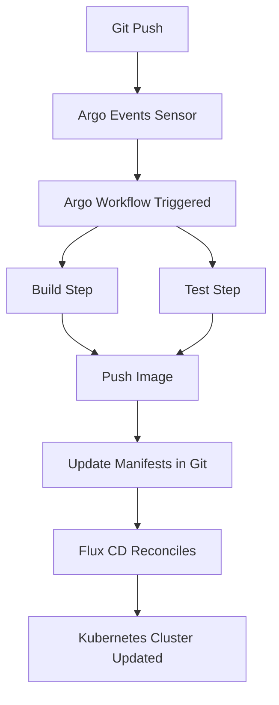

# How to Integrate Flux CD with Argo Workflows

Author: [nawazdhandala](https://github.com/nawazdhandala)

Tags: flux cd, argo workflows, ci/cd, gitops, kubernetes, continuous integration, workflow automation

Description: A step-by-step guide to combining Argo Workflows for CI pipeline orchestration with Flux CD for GitOps-based continuous delivery.

---

## Introduction

Argo Workflows is a Kubernetes-native workflow engine that excels at orchestrating complex CI pipelines with parallel steps, artifact passing, and DAG-based execution. Flux CD provides GitOps-based continuous delivery. Combining the two gives you powerful CI capabilities with a clean GitOps deployment model.

This guide shows you how to set up Argo Workflows for building and testing, and Flux CD for deploying to Kubernetes.

## Prerequisites

- A running Kubernetes cluster (v1.26 or later)
- Flux CD installed and bootstrapped
- kubectl configured to access your cluster
- Helm v3 installed
- A container registry accessible from your cluster
- A Git repository for application code and one for Kubernetes manifests

## Architecture Overview



## Step 1: Install Argo Workflows with Flux CD

Create the Flux HelmRelease to install Argo Workflows on your cluster.

```yaml
# infrastructure/argo-workflows/namespace.yaml
# Dedicated namespace for Argo Workflows
apiVersion: v1
kind: Namespace
metadata:
  name: argo
```

```yaml
# infrastructure/argo-workflows/helmrepository.yaml
# Add the Argo Helm chart repository
apiVersion: source.toolkit.fluxcd.io/v1
kind: HelmRepository
metadata:
  name: argo
  namespace: argo
spec:
  interval: 24h
  url: https://argoproj.github.io/argo-helm
```

```yaml
# infrastructure/argo-workflows/helmrelease.yaml
# Install Argo Workflows via Helm
apiVersion: helm.toolkit.fluxcd.io/v1
kind: HelmRelease
metadata:
  name: argo-workflows
  namespace: argo
spec:
  interval: 30m
  chart:
    spec:
      chart: argo-workflows
      version: "0.41.x"
      sourceRef:
        kind: HelmRepository
        name: argo
        namespace: argo
  values:
    # Server configuration
    server:
      extraArgs:
        - --auth-mode=server
    # Controller configuration
    controller:
      workflowNamespaces:
        - argo
        - default
    # Use emissary executor for better compatibility
    executor:
      type: emissary
```

## Step 2: Install Argo Events for Git Webhook Triggers

Argo Events listens for Git webhooks and triggers Argo Workflows automatically.

```yaml
# infrastructure/argo-events/helmrelease.yaml
# Install Argo Events via Helm
apiVersion: helm.toolkit.fluxcd.io/v1
kind: HelmRelease
metadata:
  name: argo-events
  namespace: argo
spec:
  interval: 30m
  chart:
    spec:
      chart: argo-events
      version: "2.4.x"
      sourceRef:
        kind: HelmRepository
        name: argo
        namespace: argo
  values:
    crds:
      install: true
```

## Step 3: Create the CI Workflow Template

Define an Argo Workflow template that builds, tests, and pushes your application image.

```yaml
# infrastructure/argo-workflows/ci-workflow-template.yaml
# Reusable CI workflow template
apiVersion: argoproj.io/v1alpha1
kind: WorkflowTemplate
metadata:
  name: ci-pipeline
  namespace: argo
spec:
  entrypoint: ci-pipeline
  # Pass the Git commit SHA and repository as parameters
  arguments:
    parameters:
      - name: git-repo
        value: "https://github.com/myorg/myapp.git"
      - name: git-revision
        value: "main"
      - name: image-name
        value: "registry.example.com/myapp"

  # Shared volume for cloning the repository
  volumeClaimTemplates:
    - metadata:
        name: workspace
      spec:
        accessModes: ["ReadWriteOnce"]
        resources:
          requests:
            storage: 1Gi

  templates:
    # Main DAG that orchestrates the pipeline steps
    - name: ci-pipeline
      dag:
        tasks:
          - name: clone
            template: git-clone
          - name: test
            template: run-tests
            dependencies: [clone]
          - name: build-push
            template: build-and-push
            dependencies: [clone]
          - name: update-manifests
            template: update-manifests
            dependencies: [test, build-push]

    # Clone the application repository
    - name: git-clone
      container:
        image: alpine/git
        command: [sh, -c]
        args:
          - |
            git clone {{workflow.parameters.git-repo}} /workspace/src
            cd /workspace/src
            git checkout {{workflow.parameters.git-revision}}
            # Save the short SHA for image tagging
            git rev-parse --short HEAD > /workspace/git-sha
        volumeMounts:
          - name: workspace
            mountPath: /workspace

    # Run application tests
    - name: run-tests
      container:
        image: golang:1.22
        command: [sh, -c]
        args:
          - |
            cd /workspace/src
            go test -v ./...
        volumeMounts:
          - name: workspace
            mountPath: /workspace

    # Build and push the container image using Kaniko
    - name: build-and-push
      container:
        image: gcr.io/kaniko-project/executor:latest
        command: [/kaniko/executor]
        args:
          - --context=/workspace/src
          - --dockerfile=/workspace/src/Dockerfile
          - "--destination={{workflow.parameters.image-name}}:$(cat /workspace/git-sha)"
          - "--destination={{workflow.parameters.image-name}}:latest"
        volumeMounts:
          - name: workspace
            mountPath: /workspace
          - name: docker-config
            mountPath: /kaniko/.docker
        env:
          - name: DOCKER_CONFIG
            value: /kaniko/.docker
      volumes:
        - name: docker-config
          secret:
            secretName: registry-credentials
            items:
              - key: .dockerconfigjson
                path: config.json

    # Update the Flux manifests repository with the new image tag
    - name: update-manifests
      container:
        image: alpine/git
        command: [sh, -c]
        args:
          - |
            GIT_SHA=$(cat /workspace/git-sha)
            IMAGE="{{workflow.parameters.image-name}}:${GIT_SHA}"

            # Clone the manifests repository
            git clone https://${GIT_TOKEN}@github.com/myorg/k8s-manifests.git /workspace/manifests
            cd /workspace/manifests

            # Update the image tag in the deployment
            sed -i "s|image: {{workflow.parameters.image-name}}:.*|image: ${IMAGE}|" apps/myapp/deployment.yaml

            # Commit and push the change
            git config user.email "argo@workflows.local"
            git config user.name "Argo Workflows"
            git add .
            git commit -m "chore: update myapp to ${GIT_SHA}"
            git push origin main
        env:
          - name: GIT_TOKEN
            valueFrom:
              secretKeyRef:
                name: git-credentials
                key: token
        volumeMounts:
          - name: workspace
            mountPath: /workspace
```

## Step 4: Set Up Argo Events to Trigger Workflows on Git Push

Create an EventSource and Sensor to listen for GitHub webhooks and trigger the CI workflow.

```yaml
# infrastructure/argo-events/github-eventsource.yaml
# Listen for GitHub webhook events
apiVersion: argoproj.io/v1alpha1
kind: EventSource
metadata:
  name: github
  namespace: argo
spec:
  github:
    myapp-push:
      # GitHub repository to watch
      repositories:
        - owner: myorg
          names:
            - myapp
      # Listen for push events on the main branch
      events:
        - push
      # Webhook configuration
      webhook:
        endpoint: /push
        port: "12000"
        method: POST
      # GitHub API token for webhook management
      apiToken:
        name: github-access
        key: token
      webhookSecret:
        name: github-access
        key: webhook-secret
      active: true
      contentType: json
```

```yaml
# infrastructure/argo-events/ci-sensor.yaml
# Trigger the CI workflow when a push event is received
apiVersion: argoproj.io/v1alpha1
kind: Sensor
metadata:
  name: ci-trigger
  namespace: argo
spec:
  dependencies:
    - name: github-push
      eventSourceName: github
      eventName: myapp-push
      # Only trigger on pushes to the main branch
      filters:
        data:
          - path: body.ref
            type: string
            value:
              - "refs/heads/main"
  triggers:
    - template:
        name: ci-workflow
        k8s:
          operation: create
          source:
            resource:
              apiVersion: argoproj.io/v1alpha1
              kind: Workflow
              metadata:
                generateName: ci-myapp-
                namespace: argo
              spec:
                workflowTemplateRef:
                  name: ci-pipeline
                arguments:
                  parameters:
                    - name: git-revision
                      # Extract the commit SHA from the webhook payload
                      value: ""
          # Map the webhook payload to workflow parameters
          parameters:
            - src:
                dependencyName: github-push
                dataKey: body.after
              dest: spec.arguments.parameters.0.value
```

## Step 5: Configure Flux CD to Deploy

Set up the Flux resources to watch the manifests repository and reconcile.

```yaml
# clusters/my-cluster/myapp-source.yaml
# Flux GitRepository pointing to the manifests repo
apiVersion: source.toolkit.fluxcd.io/v1
kind: GitRepository
metadata:
  name: myapp-manifests
  namespace: flux-system
spec:
  interval: 1m
  url: https://github.com/myorg/k8s-manifests.git
  ref:
    branch: main
  secretRef:
    name: manifests-auth
```

```yaml
# clusters/my-cluster/myapp-kustomization.yaml
# Flux Kustomization to apply the manifests
apiVersion: kustomize.toolkit.fluxcd.io/v1
kind: Kustomization
metadata:
  name: myapp
  namespace: flux-system
spec:
  interval: 5m
  sourceRef:
    kind: GitRepository
    name: myapp-manifests
  path: ./apps/myapp
  prune: true
  wait: true
  timeout: 3m
  # Health checks to verify deployment succeeded
  healthChecks:
    - apiVersion: apps/v1
      kind: Deployment
      name: myapp
      namespace: myapp
```

## Step 6: Create Required Secrets

Create the secrets that Argo Workflows and Events need.

```bash
# Create registry credentials for Kaniko to push images
kubectl create secret docker-registry registry-credentials \
  --docker-server=registry.example.com \
  --docker-username=myuser \
  --docker-password=mypassword \
  -n argo

# Create Git credentials for updating manifests
kubectl create secret generic git-credentials \
  --from-literal=token=ghp_xxxxxxxxxxxx \
  -n argo

# Create GitHub webhook secret for Argo Events
kubectl create secret generic github-access \
  --from-literal=token=ghp_xxxxxxxxxxxx \
  --from-literal=webhook-secret=my-webhook-secret \
  -n argo
```

## Step 7: Verify the Integration

Test the full pipeline by pushing a change to your application repository.

```bash
# Check Argo Workflows status
argo list -n argo

# Watch a specific workflow
argo watch -n argo ci-myapp-xxxxx

# Check Flux reconciliation
flux get sources git myapp-manifests
flux get kustomizations myapp

# Verify the deployment
kubectl get deployment myapp -n myapp -o wide
kubectl rollout status deployment/myapp -n myapp
```

## Troubleshooting

### Workflow Stuck in Pending

If workflows are stuck, check for resource issues:

```bash
# Check workflow pod events
kubectl describe pod -l workflows.argoproj.io/workflow -n argo

# Check if the workspace PVC was created
kubectl get pvc -n argo
```

### Sensor Not Triggering Workflows

Verify the EventSource and Sensor are running:

```bash
# Check EventSource status
kubectl get eventsource -n argo
kubectl logs -l eventsource-name=github -n argo

# Check Sensor status
kubectl get sensor -n argo
kubectl logs -l sensor-name=ci-trigger -n argo
```

### Flux Not Reconciling After Manifest Update

Force a reconciliation if Flux has not picked up the change:

```bash
flux reconcile source git myapp-manifests
flux reconcile kustomization myapp
```

## Summary

You now have a robust CI/CD pipeline where Argo Workflows handles complex build and test orchestration as DAGs, and Flux CD provides GitOps-based delivery. Argo Events bridges the gap by triggering workflows from Git webhooks. This setup gives you the flexibility of Argo's workflow engine with the reliability of Flux's GitOps reconciliation loop.
