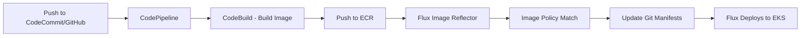

# How to Integrate Flux CD with AWS CodePipeline

Author: [nawazdhandala](https://github.com/nawazdhandala)

Tags: Flux CD, AWS CodePipeline, CodeBuild, CI/CD, GitOps, Kubernetes, ECR, EKS

Description: A practical guide to integrating AWS CodePipeline and CodeBuild with Flux CD for automated container builds and GitOps deployments on EKS.

---

## Introduction

AWS CodePipeline is Amazon's fully managed continuous delivery service that orchestrates build, test, and deploy stages. When paired with AWS CodeBuild for image building and Flux CD for GitOps deployment, it creates a cloud-native CI/CD pipeline entirely within the AWS ecosystem. This guide shows you how to configure CodePipeline to build container images, push them to Amazon ECR, and have Flux CD automatically deploy them to your EKS cluster.

## Prerequisites

Before you begin, ensure you have:

- An EKS cluster or any Kubernetes cluster with Flux CD installed
- An AWS account with CodePipeline, CodeBuild, and ECR access
- An Amazon ECR repository for storing container images
- `aws`, `kubectl`, and `flux` CLI tools installed
- Appropriate IAM roles and policies configured

## Architecture Overview



## Step 1: Create an ECR Repository

Set up an Amazon ECR repository to store your container images.

```bash
# Create an ECR repository
aws ecr create-repository \
  --repository-name my-app \
  --region us-east-1 \
  --image-scanning-configuration scanOnPush=true \
  --encryption-configuration encryptionType=AES256

# Get the repository URI for later use
ECR_URI=$(aws ecr describe-repositories \
  --repository-names my-app \
  --query 'repositories[0].repositoryUri' \
  --output text)
echo "ECR URI: $ECR_URI"
```

## Step 2: Create the CodeBuild Buildspec

Create a `buildspec.yml` file in your application repository. This defines what CodeBuild does during the build stage.

```yaml
# buildspec.yml
# AWS CodeBuild specification for building container images

version: 0.2

env:
  variables:
    # ECR repository name
    IMAGE_REPO_NAME: "my-app"
    # AWS region
    AWS_DEFAULT_REGION: "us-east-1"

phases:
  pre_build:
    commands:
      # Log in to Amazon ECR
      - echo "Logging in to Amazon ECR..."
      - aws ecr get-login-password --region $AWS_DEFAULT_REGION |
          docker login --username AWS --password-stdin
          $AWS_ACCOUNT_ID.dkr.ecr.$AWS_DEFAULT_REGION.amazonaws.com

      # Set the image tag to the commit SHA
      - COMMIT_HASH=$(echo $CODEBUILD_RESOLVED_SOURCE_VERSION | cut -c 1-7)
      - IMAGE_TAG=${COMMIT_HASH:=latest}
      - FULL_IMAGE="$AWS_ACCOUNT_ID.dkr.ecr.$AWS_DEFAULT_REGION.amazonaws.com/$IMAGE_REPO_NAME"

  build:
    commands:
      - echo "Building Docker image..."
      - echo "Build started on $(date)"

      # Build the container image
      - docker build
          --build-arg BUILD_DATE=$(date -u +%Y-%m-%dT%H:%M:%SZ)
          --build-arg VCS_REF=$CODEBUILD_RESOLVED_SOURCE_VERSION
          -t $FULL_IMAGE:$IMAGE_TAG
          -t $FULL_IMAGE:latest
          .

  post_build:
    commands:
      - echo "Pushing Docker image to ECR..."

      # Push both tags to ECR
      - docker push $FULL_IMAGE:$IMAGE_TAG
      - docker push $FULL_IMAGE:latest

      - echo "Image pushed successfully: $FULL_IMAGE:$IMAGE_TAG"

      # Write the image URI to a file for downstream stages
      - printf '{"ImageURI":"%s"}' $FULL_IMAGE:$IMAGE_TAG > imageDetail.json

artifacts:
  files:
    - imageDetail.json
```

## Step 3: Buildspec with Semantic Versioning

For semver-based image tagging:

```yaml
# buildspec-semver.yml
# CodeBuild specification with semantic versioning

version: 0.2

env:
  variables:
    IMAGE_REPO_NAME: "my-app"
    AWS_DEFAULT_REGION: "us-east-1"

phases:
  pre_build:
    commands:
      - aws ecr get-login-password --region $AWS_DEFAULT_REGION |
          docker login --username AWS --password-stdin
          $AWS_ACCOUNT_ID.dkr.ecr.$AWS_DEFAULT_REGION.amazonaws.com
      - FULL_IMAGE="$AWS_ACCOUNT_ID.dkr.ecr.$AWS_DEFAULT_REGION.amazonaws.com/$IMAGE_REPO_NAME"

      # Determine version from Git tag or generate one
      - |
        if [ -n "$GIT_TAG" ]; then
          VERSION="${GIT_TAG#v}"
        else
          VERSION="1.0.${CODEBUILD_BUILD_NUMBER}"
        fi
      - echo "Version: $VERSION"

  build:
    commands:
      # Build with semantic version tag
      - docker build
          --build-arg APP_VERSION=$VERSION
          -t $FULL_IMAGE:$VERSION
          .

  post_build:
    commands:
      - docker push $FULL_IMAGE:$VERSION
      - echo "Pushed $FULL_IMAGE:$VERSION"
```

## Step 4: Create the CodePipeline

Define the CodePipeline using CloudFormation or the AWS CLI.

```yaml
# codepipeline-cloudformation.yaml
# CloudFormation template for CodePipeline + CodeBuild

AWSTemplateFormatVersion: '2010-09-09'
Description: CI pipeline for building images consumed by Flux CD

Parameters:
  GitHubOwner:
    Type: String
    Description: GitHub repository owner
  GitHubRepo:
    Type: String
    Description: GitHub repository name
  GitHubBranch:
    Type: String
    Default: main

Resources:
  # CodeBuild project
  CodeBuildProject:
    Type: AWS::CodeBuild::Project
    Properties:
      Name: my-app-build
      Description: Build container images for Flux CD
      ServiceRole: !GetAtt CodeBuildRole.Arn
      Artifacts:
        Type: CODEPIPELINE
      Environment:
        Type: LINUX_CONTAINER
        ComputeType: BUILD_GENERAL1_MEDIUM
        Image: aws/codebuild/amazonlinux2-x86_64-standard:5.0
        PrivilegedMode: true
        EnvironmentVariables:
          - Name: AWS_ACCOUNT_ID
            Value: !Ref 'AWS::AccountId'
      Source:
        Type: CODEPIPELINE
        BuildSpec: buildspec.yml

  # CodePipeline
  Pipeline:
    Type: AWS::CodePipeline::Pipeline
    Properties:
      Name: my-app-pipeline
      RoleArn: !GetAtt PipelineRole.Arn
      Stages:
        # Source stage - pull from GitHub
        - Name: Source
          Actions:
            - Name: GitHubSource
              ActionTypeId:
                Category: Source
                Owner: ThirdParty
                Provider: GitHub
                Version: '1'
              Configuration:
                Owner: !Ref GitHubOwner
                Repo: !Ref GitHubRepo
                Branch: !Ref GitHubBranch
                OAuthToken: '{{resolve:secretsmanager:github-token}}'
              OutputArtifacts:
                - Name: SourceOutput

        # Build stage - build and push image
        - Name: Build
          Actions:
            - Name: BuildAndPush
              ActionTypeId:
                Category: Build
                Owner: AWS
                Provider: CodeBuild
                Version: '1'
              Configuration:
                ProjectName: !Ref CodeBuildProject
              InputArtifacts:
                - Name: SourceOutput
              OutputArtifacts:
                - Name: BuildOutput

  # IAM role for CodeBuild
  CodeBuildRole:
    Type: AWS::IAM::Role
    Properties:
      AssumeRolePolicyDocument:
        Version: '2012-10-17'
        Statement:
          - Effect: Allow
            Principal:
              Service: codebuild.amazonaws.com
            Action: 'sts:AssumeRole'
      Policies:
        - PolicyName: CodeBuildECRAccess
          PolicyDocument:
            Version: '2012-10-17'
            Statement:
              - Effect: Allow
                Action:
                  - 'ecr:GetAuthorizationToken'
                  - 'ecr:BatchCheckLayerAvailability'
                  - 'ecr:GetDownloadUrlForLayer'
                  - 'ecr:PutImage'
                  - 'ecr:InitiateLayerUpload'
                  - 'ecr:UploadLayerPart'
                  - 'ecr:CompleteLayerUpload'
                  - 'ecr:BatchGetImage'
                Resource: '*'
              - Effect: Allow
                Action:
                  - 'logs:CreateLogGroup'
                  - 'logs:CreateLogStream'
                  - 'logs:PutLogEvents'
                Resource: '*'

  # IAM role for CodePipeline
  PipelineRole:
    Type: AWS::IAM::Role
    Properties:
      AssumeRolePolicyDocument:
        Version: '2012-10-17'
        Statement:
          - Effect: Allow
            Principal:
              Service: codepipeline.amazonaws.com
            Action: 'sts:AssumeRole'
      Policies:
        - PolicyName: PipelinePolicy
          PolicyDocument:
            Version: '2012-10-17'
            Statement:
              - Effect: Allow
                Action:
                  - 'codebuild:StartBuild'
                  - 'codebuild:BatchGetBuilds'
                  - 's3:*'
                Resource: '*'
```

## Step 5: Configure Flux to Access ECR

Set up Flux to authenticate with Amazon ECR for image scanning.

```bash
# Create an IAM policy for Flux image scanning
cat > flux-ecr-policy.json <<EOF
{
  "Version": "2012-10-17",
  "Statement": [
    {
      "Effect": "Allow",
      "Action": [
        "ecr:GetAuthorizationToken",
        "ecr:BatchCheckLayerAvailability",
        "ecr:GetDownloadUrlForLayer",
        "ecr:BatchGetImage",
        "ecr:ListImages",
        "ecr:DescribeImages"
      ],
      "Resource": "*"
    }
  ]
}
EOF

# For EKS with IRSA (IAM Roles for Service Accounts)
# Associate the policy with the Flux service account
eksctl create iamserviceaccount \
  --name image-reflector-controller \
  --namespace flux-system \
  --cluster my-eks-cluster \
  --attach-policy-arn arn:aws:iam::$AWS_ACCOUNT_ID:policy/FluxECRReadPolicy \
  --approve
```

Alternatively, create a Kubernetes secret with ECR credentials:

```bash
# Get ECR login token and create a secret
ECR_TOKEN=$(aws ecr get-login-password --region us-east-1)

kubectl create secret docker-registry ecr-credentials \
  --namespace=flux-system \
  --docker-server=$AWS_ACCOUNT_ID.dkr.ecr.us-east-1.amazonaws.com \
  --docker-username=AWS \
  --docker-password=$ECR_TOKEN
```

## Step 6: Configure Flux Image Repository

Create the Flux `ImageRepository` to scan ECR.

```yaml
# clusters/my-cluster/image-repos/app-image-repo.yaml
apiVersion: image.toolkit.fluxcd.io/v1
kind: ImageRepository
metadata:
  name: my-app
  namespace: flux-system
spec:
  # ECR image URI
  image: 123456789012.dkr.ecr.us-east-1.amazonaws.com/my-app
  interval: 1m0s
  # Use ECR credentials secret
  secretRef:
    name: ecr-credentials
```

## Step 7: Set Up Image Policy and Automation

```yaml
# clusters/my-cluster/image-policies/app-image-policy.yaml
apiVersion: image.toolkit.fluxcd.io/v1
kind: ImagePolicy
metadata:
  name: my-app
  namespace: flux-system
spec:
  imageRepositoryRef:
    name: my-app
  policy:
    semver:
      range: ">=1.0.0"
---
# clusters/my-cluster/image-update-automation.yaml
apiVersion: image.toolkit.fluxcd.io/v1
kind: ImageUpdateAutomation
metadata:
  name: codepipeline-image-updates
  namespace: flux-system
spec:
  interval: 1m0s
  sourceRef:
    kind: GitRepository
    name: flux-system
  git:
    checkout:
      ref:
        branch: main
    commit:
      author:
        name: flux-bot
        email: flux-bot@example.com
      messageTemplate: |
        chore: update image from AWS CodePipeline build

        {{ range $resource, $changes := .Changed.Objects -}}
        - {{ $resource.Kind }}/{{ $resource.Name }}:
        {{ range $_, $change := $changes -}}
            {{ $change.OldValue }} -> {{ $change.NewValue }}
        {{ end -}}
        {{ end -}}
    push:
      branch: main
  update:
    path: ./clusters/my-cluster
    strategy: Setters
```

## Step 8: Add Image Markers to Deployment

```yaml
# clusters/my-cluster/app/deployment.yaml
apiVersion: apps/v1
kind: Deployment
metadata:
  name: my-app
  namespace: default
spec:
  replicas: 3
  selector:
    matchLabels:
      app: my-app
  template:
    metadata:
      labels:
        app: my-app
    spec:
      containers:
        - name: my-app
          # Flux updates this tag based on ImagePolicy
          image: 123456789012.dkr.ecr.us-east-1.amazonaws.com/my-app:1.0.42 # {"$imagepolicy": "flux-system:my-app"}
          ports:
            - containerPort: 8080
          resources:
            requests:
              cpu: 100m
              memory: 128Mi
            limits:
              cpu: 500m
              memory: 256Mi
```

## Step 9: Handle ECR Token Rotation

ECR tokens expire every 12 hours. Set up a CronJob to rotate the credentials automatically.

```yaml
# clusters/my-cluster/ecr-token-rotation.yaml
apiVersion: batch/v1
kind: CronJob
metadata:
  name: ecr-token-refresh
  namespace: flux-system
spec:
  # Run every 6 hours to refresh the ECR token
  schedule: "0 */6 * * *"
  jobTemplate:
    spec:
      template:
        spec:
          serviceAccountName: ecr-token-refresher
          containers:
            - name: ecr-token-refresh
              image: amazon/aws-cli:latest
              command:
                - /bin/sh
                - -c
                - |
                  # Get a fresh ECR token
                  TOKEN=$(aws ecr get-login-password --region us-east-1)

                  # Update the Kubernetes secret
                  kubectl delete secret ecr-credentials -n flux-system --ignore-not-found
                  kubectl create secret docker-registry ecr-credentials \
                    --namespace=flux-system \
                    --docker-server=$AWS_ACCOUNT_ID.dkr.ecr.us-east-1.amazonaws.com \
                    --docker-username=AWS \
                    --docker-password=$TOKEN
          restartPolicy: OnFailure
```

## Step 10: Verify and Troubleshoot

```bash
# Check image repository scan status
flux get image repository my-app

# Check image policy
flux get image policy my-app

# Check automation status
flux get image update codepipeline-image-updates

# View current deployed image
kubectl get deployment my-app -o jsonpath='{.spec.template.spec.containers[0].image}'

# Check CodePipeline status
aws codepipeline get-pipeline-state --name my-app-pipeline

# Troubleshoot Flux controllers
kubectl -n flux-system logs deployment/image-reflector-controller --tail=50
kubectl -n flux-system logs deployment/image-automation-controller --tail=50

# Force reconciliation
flux reconcile image repository my-app
flux reconcile image update codepipeline-image-updates
```

## Conclusion

Integrating AWS CodePipeline with Flux CD provides a fully managed GitOps pipeline within the AWS ecosystem. CodePipeline orchestrates the build process, CodeBuild creates container images, and ECR stores them securely. Flux CD then monitors ECR for new images and automatically deploys them to your EKS cluster. The key consideration with this setup is managing ECR token rotation, which can be handled via IRSA for a more seamless experience or through a CronJob for non-EKS clusters.
