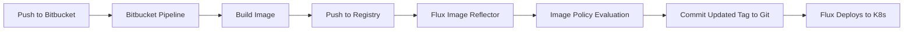

# How to Integrate Flux CD with Bitbucket Pipelines

Author: [nawazdhandala](https://github.com/nawazdhandala)

Tags: Flux CD, Bitbucket Pipelines, CI/CD, GitOps, Kubernetes, Container Images, Atlassian

Description: A comprehensive guide to integrating Bitbucket Pipelines with Flux CD for automated container builds and GitOps deployments to Kubernetes.

---

## Introduction

Bitbucket Pipelines is Atlassian's built-in CI/CD service that runs directly within Bitbucket Cloud. When paired with Flux CD, it creates a seamless GitOps workflow where Bitbucket Pipelines builds and pushes container images, and Flux CD automatically deploys them to your Kubernetes cluster. This guide walks you through the entire setup process.

## Prerequisites

Before you begin, ensure you have:

- A Kubernetes cluster with Flux CD installed
- A Bitbucket Cloud account with Pipelines enabled
- A container registry (Docker Hub, AWS ECR, GCR, or any OCI-compatible registry)
- `kubectl` and `flux` CLI tools installed locally
- Flux image automation controllers deployed in your cluster

## Architecture Overview



## Step 1: Enable Bitbucket Pipelines

In your Bitbucket repository:

1. Go to Repository Settings > Pipelines > Settings
2. Enable Pipelines
3. Go to Repository Settings > Pipelines > Repository variables
4. Add the following variables:
   - `DOCKER_USERNAME` - Your registry username
   - `DOCKER_PASSWORD` - Your registry password (mark as secured)

## Step 2: Create the Bitbucket Pipeline Configuration

Create a `bitbucket-pipelines.yml` file in the root of your application repository.

```yaml
# bitbucket-pipelines.yml
# Pipeline for building and pushing container images for Flux CD

image: atlassian/default-image:4

options:
  # Enable Docker for building container images
  docker: true

definitions:
  # Reusable step for building and pushing images
  steps:
    - step: &build-and-push
        name: Build and Push Container Image
        services:
          - docker
        caches:
          - docker
        script:
          # Authenticate with Docker Hub
          - echo "$DOCKER_PASSWORD" | docker login -u "$DOCKER_USERNAME" --password-stdin

          # Generate image tag from short commit hash
          - export IMAGE_TAG=$(echo $BITBUCKET_COMMIT | cut -c1-7)
          - export FULL_IMAGE="$DOCKER_USERNAME/my-app"

          # Build the container image
          - docker build
              --label "org.opencontainers.image.revision=$BITBUCKET_COMMIT"
              --label "org.opencontainers.image.created=$(date -u +%Y-%m-%dT%H:%M:%SZ)"
              -t $FULL_IMAGE:$IMAGE_TAG
              -t $FULL_IMAGE:latest
              .

          # Push both tags to the registry
          - docker push $FULL_IMAGE:$IMAGE_TAG
          - docker push $FULL_IMAGE:latest

          # Print a summary
          - echo "Successfully pushed $FULL_IMAGE:$IMAGE_TAG"

    - step: &run-tests
        name: Run Tests
        script:
          - echo "Running tests..."
          - make test || echo "No test target configured"

pipelines:
  # Default pipeline for all branches
  default:
    - step: *run-tests

  # Pipeline for the main branch - builds and pushes images
  branches:
    main:
      - step: *run-tests
      - step: *build-and-push
```

## Step 3: Pipeline with Semantic Versioning

For production workflows using semantic versioning:

```yaml
# bitbucket-pipelines.yml with semantic versioning

image: atlassian/default-image:4

options:
  docker: true

pipelines:
  branches:
    main:
      - step:
          name: Build and Push with Semver
          services:
            - docker
          script:
            # Authenticate with the registry
            - echo "$DOCKER_PASSWORD" | docker login -u "$DOCKER_USERNAME" --password-stdin

            # Generate a semantic version
            # Format: 1.0.<pipeline-build-number>
            - export VERSION="1.0.${BITBUCKET_BUILD_NUMBER}"
            - export FULL_IMAGE="$DOCKER_USERNAME/my-app"

            # Build with version tag
            - docker build
                --build-arg APP_VERSION=$VERSION
                -t $FULL_IMAGE:$VERSION
                .

            # Push the versioned image
            - docker push $FULL_IMAGE:$VERSION
            - echo "Pushed $FULL_IMAGE:$VERSION"

  # Build on Git tags for release versions
  tags:
    'v*':
      - step:
          name: Build Release Image
          services:
            - docker
          script:
            - echo "$DOCKER_PASSWORD" | docker login -u "$DOCKER_USERNAME" --password-stdin

            # Use the Git tag as the image version (strip 'v' prefix)
            - export VERSION=${BITBUCKET_TAG#v}
            - export FULL_IMAGE="$DOCKER_USERNAME/my-app"

            - docker build -t $FULL_IMAGE:$VERSION .
            - docker push $FULL_IMAGE:$VERSION
```

## Step 4: Pipeline for AWS ECR

If you are using AWS ECR as your container registry:

```yaml
# bitbucket-pipelines.yml for AWS ECR

image: atlassian/default-image:4

options:
  docker: true

definitions:
  steps:
    - step: &build-push-ecr
        name: Build and Push to ECR
        services:
          - docker
        script:
          # Install AWS CLI
          - pip3 install awscli

          # Configure AWS credentials (set these in repository variables)
          - export AWS_ACCESS_KEY_ID=$AWS_ACCESS_KEY_ID
          - export AWS_SECRET_ACCESS_KEY=$AWS_SECRET_ACCESS_KEY
          - export AWS_DEFAULT_REGION=$AWS_REGION

          # Authenticate with ECR
          - aws ecr get-login-password --region $AWS_REGION |
              docker login --username AWS --password-stdin
              $AWS_ACCOUNT_ID.dkr.ecr.$AWS_REGION.amazonaws.com

          # Set image variables
          - export ECR_REPO="$AWS_ACCOUNT_ID.dkr.ecr.$AWS_REGION.amazonaws.com/my-app"
          - export IMAGE_TAG=$(echo $BITBUCKET_COMMIT | cut -c1-7)

          # Build and push
          - docker build -t $ECR_REPO:$IMAGE_TAG .
          - docker push $ECR_REPO:$IMAGE_TAG

pipelines:
  branches:
    main:
      - step: *build-push-ecr
```

## Step 5: Configure Flux Image Repository

Set up Flux to scan the container registry for images pushed by Bitbucket Pipelines.

```yaml
# clusters/my-cluster/image-repos/app-image-repo.yaml
apiVersion: image.toolkit.fluxcd.io/v1
kind: ImageRepository
metadata:
  name: my-app
  namespace: flux-system
spec:
  # Point to your container image
  image: docker.io/my-org/my-app
  # Scan interval
  interval: 1m0s
  # Credentials for private registries
  secretRef:
    name: registry-credentials
```

Create the registry credentials:

```bash
# Create a Kubernetes secret for registry authentication
kubectl create secret docker-registry registry-credentials \
  --namespace=flux-system \
  --docker-server=docker.io \
  --docker-username=your-username \
  --docker-password=your-password
```

## Step 6: Set Up Image Policy

Configure Flux to select the right image tag from the registry.

```yaml
# clusters/my-cluster/image-policies/app-image-policy.yaml
apiVersion: image.toolkit.fluxcd.io/v1
kind: ImagePolicy
metadata:
  name: my-app
  namespace: flux-system
spec:
  imageRepositoryRef:
    name: my-app
  policy:
    semver:
      # Accept versions in the 1.x range
      range: ">=1.0.0"
```

## Step 7: Configure Image Update Automation

Set up Flux to commit updated image tags back to your Git repository.

```yaml
# clusters/my-cluster/image-update-automation.yaml
apiVersion: image.toolkit.fluxcd.io/v1
kind: ImageUpdateAutomation
metadata:
  name: bitbucket-image-updates
  namespace: flux-system
spec:
  interval: 1m0s
  sourceRef:
    kind: GitRepository
    name: flux-system
  git:
    checkout:
      ref:
        branch: main
    commit:
      author:
        name: flux-bot
        email: flux-bot@example.com
      messageTemplate: |
        chore: update image from Bitbucket Pipeline

        {{ range $resource, $changes := .Changed.Objects -}}
        - {{ $resource.Kind }}/{{ $resource.Name }}:
        {{ range $_, $change := $changes -}}
            {{ $change.OldValue }} -> {{ $change.NewValue }}
        {{ end -}}
        {{ end -}}
    push:
      branch: main
  update:
    path: ./clusters/my-cluster
    strategy: Setters
```

## Step 8: Mark Deployment Manifests

Add image policy markers to your Kubernetes deployment manifests.

```yaml
# clusters/my-cluster/app/deployment.yaml
apiVersion: apps/v1
kind: Deployment
metadata:
  name: my-app
  namespace: default
spec:
  replicas: 3
  selector:
    matchLabels:
      app: my-app
  template:
    metadata:
      labels:
        app: my-app
    spec:
      containers:
        - name: my-app
          # Flux updates this tag based on the ImagePolicy
          image: docker.io/my-org/my-app:1.0.23 # {"$imagepolicy": "flux-system:my-app"}
          ports:
            - containerPort: 8080
          resources:
            requests:
              cpu: 100m
              memory: 128Mi
            limits:
              cpu: 500m
              memory: 256Mi
```

## Step 9: Parallel Pipelines for Multi-Architecture Builds

Bitbucket Pipelines supports parallel steps for building multi-architecture images:

```yaml
# bitbucket-pipelines.yml with multi-arch builds

image: atlassian/default-image:4

options:
  docker: true

pipelines:
  branches:
    main:
      - parallel:
          - step:
              name: Build AMD64 Image
              services:
                - docker
              script:
                - echo "$DOCKER_PASSWORD" | docker login -u "$DOCKER_USERNAME" --password-stdin
                - export TAG=$(echo $BITBUCKET_COMMIT | cut -c1-7)
                - docker build -t $DOCKER_USERNAME/my-app:${TAG}-amd64 .
                - docker push $DOCKER_USERNAME/my-app:${TAG}-amd64
          - step:
              name: Build ARM64 Image
              services:
                - docker
              script:
                - echo "$DOCKER_PASSWORD" | docker login -u "$DOCKER_USERNAME" --password-stdin
                - export TAG=$(echo $BITBUCKET_COMMIT | cut -c1-7)
                - docker buildx build --platform linux/arm64
                    -t $DOCKER_USERNAME/my-app:${TAG}-arm64 --push .
      - step:
          name: Create Multi-Arch Manifest
          services:
            - docker
          script:
            - echo "$DOCKER_PASSWORD" | docker login -u "$DOCKER_USERNAME" --password-stdin
            - export TAG=$(echo $BITBUCKET_COMMIT | cut -c1-7)
            # Create and push a manifest list
            - docker manifest create $DOCKER_USERNAME/my-app:$TAG
                $DOCKER_USERNAME/my-app:${TAG}-amd64
                $DOCKER_USERNAME/my-app:${TAG}-arm64
            - docker manifest push $DOCKER_USERNAME/my-app:$TAG
```

## Step 10: Verify and Troubleshoot

Confirm that the end-to-end pipeline is working:

```bash
# Check if Flux is scanning the image repository
flux get image repository my-app

# Verify the selected image tag
flux get image policy my-app

# Check the image update automation status
flux get image update bitbucket-image-updates

# View the deployed image version
kubectl get deployment my-app -o jsonpath='{.spec.template.spec.containers[0].image}'

# Troubleshooting: check controller logs
kubectl -n flux-system logs deployment/image-reflector-controller --tail=50
kubectl -n flux-system logs deployment/image-automation-controller --tail=50

# Force a reconciliation
flux reconcile image repository my-app
flux reconcile image update bitbucket-image-updates
```

## Conclusion

Integrating Bitbucket Pipelines with Flux CD provides a complete GitOps workflow within the Atlassian ecosystem. Bitbucket Pipelines handles the CI side by building and pushing container images on every commit to main, while Flux CD continuously monitors the registry and deploys new images to your Kubernetes cluster automatically. This setup ensures that your deployments are always in sync with your latest builds, with full traceability through Git commits and Bitbucket Pipeline logs.
