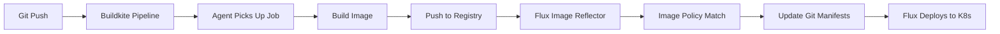

# How to Integrate Flux CD with Buildkite

Author: [nawazdhandala](https://github.com/nawazdhandala)

Tags: flux cd, buildkite, ci/cd, gitops, kubernetes, container images, docker, pipeline

Description: A step-by-step guide to integrating Buildkite pipelines with Flux CD for building container images and automating GitOps deployments.

---

## Introduction

Buildkite is a hybrid CI/CD platform that runs build agents on your own infrastructure while providing a managed web interface for orchestration. This gives you full control over your build environment with the convenience of a hosted dashboard. When integrated with Flux CD, Buildkite handles the CI side of building and pushing container images, while Flux CD provides continuous delivery through GitOps. This guide walks you through the complete setup.

## Prerequisites

Before getting started, ensure you have:

- A Kubernetes cluster with Flux CD installed
- A Buildkite account with at least one agent running
- A container registry (Docker Hub, ECR, GCR, or any OCI-compatible registry)
- `kubectl` and `flux` CLI tools installed
- Flux image automation controllers deployed in your cluster

## Architecture Overview



## Step 1: Set Up the Buildkite Agent

If you have not already set up a Buildkite agent, deploy one that has Docker access.

```bash
# Install the Buildkite agent on a machine with Docker
# Using the official install script
TOKEN="your-agent-token" bash -c \
  'bash <(curl -sL https://raw.githubusercontent.com/buildkite/agent/main/install.sh)'

# Ensure the agent user has Docker access
sudo usermod -aG docker buildkite-agent

# Start the agent
buildkite-agent start
```

Alternatively, run the agent in Kubernetes:

```yaml
# buildkite-agent-deployment.yaml
apiVersion: apps/v1
kind: Deployment
metadata:
  name: buildkite-agent
  namespace: buildkite
spec:
  replicas: 2
  selector:
    matchLabels:
      app: buildkite-agent
  template:
    metadata:
      labels:
        app: buildkite-agent
    spec:
      containers:
        - name: agent
          image: buildkite/agent:3
          env:
            - name: BUILDKITE_AGENT_TOKEN
              valueFrom:
                secretKeyRef:
                  name: buildkite-agent-token
                  key: token
            - name: BUILDKITE_AGENT_TAGS
              value: "queue=default,docker=true"
          volumeMounts:
            - name: docker-socket
              mountPath: /var/run/docker.sock
      volumes:
        - name: docker-socket
          hostPath:
            path: /var/run/docker.sock
```

## Step 2: Create the Buildkite Pipeline Configuration

Create a `.buildkite/pipeline.yml` file in your application repository.

```yaml
# .buildkite/pipeline.yml
# Buildkite pipeline for building container images for Flux CD

env:
  # Container registry settings
  REGISTRY: "docker.io"
  IMAGE_NAME: "my-org/my-app"

steps:
  # Step 1: Run tests
  - label: ":test_tube: Run Tests"
    command: |
      echo "Running tests..."
      make test || echo "Tests passed"
    agents:
      queue: default

  # Step 2: Wait for tests to pass
  - wait: ~

  # Step 3: Build and push the container image
  - label: ":docker: Build and Push Image"
    command: |
      # Generate the image tag from the commit SHA
      IMAGE_TAG=$$(echo $$BUILDKITE_COMMIT | cut -c1-7)
      FULL_IMAGE="$$REGISTRY/$$IMAGE_NAME"

      echo "Building $$FULL_IMAGE:$$IMAGE_TAG"

      # Login to the container registry
      echo "$$DOCKER_PASSWORD" | docker login $$REGISTRY \
        -u "$$DOCKER_USERNAME" --password-stdin

      # Build the container image
      docker build \
        --label "org.opencontainers.image.revision=$$BUILDKITE_COMMIT" \
        --label "org.opencontainers.image.source=$$BUILDKITE_REPO" \
        -t $$FULL_IMAGE:$$IMAGE_TAG \
        -t $$FULL_IMAGE:latest \
        .

      # Push both tags
      docker push $$FULL_IMAGE:$$IMAGE_TAG
      docker push $$FULL_IMAGE:latest

      echo "Successfully pushed $$FULL_IMAGE:$$IMAGE_TAG"
    agents:
      queue: default
      docker: "true"
    branches: "main"
```

## Step 3: Pipeline with Semantic Versioning

For semver-based image tagging:

```yaml
# .buildkite/pipeline.yml with semantic versioning

env:
  REGISTRY: "docker.io"
  IMAGE_NAME: "my-org/my-app"

steps:
  - label: ":test_tube: Tests"
    command: make test
    agents:
      queue: default

  - wait: ~

  - label: ":docker: Build and Push (Semver)"
    command: |
      # Determine the version
      if [ -n "$$BUILDKITE_TAG" ]; then
        # Use Git tag (strip 'v' prefix)
        VERSION=$${BUILDKITE_TAG#v}
      else
        # Generate version from build number
        VERSION="1.0.$$BUILDKITE_BUILD_NUMBER"
      fi

      FULL_IMAGE="$$REGISTRY/$$IMAGE_NAME"

      echo "--- :docker: Building version $$VERSION"

      # Authenticate
      echo "$$DOCKER_PASSWORD" | docker login $$REGISTRY \
        -u "$$DOCKER_USERNAME" --password-stdin

      # Build with version tag
      docker build \
        --build-arg APP_VERSION=$$VERSION \
        -t $$FULL_IMAGE:$$VERSION \
        .

      # Push the image
      docker push $$FULL_IMAGE:$$VERSION

      echo "Pushed $$FULL_IMAGE:$$VERSION"
    agents:
      queue: default
      docker: "true"
    branches: "main"
```

## Step 4: Using the Docker Buildkite Plugin

Buildkite plugins simplify common operations. Use the Docker Compose or Docker plugins for building:

```yaml
# .buildkite/pipeline.yml using the Docker plugin

steps:
  - label: ":docker: Build and Push"
    plugins:
      - docker-compose#v5.2.0:
          build: app
          image-repository: docker.io/my-org/my-app
          image-name: my-app
          # Cache from previous builds
          cache-from:
            - "app:docker.io/my-org/my-app:latest"
          push:
            - "app:docker.io/my-org/my-app:1.0.${BUILDKITE_BUILD_NUMBER}"
            - "app:docker.io/my-org/my-app:latest"
    agents:
      queue: default
    branches: "main"
```

## Step 5: Pipeline for AWS ECR

If you use Amazon ECR:

```yaml
# .buildkite/pipeline.yml for AWS ECR

env:
  AWS_REGION: "us-east-1"
  AWS_ACCOUNT_ID: "123456789012"
  IMAGE_NAME: "my-app"

steps:
  - label: ":docker: Build and Push to ECR"
    plugins:
      - ecr#v2.7.0:
          login: true
          account-ids: "${AWS_ACCOUNT_ID}"
          region: "${AWS_REGION}"
      - docker-compose#v5.2.0:
          build: app
          image-repository: "${AWS_ACCOUNT_ID}.dkr.ecr.${AWS_REGION}.amazonaws.com/${IMAGE_NAME}"
          push:
            - "app:${AWS_ACCOUNT_ID}.dkr.ecr.${AWS_REGION}.amazonaws.com/${IMAGE_NAME}:${BUILDKITE_COMMIT:0:7}"
    agents:
      queue: default
    branches: "main"
```

## Step 6: Configure Flux Image Repository

Set up Flux to scan for images pushed by Buildkite.

```yaml
# clusters/my-cluster/image-repos/app-image-repo.yaml
apiVersion: image.toolkit.fluxcd.io/v1
kind: ImageRepository
metadata:
  name: my-app
  namespace: flux-system
spec:
  # Point to your container image
  image: docker.io/my-org/my-app
  # Scan every minute
  interval: 1m0s
  # Registry credentials
  secretRef:
    name: registry-credentials
```

Create the registry credentials:

```bash
# Create a secret for Flux to access the registry
kubectl create secret docker-registry registry-credentials \
  --namespace=flux-system \
  --docker-server=docker.io \
  --docker-username=your-username \
  --docker-password=your-password
```

## Step 7: Set Up Image Policy

Define how Flux selects the latest image tag.

```yaml
# clusters/my-cluster/image-policies/app-image-policy.yaml
apiVersion: image.toolkit.fluxcd.io/v1
kind: ImagePolicy
metadata:
  name: my-app
  namespace: flux-system
spec:
  imageRepositoryRef:
    name: my-app
  policy:
    semver:
      # Select the latest semver version
      range: ">=1.0.0"
```

## Step 8: Configure Image Update Automation

Set up Flux to automatically update deployment manifests.

```yaml
# clusters/my-cluster/image-update-automation.yaml
apiVersion: image.toolkit.fluxcd.io/v1
kind: ImageUpdateAutomation
metadata:
  name: buildkite-image-updates
  namespace: flux-system
spec:
  interval: 1m0s
  sourceRef:
    kind: GitRepository
    name: flux-system
  git:
    checkout:
      ref:
        branch: main
    commit:
      author:
        name: flux-bot
        email: flux-bot@example.com
      messageTemplate: |
        chore: update image from Buildkite build

        {{ range $resource, $changes := .Changed.Objects -}}
        - {{ $resource.Kind }}/{{ $resource.Name }}:
        {{ range $_, $change := $changes -}}
            {{ $change.OldValue }} -> {{ $change.NewValue }}
        {{ end -}}
        {{ end -}}
    push:
      branch: main
  update:
    path: ./clusters/my-cluster
    strategy: Setters
```

## Step 9: Add Image Markers to Deployment

Mark your Kubernetes deployment with image policy references.

```yaml
# clusters/my-cluster/app/deployment.yaml
apiVersion: apps/v1
kind: Deployment
metadata:
  name: my-app
  namespace: default
spec:
  replicas: 3
  selector:
    matchLabels:
      app: my-app
  template:
    metadata:
      labels:
        app: my-app
    spec:
      containers:
        - name: my-app
          # Flux updates this tag based on the ImagePolicy
          image: docker.io/my-org/my-app:1.0.30 # {"$imagepolicy": "flux-system:my-app"}
          ports:
            - containerPort: 8080
          resources:
            requests:
              cpu: 100m
              memory: 128Mi
            limits:
              cpu: 500m
              memory: 256Mi
```

## Step 10: Set Up Buildkite Webhook for Flux

Configure a webhook to notify Flux immediately after a successful build.

```yaml
# clusters/my-cluster/webhook-receiver.yaml
apiVersion: notification.toolkit.fluxcd.io/v1
kind: Receiver
metadata:
  name: buildkite-receiver
  namespace: flux-system
spec:
  type: generic
  secretRef:
    name: webhook-token
  resources:
    - kind: ImageRepository
      name: my-app
      apiVersion: image.toolkit.fluxcd.io/v1
```

Add a notification step to your Buildkite pipeline:

```yaml
# Add to .buildkite/pipeline.yml after the build step
  - label: ":bell: Notify Flux"
    command: |
      # Trigger Flux to scan for the new image immediately
      curl -s -X POST \
        "https://flux-webhook.example.com/hook/buildkite-receiver" \
        -H "Content-Type: application/json" \
        -d '{"image": "'"$$REGISTRY/$$IMAGE_NAME:$$IMAGE_TAG"'"}'
    branches: "main"
    depends_on: "build-and-push"
```

## Verify and Troubleshoot

Confirm everything is working end-to-end:

```bash
# Check recent Buildkite builds via the CLI or web UI
# https://buildkite.com/my-org/my-app/builds

# Check Flux image scanning
flux get image repository my-app

# Verify the selected image tag
flux get image policy my-app

# Check automation status
flux get image update buildkite-image-updates

# View the deployed image
kubectl get deployment my-app -o jsonpath='{.spec.template.spec.containers[0].image}'

# Troubleshoot Flux
kubectl -n flux-system logs deployment/image-reflector-controller --tail=50
kubectl -n flux-system logs deployment/image-automation-controller --tail=50

# Force reconciliation
flux reconcile image repository my-app
flux reconcile image update buildkite-image-updates
```

## Conclusion

Integrating Buildkite with Flux CD combines the flexibility of running builds on your own infrastructure with the power of GitOps-based deployments. Buildkite gives you full control over your build agents and environment, while Flux CD handles the deployment automation through image scanning and Git-based manifest updates. The hybrid model of Buildkite means you can run builds close to your development environment for fast feedback, while Flux ensures consistent and auditable deployments to your Kubernetes clusters. This combination is particularly well-suited for organizations that need control over their build infrastructure while embracing GitOps principles.
