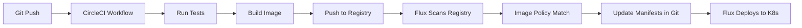

# How to Integrate Flux CD with CircleCI

Author: [nawazdhandala](https://github.com/nawazdhandala)

Tags: flux cd, circleci, ci/cd, gitops, kubernetes, container images, docker

Description: Learn how to integrate CircleCI pipelines with Flux CD to automate container image builds and GitOps-based Kubernetes deployments.

---

## Introduction

CircleCI is a cloud-native CI/CD platform known for its speed and flexibility. By integrating CircleCI with Flux CD, you can automate the entire software delivery lifecycle: CircleCI builds and pushes container images, while Flux CD handles continuous deployment to Kubernetes using GitOps principles. This guide covers the complete setup from pipeline configuration to Flux automation.

## Prerequisites

Make sure you have the following ready:

- A Kubernetes cluster with Flux CD installed and configured
- A CircleCI account linked to your Git repository (GitHub or Bitbucket)
- A container registry (Docker Hub, ECR, GCR, or GHCR)
- `kubectl` and `flux` CLI tools installed
- The Flux image automation controllers installed in your cluster

## Architecture Overview



## Step 1: Create the CircleCI Configuration

Create a `.circleci/config.yml` file in your application repository. This defines the pipeline that builds and pushes Docker images.

```yaml
# .circleci/config.yml
# CircleCI pipeline for building container images consumed by Flux CD

version: 2.1

# Reusable executors
executors:
  docker-builder:
    docker:
      - image: cimg/base:2024.01
    resource_class: medium

# Reusable commands
commands:
  setup-docker:
    description: "Set up Docker environment and authenticate"
    steps:
      - setup_remote_docker:
          version: "24.0"
          docker_layer_caching: true
      - run:
          name: Authenticate with Docker Registry
          command: |
            # Login to Docker Hub using CircleCI environment variables
            echo "$DOCKER_PASSWORD" | docker login \
              -u "$DOCKER_USERNAME" --password-stdin

# Pipeline jobs
jobs:
  test:
    executor: docker-builder
    steps:
      - checkout
      - run:
          name: Run tests
          command: |
            # Run your test suite
            make test || echo "Tests passed or no tests configured"

  build-and-push:
    executor: docker-builder
    steps:
      - checkout
      - setup-docker
      - run:
          name: Build Docker image
          command: |
            # Use the short Git SHA as the image tag
            IMAGE_TAG=$(echo $CIRCLE_SHA1 | cut -c1-7)

            # Build the container image
            docker build \
              --build-arg BUILD_DATE=$(date -u +%Y-%m-%dT%H:%M:%SZ) \
              --build-arg VCS_REF=$CIRCLE_SHA1 \
              -t $DOCKER_USERNAME/my-app:$IMAGE_TAG \
              -t $DOCKER_USERNAME/my-app:latest \
              .
      - run:
          name: Push Docker image
          command: |
            IMAGE_TAG=$(echo $CIRCLE_SHA1 | cut -c1-7)

            # Push both tags to the registry
            docker push $DOCKER_USERNAME/my-app:$IMAGE_TAG
            docker push $DOCKER_USERNAME/my-app:latest

            echo "Pushed image: $DOCKER_USERNAME/my-app:$IMAGE_TAG"

# Workflow definition
workflows:
  build-deploy:
    jobs:
      - test:
          # Only run on the main branch
          filters:
            branches:
              only: main
      - build-and-push:
          requires:
            - test
          filters:
            branches:
              only: main
```

## Step 2: Set Up CircleCI Environment Variables

In the CircleCI project settings, add the following environment variables:

1. Go to Project Settings > Environment Variables
2. Add the following:
   - `DOCKER_USERNAME` - Your Docker Hub username
   - `DOCKER_PASSWORD` - Your Docker Hub password or access token

For other registries, adjust accordingly:

```yaml
# For AWS ECR, use the aws-ecr orb
# For GCR, use the gcp-gcr orb
# For GHCR, set DOCKER_USERNAME to your GitHub username
#   and DOCKER_PASSWORD to a GitHub personal access token
```

## Step 3: Use CircleCI Orbs for Registry Integration

CircleCI orbs simplify common integrations. Here is an example using the AWS ECR orb:

```yaml
# .circleci/config.yml with AWS ECR orb

version: 2.1

orbs:
  # Use the official AWS ECR orb for ECR authentication
  aws-ecr: circleci/aws-ecr@9.0

workflows:
  build-and-push-ecr:
    jobs:
      - aws-ecr/build_and_push_image:
          repo: my-app
          # Tag with the short SHA for Flux to detect
          tag: "${CIRCLE_SHA1:0:7}"
          # Additional tag
          extra-build-args: "--build-arg VERSION=${CIRCLE_SHA1:0:7}"
          filters:
            branches:
              only: main
```

## Step 4: Semantic Versioning with CircleCI

For semver-based image tagging, use Git tags to drive version numbers:

```yaml
# .circleci/config.yml with semantic versioning

version: 2.1

executors:
  docker-builder:
    docker:
      - image: cimg/base:2024.01

jobs:
  build-and-push-semver:
    executor: docker-builder
    steps:
      - checkout
      - setup_remote_docker:
          version: "24.0"
      - run:
          name: Determine version
          command: |
            # Use the Git tag as the version, or generate one
            if [ -n "$CIRCLE_TAG" ]; then
              VERSION=$CIRCLE_TAG
            else
              # Generate a version from the branch and build number
              VERSION="1.0.${CIRCLE_BUILD_NUM}"
            fi
            echo "export VERSION=$VERSION" >> $BASH_ENV
            echo "Version: $VERSION"
      - run:
          name: Build and push
          command: |
            echo "$DOCKER_PASSWORD" | docker login -u "$DOCKER_USERNAME" --password-stdin

            # Build with the semantic version tag
            docker build -t $DOCKER_USERNAME/my-app:$VERSION .

            # Push the versioned image
            docker push $DOCKER_USERNAME/my-app:$VERSION

workflows:
  version-build:
    jobs:
      - build-and-push-semver:
          filters:
            branches:
              only: main
            tags:
              only: /^v.*/
```

## Step 5: Configure Flux Image Repository

Set up Flux to monitor the container registry for new images pushed by CircleCI.

```yaml
# clusters/my-cluster/image-repos/app-image-repo.yaml
apiVersion: image.toolkit.fluxcd.io/v1
kind: ImageRepository
metadata:
  name: my-app
  namespace: flux-system
spec:
  # Your Docker Hub image path
  image: docker.io/my-org/my-app
  # Scan every minute for new tags
  interval: 1m0s
  # Secret for private registry access
  secretRef:
    name: dockerhub-credentials
```

## Step 6: Create the Image Policy

Define the policy for selecting which image tag Flux should deploy.

```yaml
# clusters/my-cluster/image-policies/app-image-policy.yaml
apiVersion: image.toolkit.fluxcd.io/v1
kind: ImagePolicy
metadata:
  name: my-app
  namespace: flux-system
spec:
  imageRepositoryRef:
    name: my-app
  policy:
    semver:
      # Select the latest semver version
      range: ">=1.0.0"
```

## Step 7: Set Up Image Update Automation

Configure Flux to automatically commit updated image tags back to Git.

```yaml
# clusters/my-cluster/image-update-automation.yaml
apiVersion: image.toolkit.fluxcd.io/v1
kind: ImageUpdateAutomation
metadata:
  name: circleci-image-updates
  namespace: flux-system
spec:
  interval: 1m0s
  sourceRef:
    kind: GitRepository
    name: flux-system
  git:
    checkout:
      ref:
        branch: main
    commit:
      author:
        name: flux-bot
        email: flux-bot@example.com
      messageTemplate: |
        chore: update image from CircleCI build

        {{ range $resource, $changes := .Changed.Objects -}}
        - {{ $resource.Kind }}/{{ $resource.Name }}:
        {{ range $_, $change := $changes -}}
            {{ $change.OldValue }} -> {{ $change.NewValue }}
        {{ end -}}
        {{ end -}}
    push:
      branch: main
  update:
    path: ./clusters/my-cluster
    strategy: Setters
```

## Step 8: Mark Deployment Manifests

Add image policy markers to your Kubernetes deployment so Flux knows where to update the image tag.

```yaml
# clusters/my-cluster/app/deployment.yaml
apiVersion: apps/v1
kind: Deployment
metadata:
  name: my-app
  namespace: default
spec:
  replicas: 3
  selector:
    matchLabels:
      app: my-app
  template:
    metadata:
      labels:
        app: my-app
    spec:
      containers:
        - name: my-app
          # Flux will update this tag automatically
          image: docker.io/my-org/my-app:1.0.55 # {"$imagepolicy": "flux-system:my-app"}
          ports:
            - containerPort: 8080
          env:
            - name: APP_ENV
              value: production
```

## Step 9: Set Up Flux Notifications for CircleCI

Configure Flux to send notifications about deployment status.

```yaml
# clusters/my-cluster/notifications/provider.yaml
apiVersion: notification.toolkit.fluxcd.io/v1beta3
kind: Provider
metadata:
  name: slack-notifications
  namespace: flux-system
spec:
  type: slack
  channel: deployments
  secretRef:
    name: slack-webhook-url
---
# clusters/my-cluster/notifications/alert.yaml
apiVersion: notification.toolkit.fluxcd.io/v1beta3
kind: Alert
metadata:
  name: deployment-alerts
  namespace: flux-system
spec:
  providerRef:
    name: slack-notifications
  eventSeverity: info
  eventSources:
    - kind: ImagePolicy
      name: my-app
    - kind: Kustomization
      name: flux-system
```

## Step 10: Verify and Troubleshoot

Confirm the integration is working end-to-end:

```bash
# Check the image repository scan status
flux get image repository my-app

# Verify the image policy is selecting the correct tag
flux get image policy my-app

# Check the automation status
flux get image update circleci-image-updates

# View the current deployed image
kubectl get deployment my-app -o jsonpath='{.spec.template.spec.containers[0].image}'

# If something is not working, check the controller logs
kubectl -n flux-system logs deployment/image-reflector-controller --tail=50
kubectl -n flux-system logs deployment/image-automation-controller --tail=50

# Force reconciliation
flux reconcile image repository my-app
flux reconcile image update circleci-image-updates
```

## Conclusion

Integrating CircleCI with Flux CD provides a streamlined GitOps pipeline where CircleCI handles the CI responsibilities of testing, building, and pushing container images, while Flux CD continuously monitors the registry and automatically updates your Kubernetes deployments. The use of CircleCI orbs simplifies registry authentication, and Flux image automation ensures that every new image built by CircleCI is deployed without manual intervention. This combination gives you fast feedback loops, full audit trails through Git, and reliable automated deployments.
