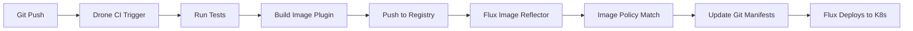

# How to Integrate Flux CD with Drone CI

Author: [nawazdhandala](https://github.com/nawazdhandala)

Tags: flux cd, drone ci, ci/cd, gitops, kubernetes, container images, docker, pipeline

Description: A practical guide to integrating Drone CI with Flux CD for automated container image builds and GitOps-based Kubernetes deployments.

---

## Introduction

Drone CI is a lightweight, container-native CI/CD platform that uses a simple YAML-based pipeline configuration. Every step in a Drone pipeline runs inside a container, making it a natural fit for building container images. When combined with Flux CD, Drone handles the CI responsibilities while Flux manages continuous delivery through GitOps. This guide shows you how to set up the complete integration.

## Prerequisites

Before you start, make sure you have:

- A Kubernetes cluster with Flux CD installed
- A Drone CI server connected to your Git provider (GitHub, GitLab, or Bitbucket)
- A container registry (Docker Hub, ECR, GCR, or any OCI-compatible registry)
- `kubectl` and `flux` CLI tools installed
- Flux image automation controllers deployed in your cluster

## Architecture Overview



## Step 1: Configure Drone CI Secrets

Set up the registry credentials as secrets in Drone CI. You can do this through the Drone UI or the CLI.

```bash
# Install the Drone CLI
# https://docs.drone.io/cli/install/

# Set environment variables for the Drone CLI
export DRONE_SERVER=https://drone.example.com
export DRONE_TOKEN=your-personal-token

# Add Docker Hub credentials as secrets
drone secret add \
  --repository my-org/my-app \
  --name docker_username \
  --data your-docker-username

drone secret add \
  --repository my-org/my-app \
  --name docker_password \
  --data your-docker-password
```

## Step 2: Create the Drone Pipeline

Create a `.drone.yml` file in the root of your application repository.

```yaml
# .drone.yml
# Drone CI pipeline for building container images for Flux CD

kind: pipeline
type: docker
name: build-and-push

# Only trigger on pushes to the main branch
trigger:
  branch:
    - main
  event:
    - push

steps:
  # Step 1: Run tests
  - name: test
    image: golang:1.22
    commands:
      # Run your test suite
      - go test ./... || echo "Tests passed"

  # Step 2: Build and push the container image
  - name: build-and-push
    image: plugins/docker
    settings:
      # Docker Hub repository
      repo: my-org/my-app
      # Use the short commit SHA as the tag
      tags:
        - "${DRONE_COMMIT_SHA:0:7}"
        - latest
      # Registry credentials from Drone secrets
      username:
        from_secret: docker_username
      password:
        from_secret: docker_password
      # Build arguments
      build_args:
        - "BUILD_DATE=${DRONE_BUILD_STARTED}"
        - "VCS_REF=${DRONE_COMMIT_SHA}"
    when:
      status:
        - success
```

## Step 3: Pipeline with Semantic Versioning

For semver-based image tagging, adjust the pipeline:

```yaml
# .drone.yml with semantic versioning

kind: pipeline
type: docker
name: build-semver

trigger:
  branch:
    - main
  event:
    - push
    - tag

steps:
  # Step 1: Determine the version
  - name: determine-version
    image: alpine:3.19
    commands:
      # Use Git tag if available, otherwise generate from build number
      - |
        if [ -n "$DRONE_TAG" ]; then
          VERSION="${DRONE_TAG#v}"
        else
          VERSION="1.0.${DRONE_BUILD_NUMBER}"
        fi
      - echo "$VERSION" > .version
      - echo "Building version: $VERSION"

  # Step 2: Build and push with semver tag
  - name: build-and-push
    image: plugins/docker
    settings:
      repo: my-org/my-app
      # Read the tag from the version file
      tags:
        - "${DRONE_TAG##v}"
      username:
        from_secret: docker_username
      password:
        from_secret: docker_password
    when:
      event:
        - tag

  # Alternative: build with build-number-based version
  - name: build-and-push-branch
    image: plugins/docker
    settings:
      repo: my-org/my-app
      tags:
        - "1.0.${DRONE_BUILD_NUMBER}"
      username:
        from_secret: docker_username
      password:
        from_secret: docker_password
    when:
      event:
        - push
```

## Step 4: Pipeline for AWS ECR

If you are using Amazon ECR as your registry:

```yaml
# .drone.yml for AWS ECR

kind: pipeline
type: docker
name: build-ecr

trigger:
  branch:
    - main
  event:
    - push

steps:
  - name: build-and-push-ecr
    image: plugins/ecr
    settings:
      # ECR repository settings
      repo: 123456789012.dkr.ecr.us-east-1.amazonaws.com/my-app
      registry: 123456789012.dkr.ecr.us-east-1.amazonaws.com
      region: us-east-1
      tags:
        - "${DRONE_COMMIT_SHA:0:7}"
        - latest
      # AWS credentials from Drone secrets
      access_key:
        from_secret: aws_access_key
      secret_key:
        from_secret: aws_secret_key
```

## Step 5: Pipeline for Google Container Registry

For GCR or Google Artifact Registry:

```yaml
# .drone.yml for GCR

kind: pipeline
type: docker
name: build-gcr

trigger:
  branch:
    - main
  event:
    - push

steps:
  - name: build-and-push-gcr
    image: plugins/gcr
    settings:
      repo: my-project-id/my-app
      registry: gcr.io
      tags:
        - "${DRONE_COMMIT_SHA:0:7}"
        - latest
      # GCP service account JSON key
      json_key:
        from_secret: gcp_service_account_key
```

## Step 6: Configure Flux Image Repository

In your Flux configuration repository, create an `ImageRepository` to scan for images.

```yaml
# clusters/my-cluster/image-repos/app-image-repo.yaml
apiVersion: image.toolkit.fluxcd.io/v1
kind: ImageRepository
metadata:
  name: my-app
  namespace: flux-system
spec:
  # Point to your container image
  image: docker.io/my-org/my-app
  # Scan every minute
  interval: 1m0s
  # Credentials for private registries
  secretRef:
    name: registry-credentials
```

Create the registry credentials for Flux:

```bash
# Create registry credentials secret
kubectl create secret docker-registry registry-credentials \
  --namespace=flux-system \
  --docker-server=docker.io \
  --docker-username=your-username \
  --docker-password=your-password
```

## Step 7: Set Up Image Policy

Define the image selection policy for Flux.

```yaml
# clusters/my-cluster/image-policies/app-image-policy.yaml
apiVersion: image.toolkit.fluxcd.io/v1
kind: ImagePolicy
metadata:
  name: my-app
  namespace: flux-system
spec:
  imageRepositoryRef:
    name: my-app
  policy:
    semver:
      # Select the latest semver version
      range: ">=1.0.0"
```

For commit SHA-based tagging:

```yaml
# Alternative: commit SHA-based policy
apiVersion: image.toolkit.fluxcd.io/v1
kind: ImagePolicy
metadata:
  name: my-app
  namespace: flux-system
spec:
  imageRepositoryRef:
    name: my-app
  filterTags:
    pattern: '^[a-f0-9]{7}$'
  policy:
    alphabetical:
      order: asc
```

## Step 8: Configure Image Update Automation

Set up Flux to automatically commit updated image tags to your Git repository.

```yaml
# clusters/my-cluster/image-update-automation.yaml
apiVersion: image.toolkit.fluxcd.io/v1
kind: ImageUpdateAutomation
metadata:
  name: drone-image-updates
  namespace: flux-system
spec:
  interval: 1m0s
  sourceRef:
    kind: GitRepository
    name: flux-system
  git:
    checkout:
      ref:
        branch: main
    commit:
      author:
        name: flux-bot
        email: flux-bot@example.com
      messageTemplate: |
        chore: update image from Drone CI build

        {{ range $resource, $changes := .Changed.Objects -}}
        - {{ $resource.Kind }}/{{ $resource.Name }}:
        {{ range $_, $change := $changes -}}
            {{ $change.OldValue }} -> {{ $change.NewValue }}
        {{ end -}}
        {{ end -}}
    push:
      branch: main
  update:
    path: ./clusters/my-cluster
    strategy: Setters
```

## Step 9: Add Image Markers to Deployment Manifests

Mark your Kubernetes deployment with image policy references.

```yaml
# clusters/my-cluster/app/deployment.yaml
apiVersion: apps/v1
kind: Deployment
metadata:
  name: my-app
  namespace: default
spec:
  replicas: 3
  selector:
    matchLabels:
      app: my-app
  template:
    metadata:
      labels:
        app: my-app
    spec:
      containers:
        - name: my-app
          # Flux will update the image tag automatically
          image: docker.io/my-org/my-app:1.0.15 # {"$imagepolicy": "flux-system:my-app"}
          ports:
            - containerPort: 8080
          resources:
            requests:
              cpu: 100m
              memory: 128Mi
            limits:
              cpu: 500m
              memory: 256Mi
```

## Step 10: Multi-Pipeline Setup

Drone supports multiple pipelines in a single `.drone.yml` file. You can separate testing and building:

```yaml
# .drone.yml with multiple pipelines

---
kind: pipeline
type: docker
name: test

trigger:
  event:
    - pull_request
    - push

steps:
  - name: lint
    image: golangci/golangci-lint:v1.55
    commands:
      - golangci-lint run ./...

  - name: test
    image: golang:1.22
    commands:
      - go test -race -cover ./...

---
kind: pipeline
type: docker
name: build-and-push

trigger:
  branch:
    - main
  event:
    - push

depends_on:
  - test

steps:
  - name: build-and-push
    image: plugins/docker
    settings:
      repo: my-org/my-app
      tags:
        - "1.0.${DRONE_BUILD_NUMBER}"
        - latest
      username:
        from_secret: docker_username
      password:
        from_secret: docker_password
```

## Verify and Troubleshoot

Confirm the integration is working:

```bash
# Check recent Drone builds
drone build ls my-org/my-app

# Check Flux image scanning
flux get image repository my-app

# Verify selected tag
flux get image policy my-app

# Check automation status
flux get image update drone-image-updates

# View deployed image
kubectl get deployment my-app -o jsonpath='{.spec.template.spec.containers[0].image}'

# Troubleshoot Flux
kubectl -n flux-system logs deployment/image-reflector-controller --tail=50
kubectl -n flux-system logs deployment/image-automation-controller --tail=50

# Force reconciliation
flux reconcile image repository my-app
flux reconcile image update drone-image-updates
```

## Conclusion

Integrating Drone CI with Flux CD provides a lightweight, container-native GitOps pipeline. Drone's plugin-based architecture makes it easy to build and push images to any container registry, while Flux CD handles the deployment side automatically through image automation. The simplicity of Drone's YAML configuration combined with Flux's GitOps approach results in a streamlined, maintainable CI/CD pipeline that scales well for teams of any size.
