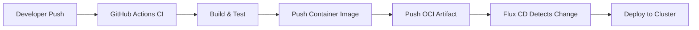

# How to Integrate Flux CD with GitHub Actions for CI/CD

Author: [nawazdhandala](https://github.com/nawazdhandala)

Tags: Flux CD, GitHub Actions, CI/CD, GitOps, Oci artifacts, Kubernetes, Automation

Description: A comprehensive guide to building an end-to-end CI/CD pipeline by integrating Flux CD with GitHub Actions, covering build workflows, OCI artifacts, and webhook triggers.

---

## Introduction

Flux CD handles the continuous delivery (CD) side of your pipeline by syncing Kubernetes clusters with Git repositories. GitHub Actions covers the continuous integration (CI) side by building, testing, and packaging your code. When combined, they form a complete CI/CD pipeline where GitHub Actions builds and pushes artifacts, and Flux CD automatically deploys them to your cluster.

This guide shows you how to create an end-to-end CI/CD pipeline using GitHub Actions and Flux CD with OCI artifacts, webhook triggers, and automated deployment workflows.

## Prerequisites

- A Kubernetes cluster with Flux CD bootstrapped
- A GitHub repository for your application code
- A GitHub repository for your Flux configuration
- A container registry (GHCR, Docker Hub, or any OCI-compatible registry)
- Flux CLI installed locally

## Architecture Overview

The CI/CD pipeline follows this flow:



## Step 1: Set Up the GitHub Actions CI Workflow

Create a workflow that builds, tests, and pushes your container image on every push to the main branch.

```yaml
# .github/workflows/ci.yaml
name: CI Pipeline

on:
  push:
    branches:
      - main
    paths:
      # Only trigger when application code changes
      - "src/**"
      - "Dockerfile"
      - "package.json"
  pull_request:
    branches:
      - main

env:
  REGISTRY: ghcr.io
  IMAGE_NAME: ${{ github.repository }}

jobs:
  test:
    runs-on: ubuntu-latest
    steps:
      - name: Checkout code
        uses: actions/checkout@v4

      - name: Set up Node.js
        uses: actions/setup-node@v4
        with:
          node-version: "20"
          cache: "npm"

      - name: Install dependencies
        run: npm ci

      - name: Run tests
        run: npm test

      - name: Run linting
        run: npm run lint

  build-and-push:
    needs: test
    runs-on: ubuntu-latest
    # Only build and push on main branch pushes
    if: github.event_name == 'push' && github.ref == 'refs/heads/main'
    permissions:
      contents: read
      packages: write
    outputs:
      image-tag: ${{ steps.meta.outputs.version }}
    steps:
      - name: Checkout code
        uses: actions/checkout@v4

      - name: Log in to GHCR
        uses: docker/login-action@v3
        with:
          registry: ${{ env.REGISTRY }}
          username: ${{ github.actor }}
          password: ${{ secrets.GITHUB_TOKEN }}

      - name: Extract metadata for Docker
        id: meta
        uses: docker/metadata-action@v5
        with:
          images: ${{ env.REGISTRY }}/${{ env.IMAGE_NAME }}
          tags: |
            # Generate a semver tag from git tag
            type=semver,pattern={{version}}
            # Generate a tag from the short SHA
            type=sha,prefix=
            # Tag as latest for main branch
            type=raw,value=latest,enable={{is_default_branch}}

      - name: Build and push Docker image
        uses: docker/build-push-action@v5
        with:
          context: .
          push: true
          tags: ${{ steps.meta.outputs.tags }}
          labels: ${{ steps.meta.outputs.labels }}
```

## Step 2: Push OCI Artifacts for Flux

After building the container image, push Kubernetes manifests as an OCI artifact that Flux can consume.

```yaml
# .github/workflows/ci.yaml (continued - add this job)
  push-oci-artifact:
    needs: build-and-push
    runs-on: ubuntu-latest
    permissions:
      contents: read
      packages: write
      id-token: write
    steps:
      - name: Checkout code
        uses: actions/checkout@v4

      - name: Set up Flux CLI
        uses: fluxcd/flux2/action@main

      - name: Log in to GHCR
        run: |
          echo "${{ secrets.GITHUB_TOKEN }}" | flux push artifact \
            oci://${{ env.REGISTRY }}/${{ github.repository }}-manifests:$(git rev-parse --short HEAD) \
            --path=./deploy \
            --source="$(git config --get remote.origin.url)" \
            --revision="$(git branch --show-current)/$(git rev-parse HEAD)" \
            --creds ${{ github.actor }}:${{ secrets.GITHUB_TOKEN }}

      - name: Tag the artifact as latest
        run: |
          flux tag artifact \
            oci://${{ env.REGISTRY }}/${{ github.repository }}-manifests:$(git rev-parse --short HEAD) \
            --tag latest \
            --creds ${{ github.actor }}:${{ secrets.GITHUB_TOKEN }}
```

## Step 3: Configure Flux to Consume OCI Artifacts

Set up Flux to pull manifests from the OCI artifact you pushed.

```yaml
# clusters/production/oci-source.yaml
apiVersion: source.toolkit.fluxcd.io/v1
kind: OCIRepository
metadata:
  name: my-app-manifests
  namespace: flux-system
spec:
  # OCI artifact pushed by GitHub Actions
  url: oci://ghcr.io/my-org/my-app-manifests
  interval: 5m
  ref:
    # Track the latest tag
    tag: latest
  provider: generic
  secretRef:
    name: ghcr-credentials
```

Create the Kustomization that deploys from the OCI source:

```yaml
# clusters/production/my-app-kustomization.yaml
apiVersion: kustomize.toolkit.fluxcd.io/v1
kind: Kustomization
metadata:
  name: my-app
  namespace: flux-system
spec:
  interval: 10m
  retryInterval: 2m
  sourceRef:
    kind: OCIRepository
    name: my-app-manifests
  path: ./
  prune: true
  wait: true
  timeout: 5m
  # Health checks for the deployed resources
  healthChecks:
    - apiVersion: apps/v1
      kind: Deployment
      name: my-app
      namespace: default
```

## Step 4: Set Up Webhook Triggers

Configure a webhook receiver in Flux so that GitHub Actions can trigger an immediate reconciliation after pushing a new artifact.

```yaml
# clusters/production/webhook-receiver.yaml
apiVersion: notification.toolkit.fluxcd.io/v1
kind: Receiver
metadata:
  name: github-receiver
  namespace: flux-system
spec:
  type: github
  events:
    - "ping"
    - "push"
  secretRef:
    # Shared secret for webhook verification
    name: github-webhook-secret
  resources:
    - kind: OCIRepository
      name: my-app-manifests
      apiVersion: source.toolkit.fluxcd.io/v1
```

Create the webhook secret:

```bash
# Generate a random secret
WEBHOOK_SECRET=$(openssl rand -hex 32)

# Create the Kubernetes secret
kubectl create secret generic github-webhook-secret \
  --namespace flux-system \
  --from-literal=token=$WEBHOOK_SECRET
```

Get the webhook URL and configure it in your GitHub repository:

```bash
# Get the receiver URL
flux get receivers

# The URL will look like:
# http://<notification-controller-address>/hook/<hash>
```

Add a step to your GitHub Actions workflow to trigger the webhook:

```yaml
  notify-flux:
    needs: push-oci-artifact
    runs-on: ubuntu-latest
    steps:
      - name: Trigger Flux reconciliation
        run: |
          # Send a webhook to trigger immediate reconciliation
          curl -X POST \
            -H "X-GitHub-Event: push" \
            -H "X-Hub-Signature-256: sha256=$(echo -n '{}' | openssl dgst -sha256 -hmac '${{ secrets.FLUX_WEBHOOK_SECRET }}' | awk '{print $2}')" \
            -d '{}' \
            ${{ secrets.FLUX_WEBHOOK_URL }}
```

## Step 5: Set Up Deployment Notifications

Configure Flux to notify GitHub about deployment status:

```yaml
# clusters/production/github-notification.yaml
apiVersion: notification.toolkit.fluxcd.io/v1
kind: Provider
metadata:
  name: github-status
  namespace: flux-system
spec:
  type: github
  address: https://github.com/my-org/my-app
  secretRef:
    # GitHub token with repo:status permission
    name: github-token

---
apiVersion: notification.toolkit.fluxcd.io/v1
kind: Alert
metadata:
  name: github-deploy-status
  namespace: flux-system
spec:
  providerRef:
    name: github-status
  eventSeverity: info
  eventSources:
    - kind: Kustomization
      name: my-app
```

## Step 6: Add Environment-Specific Deployments

Structure your CI/CD pipeline for multiple environments:

```yaml
# .github/workflows/promote.yaml
name: Promote to Production

on:
  workflow_dispatch:
    inputs:
      version:
        description: "Version to promote"
        required: true
        type: string

jobs:
  promote:
    runs-on: ubuntu-latest
    steps:
      - name: Checkout Flux config repo
        uses: actions/checkout@v4
        with:
          repository: my-org/flux-config
          token: ${{ secrets.FLUX_CONFIG_TOKEN }}

      - name: Update production image tag
        run: |
          # Update the image tag in the production overlay
          cd clusters/production
          kustomize edit set image \
            ghcr.io/my-org/my-app=ghcr.io/my-org/my-app:${{ inputs.version }}

      - name: Commit and push
        run: |
          git config user.name "GitHub Actions"
          git config user.email "actions@github.com"
          git add .
          git commit -m "chore: promote my-app to ${{ inputs.version }} in production"
          git push
```

## Step 7: Verify the Pipeline

Test the complete CI/CD pipeline:

```bash
# Make a code change and push to main
git add .
git commit -m "feat: add new feature"
git push origin main

# Monitor GitHub Actions
gh run watch

# Monitor Flux reconciliation
flux get oci-repositories --watch

# Check the deployment was updated
kubectl get deployment my-app -o jsonpath='{.spec.template.spec.containers[0].image}'

# View Flux events
flux events --for Kustomization/my-app
```

## Troubleshooting

### OCI Artifact Push Failures

```bash
# Verify GHCR authentication
echo $GITHUB_TOKEN | docker login ghcr.io -u $GITHUB_ACTOR --password-stdin

# Test pushing an artifact manually
flux push artifact oci://ghcr.io/my-org/my-app-manifests:test \
  --path=./deploy \
  --source="local" \
  --revision="test"
```

### Webhook Not Triggering

```bash
# Check the receiver status
flux get receivers

# View notification controller logs
kubectl logs -n flux-system deployment/notification-controller

# Verify the webhook secret matches
kubectl get secret github-webhook-secret -n flux-system -o yaml
```

### Flux Not Picking Up New Artifacts

```bash
# Force reconciliation of the OCI source
flux reconcile source oci my-app-manifests

# Check the source controller logs
kubectl logs -n flux-system deployment/source-controller | grep oci
```

## Conclusion

You now have a complete CI/CD pipeline where GitHub Actions handles building, testing, and packaging your application, and Flux CD handles deploying it to your Kubernetes cluster. OCI artifacts provide a clean interface between CI and CD, and webhook triggers ensure rapid deployment after a successful build. This architecture scales well for teams, supporting multiple environments and promotion workflows.
