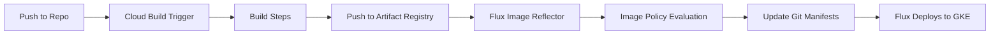

# How to Integrate Flux CD with Google Cloud Build

Author: [nawazdhandala](https://github.com/nawazdhandala)

Tags: Flux CD, Google Cloud Build, CI/CD, GitOps, Kubernetes, GKE, GCR, Artifact Registry

Description: A step-by-step guide to integrating Google Cloud Build with Flux CD for automated container image builds and GitOps deployments on GKE.

---

## Introduction

Google Cloud Build is a serverless CI/CD platform that runs builds on Google Cloud infrastructure. When integrated with Flux CD, it provides a powerful GitOps pipeline where Cloud Build handles container image creation and pushes to Google Artifact Registry, while Flux CD automatically deploys the new images to Google Kubernetes Engine (GKE) or any Kubernetes cluster. This guide covers the complete setup.

## Prerequisites

Before starting, make sure you have:

- A GKE cluster or any Kubernetes cluster with Flux CD installed
- A Google Cloud project with Cloud Build API enabled
- Google Artifact Registry or Container Registry configured
- `gcloud`, `kubectl`, and `flux` CLI tools installed
- Appropriate IAM permissions for Cloud Build

## Architecture Overview



## Step 1: Set Up Google Artifact Registry

Create an Artifact Registry repository to store your container images.

```bash
# Enable the Artifact Registry API
gcloud services enable artifactregistry.googleapis.com

# Create a Docker repository in Artifact Registry
gcloud artifacts repositories create my-docker-repo \
  --repository-format=docker \
  --location=us-central1 \
  --description="Container images for Flux CD deployments"

# Configure Docker to authenticate with Artifact Registry
gcloud auth configure-docker us-central1-docker.pkg.dev
```

## Step 2: Create the Cloud Build Configuration

Create a `cloudbuild.yaml` file in the root of your application repository.

```yaml
# cloudbuild.yaml
# Google Cloud Build configuration for building images consumed by Flux CD

steps:
  # Step 1: Run tests
  - name: 'gcr.io/cloud-builders/docker'
    id: 'run-tests'
    entrypoint: 'bash'
    args:
      - '-c'
      - |
        # Build a test image and run tests
        docker build --target test -t my-app-test . || echo "No test stage"

  # Step 2: Build the container image
  - name: 'gcr.io/cloud-builders/docker'
    id: 'build-image'
    args:
      - 'build'
      - '--build-arg'
      - 'BUILD_ID=$BUILD_ID'
      - '--label'
      - 'commit-sha=$COMMIT_SHA'
      - '-t'
      - 'us-central1-docker.pkg.dev/$PROJECT_ID/my-docker-repo/my-app:${SHORT_SHA}'
      - '-t'
      - 'us-central1-docker.pkg.dev/$PROJECT_ID/my-docker-repo/my-app:latest'
      - '.'
    waitFor: ['run-tests']

  # Step 3: Push the image to Artifact Registry
  - name: 'gcr.io/cloud-builders/docker'
    id: 'push-image'
    args:
      - 'push'
      - '--all-tags'
      - 'us-central1-docker.pkg.dev/$PROJECT_ID/my-docker-repo/my-app'
    waitFor: ['build-image']

# Images to be pushed (alternative to explicit push step)
images:
  - 'us-central1-docker.pkg.dev/$PROJECT_ID/my-docker-repo/my-app:${SHORT_SHA}'
  - 'us-central1-docker.pkg.dev/$PROJECT_ID/my-docker-repo/my-app:latest'

# Build options
options:
  # Use a larger machine for faster builds
  machineType: 'E2_HIGHCPU_8'
  # Enable Docker layer caching
  logging: CLOUD_LOGGING_ONLY
```

## Step 3: Cloud Build with Semantic Versioning

For production deployments using semantic versioning:

```yaml
# cloudbuild-semver.yaml
# Cloud Build with semantic version tagging

steps:
  # Step 1: Determine the version
  - name: 'gcr.io/cloud-builders/gcloud'
    id: 'determine-version'
    entrypoint: 'bash'
    args:
      - '-c'
      - |
        # Check if this is a tagged build
        if [[ "$TAG_NAME" =~ ^v[0-9]+\.[0-9]+\.[0-9]+$ ]]; then
          VERSION="${TAG_NAME#v}"
        else
          # Use build number as patch version
          VERSION="1.0.${BUILD_ID:0:8}"
        fi
        echo "$VERSION" > /workspace/version.txt
        echo "Building version: $VERSION"

  # Step 2: Build with the version tag
  - name: 'gcr.io/cloud-builders/docker'
    id: 'build'
    entrypoint: 'bash'
    args:
      - '-c'
      - |
        VERSION=$(cat /workspace/version.txt)
        docker build \
          --build-arg VERSION=$VERSION \
          -t us-central1-docker.pkg.dev/$PROJECT_ID/my-docker-repo/my-app:$VERSION \
          .
    waitFor: ['determine-version']

  # Step 3: Push the image
  - name: 'gcr.io/cloud-builders/docker'
    id: 'push'
    entrypoint: 'bash'
    args:
      - '-c'
      - |
        VERSION=$(cat /workspace/version.txt)
        docker push us-central1-docker.pkg.dev/$PROJECT_ID/my-docker-repo/my-app:$VERSION
    waitFor: ['build']

options:
  machineType: 'E2_HIGHCPU_8'
```

## Step 4: Create a Cloud Build Trigger

Set up a trigger to run the build automatically on code pushes.

```bash
# Create a Cloud Build trigger for the main branch
gcloud builds triggers create github \
  --name="flux-image-build" \
  --repo-name="my-app" \
  --repo-owner="my-org" \
  --branch-pattern="^main$" \
  --build-config="cloudbuild.yaml" \
  --description="Build and push container images for Flux CD"

# Create a trigger for Git tags (semver releases)
gcloud builds triggers create github \
  --name="flux-release-build" \
  --repo-name="my-app" \
  --repo-owner="my-org" \
  --tag-pattern="^v[0-9]+\.[0-9]+\.[0-9]+$" \
  --build-config="cloudbuild-semver.yaml" \
  --description="Build release images for Flux CD"
```

## Step 5: Configure Flux to Access Artifact Registry

Set up authentication for Flux to scan Google Artifact Registry.

```bash
# Create a service account for Flux
gcloud iam service-accounts create flux-image-scanner \
  --display-name="Flux Image Scanner"

# Grant read access to Artifact Registry
gcloud artifacts repositories add-iam-policy-binding my-docker-repo \
  --location=us-central1 \
  --member="serviceAccount:flux-image-scanner@$PROJECT_ID.iam.gserviceaccount.com" \
  --role="roles/artifactregistry.reader"

# Create a JSON key for the service account
gcloud iam service-accounts keys create key.json \
  --iam-account=flux-image-scanner@$PROJECT_ID.iam.gserviceaccount.com

# Create a Kubernetes secret from the key
kubectl -n flux-system create secret docker-registry gar-credentials \
  --docker-server=us-central1-docker.pkg.dev \
  --docker-username=_json_key \
  --docker-password="$(cat key.json)"

# Clean up the key file
rm key.json
```

## Step 6: Configure Flux Image Repository

Create the Flux `ImageRepository` to scan for images in Artifact Registry.

```yaml
# clusters/my-cluster/image-repos/app-image-repo.yaml
apiVersion: image.toolkit.fluxcd.io/v1
kind: ImageRepository
metadata:
  name: my-app
  namespace: flux-system
spec:
  # Point to your Artifact Registry image
  image: us-central1-docker.pkg.dev/my-project-id/my-docker-repo/my-app
  # Scan every minute
  interval: 1m0s
  # Use the GAR credentials
  secretRef:
    name: gar-credentials
```

## Step 7: Set Up Image Policy

Define the policy for selecting the latest image tag.

```yaml
# clusters/my-cluster/image-policies/app-image-policy.yaml
apiVersion: image.toolkit.fluxcd.io/v1
kind: ImagePolicy
metadata:
  name: my-app
  namespace: flux-system
spec:
  imageRepositoryRef:
    name: my-app
  policy:
    semver:
      # Accept any version >= 1.0.0
      range: ">=1.0.0"
```

## Step 8: Configure Image Update Automation

Set up Flux to automatically commit updated image tags.

```yaml
# clusters/my-cluster/image-update-automation.yaml
apiVersion: image.toolkit.fluxcd.io/v1
kind: ImageUpdateAutomation
metadata:
  name: gcb-image-updates
  namespace: flux-system
spec:
  interval: 1m0s
  sourceRef:
    kind: GitRepository
    name: flux-system
  git:
    checkout:
      ref:
        branch: main
    commit:
      author:
        name: flux-bot
        email: flux-bot@example.com
      messageTemplate: |
        chore: update image from Cloud Build

        {{ range $resource, $changes := .Changed.Objects -}}
        - {{ $resource.Kind }}/{{ $resource.Name }}:
        {{ range $_, $change := $changes -}}
            {{ $change.OldValue }} -> {{ $change.NewValue }}
        {{ end -}}
        {{ end -}}
    push:
      branch: main
  update:
    path: ./clusters/my-cluster
    strategy: Setters
```

## Step 9: Add Image Markers to Deployment Manifests

Add image policy markers to your Kubernetes deployment.

```yaml
# clusters/my-cluster/app/deployment.yaml
apiVersion: apps/v1
kind: Deployment
metadata:
  name: my-app
  namespace: default
spec:
  replicas: 3
  selector:
    matchLabels:
      app: my-app
  template:
    metadata:
      labels:
        app: my-app
    spec:
      containers:
        - name: my-app
          # Flux will update this image tag automatically
          image: us-central1-docker.pkg.dev/my-project-id/my-docker-repo/my-app:1.0.50 # {"$imagepolicy": "flux-system:my-app"}
          ports:
            - containerPort: 8080
          resources:
            requests:
              cpu: 100m
              memory: 128Mi
            limits:
              cpu: 500m
              memory: 256Mi
```

## Step 10: Set Up Pub/Sub Notifications (Optional)

Use Google Cloud Pub/Sub to notify Flux immediately when Cloud Build completes.

```bash
# Cloud Build automatically publishes to the cloud-builds topic
# Create a subscription for monitoring
gcloud pubsub subscriptions create flux-build-notifications \
  --topic=cloud-builds \
  --push-endpoint="https://your-flux-webhook-endpoint/hook/gcb-receiver"
```

```yaml
# clusters/my-cluster/webhook-receiver.yaml
apiVersion: notification.toolkit.fluxcd.io/v1
kind: Receiver
metadata:
  name: gcb-receiver
  namespace: flux-system
spec:
  type: generic
  secretRef:
    name: webhook-token
  resources:
    - kind: ImageRepository
      name: my-app
      apiVersion: image.toolkit.fluxcd.io/v1
```

## Verify and Troubleshoot

Confirm the integration is working:

```bash
# Check image repository status
flux get image repository my-app

# Check selected image tag
flux get image policy my-app

# Verify automation status
flux get image update gcb-image-updates

# View current image in deployment
kubectl get deployment my-app -o jsonpath='{.spec.template.spec.containers[0].image}'

# Troubleshooting
kubectl -n flux-system logs deployment/image-reflector-controller --tail=50
kubectl -n flux-system logs deployment/image-automation-controller --tail=50

# Force reconciliation
flux reconcile image repository my-app
flux reconcile image update gcb-image-updates
```

## Conclusion

Integrating Google Cloud Build with Flux CD provides a fully serverless GitOps pipeline within the Google Cloud ecosystem. Cloud Build handles image building without requiring you to manage build infrastructure, while Flux CD monitors Artifact Registry and automatically deploys updates to your GKE cluster. The native integration between GCP services simplifies authentication and reduces operational overhead. Combined with Pub/Sub notifications, you get near-instant deployments after every successful build.
