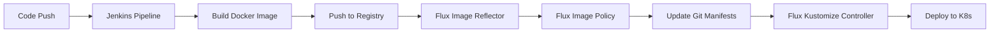

# How to Integrate Flux CD with Jenkins for Image Building

Author: [nawazdhandala](https://github.com/nawazdhandala)

Tags: flux cd, jenkins, container images, ci/cd, gitops, kubernetes, docker, pipeline

Description: A step-by-step guide to integrating Jenkins pipelines with Flux CD for automated container image building and GitOps deployments.

---

## Introduction

Jenkins is one of the most widely adopted CI/CD tools in enterprise environments. Integrating Jenkins with Flux CD gives you the best of both worlds: Jenkins handles complex build pipelines while Flux CD manages continuous delivery using GitOps principles. This guide walks you through setting up Jenkins to build and push container images, and configuring Flux CD to automatically deploy them.

## Prerequisites

Before getting started, ensure you have:

- A Kubernetes cluster with Flux CD installed
- A Jenkins server (version 2.387 or later recommended)
- Docker Pipeline and Kubernetes plugins installed on Jenkins
- A container registry (Docker Hub, ECR, GCR, or any OCI-compatible registry)
- `kubectl` and `flux` CLI tools installed locally

## Architecture Overview



## Step 1: Configure Jenkins Credentials

First, set up the necessary credentials in Jenkins for accessing your container registry and Git repositories.

Navigate to Jenkins > Manage Jenkins > Credentials and add the following:

1. **Docker Registry credentials** - Username/password or access token for your container registry
2. **Git credentials** - For checking out your application repository

```groovy
// You can also create credentials programmatically via Jenkins Script Console
import com.cloudbees.plugins.credentials.impl.UsernamePasswordCredentialsImpl
import com.cloudbees.plugins.credentials.CredentialsScope
import com.cloudbees.plugins.credentials.domains.Domain
import jenkins.model.Jenkins

def store = Jenkins.instance.getExtensionList(
    'com.cloudbees.plugins.credentials.SystemCredentialsProvider'
)[0].getStore()

// Add Docker registry credentials
def dockerCreds = new UsernamePasswordCredentialsImpl(
    CredentialsScope.GLOBAL,
    'docker-registry-creds',    // Credential ID
    'Docker Registry Login',     // Description
    'your-username',             // Username
    'your-password'              // Password or token
)
store.addCredentials(Domain.global(), dockerCreds)
```

## Step 2: Create the Jenkinsfile

Create a `Jenkinsfile` in the root of your application repository. This pipeline will build, test, and push container images.

```groovy
// Jenkinsfile
// Pipeline for building and pushing container images for Flux CD

pipeline {
    agent any

    environment {
        // Container registry configuration
        REGISTRY = 'docker.io'
        IMAGE_NAME = 'my-org/my-app'
        // Use the Git commit SHA as the image tag
        IMAGE_TAG = "${GIT_COMMIT.take(7)}"
        // Jenkins credential ID for Docker registry
        REGISTRY_CREDENTIALS = 'docker-registry-creds'
    }

    stages {
        stage('Checkout') {
            steps {
                // Clone the application repository
                checkout scm
            }
        }

        stage('Run Tests') {
            steps {
                // Run unit tests before building the image
                sh 'make test || echo "No tests configured"'
            }
        }

        stage('Build Image') {
            steps {
                script {
                    // Build the Docker image
                    docker.build("${REGISTRY}/${IMAGE_NAME}:${IMAGE_TAG}")
                }
            }
        }

        stage('Push Image') {
            steps {
                script {
                    // Authenticate and push to the container registry
                    docker.withRegistry("https://${REGISTRY}", REGISTRY_CREDENTIALS) {
                        def appImage = docker.image("${REGISTRY}/${IMAGE_NAME}:${IMAGE_TAG}")
                        // Push the commit SHA tag
                        appImage.push()
                        // Also push as latest for convenience
                        appImage.push('latest')
                    }
                }
            }
        }
    }

    post {
        success {
            echo "Image ${REGISTRY}/${IMAGE_NAME}:${IMAGE_TAG} pushed successfully"
        }
        failure {
            echo "Pipeline failed. Check the logs for details."
        }
        always {
            // Clean up Docker images to save disk space
            sh "docker rmi ${REGISTRY}/${IMAGE_NAME}:${IMAGE_TAG} || true"
        }
    }
}
```

## Step 3: Jenkins Pipeline with Semantic Versioning

For production environments, you may prefer semantic versioning over commit SHAs.

```groovy
// Jenkinsfile with semantic versioning

pipeline {
    agent any

    environment {
        REGISTRY = 'docker.io'
        IMAGE_NAME = 'my-org/my-app'
        REGISTRY_CREDENTIALS = 'docker-registry-creds'
    }

    stages {
        stage('Determine Version') {
            steps {
                script {
                    // Read version from a file or generate from Git tags
                    def baseVersion = readFile('VERSION').trim()
                    // Append build number for unique identification
                    env.IMAGE_TAG = "${baseVersion}.${BUILD_NUMBER}"
                    echo "Building version: ${env.IMAGE_TAG}"
                }
            }
        }

        stage('Build and Push') {
            steps {
                script {
                    docker.withRegistry("https://${REGISTRY}", REGISTRY_CREDENTIALS) {
                        def appImage = docker.build(
                            "${REGISTRY}/${IMAGE_NAME}:${IMAGE_TAG}",
                            // Pass build arguments
                            "--build-arg VERSION=${IMAGE_TAG} ."
                        )
                        appImage.push()
                        appImage.push('latest')
                    }
                }
            }
        }
    }
}
```

## Step 4: Configure Flux Image Repository

In your Flux configuration repository, set up the `ImageRepository` to scan for new images pushed by Jenkins.

```yaml
# clusters/my-cluster/image-repos/app-image-repo.yaml
apiVersion: image.toolkit.fluxcd.io/v1
kind: ImageRepository
metadata:
  name: my-app
  namespace: flux-system
spec:
  # Point to your container registry and image
  image: docker.io/my-org/my-app
  # How often to scan for new tags
  interval: 1m0s
  # Secret containing registry credentials
  secretRef:
    name: docker-registry-secret
```

Create the registry secret for Flux:

```bash
# Create a secret so Flux can pull from your private registry
kubectl create secret docker-registry docker-registry-secret \
  --namespace=flux-system \
  --docker-server=docker.io \
  --docker-username=your-username \
  --docker-password=your-password
```

## Step 5: Set Up Image Policy

Define how Flux selects the correct image tag to deploy.

```yaml
# clusters/my-cluster/image-policies/app-image-policy.yaml
apiVersion: image.toolkit.fluxcd.io/v1
kind: ImagePolicy
metadata:
  name: my-app
  namespace: flux-system
spec:
  imageRepositoryRef:
    name: my-app
  policy:
    semver:
      # Accept any version >= 1.0.0
      range: ">=1.0.0"
```

For commit SHA-based tags, use an alphabetical policy instead:

```yaml
# Alternative: commit SHA-based policy
apiVersion: image.toolkit.fluxcd.io/v1
kind: ImagePolicy
metadata:
  name: my-app
  namespace: flux-system
spec:
  imageRepositoryRef:
    name: my-app
  filterTags:
    # Match 7-character hex strings (short commit SHAs)
    pattern: '^[a-f0-9]{7}$'
  policy:
    alphabetical:
      order: asc
```

## Step 6: Configure Image Update Automation

Set up Flux to automatically update your Kubernetes manifests when new images are detected.

```yaml
# clusters/my-cluster/image-update-automation.yaml
apiVersion: image.toolkit.fluxcd.io/v1
kind: ImageUpdateAutomation
metadata:
  name: jenkins-image-updates
  namespace: flux-system
spec:
  interval: 1m0s
  sourceRef:
    kind: GitRepository
    name: flux-system
  git:
    checkout:
      ref:
        branch: main
    commit:
      author:
        name: flux-bot
        email: flux-bot@example.com
      messageTemplate: |
        chore: update image from Jenkins build

        {{ range $resource, $changes := .Changed.Objects -}}
        - {{ $resource.Kind }}/{{ $resource.Name }}:
        {{ range $_, $change := $changes -}}
            {{ $change.OldValue }} -> {{ $change.NewValue }}
        {{ end -}}
        {{ end -}}
    push:
      branch: main
  update:
    path: ./clusters/my-cluster
    strategy: Setters
```

## Step 7: Add Markers to Deployment Manifests

Mark your deployment YAML with image policy references so Flux knows where to update tags.

```yaml
# clusters/my-cluster/app/deployment.yaml
apiVersion: apps/v1
kind: Deployment
metadata:
  name: my-app
  namespace: default
spec:
  replicas: 2
  selector:
    matchLabels:
      app: my-app
  template:
    metadata:
      labels:
        app: my-app
    spec:
      containers:
        - name: my-app
          # Flux will update the tag based on the ImagePolicy
          image: docker.io/my-org/my-app:1.0.42 # {"$imagepolicy": "flux-system:my-app"}
          ports:
            - containerPort: 8080
```

## Step 8: Jenkins Webhook for Faster Feedback

Configure a Jenkins webhook to notify Flux immediately after a successful build instead of waiting for the polling interval.

```yaml
# clusters/my-cluster/webhook-receiver.yaml
apiVersion: notification.toolkit.fluxcd.io/v1
kind: Receiver
metadata:
  name: jenkins-receiver
  namespace: flux-system
spec:
  type: generic
  # Secret containing the webhook token
  secretRef:
    name: webhook-token
  resources:
    - kind: ImageRepository
      name: my-app
      apiVersion: image.toolkit.fluxcd.io/v1
```

Create the webhook token secret:

```bash
# Generate a random token for webhook authentication
TOKEN=$(head -c 32 /dev/urandom | base64 | tr -d '=+/')

# Create the secret in the flux-system namespace
kubectl -n flux-system create secret generic webhook-token \
  --from-literal=token=$TOKEN
```

Add a post-build step in your Jenkinsfile to trigger the webhook:

```groovy
// Add this stage after Push Image
stage('Notify Flux') {
    steps {
        script {
            // Trigger Flux to scan for the new image immediately
            def webhookUrl = "https://flux-webhook.example.com/hook/jenkins-receiver"
            sh """
                curl -s -X POST ${webhookUrl} \
                  -H 'Content-Type: application/json' \
                  -d '{"image": "${REGISTRY}/${IMAGE_NAME}:${IMAGE_TAG}"}'
            """
        }
    }
}
```

## Step 9: Verify the Integration

After setting up the complete pipeline, verify everything works:

```bash
# Trigger a Jenkins build and then check Flux status
flux get image repository my-app

# Check the latest detected image tag
flux get image policy my-app

# Verify the image update automation is running
flux get image update jenkins-image-updates

# Check that the deployment was updated
kubectl get deployment my-app -o jsonpath='{.spec.template.spec.containers[0].image}'
```

## Step 10: Troubleshooting

Common issues and their resolutions:

```bash
# If images are not being detected, check the image reflector logs
kubectl -n flux-system logs deployment/image-reflector-controller

# If manifests are not being updated, check the image automation logs
kubectl -n flux-system logs deployment/image-automation-controller

# Verify registry credentials are valid
kubectl -n flux-system get secret docker-registry-secret -o jsonpath='{.data.\.dockerconfigjson}' | base64 -d

# Force an immediate reconciliation
flux reconcile image repository my-app
flux reconcile image update jenkins-image-updates
```

## Conclusion

Integrating Jenkins with Flux CD creates a powerful GitOps pipeline that leverages Jenkins for its mature build capabilities and Flux CD for declarative, Git-based deployments. Jenkins handles the CI side by building and pushing container images, while Flux continuously monitors the container registry and updates your Kubernetes manifests automatically. This approach gives you full auditability through Git history and reduces manual intervention in your deployment process.
