# How to Integrate Flux CD with Tekton Pipelines

Author: [nawazdhandala](https://github.com/nawazdhandala)

Tags: flux cd, tekton, ci/cd, gitops, kubernetes, container images, cloud native, pipelines

Description: A hands-on guide to integrating Tekton Pipelines with Flux CD for Kubernetes-native CI/CD with GitOps-based deployments.

---

## Introduction

Tekton is a powerful, Kubernetes-native CI/CD framework that runs pipelines as Kubernetes resources. When combined with Flux CD, you get a fully Kubernetes-native CI/CD and GitOps stack where both the build system and the deployment system run inside your cluster. This guide walks you through setting up Tekton to build and push container images, and configuring Flux CD to automatically deploy them.

## Prerequisites

Before you begin, make sure you have:

- A Kubernetes cluster with Flux CD installed
- Tekton Pipelines installed (v0.50 or later)
- Tekton Triggers installed (for webhook-based triggers)
- A container registry (Docker Hub, ECR, GCR, or any OCI-compatible registry)
- `kubectl`, `flux`, and `tkn` CLI tools installed

## Architecture Overview

```mermaid
graph LR
    A[Git Push] --> B[Tekton EventListener]
    B --> C[Tekton PipelineRun]
    C --> D[Clone Source]
    D --> E[Build Image with Kaniko]
    E --> F[Push to Registry]
    F --> G[Flux Image Reflector]
    G --> H[Image Policy Match]
    H --> I[Update Git Manifests]
    I --> J[Flux Deploys to K8s]
```



## Step 1: Install Tekton Pipelines

If Tekton is not already installed, deploy it to your cluster.

```bash
# Install Tekton Pipelines
kubectl apply --filename https://storage.googleapis.com/tekton-releases/pipeline/latest/release.yaml

# Install Tekton Triggers
kubectl apply --filename https://storage.googleapis.com/tekton-releases/triggers/latest/release.yaml

# Install Tekton Interceptors
kubectl apply --filename https://storage.googleapis.com/tekton-releases/triggers/latest/interceptors.yaml

# Verify the installation
kubectl get pods -n tekton-pipelines
```

## Step 2: Create Registry Credentials

Set up a Kubernetes secret for authenticating with your container registry.

```bash
# Create a secret for Docker Hub authentication
kubectl create secret docker-registry docker-credentials \
  --namespace=default \
  --docker-server=https://index.docker.io/v1/ \
  --docker-username=your-username \
  --docker-password=your-password

# Annotate the secret for Tekton to use
kubectl annotate secret docker-credentials \
  tekton.dev/docker-0=https://index.docker.io/v1/ \
  --namespace=default
```

Create a service account for Tekton to use:

```yaml
# tekton/service-account.yaml
apiVersion: v1
kind: ServiceAccount
metadata:
  name: tekton-build-sa
  namespace: default
secrets:
  - name: docker-credentials
```

## Step 3: Create Tekton Tasks

Define reusable Tasks for cloning a repository and building container images.

```yaml
# tekton/tasks/git-clone.yaml
apiVersion: tekton.dev/v1
kind: Task
metadata:
  name: git-clone
  namespace: default
spec:
  description: "Clone a Git repository"
  params:
    - name: url
      description: The Git repository URL
      type: string
    - name: revision
      description: The Git revision to checkout
      type: string
      default: main
  workspaces:
    - name: output
      description: The workspace to clone the repo into
  steps:
    - name: clone
      image: alpine/git:2.43.0
      script: |
        #!/bin/sh
        set -eu
        # Clone the repository
        git clone $(params.url) $(workspaces.output.path)/source
        cd $(workspaces.output.path)/source
        # Checkout the specified revision
        git checkout $(params.revision)
        # Output the commit SHA for tagging
        COMMIT_SHA=$(git rev-parse --short HEAD)
        echo -n "$COMMIT_SHA" > $(workspaces.output.path)/commit-sha
        echo "Cloned $(params.url) at $COMMIT_SHA"
```

```yaml
# tekton/tasks/kaniko-build.yaml
apiVersion: tekton.dev/v1
kind: Task
metadata:
  name: kaniko-build
  namespace: default
spec:
  description: "Build and push a container image using Kaniko"
  params:
    - name: image
      description: The full image name including registry
      type: string
    - name: dockerfile
      description: Path to the Dockerfile
      type: string
      default: ./Dockerfile
    - name: context
      description: The build context directory
      type: string
      default: .
  workspaces:
    - name: source
      description: Workspace containing the source code
  steps:
    - name: build-and-push
      image: gcr.io/kaniko-project/executor:v1.19.2
      args:
        # Set the Docker context
        - --context=$(workspaces.source.path)/source
        # Path to Dockerfile
        - --dockerfile=$(workspaces.source.path)/source/$(params.dockerfile)
        # Destination image with tag from commit SHA
        - --destination=$(params.image):$(cat $(workspaces.source.path)/commit-sha)
        # Also push as latest
        - --destination=$(params.image):latest
        # Enable layer caching
        - --cache=true
        - --cache-repo=$(params.image)-cache
      securityContext:
        runAsUser: 0
```

## Step 4: Create the Tekton Pipeline

Combine the tasks into a Pipeline that runs them in sequence.

```yaml
# tekton/pipeline.yaml
apiVersion: tekton.dev/v1
kind: Pipeline
metadata:
  name: build-and-push-pipeline
  namespace: default
spec:
  description: "Pipeline to build and push container images for Flux CD"
  params:
    - name: git-url
      description: The Git repository URL
      type: string
    - name: git-revision
      description: The Git revision to build
      type: string
      default: main
    - name: image
      description: The full image name (registry/repo)
      type: string
    - name: dockerfile
      description: Path to the Dockerfile
      type: string
      default: ./Dockerfile
  workspaces:
    - name: shared-workspace
      description: Workspace shared between tasks
  tasks:
    # Task 1: Clone the repository
    - name: clone-repo
      taskRef:
        name: git-clone
      params:
        - name: url
          value: $(params.git-url)
        - name: revision
          value: $(params.git-revision)
      workspaces:
        - name: output
          workspace: shared-workspace

    # Task 2: Build and push the image
    - name: build-image
      taskRef:
        name: kaniko-build
      runAfter:
        - clone-repo
      params:
        - name: image
          value: $(params.image)
        - name: dockerfile
          value: $(params.dockerfile)
      workspaces:
        - name: source
          workspace: shared-workspace
```

## Step 5: Create a PipelineRun

Trigger the pipeline manually or use this as a template for automated triggers.

```yaml
# tekton/pipeline-run.yaml
apiVersion: tekton.dev/v1
kind: PipelineRun
metadata:
  generateName: build-and-push-run-
  namespace: default
spec:
  pipelineRef:
    name: build-and-push-pipeline
  serviceAccountName: tekton-build-sa
  params:
    - name: git-url
      value: "https://github.com/my-org/my-app.git"
    - name: git-revision
      value: "main"
    - name: image
      value: "docker.io/my-org/my-app"
  workspaces:
    - name: shared-workspace
      volumeClaimTemplate:
        spec:
          accessModes:
            - ReadWriteOnce
          resources:
            requests:
              storage: 1Gi
```

Run the pipeline:

```bash
# Create the pipeline run
kubectl create -f tekton/pipeline-run.yaml

# Watch the pipeline run progress
tkn pipelinerun logs -f --last
```

## Step 6: Set Up Tekton Triggers

Configure Tekton Triggers to automatically start builds on Git pushes.

```yaml
# tekton/triggers/trigger-template.yaml
apiVersion: triggers.tekton.dev/v1beta1
kind: TriggerTemplate
metadata:
  name: build-trigger-template
  namespace: default
spec:
  params:
    - name: git-revision
      description: The Git revision
    - name: git-url
      description: The Git repository URL
  resourcetemplates:
    - apiVersion: tekton.dev/v1
      kind: PipelineRun
      metadata:
        generateName: build-triggered-
      spec:
        pipelineRef:
          name: build-and-push-pipeline
        serviceAccountName: tekton-build-sa
        params:
          - name: git-url
            value: $(tt.params.git-url)
          - name: git-revision
            value: $(tt.params.git-revision)
          - name: image
            value: "docker.io/my-org/my-app"
        workspaces:
          - name: shared-workspace
            volumeClaimTemplate:
              spec:
                accessModes:
                  - ReadWriteOnce
                resources:
                  requests:
                    storage: 1Gi
---
# tekton/triggers/trigger-binding.yaml
apiVersion: triggers.tekton.dev/v1beta1
kind: TriggerBinding
metadata:
  name: github-push-binding
  namespace: default
spec:
  params:
    - name: git-revision
      value: $(body.after)
    - name: git-url
      value: $(body.repository.clone_url)
---
# tekton/triggers/event-listener.yaml
apiVersion: triggers.tekton.dev/v1beta1
kind: EventListener
metadata:
  name: github-listener
  namespace: default
spec:
  serviceAccountName: tekton-build-sa
  triggers:
    - name: github-push
      interceptors:
        - ref:
            name: "github"
          params:
            - name: "eventTypes"
              value: ["push"]
      bindings:
        - ref: github-push-binding
      template:
        ref: build-trigger-template
```

## Step 7: Configure Flux Image Repository

Set up Flux to scan for images built by Tekton.

```yaml
# clusters/my-cluster/image-repos/app-image-repo.yaml
apiVersion: image.toolkit.fluxcd.io/v1beta2
kind: ImageRepository
metadata:
  name: my-app
  namespace: flux-system
spec:
  image: docker.io/my-org/my-app
  interval: 1m0s
  secretRef:
    name: registry-credentials
```

## Step 8: Set Up Image Policy and Automation

```yaml
# clusters/my-cluster/image-policies/app-image-policy.yaml
apiVersion: image.toolkit.fluxcd.io/v1beta2
kind: ImagePolicy
metadata:
  name: my-app
  namespace: flux-system
spec:
  imageRepositoryRef:
    name: my-app
  filterTags:
    # Match short commit SHA tags
    pattern: '^[a-f0-9]{7,}$'
  policy:
    alphabetical:
      order: asc
---
# clusters/my-cluster/image-update-automation.yaml
apiVersion: image.toolkit.fluxcd.io/v1beta2
kind: ImageUpdateAutomation
metadata:
  name: tekton-image-updates
  namespace: flux-system
spec:
  interval: 1m0s
  sourceRef:
    kind: GitRepository
    name: flux-system
  git:
    checkout:
      ref:
        branch: main
    commit:
      author:
        name: flux-bot
        email: flux-bot@example.com
      messageTemplate: |
        chore: update image from Tekton build

        {{ range $resource, $changes := .Changed.Objects -}}
        - {{ $resource.Kind }}/{{ $resource.Name }}:
        {{ range $_, $change := $changes -}}
            {{ $change.OldValue }} -> {{ $change.NewValue }}
        {{ end -}}
        {{ end -}}
    push:
      branch: main
  update:
    path: ./clusters/my-cluster
    strategy: Setters
```

## Step 9: Add Image Markers to Deployment

```yaml
# clusters/my-cluster/app/deployment.yaml
apiVersion: apps/v1
kind: Deployment
metadata:
  name: my-app
  namespace: default
spec:
  replicas: 3
  selector:
    matchLabels:
      app: my-app
  template:
    metadata:
      labels:
        app: my-app
    spec:
      containers:
        - name: my-app
          # Flux updates the tag from the ImagePolicy
          image: docker.io/my-org/my-app:abc1234 # {"$imagepolicy": "flux-system:my-app"}
          ports:
            - containerPort: 8080
          resources:
            requests:
              cpu: 100m
              memory: 128Mi
            limits:
              cpu: 500m
              memory: 256Mi
```

## Step 10: Verify and Troubleshoot

```bash
# Check Tekton pipeline runs
tkn pipelinerun list
tkn pipelinerun logs --last

# Check Flux image scanning
flux get image repository my-app

# Verify selected image tag
flux get image policy my-app

# Check automation status
flux get image update tekton-image-updates

# View deployed image
kubectl get deployment my-app -o jsonpath='{.spec.template.spec.containers[0].image}'

# Troubleshoot Tekton
kubectl get pipelineruns -o wide
kubectl describe pipelinerun <run-name>

# Troubleshoot Flux
kubectl -n flux-system logs deployment/image-reflector-controller --tail=50
kubectl -n flux-system logs deployment/image-automation-controller --tail=50

# Force reconciliation
flux reconcile image repository my-app
flux reconcile image update tekton-image-updates
```

## Conclusion

Integrating Tekton Pipelines with Flux CD gives you a fully Kubernetes-native CI/CD and GitOps stack. Both Tekton and Flux run as Kubernetes controllers, meaning your entire build and deployment infrastructure is managed declaratively through Kubernetes resources. Tekton handles the CI side with its flexible task and pipeline model, while Flux CD provides the CD side through image automation and Git-based deployment. This combination is ideal for teams that want to keep everything within the Kubernetes ecosystem without relying on external CI/CD services.
