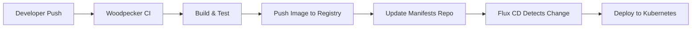

# How to Integrate Flux CD with Woodpecker CI

Author: [nawazdhandala](https://github.com/nawazdhandala)

Tags: Flux CD, Woodpecker CI, CI/CD, GitOps, Kubernetes, Continuous Integration, Continuous Delivery

Description: A practical guide to integrating Flux CD with Woodpecker CI for a complete GitOps-based CI/CD pipeline on Kubernetes.

---

## Introduction

Flux CD handles the continuous delivery side of your pipeline by syncing Kubernetes manifests from Git repositories. Woodpecker CI is a lightweight, community-driven CI server that handles the continuous integration side, building and testing your code. Together, they form a powerful GitOps pipeline where Woodpecker CI builds container images and updates manifests, and Flux CD deploys them automatically.

This guide walks you through setting up the integration from scratch.

## Prerequisites

Before you begin, make sure you have:

- A running Kubernetes cluster (v1.26 or later)
- Flux CD installed and bootstrapped on your cluster
- Woodpecker CI server and agent deployed
- A Git repository for your application code
- A Git repository for your Kubernetes manifests
- kubectl configured to access your cluster

## Architecture Overview

The integration follows a standard GitOps workflow:



## Step 1: Configure Your Application Repository

Create a `.woodpecker.yml` file in the root of your application repository. This pipeline builds a Docker image, pushes it to a container registry, and then updates the Flux manifest repository.

```yaml
# .woodpecker.yml
# Woodpecker CI pipeline for building and triggering Flux CD deployments

variables:
  - &image_name "registry.example.com/myapp"

steps:
  # Step 1: Run tests before building the image
  test:
    image: golang:1.22
    commands:
      - go test ./...

  # Step 2: Build and push the Docker image with a tag based on the commit SHA
  build:
    image: woodpeckerci/plugin-docker-buildx
    settings:
      repo: *image_name
      tags:
        - "${CI_COMMIT_SHA:0:8}"
        - latest
      registry: registry.example.com
      username:
        from_secret: registry_username
      password:
        from_secret: registry_password
    when:
      branch: main
      event: push

  # Step 3: Update the Kubernetes manifests repository to trigger Flux CD
  update-manifests:
    image: alpine/git
    commands:
      # Install required tools
      - apk add --no-cache bash curl

      # Clone the manifests repository
      - git clone https://$MANIFEST_REPO_TOKEN@github.com/myorg/k8s-manifests.git
      - cd k8s-manifests

      # Update the image tag in the deployment manifest
      - "sed -i \"s|image: registry.example.com/myapp:.*|image: registry.example.com/myapp:${CI_COMMIT_SHA:0:8}|\" apps/myapp/deployment.yaml"

      # Commit and push the change
      - git config user.email "woodpecker@ci.local"
      - git config user.name "Woodpecker CI"
      - git add .
      - git commit -m "Update myapp image to ${CI_COMMIT_SHA:0:8}"
      - git push origin main
    secrets:
      - manifest_repo_token
    when:
      branch: main
      event: push
```

## Step 2: Set Up the Flux Manifest Repository

In your Kubernetes manifests repository, create the directory structure that Flux CD will watch.

```yaml
# apps/myapp/namespace.yaml
# Create a dedicated namespace for the application
apiVersion: v1
kind: Namespace
metadata:
  name: myapp
```

```yaml
# apps/myapp/deployment.yaml
# The deployment manifest that Woodpecker CI will update
apiVersion: apps/v1
kind: Deployment
metadata:
  name: myapp
  namespace: myapp
  labels:
    app: myapp
spec:
  replicas: 3
  selector:
    matchLabels:
      app: myapp
  template:
    metadata:
      labels:
        app: myapp
    spec:
      containers:
        - name: myapp
          # This image tag gets updated by Woodpecker CI
          image: registry.example.com/myapp:latest
          ports:
            - containerPort: 8080
          resources:
            requests:
              cpu: 100m
              memory: 128Mi
            limits:
              cpu: 250m
              memory: 256Mi
```

```yaml
# apps/myapp/service.yaml
# Expose the application within the cluster
apiVersion: v1
kind: Service
metadata:
  name: myapp
  namespace: myapp
spec:
  selector:
    app: myapp
  ports:
    - port: 80
      targetPort: 8080
  type: ClusterIP
```

## Step 3: Configure Flux CD to Watch the Manifests Repository

Set up a Flux GitRepository and Kustomization to watch and reconcile the manifests.

```yaml
# clusters/my-cluster/myapp-source.yaml
# Tell Flux where to find the manifests
apiVersion: source.toolkit.fluxcd.io/v1
kind: GitRepository
metadata:
  name: myapp-manifests
  namespace: flux-system
spec:
  interval: 1m
  url: https://github.com/myorg/k8s-manifests.git
  ref:
    branch: main
  secretRef:
    name: myapp-manifests-auth
```

```yaml
# clusters/my-cluster/myapp-kustomization.yaml
# Tell Flux how to apply the manifests
apiVersion: kustomize.toolkit.fluxcd.io/v1
kind: Kustomization
metadata:
  name: myapp
  namespace: flux-system
spec:
  interval: 5m
  targetNamespace: myapp
  sourceRef:
    kind: GitRepository
    name: myapp-manifests
  path: ./apps/myapp
  prune: true
  wait: true
  timeout: 2m
```

## Step 4: Configure Flux Image Automation (Alternative Approach)

Instead of having Woodpecker CI update manifests directly, you can use Flux Image Automation to watch for new container images and update manifests automatically.

```yaml
# clusters/my-cluster/image-registry.yaml
# Tell Flux to scan the container registry for new tags
apiVersion: image.toolkit.fluxcd.io/v1
kind: ImageRepository
metadata:
  name: myapp
  namespace: flux-system
spec:
  image: registry.example.com/myapp
  interval: 5m
  secretRef:
    name: registry-credentials
```

```yaml
# clusters/my-cluster/image-policy.yaml
# Define which image tags Flux should use
apiVersion: image.toolkit.fluxcd.io/v1
kind: ImagePolicy
metadata:
  name: myapp
  namespace: flux-system
spec:
  imageRepositoryRef:
    name: myapp
  # Use alphabetical ordering since we use commit SHA tags
  policy:
    alphabetical:
      order: asc
```

```yaml
# clusters/my-cluster/image-update.yaml
# Configure Flux to commit image updates back to Git
apiVersion: image.toolkit.fluxcd.io/v1
kind: ImageUpdateAutomation
metadata:
  name: myapp
  namespace: flux-system
spec:
  interval: 5m
  sourceRef:
    kind: GitRepository
    name: myapp-manifests
  git:
    checkout:
      ref:
        branch: main
    commit:
      author:
        email: flux@example.com
        name: Flux Image Automation
      messageTemplate: "Update image to {{.NewImage}}"
    push:
      branch: main
  update:
    path: ./apps/myapp
    strategy: Setters
```

## Step 5: Add Woodpecker CI Secrets

Configure the secrets in Woodpecker CI that the pipeline needs. You can do this via the Woodpecker UI or CLI.

```bash
# Add container registry credentials
woodpecker-cli secret add \
  --repository myorg/myapp \
  --name registry_username \
  --value "my-registry-user"

woodpecker-cli secret add \
  --repository myorg/myapp \
  --name registry_password \
  --value "my-registry-password"

# Add Git token for updating the manifests repository
woodpecker-cli secret add \
  --repository myorg/myapp \
  --name manifest_repo_token \
  --value "ghp_xxxxxxxxxxxx"
```

## Step 6: Set Up Flux Notifications for Woodpecker

Configure Flux to send deployment notifications so you can track the status of deployments triggered by Woodpecker CI builds.

```yaml
# clusters/my-cluster/notification-provider.yaml
# Send notifications to a webhook endpoint
apiVersion: notification.toolkit.fluxcd.io/v1beta3
kind: Provider
metadata:
  name: woodpecker-webhook
  namespace: flux-system
spec:
  type: generic
  address: https://woodpecker.example.com/api/hook
  secretRef:
    name: webhook-secret
```

```yaml
# clusters/my-cluster/notification-alert.yaml
# Alert on deployment events
apiVersion: notification.toolkit.fluxcd.io/v1beta3
kind: Alert
metadata:
  name: myapp-deployment
  namespace: flux-system
spec:
  providerRef:
    name: woodpecker-webhook
  eventSeverity: info
  eventSources:
    - kind: Kustomization
      name: myapp
    - kind: GitRepository
      name: myapp-manifests
```

## Step 7: Verify the Integration

After pushing a change to your application repository, verify the pipeline works end to end.

```bash
# Check Woodpecker CI build status (via the Woodpecker UI or CLI)
woodpecker-cli build ls myorg/myapp

# Check if Flux detected the manifest change
flux get sources git myapp-manifests

# Check the Kustomization reconciliation status
flux get kustomizations myapp

# Verify the deployment was updated
kubectl get deployment myapp -n myapp -o jsonpath='{.spec.template.spec.containers[0].image}'

# Check Flux events for any issues
flux events --for Kustomization/myapp
```

## Troubleshooting

### Flux Not Picking Up Changes

If Flux does not reconcile after Woodpecker pushes manifest changes, force a reconciliation:

```bash
# Trigger an immediate source reconciliation
flux reconcile source git myapp-manifests

# Trigger an immediate kustomization reconciliation
flux reconcile kustomization myapp
```

### Image Pull Errors

If the deployment fails due to image pull errors, verify the image exists and credentials are correct:

```bash
# Check pod events for image pull errors
kubectl describe pod -l app=myapp -n myapp

# Verify the image exists in the registry
crane digest registry.example.com/myapp:abcd1234
```

### Woodpecker Pipeline Failing on Manifest Update

If the update-manifests step fails, verify the Git token has write access:

```bash
# Test Git access manually
git clone https://<token>@github.com/myorg/k8s-manifests.git
```

## Summary

You now have a complete CI/CD pipeline where Woodpecker CI handles building, testing, and pushing container images, and Flux CD handles deploying them to Kubernetes via GitOps. The key benefits of this approach are:

- Clear separation between CI and CD concerns
- Git as the single source of truth for deployments
- Automatic rollback by reverting Git commits
- Audit trail of all deployments through Git history
- Lightweight CI with Woodpecker and robust CD with Flux
