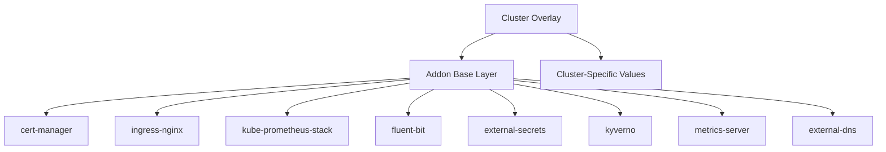

# How to Manage Cluster Addons Consistently with Flux CD

Author: [nawazdhandala](https://github.com/nawazdhandala)

Tags: Flux CD, Cluster addons, Multi-Cluster, GitOps, Kubernetes, Helm, Infrastructure

Description: A practical guide to managing cluster addons like cert-manager, ingress controllers, monitoring stacks, and more consistently across all clusters using Flux CD.

---

## Introduction

Cluster addons are the foundational components that every Kubernetes cluster needs: ingress controllers, certificate managers, monitoring and logging stacks, policy engines, and storage provisioners. In a multi-cluster environment, managing these addons consistently is crucial. Different versions, configurations, or missing addons across clusters lead to operational headaches and security gaps.

Flux CD provides an excellent framework for deploying and maintaining cluster addons using HelmReleases and Kustomizations, ensuring every cluster converges to the same addon baseline.

## Prerequisites

- Multiple Kubernetes clusters managed by Flux CD
- A Git repository for addon configurations
- kubectl and Flux CLI installed
- Helm v3 installed (for chart inspection)

## Addon Architecture



## Step 1: Structure Your Addon Repository

Organize addons with clear base definitions and cluster-specific overlays.

```text
fleet-config/
  addons/
    base/
      cert-manager/
        namespace.yaml
        helm-repo.yaml
        helm-release.yaml
        kustomization.yaml
      ingress-nginx/
        namespace.yaml
        helm-repo.yaml
        helm-release.yaml
        kustomization.yaml
      monitoring/
        namespace.yaml
        helm-repo.yaml
        helm-release.yaml
        kustomization.yaml
      logging/
        namespace.yaml
        helm-repo.yaml
        helm-release.yaml
        kustomization.yaml
      policy-engine/
        namespace.yaml
        helm-repo.yaml
        helm-release.yaml
        kustomization.yaml
      metrics-server/
        namespace.yaml
        helm-repo.yaml
        helm-release.yaml
        kustomization.yaml
    kustomization.yaml
  clusters/
    cluster-1/
      addons/
        kustomization.yaml  # Overlay for cluster-1
    cluster-2/
      addons/
        kustomization.yaml
```

## Step 2: Define cert-manager Addon

```yaml
# addons/base/cert-manager/namespace.yaml
apiVersion: v1
kind: Namespace
metadata:
  name: cert-manager
  labels:
    addon: cert-manager
---
# addons/base/cert-manager/helm-repo.yaml
apiVersion: source.toolkit.fluxcd.io/v1
kind: HelmRepository
metadata:
  name: jetstack
  namespace: cert-manager
spec:
  interval: 1h
  url: https://charts.jetstack.io
---
# addons/base/cert-manager/helm-release.yaml
# cert-manager for automated TLS certificate management
apiVersion: helm.toolkit.fluxcd.io/v2
kind: HelmRelease
metadata:
  name: cert-manager
  namespace: cert-manager
spec:
  interval: 30m
  chart:
    spec:
      chart: cert-manager
      version: "1.14.x"
      sourceRef:
        kind: HelmRepository
        name: jetstack
  # Install CRDs before the chart
  install:
    crds: CreateReplace
  upgrade:
    crds: CreateReplace
  values:
    # Install CRDs as part of the Helm release
    installCRDs: true
    # High availability configuration
    replicaCount: 2
    webhook:
      replicaCount: 2
    cainjector:
      replicaCount: 2
    # Enable Prometheus metrics
    prometheus:
      enabled: true
      servicemonitor:
        enabled: true
    # Resource limits
    resources:
      requests:
        cpu: 50m
        memory: 128Mi
      limits:
        cpu: 200m
        memory: 256Mi
```

```yaml
# addons/base/cert-manager/cluster-issuer.yaml
# Default ClusterIssuer for Let's Encrypt
apiVersion: cert-manager.io/v1
kind: ClusterIssuer
metadata:
  name: letsencrypt-prod
spec:
  acme:
    server: https://acme-v02.api.letsencrypt.org/directory
    email: ${ACME_EMAIL:=ops@example.com}
    privateKeySecretRef:
      name: letsencrypt-prod-key
    solvers:
      - http01:
          ingress:
            class: nginx
```

## Step 3: Define Ingress Controller Addon

```yaml
# addons/base/ingress-nginx/namespace.yaml
apiVersion: v1
kind: Namespace
metadata:
  name: ingress-nginx
  labels:
    addon: ingress-nginx
---
# addons/base/ingress-nginx/helm-repo.yaml
apiVersion: source.toolkit.fluxcd.io/v1
kind: HelmRepository
metadata:
  name: ingress-nginx
  namespace: ingress-nginx
spec:
  interval: 1h
  url: https://kubernetes.github.io/ingress-nginx
---
# addons/base/ingress-nginx/helm-release.yaml
# NGINX ingress controller for routing external traffic
apiVersion: helm.toolkit.fluxcd.io/v2
kind: HelmRelease
metadata:
  name: ingress-nginx
  namespace: ingress-nginx
spec:
  interval: 30m
  chart:
    spec:
      chart: ingress-nginx
      version: "4.9.x"
      sourceRef:
        kind: HelmRepository
        name: ingress-nginx
  values:
    controller:
      replicaCount: ${INGRESS_REPLICAS:=2}
      metrics:
        enabled: true
        serviceMonitor:
          enabled: true
      resources:
        requests:
          cpu: 100m
          memory: 128Mi
        limits:
          cpu: 500m
          memory: 512Mi
      # Default configuration
      config:
        log-format-upstream: '$remote_addr - $request_id [$time_local] "$request" $status $body_bytes_sent "$http_referer" "$http_user_agent" $request_length $request_time [$proxy_upstream_name] $upstream_response_length $upstream_response_time $upstream_status'
      admissionWebhooks:
        enabled: true
```

## Step 4: Define Monitoring Stack Addon

```yaml
# addons/base/monitoring/namespace.yaml
apiVersion: v1
kind: Namespace
metadata:
  name: monitoring
  labels:
    addon: monitoring
---
# addons/base/monitoring/helm-repo.yaml
apiVersion: source.toolkit.fluxcd.io/v1
kind: HelmRepository
metadata:
  name: prometheus-community
  namespace: monitoring
spec:
  interval: 1h
  url: https://prometheus-community.github.io/helm-charts
---
# addons/base/monitoring/helm-release.yaml
# Full monitoring stack with Prometheus, Grafana, and Alertmanager
apiVersion: helm.toolkit.fluxcd.io/v2
kind: HelmRelease
metadata:
  name: kube-prometheus-stack
  namespace: monitoring
spec:
  interval: 30m
  chart:
    spec:
      chart: kube-prometheus-stack
      version: "56.x"
      sourceRef:
        kind: HelmRepository
        name: prometheus-community
  # CRD management
  install:
    crds: CreateReplace
  upgrade:
    crds: CreateReplace
  values:
    # Prometheus configuration
    prometheus:
      prometheusSpec:
        retention: ${PROMETHEUS_RETENTION:=7d}
        storageSpec:
          volumeClaimTemplate:
            spec:
              accessModes: ["ReadWriteOnce"]
              resources:
                requests:
                  storage: ${PROMETHEUS_STORAGE:=50Gi}
        # Add cluster label to all metrics
        externalLabels:
          cluster: ${CLUSTER_NAME}
        resources:
          requests:
            cpu: 500m
            memory: 1Gi
          limits:
            cpu: "2"
            memory: 4Gi
    # Grafana configuration
    grafana:
      enabled: true
      adminPassword: ${GRAFANA_ADMIN_PASSWORD:=admin}
      persistence:
        enabled: true
        size: 10Gi
      dashboardProviders:
        dashboardproviders.yaml:
          apiVersion: 1
          providers:
            - name: default
              folder: ""
              type: file
              options:
                path: /var/lib/grafana/dashboards/default
    # Alertmanager configuration
    alertmanager:
      alertmanagerSpec:
        storage:
          volumeClaimTemplate:
            spec:
              accessModes: ["ReadWriteOnce"]
              resources:
                requests:
                  storage: 5Gi
```

## Step 5: Define Logging Addon

```yaml
# addons/base/logging/namespace.yaml
apiVersion: v1
kind: Namespace
metadata:
  name: logging
  labels:
    addon: logging
---
# addons/base/logging/helm-repo.yaml
apiVersion: source.toolkit.fluxcd.io/v1
kind: HelmRepository
metadata:
  name: fluent
  namespace: logging
spec:
  interval: 1h
  url: https://fluent.github.io/helm-charts
---
# addons/base/logging/helm-release.yaml
# Fluent Bit for log collection and forwarding
apiVersion: helm.toolkit.fluxcd.io/v2
kind: HelmRelease
metadata:
  name: fluent-bit
  namespace: logging
spec:
  interval: 30m
  chart:
    spec:
      chart: fluent-bit
      version: "0.43.x"
      sourceRef:
        kind: HelmRepository
        name: fluent
  values:
    # DaemonSet tolerations to run on all nodes
    tolerations:
      - operator: Exists
    # Resource limits
    resources:
      requests:
        cpu: 50m
        memory: 64Mi
      limits:
        cpu: 200m
        memory: 256Mi
    config:
      # Add cluster name to all log entries
      filters: |
        [FILTER]
            Name         modify
            Match        *
            Add          cluster ${CLUSTER_NAME}
            Add          region ${CLUSTER_REGION}
      # Forward logs to a central logging backend
      outputs: |
        [OUTPUT]
            Name         forward
            Match        *
            Host         ${LOG_AGGREGATOR_HOST:=fluentd.logging.svc}
            Port         24224
```

## Step 6: Define Policy Engine Addon

```yaml
# addons/base/policy-engine/namespace.yaml
apiVersion: v1
kind: Namespace
metadata:
  name: kyverno
  labels:
    addon: kyverno
---
# addons/base/policy-engine/helm-repo.yaml
apiVersion: source.toolkit.fluxcd.io/v1
kind: HelmRepository
metadata:
  name: kyverno
  namespace: kyverno
spec:
  interval: 1h
  url: https://kyverno.github.io/kyverno
---
# addons/base/policy-engine/helm-release.yaml
# Kyverno policy engine for admission control
apiVersion: helm.toolkit.fluxcd.io/v2
kind: HelmRelease
metadata:
  name: kyverno
  namespace: kyverno
spec:
  interval: 30m
  chart:
    spec:
      chart: kyverno
      version: "3.1.x"
      sourceRef:
        kind: HelmRepository
        name: kyverno
  values:
    replicaCount: 3
    resources:
      requests:
        cpu: 100m
        memory: 256Mi
      limits:
        cpu: 500m
        memory: 512Mi
---
# addons/base/policy-engine/policies.yaml
# Require resource limits on all containers
apiVersion: kyverno.io/v1
kind: ClusterPolicy
metadata:
  name: require-resource-limits
spec:
  validationFailureAction: Enforce
  rules:
    - name: check-resource-limits
      match:
        any:
          - resources:
              kinds:
                - Pod
      validate:
        message: "All containers must have CPU and memory limits defined."
        pattern:
          spec:
            containers:
              - resources:
                  limits:
                    cpu: "?*"
                    memory: "?*"
---
# Require labels on all deployments
apiVersion: kyverno.io/v1
kind: ClusterPolicy
metadata:
  name: require-labels
spec:
  validationFailureAction: Audit
  rules:
    - name: check-labels
      match:
        any:
          - resources:
              kinds:
                - Deployment
      validate:
        message: "Deployments must have 'app' and 'owner' labels."
        pattern:
          metadata:
            labels:
              app: "?*"
              owner: "?*"
```

## Step 7: Create the Base Addon Kustomization

```yaml
# addons/base/kustomization.yaml
apiVersion: kustomize.config.k8s.io/v1beta1
kind: Kustomization
resources:
  - cert-manager/
  - ingress-nginx/
  - monitoring/
  - logging/
  - policy-engine/
  - metrics-server/
```

## Step 8: Create Flux Kustomizations with Dependencies

Define the ordering of addon installation using Flux dependencies.

```yaml
# clusters/cluster-1/addons.yaml
# Install addons in the correct order using dependencies
apiVersion: kustomize.toolkit.fluxcd.io/v1
kind: Kustomization
metadata:
  name: addons-cert-manager
  namespace: flux-system
spec:
  interval: 30m
  path: ./addons/base/cert-manager
  prune: true
  sourceRef:
    kind: GitRepository
    name: flux-system
  postBuild:
    substituteFrom:
      - kind: ConfigMap
        name: cluster-vars
  # Wait for cert-manager to be fully ready
  wait: true
  timeout: 10m
---
apiVersion: kustomize.toolkit.fluxcd.io/v1
kind: Kustomization
metadata:
  name: addons-ingress-nginx
  namespace: flux-system
spec:
  interval: 30m
  path: ./addons/base/ingress-nginx
  prune: true
  sourceRef:
    kind: GitRepository
    name: flux-system
  # Ingress needs cert-manager for TLS
  dependsOn:
    - name: addons-cert-manager
  postBuild:
    substituteFrom:
      - kind: ConfigMap
        name: cluster-vars
  wait: true
---
apiVersion: kustomize.toolkit.fluxcd.io/v1
kind: Kustomization
metadata:
  name: addons-monitoring
  namespace: flux-system
spec:
  interval: 30m
  path: ./addons/base/monitoring
  prune: true
  sourceRef:
    kind: GitRepository
    name: flux-system
  # Monitoring does not depend on other addons
  postBuild:
    substituteFrom:
      - kind: ConfigMap
        name: cluster-vars
      - kind: Secret
        name: monitoring-secrets
  wait: true
  timeout: 15m
---
apiVersion: kustomize.toolkit.fluxcd.io/v1
kind: Kustomization
metadata:
  name: addons-policy-engine
  namespace: flux-system
spec:
  interval: 30m
  path: ./addons/base/policy-engine
  prune: true
  sourceRef:
    kind: GitRepository
    name: flux-system
  # Install policies after all other addons are ready
  dependsOn:
    - name: addons-cert-manager
    - name: addons-ingress-nginx
    - name: addons-monitoring
  wait: true
```

## Step 9: Create Cluster-Specific Overrides

```yaml
# clusters/cluster-1/addons/kustomization.yaml
# Override addon settings for cluster-1 (large production cluster)
apiVersion: kustomize.config.k8s.io/v1beta1
kind: Kustomization
resources:
  - ../../../addons/base
patches:
  # Increase ingress replicas for high-traffic cluster
  - target:
      kind: HelmRelease
      name: ingress-nginx
    patch: |
      - op: replace
        path: /spec/values/controller/replicaCount
        value: 5
  # Increase Prometheus retention for production
  - target:
      kind: HelmRelease
      name: kube-prometheus-stack
    patch: |
      - op: replace
        path: /spec/values/prometheus/prometheusSpec/retention
        value: "30d"
      - op: replace
        path: /spec/values/prometheus/prometheusSpec/storageSpec/volumeClaimTemplate/spec/resources/requests/storage
        value: "200Gi"
```

## Step 10: Validate Addon Consistency

```bash
# Check addon versions across all clusters
for cluster in cluster-1 cluster-2 cluster-3; do
  echo "=== $cluster ==="
  flux get helmreleases --context=$cluster -A --no-header | \
    awk '{printf "  %-30s %-15s %s\n", $2, $6, $4}'
done

# Check for addon health issues
for cluster in cluster-1 cluster-2 cluster-3; do
  failed=$(flux get helmreleases --context=$cluster -A --no-header | \
    grep -c "False" || true)
  if [ "$failed" -gt 0 ]; then
    echo "WARNING: $cluster has $failed unhealthy addons"
    flux get helmreleases --context=$cluster -A | grep False
  fi
done
```

## Troubleshooting

**HelmRelease stuck in pending state**: Check that the HelmRepository is accessible and the chart version exists.

```bash
# Check HelmRepository status
flux get sources helm -A

# Check HelmRelease events
kubectl describe helmrelease cert-manager -n cert-manager
```

**CRD conflicts during upgrade**: When upgrading addons that install CRDs (cert-manager, Prometheus), ensure the `install.crds` and `upgrade.crds` settings are set to `CreateReplace`.

**Dependency deadlock**: Avoid circular dependencies between addon Kustomizations. Use a clear dependency hierarchy.

## Conclusion

Managing cluster addons consistently with Flux CD eliminates configuration drift and ensures every cluster in your fleet has the same foundational components. By defining addons as base HelmReleases with variable substitution for cluster-specific values, you maintain a single source of truth while allowing the flexibility each cluster needs. The dependency ordering ensures addons are installed in the correct sequence, and the GitOps approach means every addon change is version-controlled and auditable.
