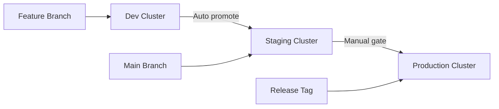

# How to Manage Development, Staging, and Production Clusters with Flux CD

Author: [nawazdhandala](https://github.com/nawazdhandala)

Tags: Flux CD, Development, Staging, Production, GitOps, Kubernetes, Multi-Environment

Description: Learn how to manage three-tier environments with Flux CD, covering progressive delivery from development through staging to production clusters.

---

## Introduction

Most organizations run at least three environments: development, staging, and production. Each serves a distinct purpose in the software delivery lifecycle. Development is for rapid iteration, staging for validation, and production for serving users. This guide shows you how to configure Flux CD to manage all three tiers effectively with progressive promotion and environment-appropriate settings.

## Environment Roles

Each environment has different requirements:

- **Development**: Fast feedback, frequent deploys, relaxed resource limits, debug logging, experimental features enabled
- **Staging**: Production-like configuration, integration testing, performance validation, release candidates
- **Production**: High availability, strict resource controls, error-only logging, stable releases, PDB enforcement



## Prerequisites

- Three Kubernetes clusters with `kubectl` access
- Flux CD CLI version 2.0 or later
- A Git repository for fleet management

## Repository Structure

```text
fleet-repo/
  base/
    apps/
      payment-service/
        deployment.yaml
        service.yaml
        configmap.yaml
        kustomization.yaml
      notification-service/
        deployment.yaml
        service.yaml
        kustomization.yaml
  overlays/
    development/
      kustomization.yaml
      patches/
    staging/
      kustomization.yaml
      patches/
    production/
      kustomization.yaml
      patches/
  infrastructure/
    base/
      monitoring/
      networking/
      security/
    overlays/
      development/
      staging/
      production/
  clusters/
    development/
      flux-system/
      infrastructure.yaml
      apps.yaml
    staging/
      flux-system/
      infrastructure.yaml
      apps.yaml
    production/
      flux-system/
      infrastructure.yaml
      apps.yaml
```

## Bootstrapping All Three Clusters

```bash
# Bootstrap the development cluster
kubectl config use-context dev-cluster
flux bootstrap github \
  --owner=your-org \
  --repository=fleet-repo \
  --branch=main \
  --path=clusters/development \
  --personal=false \
  --token-auth

# Bootstrap the staging cluster
kubectl config use-context staging-cluster
flux bootstrap github \
  --owner=your-org \
  --repository=fleet-repo \
  --branch=main \
  --path=clusters/staging \
  --personal=false \
  --token-auth

# Bootstrap the production cluster
kubectl config use-context production-cluster
flux bootstrap github \
  --owner=your-org \
  --repository=fleet-repo \
  --branch=main \
  --path=clusters/production \
  --personal=false \
  --token-auth
```

## Base Application Manifests

```yaml
# base/apps/payment-service/deployment.yaml
# Base payment service deployment shared across all environments
apiVersion: apps/v1
kind: Deployment
metadata:
  name: payment-service
  namespace: apps
spec:
  replicas: 1
  selector:
    matchLabels:
      app: payment-service
  template:
    metadata:
      labels:
        app: payment-service
    spec:
      serviceAccountName: payment-service
      containers:
        - name: payment-service
          image: your-org/payment-service:v3.0.0
          ports:
            - containerPort: 8080
              name: http
            - containerPort: 9090
              name: metrics
          env:
            - name: ENVIRONMENT
              value: base
            - name: LOG_LEVEL
              value: info
            - name: LOG_FORMAT
              value: json
            - name: PAYMENT_GATEWAY_URL
              valueFrom:
                configMapKeyRef:
                  name: payment-config
                  key: gateway-url
          readinessProbe:
            httpGet:
              path: /ready
              port: http
            initialDelaySeconds: 5
          livenessProbe:
            httpGet:
              path: /health
              port: http
            initialDelaySeconds: 10
          resources:
            requests:
              cpu: 100m
              memory: 128Mi
            limits:
              cpu: 500m
              memory: 512Mi
```

```yaml
# base/apps/payment-service/configmap.yaml
# Base configuration for the payment service
apiVersion: v1
kind: ConfigMap
metadata:
  name: payment-config
  namespace: apps
data:
  gateway-url: "https://payment-gateway.internal"
  retry-count: "3"
  timeout-seconds: "30"
  cache-ttl: "300"
```

```yaml
# base/apps/payment-service/kustomization.yaml
apiVersion: kustomize.config.k8s.io/v1beta1
kind: Kustomization
resources:
  - deployment.yaml
  - service.yaml
  - configmap.yaml
```

## Development Overlay

The development overlay maximizes developer productivity with fast feedback and relaxed constraints.

```yaml
# overlays/development/kustomization.yaml
# Development environment overlay with debug-friendly settings
apiVersion: kustomize.config.k8s.io/v1beta1
kind: Kustomization
resources:
  - ../../base/apps/payment-service
  - ../../base/apps/notification-service
commonLabels:
  environment: development
patches:
  - path: patches/payment-service.yaml
  - path: patches/notification-service.yaml
  - path: patches/dev-configmap.yaml
```

```yaml
# overlays/development/patches/payment-service.yaml
# Development overrides: single replica, debug logging, test gateway
apiVersion: apps/v1
kind: Deployment
metadata:
  name: payment-service
  namespace: apps
spec:
  replicas: 1
  template:
    spec:
      containers:
        - name: payment-service
          # Development uses the latest image from feature branches
          image: your-org/payment-service:dev-latest
          env:
            - name: ENVIRONMENT
              value: development
            - name: LOG_LEVEL
              # Trace-level logging for maximum debugging visibility
              value: trace
            - name: FEATURE_FLAGS
              # All experimental features enabled in development
              value: "new-checkout,payment-v2,refund-api,analytics-dashboard"
            - name: ENABLE_DEBUG_ENDPOINTS
              # Expose debug and profiling endpoints
              value: "true"
          resources:
            # Minimal resources in development to save costs
            requests:
              cpu: 50m
              memory: 64Mi
            limits:
              cpu: 200m
              memory: 256Mi
```

```yaml
# overlays/development/patches/dev-configmap.yaml
# Development uses a sandbox payment gateway
apiVersion: v1
kind: ConfigMap
metadata:
  name: payment-config
  namespace: apps
data:
  gateway-url: "https://sandbox.payment-gateway.dev"
  # Shorter timeouts for faster feedback in development
  retry-count: "1"
  timeout-seconds: "5"
  cache-ttl: "10"
```

## Staging Overlay

Staging mirrors production as closely as possible while still using release candidate builds.

```yaml
# overlays/staging/kustomization.yaml
# Staging environment overlay that mirrors production settings
apiVersion: kustomize.config.k8s.io/v1beta1
kind: Kustomization
resources:
  - ../../base/apps/payment-service
  - ../../base/apps/notification-service
commonLabels:
  environment: staging
patches:
  - path: patches/payment-service.yaml
  - path: patches/notification-service.yaml
  - path: patches/staging-configmap.yaml
```

```yaml
# overlays/staging/patches/payment-service.yaml
# Staging uses release candidates with production-like settings
apiVersion: apps/v1
kind: Deployment
metadata:
  name: payment-service
  namespace: apps
spec:
  # Staging runs with enough replicas to test HA behavior
  replicas: 2
  template:
    spec:
      containers:
        - name: payment-service
          # Staging uses release candidate images
          image: your-org/payment-service:v3.1.0-rc2
          env:
            - name: ENVIRONMENT
              value: staging
            - name: LOG_LEVEL
              value: info
            - name: FEATURE_FLAGS
              # Only features ready for production testing
              value: "new-checkout,payment-v2"
            - name: ENABLE_DEBUG_ENDPOINTS
              value: "false"
          resources:
            # Staging uses production-like resources
            requests:
              cpu: 250m
              memory: 256Mi
            limits:
              cpu: 500m
              memory: 512Mi
```

```yaml
# overlays/staging/patches/staging-configmap.yaml
# Staging uses a test payment gateway
apiVersion: v1
kind: ConfigMap
metadata:
  name: payment-config
  namespace: apps
data:
  gateway-url: "https://test.payment-gateway.staging"
  retry-count: "3"
  timeout-seconds: "30"
  cache-ttl: "300"
```

## Production Overlay

Production prioritizes stability, high availability, and security.

```yaml
# overlays/production/kustomization.yaml
# Production environment overlay with HA and security
apiVersion: kustomize.config.k8s.io/v1beta1
kind: Kustomization
resources:
  - ../../base/apps/payment-service
  - ../../base/apps/notification-service
  # Production-only resources
  - pdb.yaml
commonLabels:
  environment: production
patches:
  - path: patches/payment-service.yaml
  - path: patches/notification-service.yaml
  - path: patches/production-configmap.yaml
```

```yaml
# overlays/production/patches/payment-service.yaml
# Production overrides: high replicas, strict limits, stable image
apiVersion: apps/v1
kind: Deployment
metadata:
  name: payment-service
  namespace: apps
spec:
  # Production runs with full HA
  replicas: 5
  template:
    spec:
      containers:
        - name: payment-service
          # Production uses stable, tested release
          image: your-org/payment-service:v3.0.0
          env:
            - name: ENVIRONMENT
              value: production
            - name: LOG_LEVEL
              # Only warnings and errors in production
              value: warn
            - name: FEATURE_FLAGS
              # Only fully tested features
              value: "new-checkout"
            - name: ENABLE_DEBUG_ENDPOINTS
              value: "false"
          resources:
            requests:
              cpu: 500m
              memory: 512Mi
            limits:
              cpu: "1"
              memory: 1Gi
      # Ensure pods are spread across availability zones
      topologySpreadConstraints:
        - maxSkew: 1
          topologyKey: topology.kubernetes.io/zone
          whenUnsatisfiable: DoNotSchedule
          labelSelector:
            matchLabels:
              app: payment-service
      # Use anti-affinity to avoid running on the same node
      affinity:
        podAntiAffinity:
          requiredDuringSchedulingIgnoredDuringExecution:
            - labelSelector:
                matchLabels:
                  app: payment-service
              topologyKey: kubernetes.io/hostname
```

```yaml
# overlays/production/pdb.yaml
# PodDisruptionBudget to maintain availability during node drains
apiVersion: policy/v1
kind: PodDisruptionBudget
metadata:
  name: payment-service-pdb
  namespace: apps
spec:
  minAvailable: 3
  selector:
    matchLabels:
      app: payment-service
```

## Flux Kustomization per Cluster

```yaml
# clusters/development/apps.yaml
# Development Kustomization with fast sync interval
apiVersion: kustomize.toolkit.fluxcd.io/v1
kind: Kustomization
metadata:
  name: apps
  namespace: flux-system
spec:
  # Development syncs every 2 minutes for rapid feedback
  interval: 2m
  retryInterval: 30s
  path: ./overlays/development
  prune: true
  sourceRef:
    kind: GitRepository
    name: flux-system
  dependsOn:
    - name: infrastructure
  timeout: 3m
```

```yaml
# clusters/staging/apps.yaml
# Staging Kustomization with health checks
apiVersion: kustomize.toolkit.fluxcd.io/v1
kind: Kustomization
metadata:
  name: apps
  namespace: flux-system
spec:
  interval: 5m
  retryInterval: 1m
  path: ./overlays/staging
  prune: true
  sourceRef:
    kind: GitRepository
    name: flux-system
  dependsOn:
    - name: infrastructure
  healthChecks:
    - apiVersion: apps/v1
      kind: Deployment
      name: payment-service
      namespace: apps
    - apiVersion: apps/v1
      kind: Deployment
      name: notification-service
      namespace: apps
  timeout: 5m
```

```yaml
# clusters/production/apps.yaml
# Production Kustomization with strict health checks and long timeout
apiVersion: kustomize.toolkit.fluxcd.io/v1
kind: Kustomization
metadata:
  name: apps
  namespace: flux-system
spec:
  interval: 10m
  retryInterval: 5m
  path: ./overlays/production
  prune: true
  sourceRef:
    kind: GitRepository
    name: flux-system
  dependsOn:
    - name: infrastructure
  healthChecks:
    - apiVersion: apps/v1
      kind: Deployment
      name: payment-service
      namespace: apps
    - apiVersion: apps/v1
      kind: Deployment
      name: notification-service
      namespace: apps
    - apiVersion: policy/v1
      kind: PodDisruptionBudget
      name: payment-service-pdb
      namespace: apps
  timeout: 15m
```

## Progressive Delivery Across Environments

Configure image automation to progressively update environments.

```yaml
# clusters/development/image-policy.yaml
# Development tracks all new builds including pre-release tags
apiVersion: image.toolkit.fluxcd.io/v1
kind: ImagePolicy
metadata:
  name: payment-service-dev
  namespace: flux-system
spec:
  imageRepositoryRef:
    name: payment-service
  # Accept any tag with the dev- prefix
  filterTags:
    pattern: '^dev-(?P<ts>[0-9]+)$'
    extract: '$ts'
  policy:
    numerical:
      order: asc
```

```yaml
# clusters/staging/image-policy.yaml
# Staging only accepts release candidate tags
apiVersion: image.toolkit.fluxcd.io/v1
kind: ImagePolicy
metadata:
  name: payment-service-staging
  namespace: flux-system
spec:
  imageRepositoryRef:
    name: payment-service
  filterTags:
    pattern: '^v(?P<version>[0-9]+\.[0-9]+\.[0-9]+-rc[0-9]+)$'
    extract: '$version'
  policy:
    semver:
      range: ">=3.0.0-rc0"
```

## Environment Comparison Dashboard

Use this script to compare deployments across all three environments.

```bash
# Compare image versions across all three environments
echo "=== Image Versions Across Environments ==="
for env in dev staging production; do
  ctx="${env}-cluster"
  echo "--- $env ---"
  kubectl --context "$ctx" get deployments -n apps \
    -o custom-columns='NAME:.metadata.name,IMAGE:.spec.template.spec.containers[0].image,REPLICAS:.spec.replicas'
done
```

## Best Practices

1. **Progressive feature flags**: Enable features incrementally from dev to staging to production.
2. **Match production resources in staging**: Staging should use production-like resource limits to catch sizing issues.
3. **Automate dev, semi-automate staging, gate production**: Each tier gets more scrutiny.
4. **Use PDBs only in production**: PodDisruptionBudgets should be a production concern.
5. **Faster sync intervals for lower environments**: Dev can sync every 2 minutes, production every 10.
6. **Different image tag strategies per environment**: Dev uses build timestamps, staging uses RCs, production uses stable versions.

## Conclusion

Managing three environments with Flux CD follows the principle of progressive delivery. Each environment serves a distinct role, and Flux CD's Kustomize overlays let you tailor configurations appropriately. By using different sync intervals, health check strategies, and image policies per environment, you create a robust pipeline that catches issues early while maintaining production stability. The shared base keeps configurations DRY, and the overlay pattern makes differences between environments explicit and reviewable.
