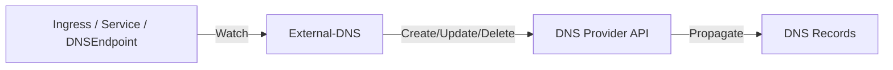

# How to Manage DNS Records with External-DNS and Flux CD

Author: [nawazdhandala](https://github.com/nawazdhandala)

Tags: flux cd, external-dns, dns, kubernetes, gitops, route53, cloudflare

Description: Learn how to automate DNS record management using External-DNS deployed and configured through Flux CD.

---

## Introduction

External-DNS synchronizes Kubernetes resources such as Services and Ingresses with DNS providers, automatically creating and updating DNS records. When deployed through Flux CD, your DNS configuration becomes fully declarative and Git-driven, eliminating manual DNS management and reducing the risk of misconfigurations.

This guide covers deploying External-DNS with Flux CD, configuring it for popular DNS providers, and setting up advanced features like ownership tracking and filtering.

## Prerequisites

- A running Kubernetes cluster
- Flux CD installed and bootstrapped
- A DNS zone managed by a supported provider (AWS Route53, Cloudflare, Google Cloud DNS, Azure DNS, etc.)
- Appropriate API credentials or IAM roles for your DNS provider
- kubectl access to your cluster

## How External-DNS Works



External-DNS watches Kubernetes resources for hostname annotations and creates corresponding DNS records in your DNS provider. It supports a wide range of providers and record types.

## Repository Structure

```
infrastructure/
  external-dns/
    namespace.yaml
    helmrepository.yaml
    helmrelease.yaml
    dns-endpoints/
      app-records.yaml
```

## Creating the Namespace

```yaml
# infrastructure/external-dns/namespace.yaml
apiVersion: v1
kind: Namespace
metadata:
  name: external-dns
  labels:
    monitoring: enabled
```

## Adding the Helm Repository

```yaml
# infrastructure/external-dns/helmrepository.yaml
apiVersion: source.toolkit.fluxcd.io/v1
kind: HelmRepository
metadata:
  name: external-dns
  namespace: flux-system
spec:
  interval: 1h
  url: https://kubernetes-sigs.github.io/external-dns
```

## Deploying External-DNS for AWS Route53

```yaml
# infrastructure/external-dns/helmrelease.yaml
apiVersion: helm.toolkit.fluxcd.io/v1
kind: HelmRelease
metadata:
  name: external-dns
  namespace: external-dns
spec:
  interval: 30m
  chart:
    spec:
      chart: external-dns
      version: "1.14.x"
      sourceRef:
        kind: HelmRepository
        name: external-dns
        namespace: flux-system
  install:
    remediation:
      retries: 3
  upgrade:
    remediation:
      retries: 3
  values:
    # DNS provider configuration
    provider:
      name: aws
    # AWS-specific settings
    env:
      - name: AWS_DEFAULT_REGION
        value: us-east-1
    # Domain filter: only manage records for these domains
    domainFilters:
      - example.com
      - staging.example.com
    # Exclude specific subdomains
    excludeDomains:
      - internal.example.com
    # Ownership tracking to prevent conflicts
    # Uses TXT records to track which records External-DNS manages
    txtOwnerId: "my-cluster"
    txtPrefix: "_externaldns."
    # Policy: sync will create, update, and delete records
    # Use "upsert-only" to prevent deletion
    policy: sync
    # Sources to watch for DNS records
    sources:
      - ingress
      - service
      - crd  # DNSEndpoint custom resources
    # Sync interval
    interval: "1m"
    # Log level
    logLevel: info
    # Resource allocation
    resources:
      requests:
        cpu: 50m
        memory: 64Mi
      limits:
        cpu: 200m
        memory: 256Mi
    # Service account with IAM role
    serviceAccount:
      annotations:
        eks.amazonaws.com/role-arn: arn:aws:iam::123456789012:role/external-dns
    # Metrics for Prometheus
    metrics:
      enabled: true
      serviceMonitor:
        enabled: true
```

## Deploying External-DNS for Cloudflare

```yaml
# infrastructure/external-dns/overlays/cloudflare/helmrelease.yaml
apiVersion: helm.toolkit.fluxcd.io/v1
kind: HelmRelease
metadata:
  name: external-dns
  namespace: external-dns
spec:
  interval: 30m
  chart:
    spec:
      chart: external-dns
      version: "1.14.x"
      sourceRef:
        kind: HelmRepository
        name: external-dns
        namespace: flux-system
  values:
    provider:
      name: cloudflare
    # Cloudflare API token from a secret
    env:
      - name: CF_API_TOKEN
        valueFrom:
          secretKeyRef:
            name: cloudflare-api-token
            key: api-token
    domainFilters:
      - example.com
    # Enable Cloudflare proxy for CDN and DDoS protection
    extraArgs:
      - --cloudflare-proxied
      # Only proxy A and CNAME records
      - --cloudflare-dns-records-per-page=5000
    txtOwnerId: "my-cluster"
    policy: sync
    sources:
      - ingress
      - service
      - crd
    resources:
      requests:
        cpu: 50m
        memory: 64Mi
      limits:
        cpu: 200m
        memory: 256Mi
```

## Cloudflare API Token Secret

```yaml
# infrastructure/external-dns/overlays/cloudflare/secret.yaml
apiVersion: v1
kind: Secret
metadata:
  name: cloudflare-api-token
  namespace: external-dns
type: Opaque
stringData:
  # Encrypt this with SOPS in production
  api-token: CHANGE_ME_USE_SOPS
```

## Using Ingress Annotations

External-DNS automatically creates DNS records from Ingress resources.

```yaml
# apps/my-app/ingress.yaml
apiVersion: networking.k8s.io/v1
kind: Ingress
metadata:
  name: my-app
  namespace: my-app
  annotations:
    # External-DNS will create this DNS record
    external-dns.alpha.kubernetes.io/hostname: my-app.example.com
    # Set TTL for the DNS record
    external-dns.alpha.kubernetes.io/ttl: "300"
    # Set the record type (optional, defaults to A/CNAME)
    external-dns.alpha.kubernetes.io/target: ingress-lb.example.com
spec:
  ingressClassName: nginx
  rules:
    - host: my-app.example.com
      http:
        paths:
          - path: /
            pathType: Prefix
            backend:
              service:
                name: my-app
                port:
                  number: 80
```

## Using Service Annotations

Create DNS records from LoadBalancer services.

```yaml
# apps/my-app/service.yaml
apiVersion: v1
kind: Service
metadata:
  name: my-app
  namespace: my-app
  annotations:
    # Create a DNS record pointing to this service's load balancer
    external-dns.alpha.kubernetes.io/hostname: api.example.com
    external-dns.alpha.kubernetes.io/ttl: "60"
spec:
  type: LoadBalancer
  ports:
    - port: 443
      targetPort: 8443
  selector:
    app: my-app
```

## Using DNSEndpoint Custom Resources

For more control, use the DNSEndpoint CRD to create records directly.

```yaml
# infrastructure/external-dns/dns-endpoints/app-records.yaml
apiVersion: externaldns.k8s.io/v1alpha1
kind: DNSEndpoint
metadata:
  name: application-dns-records
  namespace: external-dns
spec:
  endpoints:
    # A record pointing to a specific IP
    - dnsName: legacy-app.example.com
      recordTTL: 300
      recordType: A
      targets:
        - 203.0.113.50
    # CNAME record
    - dnsName: docs.example.com
      recordTTL: 300
      recordType: CNAME
      targets:
        - my-docs-site.netlify.app
    # MX records for email
    - dnsName: example.com
      recordTTL: 3600
      recordType: MX
      targets:
        - "10 mail1.example.com"
        - "20 mail2.example.com"
    # TXT record for verification
    - dnsName: example.com
      recordTTL: 3600
      recordType: TXT
      targets:
        - "v=spf1 include:_spf.google.com ~all"
```

## Multi-Provider Setup

Run multiple External-DNS instances for different DNS providers.

```yaml
# infrastructure/external-dns/route53-helmrelease.yaml
apiVersion: helm.toolkit.fluxcd.io/v1
kind: HelmRelease
metadata:
  name: external-dns-route53
  namespace: external-dns
spec:
  interval: 30m
  chart:
    spec:
      chart: external-dns
      version: "1.14.x"
      sourceRef:
        kind: HelmRepository
        name: external-dns
        namespace: flux-system
  values:
    provider:
      name: aws
    domainFilters:
      - internal.example.com
    # Use annotation filter to only process resources with this annotation
    extraArgs:
      - --annotation-filter=external-dns.alpha.kubernetes.io/provider=route53
    txtOwnerId: "my-cluster-route53"
    sources:
      - ingress
      - service
---
# infrastructure/external-dns/cloudflare-helmrelease.yaml
apiVersion: helm.toolkit.fluxcd.io/v1
kind: HelmRelease
metadata:
  name: external-dns-cloudflare
  namespace: external-dns
spec:
  interval: 30m
  chart:
    spec:
      chart: external-dns
      version: "1.14.x"
      sourceRef:
        kind: HelmRepository
        name: external-dns
        namespace: flux-system
  values:
    provider:
      name: cloudflare
    domainFilters:
      - public.example.com
    extraArgs:
      - --annotation-filter=external-dns.alpha.kubernetes.io/provider=cloudflare
      - --cloudflare-proxied
    txtOwnerId: "my-cluster-cloudflare"
    sources:
      - ingress
      - service
    env:
      - name: CF_API_TOKEN
        valueFrom:
          secretKeyRef:
            name: cloudflare-api-token
            key: api-token
```

## Flux Kustomization

```yaml
# clusters/my-cluster/external-dns.yaml
apiVersion: kustomize.toolkit.fluxcd.io/v1
kind: Kustomization
metadata:
  name: external-dns
  namespace: flux-system
spec:
  interval: 15m
  path: ./infrastructure/external-dns
  prune: true
  sourceRef:
    kind: GitRepository
    name: flux-system
  # Depends on cert-manager for TLS
  dependsOn:
    - name: cert-manager
  healthChecks:
    - apiVersion: apps/v1
      kind: Deployment
      name: external-dns
      namespace: external-dns
  timeout: 5m
  # Decrypt secrets
  decryption:
    provider: sops
    secretRef:
      name: sops-gpg
```

## Verifying the Deployment

```bash
# Check Flux reconciliation
flux get kustomizations external-dns
flux get helmreleases -n external-dns

# Verify External-DNS is running
kubectl get pods -n external-dns

# Check External-DNS logs for record creation
kubectl logs -n external-dns -l app.kubernetes.io/name=external-dns --tail=50

# Verify DNS records were created
dig my-app.example.com
nslookup my-app.example.com

# List DNSEndpoint resources
kubectl get dnsendpoints --all-namespaces
```

## Troubleshooting

- **Records not being created**: Check External-DNS logs for permission errors. Verify IAM roles or API tokens have the correct permissions
- **Records being deleted unexpectedly**: Ensure the txtOwnerId is unique per cluster. Check that the policy is set correctly
- **Duplicate records**: Multiple External-DNS instances may be competing. Use annotation filters to isolate responsibilities
- **Slow DNS propagation**: DNS changes can take time to propagate. Check the TTL values and provider-specific propagation times

## Conclusion

External-DNS managed through Flux CD eliminates manual DNS record management entirely. By declaring DNS records through Kubernetes resources and letting External-DNS synchronize them with your DNS provider, you achieve a fully automated, Git-driven DNS workflow. Combined with cert-manager for TLS certificates, you get a complete solution for managing both DNS and certificates through GitOps principles.
