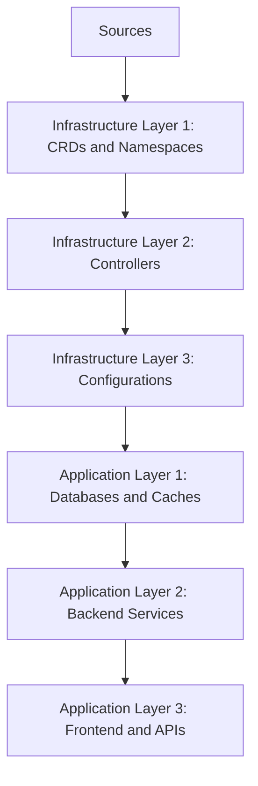

# How to Manage Infrastructure and Applications Together with Flux CD

Author: [nawazdhandala](https://github.com/nawazdhandala)

Tags: flux cd, gitops, kubernetes, infrastructure, applications, dependency management

Description: A practical guide to managing both infrastructure components and application workloads in a unified Flux CD GitOps workflow with proper dependency ordering.

---

## Introduction

In real-world Kubernetes environments, applications depend on infrastructure. Your web service needs an ingress controller. Your backend needs a database. Your monitoring stack needs to be running before you can observe anything. Flux CD provides built-in dependency management that lets you define these relationships and ensure components are deployed in the correct order.

This guide shows how to structure your Git repository to manage infrastructure and applications together, with proper dependency chains and environment-specific configurations.

## Prerequisites

- A Kubernetes cluster with Flux CD bootstrapped
- kubectl and flux CLI installed
- A Git repository connected to Flux

## Dependency Chain Design



## Repository Structure

Organize your repository to reflect the dependency layers.

```
fleet-infra/
├── clusters/
│   ├── staging/
│   │   └── kustomization.yaml
│   └── production/
│       └── kustomization.yaml
├── infrastructure/
│   ├── sources/              # HelmRepositories and GitRepositories
│   │   ├── kustomization.yaml
│   │   ├── bitnami.yaml
│   │   ├── prometheus.yaml
│   │   └── ingress-nginx.yaml
│   ├── crds/                 # Custom Resource Definitions
│   │   ├── kustomization.yaml
│   │   └── cert-manager-crds.yaml
│   ├── controllers/          # Infrastructure controllers
│   │   ├── kustomization.yaml
│   │   ├── cert-manager.yaml
│   │   ├── ingress-nginx.yaml
│   │   ├── external-dns.yaml
│   │   └── monitoring.yaml
│   └── configs/              # Cluster configurations
│       ├── kustomization.yaml
│       ├── cluster-issuers.yaml
│       └── storage-classes.yaml
└── apps/
    ├── base/                 # Base application manifests
    ├── staging/              # Staging overrides
    └── production/           # Production overrides
```

## Step 1: Define Sources

Create all Helm and Git repository sources in a single layer.

```yaml
# infrastructure/sources/kustomization.yaml
apiVersion: kustomize.config.k8s.io/v1beta1
kind: Kustomization
resources:
  - bitnami.yaml
  - prometheus.yaml
  - ingress-nginx.yaml
  - jetstack.yaml
```

```yaml
# infrastructure/sources/bitnami.yaml
# Bitnami Helm repository for common applications
apiVersion: source.toolkit.fluxcd.io/v1
kind: HelmRepository
metadata:
  name: bitnami
  namespace: flux-system
spec:
  interval: 1h
  url: https://charts.bitnami.com/bitnami
```

```yaml
# infrastructure/sources/prometheus.yaml
# Prometheus community Helm charts
apiVersion: source.toolkit.fluxcd.io/v1
kind: HelmRepository
metadata:
  name: prometheus-community
  namespace: flux-system
spec:
  interval: 1h
  url: https://prometheus-community.github.io/helm-charts
```

```yaml
# infrastructure/sources/ingress-nginx.yaml
apiVersion: source.toolkit.fluxcd.io/v1
kind: HelmRepository
metadata:
  name: ingress-nginx
  namespace: flux-system
spec:
  interval: 1h
  url: https://kubernetes.github.io/ingress-nginx
```

```yaml
# infrastructure/sources/jetstack.yaml
# Jetstack Helm repository for cert-manager
apiVersion: source.toolkit.fluxcd.io/v1
kind: HelmRepository
metadata:
  name: jetstack
  namespace: flux-system
spec:
  interval: 1h
  url: https://charts.jetstack.io
```

## Step 2: Define Infrastructure Controllers

Install the infrastructure components that applications depend on.

```yaml
# infrastructure/controllers/cert-manager.yaml
# TLS certificate management controller
apiVersion: helm.toolkit.fluxcd.io/v2
kind: HelmRelease
metadata:
  name: cert-manager
  namespace: cert-manager
spec:
  interval: 15m
  chart:
    spec:
      chart: cert-manager
      version: "1.16.x"
      sourceRef:
        kind: HelmRepository
        name: jetstack
        namespace: flux-system
  install:
    createNamespace: true
    crds: CreateReplace
  upgrade:
    crds: CreateReplace
  values:
    # Install CRDs as part of the Helm release
    installCRDs: true
    # Enable Prometheus metrics endpoint
    prometheus:
      enabled: true
      servicemonitor:
        enabled: true
    resources:
      requests:
        cpu: 50m
        memory: 128Mi
```

```yaml
# infrastructure/controllers/ingress-nginx.yaml
# Ingress controller for HTTP/HTTPS routing
apiVersion: helm.toolkit.fluxcd.io/v2
kind: HelmRelease
metadata:
  name: ingress-nginx
  namespace: ingress-nginx
spec:
  interval: 15m
  chart:
    spec:
      chart: ingress-nginx
      version: "4.11.x"
      sourceRef:
        kind: HelmRepository
        name: ingress-nginx
        namespace: flux-system
  install:
    createNamespace: true
  values:
    controller:
      replicaCount: 2
      metrics:
        enabled: true
        serviceMonitor:
          enabled: true
      resources:
        requests:
          cpu: 100m
          memory: 128Mi
```

```yaml
# infrastructure/controllers/monitoring.yaml
# Full monitoring stack with Prometheus and Grafana
apiVersion: helm.toolkit.fluxcd.io/v2
kind: HelmRelease
metadata:
  name: kube-prometheus-stack
  namespace: monitoring
spec:
  interval: 30m
  chart:
    spec:
      chart: kube-prometheus-stack
      version: "65.x"
      sourceRef:
        kind: HelmRepository
        name: prometheus-community
        namespace: flux-system
  install:
    createNamespace: true
    crds: CreateReplace
  upgrade:
    crds: CreateReplace
  values:
    grafana:
      enabled: true
      persistence:
        enabled: true
        size: 10Gi
    alertmanager:
      enabled: true
    prometheus:
      prometheusSpec:
        retention: 14d
        storageSpec:
          volumeClaimTemplate:
            spec:
              accessModes: ["ReadWriteOnce"]
              resources:
                requests:
                  storage: 50Gi
```

## Step 3: Define Infrastructure Configurations

Post-install configurations that depend on controllers being ready.

```yaml
# infrastructure/configs/cluster-issuers.yaml
# ClusterIssuer for Let's Encrypt TLS certificates
# Requires cert-manager to be running
apiVersion: cert-manager.io/v1
kind: ClusterIssuer
metadata:
  name: letsencrypt-production
spec:
  acme:
    server: https://acme-v02.api.letsencrypt.org/directory
    email: platform@example.com
    privateKeySecretRef:
      name: letsencrypt-production-key
    solvers:
      - http01:
          ingress:
            class: nginx
---
apiVersion: cert-manager.io/v1
kind: ClusterIssuer
metadata:
  name: letsencrypt-staging
spec:
  acme:
    server: https://acme-staging-v02.api.letsencrypt.org/directory
    email: platform@example.com
    privateKeySecretRef:
      name: letsencrypt-staging-key
    solvers:
      - http01:
          ingress:
            class: nginx
```

## Step 4: Wire Dependencies with Flux Kustomizations

Create the Flux Kustomizations that enforce the dependency order.

```yaml
# clusters/production/kustomization.yaml
apiVersion: kustomize.config.k8s.io/v1beta1
kind: Kustomization
resources:
  - sources.yaml
  - infrastructure.yaml
  - configs.yaml
  - apps.yaml
```

```yaml
# clusters/production/sources.yaml
# Layer 0: Deploy all Helm and Git repository sources
apiVersion: kustomize.toolkit.fluxcd.io/v1
kind: Kustomization
metadata:
  name: sources
  namespace: flux-system
spec:
  interval: 10m
  sourceRef:
    kind: GitRepository
    name: flux-system
  path: ./infrastructure/sources
  prune: true
```

```yaml
# clusters/production/infrastructure.yaml
# Layer 1: Deploy infrastructure controllers
# Depends on sources being available
apiVersion: kustomize.toolkit.fluxcd.io/v1
kind: Kustomization
metadata:
  name: infrastructure
  namespace: flux-system
spec:
  interval: 10m
  sourceRef:
    kind: GitRepository
    name: flux-system
  path: ./infrastructure/controllers
  prune: true
  wait: true
  # Wait for all controllers to be healthy before proceeding
  timeout: "10m"
  dependsOn:
    - name: sources
  # Health checks verify controllers are actually running
  healthChecks:
    - apiVersion: apps/v1
      kind: Deployment
      name: cert-manager
      namespace: cert-manager
    - apiVersion: apps/v1
      kind: Deployment
      name: ingress-nginx-controller
      namespace: ingress-nginx
```

```yaml
# clusters/production/configs.yaml
# Layer 2: Deploy configurations after controllers are healthy
apiVersion: kustomize.toolkit.fluxcd.io/v1
kind: Kustomization
metadata:
  name: infrastructure-configs
  namespace: flux-system
spec:
  interval: 10m
  sourceRef:
    kind: GitRepository
    name: flux-system
  path: ./infrastructure/configs
  prune: true
  dependsOn:
    - name: infrastructure
```

```yaml
# clusters/production/apps.yaml
# Layer 3: Deploy applications after infrastructure is configured
apiVersion: kustomize.toolkit.fluxcd.io/v1
kind: Kustomization
metadata:
  name: applications
  namespace: flux-system
spec:
  interval: 5m
  sourceRef:
    kind: GitRepository
    name: flux-system
  path: ./apps/production
  prune: true
  dependsOn:
    - name: infrastructure-configs
  # Substitute environment variables into app manifests
  postBuild:
    substitute:
      CLUSTER_DOMAIN: "prod.example.com"
      ENVIRONMENT: "production"
      LOG_LEVEL: "info"
    substituteFrom:
      - kind: ConfigMap
        name: cluster-settings
      - kind: Secret
        name: cluster-secrets
```

## Step 5: Define Applications with Dependencies

Create application definitions that reference infrastructure.

```yaml
# apps/base/backend/deployment.yaml
# Backend API deployment
apiVersion: apps/v1
kind: Deployment
metadata:
  name: backend-api
spec:
  replicas: 2
  selector:
    matchLabels:
      app: backend-api
  template:
    metadata:
      labels:
        app: backend-api
    spec:
      containers:
        - name: api
          image: my-org/backend-api:v1.5.0
          ports:
            - containerPort: 8080
          env:
            - name: DATABASE_HOST
              valueFrom:
                secretKeyRef:
                  name: database-credentials
                  key: host
            - name: REDIS_URL
              value: "redis://redis-master.database:6379"
          resources:
            requests:
              cpu: 200m
              memory: 256Mi
```

```yaml
# apps/base/backend/ingress.yaml
# Ingress using the nginx controller and cert-manager annotations
# Both must be running for this to work
apiVersion: networking.k8s.io/v1
kind: Ingress
metadata:
  name: backend-api
  annotations:
    # References the ingress-nginx controller
    kubernetes.io/ingress.class: nginx
    # References the cert-manager ClusterIssuer
    cert-manager.io/cluster-issuer: letsencrypt-production
spec:
  tls:
    - hosts:
        - api.${CLUSTER_DOMAIN}
      secretName: backend-api-tls
  rules:
    - host: api.${CLUSTER_DOMAIN}
      http:
        paths:
          - path: /
            pathType: Prefix
            backend:
              service:
                name: backend-api
                port:
                  number: 80
```

```yaml
# apps/production/kustomization.yaml
# Production application configuration
apiVersion: kustomize.config.k8s.io/v1beta1
kind: Kustomization
resources:
  - ../base/backend
  - ../base/frontend
  - database.yaml
patches:
  # Scale up backend for production traffic
  - target:
      kind: Deployment
      name: backend-api
    patch: |
      - op: replace
        path: /spec/replicas
        value: 5
      - op: add
        path: /spec/template/spec/topologySpreadConstraints
        value:
          - maxSkew: 1
            topologyKey: topology.kubernetes.io/zone
            whenUnsatisfiable: DoNotSchedule
            labelSelector:
              matchLabels:
                app: backend-api
```

## Verifying the Full Stack

Monitor the dependency chain and all layers.

```bash
# View all Flux Kustomizations and their status
flux get kustomizations

# Expected output shows dependency ordering:
# NAME                  READY  STATUS
# sources               True   Applied revision: main@sha1:abc123
# infrastructure        True   Applied revision: main@sha1:abc123
# infrastructure-configs True  Applied revision: main@sha1:abc123
# applications          True   Applied revision: main@sha1:abc123

# Check the health of infrastructure components
kubectl get pods -n cert-manager
kubectl get pods -n ingress-nginx
kubectl get pods -n monitoring

# Check application deployments
kubectl get pods -n default
kubectl get ingress -A

# Verify TLS certificates are issued
kubectl get certificates -A
```

## Handling Failures in the Chain

When a dependency fails, Flux stops deploying downstream components.

```bash
# If infrastructure fails, applications will not be deployed
# Check which kustomization is failing
flux get kustomizations

# Get detailed error information
flux get kustomization infrastructure -o yaml

# View events for debugging
kubectl get events -n flux-system --field-selector reason=ReconciliationFailed

# Force reconciliation after fixing the issue
flux reconcile kustomization infrastructure
```

## Conclusion

Managing infrastructure and applications together in Flux CD gives you a clear, layered deployment model. Dependencies are explicit, ordering is enforced, and health checks verify each layer before the next one starts. This means your applications never try to start before their required infrastructure is ready. The entire stack is defined in Git, giving you version history, pull request reviews, and the ability to recreate any environment from scratch by pointing Flux at the same repository.
