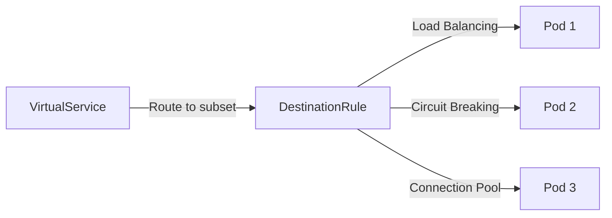

# How to Manage Istio DestinationRules with Flux CD

Author: [nawazdhandala](https://github.com/nawazdhandala)

Tags: flux cd, istio, destinationrule, service mesh, gitops, traffic management, load balancing

Description: Learn how to manage Istio DestinationRule resources with Flux CD for GitOps-driven load balancing, circuit breaking, and connection pool management.

---

Istio DestinationRules define policies that apply to traffic after routing has occurred. They control load balancing, connection pools, circuit breaking, and TLS settings for service-to-service communication. Managing DestinationRules with Flux CD ensures these critical policies are version-controlled and consistently applied across your mesh.

## Prerequisites

Before you begin, ensure you have the following:

- A Kubernetes cluster with Istio installed
- Flux CD installed on your cluster (v2.x)
- kubectl configured to access your cluster
- Applications deployed in the Istio mesh

## Understanding DestinationRules

DestinationRules work alongside VirtualServices. While VirtualServices define how traffic is routed, DestinationRules define what happens to the traffic once it reaches a destination. They are essential for defining service subsets, load balancing algorithms, and resilience policies.



## Step 1: Basic DestinationRule with Subsets

Define subsets for different versions of a service:

```yaml
# basic-destinationrule.yaml
# DestinationRule defining subsets for the product service
apiVersion: networking.istio.io/v1
kind: DestinationRule
metadata:
  name: product-service
  namespace: my-app
spec:
  # The service this rule applies to
  host: product-service
  # Define subsets based on pod labels
  subsets:
    # Stable version subset
    - name: stable
      labels:
        version: v1
    # Canary version subset
    - name: canary
      labels:
        version: v2
    # Previous version for rollback
    - name: previous
      labels:
        version: v0
```

## Step 2: Load Balancing Configuration

Configure different load balancing algorithms:

```yaml
# load-balancing-destinationrule.yaml
# DestinationRule with custom load balancing settings
apiVersion: networking.istio.io/v1
kind: DestinationRule
metadata:
  name: api-gateway
  namespace: my-app
spec:
  host: api-gateway
  # Traffic policy applied to all subsets
  trafficPolicy:
    loadBalancer:
      # Use consistent hashing for session affinity
      consistentHash:
        # Hash based on a specific HTTP header
        httpHeaderName: x-user-id
  subsets:
    - name: v1
      labels:
        version: v1
    - name: v2
      labels:
        version: v2
      # Override the default load balancer for this subset
      trafficPolicy:
        loadBalancer:
          # Use round-robin for the v2 subset
          simple: ROUND_ROBIN
```

Here are the available load balancing algorithms:

```yaml
# round-robin-lb.yaml
# DestinationRule with round-robin load balancing
apiVersion: networking.istio.io/v1
kind: DestinationRule
metadata:
  name: service-round-robin
  namespace: my-app
spec:
  host: my-service
  trafficPolicy:
    loadBalancer:
      # ROUND_ROBIN distributes requests evenly
      simple: ROUND_ROBIN
---
# least-conn-lb.yaml
# DestinationRule with least-connections load balancing
apiVersion: networking.istio.io/v1
kind: DestinationRule
metadata:
  name: service-least-conn
  namespace: my-app
spec:
  host: my-service
  trafficPolicy:
    loadBalancer:
      # LEAST_REQUEST sends to the instance with fewest active requests
      simple: LEAST_REQUEST
---
# random-lb.yaml
# DestinationRule with random load balancing
apiVersion: networking.istio.io/v1
kind: DestinationRule
metadata:
  name: service-random
  namespace: my-app
spec:
  host: my-service
  trafficPolicy:
    loadBalancer:
      # RANDOM distributes requests randomly
      simple: RANDOM
```

## Step 3: Circuit Breaking

Configure circuit breaking to prevent cascading failures:

```yaml
# circuit-breaker-destinationrule.yaml
# DestinationRule with circuit breaking for the payment service
apiVersion: networking.istio.io/v1
kind: DestinationRule
metadata:
  name: payment-service
  namespace: my-app
spec:
  host: payment-service
  trafficPolicy:
    # Connection pool settings act as the circuit breaker
    connectionPool:
      tcp:
        # Maximum number of TCP connections
        maxConnections: 100
        # TCP connection timeout
        connectTimeout: 5s
      http:
        # Maximum number of pending HTTP requests
        h2UpgradePolicy: DEFAULT
        http1MaxPendingRequests: 100
        # Maximum number of concurrent HTTP requests
        http2MaxRequests: 1000
        # Maximum number of requests per connection
        maxRequestsPerConnection: 10
        # Maximum number of retries
        maxRetries: 3
    # Outlier detection (the actual circuit breaker)
    outlierDetection:
      # Check for outliers every 30 seconds
      interval: 30s
      # Number of consecutive errors before ejecting
      consecutive5xxErrors: 5
      # Number of consecutive gateway errors before ejecting
      consecutiveGatewayErrors: 3
      # Percentage of hosts that can be ejected
      maxEjectionPercent: 50
      # Duration an outlier is ejected (increases with each ejection)
      baseEjectionTime: 30s
      # Minimum percentage of healthy hosts required
      minHealthPercent: 50
  subsets:
    - name: stable
      labels:
        version: v1
```

## Step 4: Connection Pool Management

Fine-tune connection pools for high-traffic services:

```yaml
# connection-pool-destinationrule.yaml
# DestinationRule with detailed connection pool configuration
apiVersion: networking.istio.io/v1
kind: DestinationRule
metadata:
  name: high-traffic-service
  namespace: my-app
spec:
  host: high-traffic-service
  trafficPolicy:
    connectionPool:
      tcp:
        # Maximum number of TCP connections to the service
        maxConnections: 500
        # TCP connection timeout
        connectTimeout: 10s
        # TCP keepalive settings
        tcpKeepalive:
          # Send keepalive probes after 60 seconds of inactivity
          time: 60s
          # Interval between keepalive probes
          interval: 10s
          # Number of probes before considering connection dead
          probes: 3
      http:
        # Maximum pending requests queued for the connection pool
        http1MaxPendingRequests: 500
        # Maximum active requests to the service
        http2MaxRequests: 2000
        # Maximum requests per connection before closing
        maxRequestsPerConnection: 100
        # Maximum number of retries across all hosts
        maxRetries: 10
        # Idle timeout for connections
        idleTimeout: 300s
```

## Step 5: mTLS Configuration

Configure mutual TLS settings per destination:

```yaml
# mtls-destinationrule.yaml
# DestinationRule with mTLS configuration
apiVersion: networking.istio.io/v1
kind: DestinationRule
metadata:
  name: secure-service
  namespace: my-app
spec:
  host: secure-service
  trafficPolicy:
    tls:
      # Use Istio mutual TLS
      mode: ISTIO_MUTUAL
  subsets:
    - name: v1
      labels:
        version: v1
---
# external-mtls-destinationrule.yaml
# DestinationRule for an external service requiring client certificates
apiVersion: networking.istio.io/v1
kind: DestinationRule
metadata:
  name: external-payment-api
  namespace: my-app
spec:
  host: payment-api.external.com
  trafficPolicy:
    tls:
      # Use mutual TLS with custom certificates
      mode: MUTUAL
      # Client certificate
      clientCertificate: /etc/certs/client.pem
      # Client private key
      privateKey: /etc/certs/client-key.pem
      # CA certificate to verify the server
      caCertificates: /etc/certs/ca.pem
      # SNI hostname
      sni: payment-api.external.com
```

## Step 6: Locality-Aware Load Balancing

Configure geographic load balancing for multi-region deployments:

```yaml
# locality-lb-destinationrule.yaml
# DestinationRule with locality-aware load balancing
apiVersion: networking.istio.io/v1
kind: DestinationRule
metadata:
  name: multi-region-service
  namespace: my-app
spec:
  host: multi-region-service
  trafficPolicy:
    loadBalancer:
      localityLbSetting:
        enabled: true
        # Define failover priorities
        distribute:
          # From us-east-1, send 80% local, 20% to us-west-2
          - from: "us-east-1/us-east-1a/*"
            to:
              "us-east-1/us-east-1a/*": 80
              "us-west-2/us-west-2a/*": 20
          # From us-west-2, send 80% local, 20% to us-east-1
          - from: "us-west-2/us-west-2a/*"
            to:
              "us-west-2/us-west-2a/*": 80
              "us-east-1/us-east-1a/*": 20
        # Define failover order
        failover:
          - from: us-east-1
            to: us-west-2
          - from: us-west-2
            to: us-east-1
    # Outlier detection is required for locality failover
    outlierDetection:
      consecutive5xxErrors: 3
      interval: 10s
      baseEjectionTime: 30s
```

## Step 7: Port-Level Traffic Policies

Apply different policies to different ports:

```yaml
# port-level-destinationrule.yaml
# DestinationRule with port-specific traffic policies
apiVersion: networking.istio.io/v1
kind: DestinationRule
metadata:
  name: multi-port-service
  namespace: my-app
spec:
  host: multi-port-service
  trafficPolicy:
    # Default policy for all ports
    loadBalancer:
      simple: ROUND_ROBIN
    # Port-specific overrides
    portLevelSettings:
      # HTTP port with specific connection pool
      - port:
          number: 8080
        connectionPool:
          http:
            http2MaxRequests: 500
            maxRequestsPerConnection: 50
        loadBalancer:
          simple: LEAST_REQUEST
      # gRPC port with different settings
      - port:
          number: 9090
        connectionPool:
          http:
            http2MaxRequests: 1000
        loadBalancer:
          simple: ROUND_ROBIN
      # Metrics port with relaxed settings
      - port:
          number: 9091
        connectionPool:
          http:
            http2MaxRequests: 100
```

## Step 8: DestinationRule for External Services

Configure DestinationRules for services outside the mesh:

```yaml
# external-service-destinationrule.yaml
# ServiceEntry and DestinationRule for an external API
apiVersion: networking.istio.io/v1
kind: ServiceEntry
metadata:
  name: external-api
  namespace: my-app
spec:
  hosts:
    - api.thirdparty.com
  ports:
    - number: 443
      name: https
      protocol: HTTPS
  resolution: DNS
  location: MESH_EXTERNAL
---
# DestinationRule for the external service
apiVersion: networking.istio.io/v1
kind: DestinationRule
metadata:
  name: external-api
  namespace: my-app
spec:
  host: api.thirdparty.com
  trafficPolicy:
    tls:
      # Originate TLS for the external service
      mode: SIMPLE
      sni: api.thirdparty.com
    connectionPool:
      tcp:
        maxConnections: 50
        connectTimeout: 5s
      http:
        http1MaxPendingRequests: 50
        http2MaxRequests: 100
    # Circuit breaker for the external service
    outlierDetection:
      consecutive5xxErrors: 3
      interval: 30s
      baseEjectionTime: 60s
      maxEjectionPercent: 100
```

## Step 9: Create the Flux CD Kustomization

```yaml
# kustomization.yaml
# Flux CD Kustomization for DestinationRule management
apiVersion: kustomize.toolkit.fluxcd.io/v1
kind: Kustomization
metadata:
  name: destination-rules
  namespace: flux-system
spec:
  interval: 5m
  sourceRef:
    kind: GitRepository
    name: traffic-management
  path: ./destinationrules/production
  prune: true
  wait: true
  timeout: 5m
  dependsOn:
    - name: istio-system
    - name: traffic-management
```

## Step 10: Verify DestinationRule Configuration

```bash
# List all DestinationRules
kubectl get destinationrules -n my-app

# Describe a specific DestinationRule
kubectl describe destinationrule payment-service -n my-app

# Check the proxy configuration for applied rules
istioctl proxy-config cluster deploy/product-service -n my-app

# Analyze for configuration issues
istioctl analyze -n my-app

# Check circuit breaker statistics
istioctl proxy-config endpoint deploy/frontend -n my-app | grep payment

# Verify Flux reconciliation
flux get kustomizations destination-rules
```

## Best Practices

1. **Always define subsets** when using VirtualServices with weighted routing
2. **Configure circuit breaking** for all external and critical internal services
3. **Use locality-aware load balancing** for multi-region deployments
4. **Set connection pool limits** based on actual traffic patterns and capacity
5. **Enable outlier detection** to automatically remove unhealthy endpoints
6. **Use ISTIO_MUTUAL TLS** for in-mesh traffic and MUTUAL for external mTLS
7. **Test circuit breaker settings** in staging before applying to production

## Conclusion

Managing Istio DestinationRules with Flux CD provides a GitOps-driven approach to configuring load balancing, circuit breaking, and connection pool management. By storing these policies in Git, you maintain a clear audit trail of all traffic policy changes. Flux CD ensures that DestinationRules are automatically reconciled, preventing configuration drift and ensuring consistent service mesh behavior across your cluster. Combined with VirtualServices, DestinationRules give you comprehensive traffic management capabilities that are essential for running reliable microservices in production.
