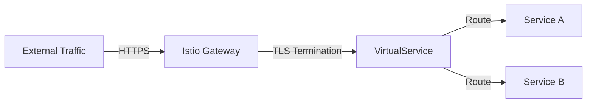

# How to Manage Istio Gateways with Flux CD

Author: [nawazdhandala](https://github.com/nawazdhandala)

Tags: Flux CD, Istio, Gateway, Service Mesh, GitOps, Ingresses, TLS, Kubernetes

Description: Learn how to manage Istio Gateway resources with Flux CD for GitOps-driven ingress configuration, TLS termination, and multi-domain routing.

---

Istio Gateways control the traffic entering and leaving your service mesh. They configure load balancers operating at the edge of the mesh, handling TLS termination, protocol selection, and host-based routing. Managing Gateways with Flux CD ensures your ingress configuration is version-controlled and automatically reconciled. This guide covers practical patterns for Istio Gateway management.

## Prerequisites

Before you begin, ensure you have the following:

- A Kubernetes cluster with Istio installed (including the ingress gateway)
- Flux CD installed on your cluster (v2.x)
- kubectl configured to access your cluster
- Domain names configured to point to your ingress gateway
- TLS certificates (or cert-manager for automatic certificate management)

## Understanding Istio Gateways

An Istio Gateway describes a load balancer operating at the edge of the mesh. It configures which ports to expose, which protocols to use, and how to handle TLS. Gateways work with VirtualServices to route external traffic to internal services.



## Step 1: Basic HTTP Gateway

Create a simple Gateway for HTTP traffic:

```yaml
# basic-gateway.yaml
# Istio Gateway for basic HTTP traffic
apiVersion: networking.istio.io/v1
kind: Gateway
metadata:
  name: http-gateway
  namespace: istio-ingress
spec:
  # Select the istio ingress gateway deployment
  selector:
    istio: ingress
  servers:
    # HTTP server configuration
    - port:
        number: 80
        name: http
        protocol: HTTP
      # Accept traffic for these hosts
      hosts:
        - "*.example.com"
      tls:
        # Redirect HTTP to HTTPS
        httpsRedirect: true
```

## Step 2: HTTPS Gateway with TLS Termination

Configure a Gateway with TLS termination using Kubernetes secrets:

```yaml
# https-gateway.yaml
# Istio Gateway with TLS termination
apiVersion: networking.istio.io/v1
kind: Gateway
metadata:
  name: https-gateway
  namespace: istio-ingress
spec:
  selector:
    istio: ingress
  servers:
    # HTTPS server with TLS termination
    - port:
        number: 443
        name: https
        protocol: HTTPS
      hosts:
        - "app.example.com"
        - "api.example.com"
      tls:
        # Terminate TLS at the gateway
        mode: SIMPLE
        # Reference to the Kubernetes TLS secret
        credentialName: example-com-tls
    # HTTP server that redirects to HTTPS
    - port:
        number: 80
        name: http
        protocol: HTTP
      hosts:
        - "app.example.com"
        - "api.example.com"
      tls:
        httpsRedirect: true
```

Create the TLS secret:

```yaml
# tls-secret.yaml
# Kubernetes TLS secret for the gateway
apiVersion: v1
kind: Secret
metadata:
  name: example-com-tls
  namespace: istio-ingress
type: kubernetes.io/tls
data:
  # Base64-encoded certificate and key
  tls.crt: LS0tLS1CRUd...
  tls.key: LS0tLS1CRUd...
```

## Step 3: Gateway with cert-manager Integration

Use cert-manager to automatically manage TLS certificates:

```yaml
# cert-manager-certificate.yaml
# Certificate resource managed by cert-manager
apiVersion: cert-manager.io/v1
kind: Certificate
metadata:
  name: example-com-cert
  namespace: istio-ingress
spec:
  # Name of the secret where cert-manager stores the certificate
  secretName: example-com-tls
  # Certificate duration and renewal
  duration: 2160h
  renewBefore: 360h
  # Domain names for the certificate
  dnsNames:
    - "app.example.com"
    - "api.example.com"
    - "*.staging.example.com"
  # Reference to the ClusterIssuer
  issuerRef:
    name: letsencrypt-prod
    kind: ClusterIssuer
---
# gateway-with-cert-manager.yaml
# Istio Gateway using the cert-manager certificate
apiVersion: networking.istio.io/v1
kind: Gateway
metadata:
  name: secure-gateway
  namespace: istio-ingress
spec:
  selector:
    istio: ingress
  servers:
    - port:
        number: 443
        name: https
        protocol: HTTPS
      hosts:
        - "app.example.com"
        - "api.example.com"
      tls:
        mode: SIMPLE
        # This secret is managed by cert-manager
        credentialName: example-com-tls
    - port:
        number: 80
        name: http
        protocol: HTTP
      hosts:
        - "app.example.com"
        - "api.example.com"
      tls:
        httpsRedirect: true
```

## Step 4: Mutual TLS (mTLS) Gateway

Configure a Gateway that requires client certificates:

```yaml
# mtls-gateway.yaml
# Istio Gateway with mutual TLS for client certificate authentication
apiVersion: networking.istio.io/v1
kind: Gateway
metadata:
  name: mtls-gateway
  namespace: istio-ingress
spec:
  selector:
    istio: ingress
  servers:
    - port:
        number: 443
        name: https-mtls
        protocol: HTTPS
      hosts:
        - "secure-api.example.com"
      tls:
        # MUTUAL mode requires client certificates
        mode: MUTUAL
        # Server certificate
        credentialName: secure-api-tls
        # Minimum TLS version
        minProtocolVersion: TLSV1_3
        # Allowed cipher suites
        cipherSuites:
          - ECDHE-ECDSA-AES256-GCM-SHA384
          - ECDHE-RSA-AES256-GCM-SHA384
```

Create the secret with CA certificate for client validation:

```yaml
# mtls-secret.yaml
# Secret with server cert, key, and CA cert for client verification
apiVersion: v1
kind: Secret
metadata:
  name: secure-api-tls
  namespace: istio-ingress
type: generic
data:
  # Server certificate
  tls.crt: LS0tLS1CRUd...
  # Server private key
  tls.key: LS0tLS1CRUd...
  # CA certificate to verify client certificates
  ca.crt: LS0tLS1CRUd...
```

## Step 5: Multi-Domain Gateway

Configure a Gateway serving multiple domains with different certificates:

```yaml
# multi-domain-gateway.yaml
# Istio Gateway serving multiple domains with separate TLS certificates
apiVersion: networking.istio.io/v1
kind: Gateway
metadata:
  name: multi-domain-gateway
  namespace: istio-ingress
spec:
  selector:
    istio: ingress
  servers:
    # Primary domain
    - port:
        number: 443
        name: https-primary
        protocol: HTTPS
      hosts:
        - "app.example.com"
        - "www.example.com"
      tls:
        mode: SIMPLE
        credentialName: example-com-tls
    # API domain with a different certificate
    - port:
        number: 443
        name: https-api
        protocol: HTTPS
      hosts:
        - "api.example.com"
      tls:
        mode: SIMPLE
        credentialName: api-example-com-tls
    # Partner domain with mutual TLS
    - port:
        number: 443
        name: https-partner
        protocol: HTTPS
      hosts:
        - "partner.example.com"
      tls:
        mode: MUTUAL
        credentialName: partner-example-com-tls
    # HTTP redirect for all domains
    - port:
        number: 80
        name: http
        protocol: HTTP
      hosts:
        - "*.example.com"
      tls:
        httpsRedirect: true
```

## Step 6: TCP and gRPC Gateway

Configure Gateways for non-HTTP protocols:

```yaml
# tcp-gateway.yaml
# Istio Gateway for TCP traffic (e.g., database proxy)
apiVersion: networking.istio.io/v1
kind: Gateway
metadata:
  name: tcp-gateway
  namespace: istio-ingress
spec:
  selector:
    istio: ingress
  servers:
    # TCP server for database connections
    - port:
        number: 5432
        name: tcp-postgres
        protocol: TCP
      hosts:
        - "db.example.com"
      tls:
        mode: SIMPLE
        credentialName: db-tls
---
# grpc-gateway.yaml
# Istio Gateway for gRPC traffic
apiVersion: networking.istio.io/v1
kind: Gateway
metadata:
  name: grpc-gateway
  namespace: istio-ingress
spec:
  selector:
    istio: ingress
  servers:
    # gRPC server with TLS
    - port:
        number: 443
        name: grpc-tls
        protocol: HTTPS
      hosts:
        - "grpc.example.com"
      tls:
        mode: SIMPLE
        credentialName: grpc-tls
```

## Step 7: Gateway with TLS Passthrough

For services that handle their own TLS termination:

```yaml
# passthrough-gateway.yaml
# Istio Gateway with TLS passthrough (no termination at gateway)
apiVersion: networking.istio.io/v1
kind: Gateway
metadata:
  name: passthrough-gateway
  namespace: istio-ingress
spec:
  selector:
    istio: ingress
  servers:
    - port:
        number: 443
        name: https-passthrough
        protocol: TLS
      hosts:
        - "legacy-app.example.com"
      tls:
        # PASSTHROUGH mode forwards encrypted traffic as-is
        mode: PASSTHROUGH
```

The corresponding VirtualService for TLS passthrough:

```yaml
# passthrough-virtualservice.yaml
# VirtualService for TLS passthrough routing
apiVersion: networking.istio.io/v1
kind: VirtualService
metadata:
  name: legacy-app
  namespace: my-app
spec:
  hosts:
    - "legacy-app.example.com"
  gateways:
    - istio-ingress/passthrough-gateway
  # Use tls routing (not http) for passthrough
  tls:
    - match:
        - sniHosts:
            - "legacy-app.example.com"
          port: 443
      route:
        - destination:
            host: legacy-app
            port:
              number: 443
```

## Step 8: Egress Gateway

Configure an egress gateway for controlling outbound traffic:

```yaml
# egress-gateway.yaml
# Istio Gateway for controlling egress (outbound) traffic
apiVersion: networking.istio.io/v1
kind: Gateway
metadata:
  name: egress-gateway
  namespace: istio-system
spec:
  selector:
    # Select the egress gateway deployment
    istio: egressgateway
  servers:
    - port:
        number: 443
        name: https
        protocol: HTTPS
      hosts:
        - "external-api.thirdparty.com"
      tls:
        mode: ISTIO_MUTUAL
---
# Egress VirtualService to route through the egress gateway
apiVersion: networking.istio.io/v1
kind: VirtualService
metadata:
  name: external-api
  namespace: my-app
spec:
  hosts:
    - "external-api.thirdparty.com"
  gateways:
    - istio-system/egress-gateway
    - mesh
  http:
    # Route mesh traffic to the egress gateway
    - match:
        - gateways:
            - mesh
      route:
        - destination:
            host: istio-egressgateway.istio-system.svc.cluster.local
            port:
              number: 443
    # Route from egress gateway to the external service
    - match:
        - gateways:
            - istio-system/egress-gateway
      route:
        - destination:
            host: external-api.thirdparty.com
            port:
              number: 443
```

## Step 9: Create the Flux CD Kustomization

```yaml
# kustomization.yaml
# Flux CD Kustomization for Gateway management
apiVersion: kustomize.toolkit.fluxcd.io/v1
kind: Kustomization
metadata:
  name: istio-gateways
  namespace: flux-system
spec:
  interval: 5m
  sourceRef:
    kind: GitRepository
    name: infrastructure
  path: ./istio/gateways/production
  prune: true
  wait: true
  timeout: 10m
  dependsOn:
    - name: istio-system
    - name: cert-manager
```

## Step 10: Verify Gateway Configuration

```bash
# List all Gateways
kubectl get gateways -A

# Describe a specific Gateway
kubectl describe gateway https-gateway -n istio-ingress

# Check the ingress gateway service external IP
kubectl get svc -n istio-ingress

# Verify TLS certificate is loaded
istioctl proxy-config secret deploy/istio-ingress -n istio-ingress

# Check listener configuration on the gateway
istioctl proxy-config listener deploy/istio-ingress -n istio-ingress

# Test HTTPS connectivity
curl -v https://app.example.com

# Analyze for issues
istioctl analyze -n istio-ingress

# Check Flux reconciliation
flux get kustomizations istio-gateways
```

## Best Practices

1. **Always redirect HTTP to HTTPS** for production gateways
2. **Use cert-manager** for automatic certificate management and renewal
3. **Separate gateways by domain** to isolate certificate management
4. **Set minimum TLS version** to TLSV1_2 or TLSV1_3
5. **Use egress gateways** to control and audit outbound traffic
6. **Deploy gateways in their own namespace** separate from applications
7. **Monitor certificate expiry** and set up alerts for renewal failures

## Conclusion

Managing Istio Gateways with Flux CD provides a robust, GitOps-driven approach to ingress configuration. By storing Gateway definitions in Git, you maintain version control over your edge infrastructure, including TLS certificates, protocol configurations, and domain routing. Flux CD's automated reconciliation ensures your gateways stay in the desired state, and the dependency system guarantees that Istio is properly installed before gateway configurations are applied. This approach is essential for maintaining secure and reliable ingress to your service mesh.
