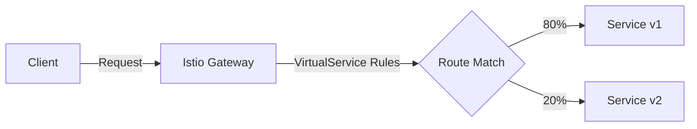

# How to Manage Istio VirtualServices with Flux CD

Author: [nawazdhandala](https://github.com/nawazdhandala)

Tags: flux cd, istio, virtualservice, service mesh, gitops, traffic management, kubernetes

Description: Learn how to manage Istio VirtualService resources with Flux CD for GitOps-driven traffic routing, canary deployments, and advanced traffic management.

---

Istio VirtualServices are the core traffic management resource in the Istio service mesh. They define how requests are routed to services, enabling canary deployments, A/B testing, traffic mirroring, and fault injection. Managing VirtualServices with Flux CD ensures your traffic routing rules are version-controlled and automatically reconciled. This guide covers practical patterns for VirtualService management.

## Prerequisites

Before you begin, ensure you have the following:

- A Kubernetes cluster with Istio installed (see our Istio deployment guide)
- Flux CD installed on your cluster (v2.x)
- kubectl configured to access your cluster
- A sample application deployed in the mesh

## Understanding VirtualServices

A VirtualService defines rules that control how requests for a service are routed within the Istio mesh. They work alongside DestinationRules to provide fine-grained traffic control.



## Step 1: Set Up the Git Repository

Create the Flux CD source for your traffic management configs:

```yaml
# git-source.yaml
# GitRepository source for traffic management configurations
apiVersion: source.toolkit.fluxcd.io/v1
kind: GitRepository
metadata:
  name: traffic-management
  namespace: flux-system
spec:
  interval: 2m
  url: https://github.com/your-org/traffic-management
  ref:
    branch: main
  secretRef:
    name: git-credentials
```

## Step 2: Basic VirtualService for HTTP Routing

Create a simple VirtualService that routes traffic to a service:

```yaml
# basic-virtualservice.yaml
# VirtualService for basic HTTP routing to the frontend service
apiVersion: networking.istio.io/v1
kind: VirtualService
metadata:
  name: frontend
  namespace: my-app
spec:
  # The hosts this VirtualService applies to
  hosts:
    - frontend.example.com
  # Attach to the istio ingress gateway
  gateways:
    - istio-ingress/main-gateway
  http:
    # Route rule for the frontend service
    - match:
        - uri:
            # Match requests with /api prefix
            prefix: /api
      route:
        - destination:
            host: frontend-api
            port:
              number: 80
    # Default route for all other requests
    - route:
        - destination:
            host: frontend-web
            port:
              number: 80
```

## Step 3: Canary Deployment with Weighted Routing

Implement a canary deployment using weighted traffic splitting:

```yaml
# canary-virtualservice.yaml
# VirtualService for canary deployment with 90/10 traffic split
apiVersion: networking.istio.io/v1
kind: VirtualService
metadata:
  name: product-service
  namespace: my-app
  annotations:
    # Track the deployment stage
    fluxcd.io/deployment-stage: canary
spec:
  hosts:
    - product-service
  http:
    - route:
        # Send 90% of traffic to the stable version
        - destination:
            host: product-service
            subset: stable
            port:
              number: 80
          weight: 90
        # Send 10% of traffic to the canary version
        - destination:
            host: product-service
            subset: canary
            port:
              number: 80
          weight: 10
```

To progressively increase canary traffic, update the weights in Git:

```yaml
# canary-virtualservice-50.yaml
# VirtualService updated to 50/50 split for canary promotion
apiVersion: networking.istio.io/v1
kind: VirtualService
metadata:
  name: product-service
  namespace: my-app
  annotations:
    fluxcd.io/deployment-stage: canary-50
spec:
  hosts:
    - product-service
  http:
    - route:
        - destination:
            host: product-service
            subset: stable
            port:
              number: 80
          weight: 50
        - destination:
            host: product-service
            subset: canary
            port:
              number: 80
          weight: 50
```

## Step 4: Header-Based Routing for A/B Testing

Route traffic based on HTTP headers:

```yaml
# ab-testing-virtualservice.yaml
# VirtualService for A/B testing using header-based routing
apiVersion: networking.istio.io/v1
kind: VirtualService
metadata:
  name: checkout-service
  namespace: my-app
spec:
  hosts:
    - checkout-service
  http:
    # Route users with the beta header to the new version
    - match:
        - headers:
            x-user-group:
              exact: beta
      route:
        - destination:
            host: checkout-service
            subset: v2
            port:
              number: 80
      # Add a response header to identify the version served
      headers:
        response:
          add:
            x-served-by: checkout-v2
    # Route users with specific cookie to the new version
    - match:
        - headers:
            cookie:
              regex: ".*beta_user=true.*"
      route:
        - destination:
            host: checkout-service
            subset: v2
            port:
              number: 80
    # Default route to the stable version
    - route:
        - destination:
            host: checkout-service
            subset: v1
            port:
              number: 80
```

## Step 5: Traffic Mirroring

Mirror production traffic to a test version for validation:

```yaml
# mirror-virtualservice.yaml
# VirtualService that mirrors traffic to a shadow deployment
apiVersion: networking.istio.io/v1
kind: VirtualService
metadata:
  name: payment-service
  namespace: my-app
spec:
  hosts:
    - payment-service
  http:
    - route:
        # Route all traffic to the stable version
        - destination:
            host: payment-service
            subset: stable
            port:
              number: 80
      # Mirror a percentage of traffic to the test version
      mirror:
        host: payment-service
        subset: test
        port:
          number: 80
      # Mirror 50% of the traffic (not all)
      mirrorPercentage:
        value: 50.0
```

## Step 6: Fault Injection for Resilience Testing

Inject faults to test application resilience:

```yaml
# fault-injection-virtualservice.yaml
# VirtualService with fault injection for resilience testing
apiVersion: networking.istio.io/v1
kind: VirtualService
metadata:
  name: inventory-service
  namespace: my-app
  annotations:
    # Only apply in staging environments
    fluxcd.io/environment: staging
spec:
  hosts:
    - inventory-service
  http:
    - match:
        # Only inject faults for test traffic
        - headers:
            x-test-fault:
              exact: "true"
      fault:
        # Inject a 3-second delay for 50% of requests
        delay:
          percentage:
            value: 50.0
          fixedDelay: 3s
        # Return 503 errors for 10% of requests
        abort:
          percentage:
            value: 10.0
          httpStatus: 503
      route:
        - destination:
            host: inventory-service
            port:
              number: 80
    # Normal traffic without fault injection
    - route:
        - destination:
            host: inventory-service
            port:
              number: 80
```

## Step 7: Timeout and Retry Configuration

Configure timeouts and retries for service reliability:

```yaml
# timeout-retry-virtualservice.yaml
# VirtualService with timeout and retry policies
apiVersion: networking.istio.io/v1
kind: VirtualService
metadata:
  name: order-service
  namespace: my-app
spec:
  hosts:
    - order-service
  http:
    - route:
        - destination:
            host: order-service
            port:
              number: 80
      # Set a timeout for requests
      timeout: 10s
      # Configure retry behavior
      retries:
        # Maximum number of retry attempts
        attempts: 3
        # Timeout per retry attempt
        perTryTimeout: 3s
        # Retry on these conditions
        retryOn: 5xx,reset,connect-failure,retriable-4xx
```

## Step 8: URL Rewriting and Redirects

Configure URL rewriting and redirect rules:

```yaml
# rewrite-virtualservice.yaml
# VirtualService with URL rewriting and redirects
apiVersion: networking.istio.io/v1
kind: VirtualService
metadata:
  name: api-gateway
  namespace: my-app
spec:
  hosts:
    - api.example.com
  gateways:
    - istio-ingress/main-gateway
  http:
    # Rewrite /v1/users to /users on the backend
    - match:
        - uri:
            prefix: /v1/users
      rewrite:
        uri: /users
      route:
        - destination:
            host: user-service
            port:
              number: 80
    # Redirect old API paths to new ones
    - match:
        - uri:
            prefix: /legacy/api
      redirect:
        uri: /v2/api
        redirectCode: 301
    # Rewrite with authority (host) change
    - match:
        - uri:
            prefix: /external
      rewrite:
        uri: /
        authority: external-api.example.com
      route:
        - destination:
            host: external-api
            port:
              number: 443
```

## Step 9: Create the Flux CD Kustomization

Manage all VirtualServices through a Flux CD Kustomization:

```yaml
# kustomization.yaml
# Flux CD Kustomization for VirtualService management
apiVersion: kustomize.toolkit.fluxcd.io/v1
kind: Kustomization
metadata:
  name: traffic-management
  namespace: flux-system
spec:
  interval: 2m
  sourceRef:
    kind: GitRepository
    name: traffic-management
  path: ./virtualservices/production
  prune: true
  wait: true
  # Short timeout since VirtualServices apply quickly
  timeout: 5m
  # Depend on Istio being installed
  dependsOn:
    - name: istio-system
```

## Step 10: Verify VirtualService Configuration

Validate your VirtualService configurations:

```bash
# List all VirtualServices
kubectl get virtualservices -n my-app

# Describe a specific VirtualService
kubectl describe virtualservice frontend -n my-app

# Use istioctl to analyze configurations
istioctl analyze -n my-app

# Check the proxy configuration for a specific pod
istioctl proxy-config routes deploy/frontend-web -n my-app

# Verify traffic routing
kubectl exec deploy/sleep -n my-app -- \
  curl -s -H "Host: frontend.example.com" http://istio-ingress.istio-ingress/api/health

# Check Flux reconciliation status
flux get kustomizations traffic-management
```

## Best Practices

1. **Use short reconciliation intervals** for traffic management resources (2-5 minutes)
2. **Version your VirtualServices** alongside application deployments
3. **Test canary deployments** with small traffic percentages before scaling up
4. **Use header-based routing** for internal testing before exposing to users
5. **Set appropriate timeouts and retries** based on service SLAs
6. **Avoid overlapping match rules** that can cause unpredictable routing
7. **Use traffic mirroring** to validate new versions with real traffic without risk

## Conclusion

Managing Istio VirtualServices with Flux CD provides a robust, auditable approach to traffic management. By storing routing rules in Git, you get version control over traffic configurations, enabling safe canary deployments, A/B testing, and fault injection. Flux CD's automated reconciliation ensures your desired traffic routing state is always applied, and any manual changes are automatically reverted. This GitOps approach is essential for teams that need reliable and repeatable traffic management in production environments.
