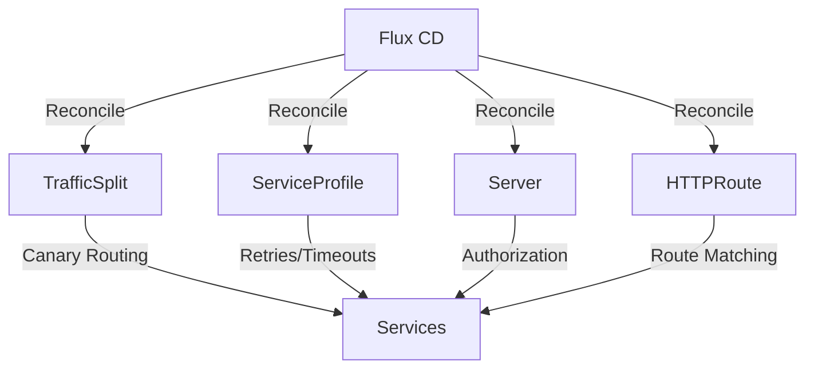

# How to Manage Linkerd Traffic Policies with Flux CD

Author: [nawazdhandala](https://github.com/nawazdhandala)

Tags: Flux CD, Linkerd, Traffic Policy, Service Mesh, GitOps, Traffic Management, Kubernetes

Description: Learn how to manage Linkerd traffic policies with Flux CD for GitOps-driven traffic splitting, retries, timeouts, and authorization policies.

---

Linkerd provides powerful traffic management capabilities through its policy resources, including traffic splitting for canary deployments, retry budgets, timeouts, and server authorization. Managing these policies with Flux CD ensures consistent, version-controlled traffic management across your service mesh. This guide covers practical patterns for Linkerd traffic policy management.

## Prerequisites

Before you begin, ensure you have the following:

- A Kubernetes cluster with Linkerd installed (see our Linkerd deployment guide)
- Flux CD installed on your cluster (v2.x)
- kubectl configured to access your cluster
- Applications deployed in the Linkerd mesh

## Understanding Linkerd Traffic Policies

Linkerd uses several custom resources for traffic management. The key resources include TrafficSplit for canary deployments, ServiceProfile for retries and timeouts, Server and ServerAuthorization for access control, and HTTPRoute for advanced routing.



## Step 1: Set Up the Git Repository Source

Create a Flux CD source for traffic policy configurations:

```yaml
# git-source.yaml
# GitRepository source for Linkerd traffic policies
apiVersion: source.toolkit.fluxcd.io/v1
kind: GitRepository
metadata:
  name: linkerd-policies
  namespace: flux-system
spec:
  interval: 2m
  url: https://github.com/your-org/linkerd-policies
  ref:
    branch: main
  secretRef:
    name: git-credentials
```

## Step 2: Traffic Splitting for Canary Deployments

Use the SMI TrafficSplit resource for canary deployments:

```yaml
# canary-trafficsplit.yaml
# TrafficSplit for canary deployment of the web service
apiVersion: split.smi-spec.io/v1alpha2
kind: TrafficSplit
metadata:
  name: web-app-canary
  namespace: my-app
spec:
  # The root service that receives all traffic
  service: web-app
  backends:
    # Stable version gets 90% of traffic
    - service: web-app-stable
      weight: 900
    # Canary version gets 10% of traffic
    - service: web-app-canary
      weight: 100
```

The corresponding services and deployments:

```yaml
# canary-services.yaml
# Root service (clients connect to this)
apiVersion: v1
kind: Service
metadata:
  name: web-app
  namespace: my-app
spec:
  selector:
    app: web-app
  ports:
    - port: 80
      targetPort: 80
      name: http
---
# Stable version service
apiVersion: v1
kind: Service
metadata:
  name: web-app-stable
  namespace: my-app
spec:
  selector:
    app: web-app
    version: stable
  ports:
    - port: 80
      targetPort: 80
      name: http
---
# Canary version service
apiVersion: v1
kind: Service
metadata:
  name: web-app-canary
  namespace: my-app
spec:
  selector:
    app: web-app
    version: canary
  ports:
    - port: 80
      targetPort: 80
      name: http
```

## Step 3: Progressive Canary Rollout

Define multiple TrafficSplit configurations for progressive rollout stages:

```yaml
# canary-stage-1.yaml (10% canary)
# Initial canary stage - 10% traffic to new version
apiVersion: split.smi-spec.io/v1alpha2
kind: TrafficSplit
metadata:
  name: payment-service-canary
  namespace: my-app
  annotations:
    fluxcd.io/canary-stage: "1"
spec:
  service: payment-service
  backends:
    - service: payment-service-stable
      weight: 900
    - service: payment-service-canary
      weight: 100
---
# canary-stage-2.yaml (50% canary)
# Second canary stage - 50% traffic to new version
apiVersion: split.smi-spec.io/v1alpha2
kind: TrafficSplit
metadata:
  name: payment-service-canary
  namespace: my-app
  annotations:
    fluxcd.io/canary-stage: "2"
spec:
  service: payment-service
  backends:
    - service: payment-service-stable
      weight: 500
    - service: payment-service-canary
      weight: 500
---
# canary-stage-3.yaml (100% canary - promotion)
# Final stage - full promotion to new version
apiVersion: split.smi-spec.io/v1alpha2
kind: TrafficSplit
metadata:
  name: payment-service-canary
  namespace: my-app
  annotations:
    fluxcd.io/canary-stage: "3"
spec:
  service: payment-service
  backends:
    - service: payment-service-stable
      weight: 0
    - service: payment-service-canary
      weight: 1000
```

## Step 4: ServiceProfile for Retries and Timeouts

Create ServiceProfiles to define retry and timeout policies:

```yaml
# service-profile.yaml
# ServiceProfile for the order service with retry and timeout settings
apiVersion: linkerd.io/v1alpha2
kind: ServiceProfile
metadata:
  name: order-service.my-app.svc.cluster.local
  namespace: my-app
spec:
  routes:
    # Route for creating orders
    - name: POST /api/orders
      condition:
        method: POST
        pathRegex: /api/orders
      # Timeout for this specific route
      timeout: 10s
      # This route is retryable (idempotent)
      isRetryable: false
      # Response classes for metrics
      responseClasses:
        - condition:
            status:
              min: 500
              max: 599
          isFailure: true

    # Route for listing orders
    - name: GET /api/orders
      condition:
        method: GET
        pathRegex: /api/orders
      timeout: 5s
      # GET requests are safe to retry
      isRetryable: true

    # Route for getting a specific order
    - name: GET /api/orders/{id}
      condition:
        method: GET
        pathRegex: /api/orders/[^/]+
      timeout: 3s
      isRetryable: true

    # Health check route with short timeout
    - name: GET /health
      condition:
        method: GET
        pathRegex: /health
      timeout: 1s
      isRetryable: true

  # Retry budget for the service
  retryBudget:
    # Maximum percentage of requests that can be retries
    retryRatio: 0.2
    # Minimum retries per second (even if ratio is exceeded)
    minRetriesPerSecond: 10
    # Time window for the retry budget
    ttl: 10s
```

## Step 5: Server Authorization Policies

Configure authorization policies to control which services can communicate:

```yaml
# server.yaml
# Server resource defines a port and protocol for policy attachment
apiVersion: policy.linkerd.io/v1beta3
kind: Server
metadata:
  name: order-service-http
  namespace: my-app
spec:
  # Select pods this server applies to
  podSelector:
    matchLabels:
      app: order-service
  # Port configuration
  port: 8080
  proxyProtocol: HTTP/2
---
# server-authorization.yaml
# ServerAuthorization defines who can access the server
apiVersion: policy.linkerd.io/v1beta1
kind: ServerAuthorization
metadata:
  name: order-service-authz
  namespace: my-app
spec:
  # Reference to the Server resource
  server:
    name: order-service-http
  # Client authorization rules
  client:
    # Allow traffic from meshed clients in specific namespaces
    meshTLS:
      serviceAccounts:
        # Allow the frontend service account
        - name: frontend
          namespace: my-app
        # Allow the API gateway service account
        - name: api-gateway
          namespace: my-app
```

## Step 6: Network Authentication Policies

Define authentication requirements for services:

```yaml
# meshtls-authentication.yaml
# MeshTLSAuthentication requires mTLS for the service
apiVersion: policy.linkerd.io/v1alpha1
kind: MeshTLSAuthentication
metadata:
  name: order-service-mtls
  namespace: my-app
spec:
  # Require mesh TLS from specific identities
  identities:
    - "frontend.my-app.serviceaccount.identity.linkerd.cluster.local"
    - "api-gateway.my-app.serviceaccount.identity.linkerd.cluster.local"
  identityRefs:
    - kind: ServiceAccount
      name: frontend
      namespace: my-app
---
# authorization-policy.yaml
# AuthorizationPolicy ties authentication to a server
apiVersion: policy.linkerd.io/v1alpha1
kind: AuthorizationPolicy
metadata:
  name: order-service-policy
  namespace: my-app
spec:
  # Target the server resource
  targetRef:
    group: policy.linkerd.io
    kind: Server
    name: order-service-http
  # Required authentication
  requiredAuthenticationRefs:
    - name: order-service-mtls
      kind: MeshTLSAuthentication
      group: policy.linkerd.io
```

## Step 7: HTTPRoute for Advanced Routing

Use Linkerd's HTTPRoute for path-based routing policies:

```yaml
# httproute.yaml
# HTTPRoute for fine-grained routing within the mesh
apiVersion: policy.linkerd.io/v1beta3
kind: HTTPRoute
metadata:
  name: order-service-routes
  namespace: my-app
spec:
  # Attach to the parent server
  parentRefs:
    - name: order-service-http
      kind: Server
      group: policy.linkerd.io
  rules:
    # Route for read operations
    - matches:
        - path:
            type: PathPrefix
            value: /api/orders
          method: GET
      filters: []
    # Route for write operations
    - matches:
        - path:
            type: PathPrefix
            value: /api/orders
          method: POST
      filters: []
    # Route for health checks
    - matches:
        - path:
            type: Exact
            value: /health
          method: GET
      filters: []
```

## Step 8: Rate Limiting with HTTPRoute

Configure rate limiting policies:

```yaml
# rate-limit-httproute.yaml
# HTTPRoute with per-route authorization for rate limiting
apiVersion: policy.linkerd.io/v1beta3
kind: HTTPRoute
metadata:
  name: api-rate-limited
  namespace: my-app
spec:
  parentRefs:
    - name: api-service-http
      kind: Server
      group: policy.linkerd.io
  rules:
    # Public API endpoint with rate limiting
    - matches:
        - path:
            type: PathPrefix
            value: /api/public
      filters: []
---
# Authorization specific to rate-limited routes
apiVersion: policy.linkerd.io/v1alpha1
kind: AuthorizationPolicy
metadata:
  name: api-public-authz
  namespace: my-app
spec:
  targetRef:
    group: policy.linkerd.io
    kind: HTTPRoute
    name: api-rate-limited
  requiredAuthenticationRefs:
    - name: api-mtls-auth
      kind: MeshTLSAuthentication
      group: policy.linkerd.io
```

## Step 9: Opaque Protocol Configuration

Configure opaque ports for non-HTTP protocols:

```yaml
# opaque-ports-config.yaml
# ConfigMap for default opaque ports across the namespace
apiVersion: v1
kind: ConfigMap
metadata:
  name: linkerd-config
  namespace: my-app
  annotations:
    # Default opaque ports for the namespace
    config.linkerd.io/opaque-ports: "3306,5432,6379,27017"
---
# Deployment with per-pod opaque port configuration
apiVersion: apps/v1
kind: Deployment
metadata:
  name: redis-client
  namespace: my-app
spec:
  replicas: 2
  selector:
    matchLabels:
      app: redis-client
  template:
    metadata:
      labels:
        app: redis-client
      annotations:
        # Mark Redis port as opaque for this pod
        config.linkerd.io/opaque-ports: "6379"
        # Skip outbound ports that should not be proxied
        config.linkerd.io/skip-outbound-ports: "25"
    spec:
      containers:
        - name: redis-client
          image: redis:7
          ports:
            - containerPort: 6379
```

## Step 10: Create the Flux CD Kustomization

Manage all Linkerd traffic policies through Flux CD:

```yaml
# kustomization.yaml
# Flux CD Kustomization for Linkerd traffic policies
apiVersion: kustomize.toolkit.fluxcd.io/v1
kind: Kustomization
metadata:
  name: linkerd-policies
  namespace: flux-system
spec:
  interval: 2m
  sourceRef:
    kind: GitRepository
    name: linkerd-policies
  path: ./policies/production
  prune: true
  wait: true
  timeout: 5m
  dependsOn:
    # Ensure Linkerd is installed first
    - name: linkerd
  healthChecks:
    - apiVersion: split.smi-spec.io/v1alpha2
      kind: TrafficSplit
      name: web-app-canary
      namespace: my-app
```

## Verify Traffic Policies

Check that policies are applied correctly:

```bash
# List TrafficSplits
kubectl get trafficsplits -n my-app

# Check ServiceProfiles
kubectl get serviceprofiles -n my-app

# List Servers and ServerAuthorizations
kubectl get servers -n my-app
kubectl get serverauthorizations -n my-app

# Check AuthorizationPolicies
kubectl get authorizationpolicies -n my-app

# View traffic stats for a service
linkerd viz stat deploy -n my-app

# Check route-level statistics
linkerd viz routes deploy/order-service -n my-app

# View traffic split status
linkerd viz stat ts/web-app-canary -n my-app

# Check for policy conflicts
linkerd viz authz deploy/order-service -n my-app

# Verify Flux reconciliation
flux get kustomizations linkerd-policies
```

## Setting Up Notifications

Configure Flux CD alerts for traffic policy changes:

```yaml
# policy-alerts.yaml
# Alert for Linkerd traffic policy changes
apiVersion: notification.toolkit.fluxcd.io/v1beta3
kind: Alert
metadata:
  name: linkerd-policy-alerts
  namespace: flux-system
spec:
  providerRef:
    name: slack-provider
  eventSources:
    - kind: Kustomization
      name: linkerd-policies
      namespace: flux-system
  eventSeverity: info
```

## Best Practices

1. **Use short reconciliation intervals** for traffic policies (2-3 minutes)
2. **Start canary deployments with small traffic percentages** (5-10%)
3. **Define retry budgets** to prevent retry storms
4. **Use ServiceProfiles** to set per-route timeouts based on expected latency
5. **Implement least-privilege authorization** with Server and ServerAuthorization
6. **Configure opaque ports** for non-HTTP protocols to ensure proper proxying
7. **Monitor traffic splits** using linkerd viz to verify traffic distribution

## Conclusion

Managing Linkerd traffic policies with Flux CD provides a robust GitOps workflow for traffic management, authorization, and resilience configuration. By storing policies in Git, you get version control and audit trails for all traffic management changes. Flux CD's automated reconciliation ensures policies are consistently applied and any manual changes are reverted. The combination of TrafficSplit for canary deployments, ServiceProfile for retries and timeouts, and Server/AuthorizationPolicy for access control gives you comprehensive traffic management capabilities with Linkerd's lightweight service mesh.
