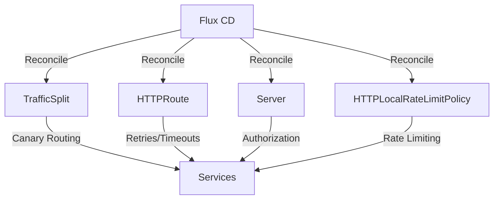

# How to Manage Linkerd Traffic Policies with Flux CD

Author: [nawazdhandala](https://github.com/nawazdhandala)

Tags: Flux CD, Linkerd, Traffic Policy, Service Mesh, GitOps, Traffic Management, Kubernetes

Description: Learn how to manage Linkerd traffic policies with Flux CD for GitOps-driven traffic splitting, retries, timeouts, and authorization policies.

---

Linkerd provides powerful traffic management capabilities through its policy resources, including traffic splitting for canary deployments, retries, timeouts, rate limiting, and server authorization. Managing these policies with Flux CD ensures consistent, version-controlled traffic management across your service mesh. This guide covers practical patterns for Linkerd traffic policy management.

## Prerequisites

Before you begin, ensure you have the following:

- A Kubernetes cluster with Linkerd installed (see our Linkerd deployment guide)
- The Linkerd SMI extension installed if you plan to use TrafficSplit
- Flux CD installed on your cluster (v2.x)
- kubectl configured to access your cluster
- Applications deployed in the Linkerd mesh

## Understanding Linkerd Traffic Policies

Linkerd uses several custom resources for traffic management. The key resources include TrafficSplit for canary deployments, HTTPRoute and annotations for retries and timeouts, Server and AuthorizationPolicy for access control, and HTTPLocalRateLimitPolicy for rate limiting.


```mermaid
graph TD
    A[Flux CD] -->|Reconcile| B[TrafficSplit]
    A -->|Reconcile| C[HTTPRoute]
    A -->|Reconcile| D[Server]
    A -->|Reconcile| E[HTTPLocalRateLimitPolicy]
    B -->|Canary Routing| F[Services]
    C -->|Retries/Timeouts| F
    D -->|Authorization| F
    E -->|Rate Limiting| F
```

## Step 1: Set Up the Git Repository Source

Create a Flux CD source for traffic policy configurations:

```yaml
# git-source.yaml

# GitRepository source for Linkerd traffic policies
apiVersion: source.toolkit.fluxcd.io/v1
kind: GitRepository
metadata:
  name: linkerd-policies
  namespace: flux-system
spec:
  interval: 2m
  url: https://github.com/your-org/linkerd-policies
  ref:
    branch: main
  secretRef:
    name: git-credentials
```

## Step 2: Traffic Splitting for Canary Deployments

Use the SMI TrafficSplit resource for canary deployments:

```yaml
# canary-trafficsplit.yaml
# TrafficSplit for canary deployment of the web service
apiVersion: split.smi-spec.io/v1alpha2
kind: TrafficSplit
metadata:
  name: web-app-canary
  namespace: my-app
spec:
  # The root service that receives all traffic
  service: web-app
  backends:
    # Stable version gets 90% of traffic
    - service: web-app-stable
      weight: 900
    # Canary version gets 10% of traffic
    - service: web-app-canary
      weight: 100
```

The corresponding services and deployments:

```yaml
# canary-services.yaml
# Root service (clients connect to this)
apiVersion: v1
kind: Service
metadata:
  name: web-app
  namespace: my-app
spec:
  selector:
    app: web-app
  ports:
    - port: 80
      targetPort: 80
      name: http
---
# Stable version service
apiVersion: v1
kind: Service
metadata:
  name: web-app-stable
  namespace: my-app
spec:
  selector:
    app: web-app
    version: stable
  ports:
    - port: 80
      targetPort: 80
      name: http
---
# Canary version service
apiVersion: v1
kind: Service
metadata:
  name: web-app-canary
  namespace: my-app
spec:
  selector:
    app: web-app
    version: canary
  ports:
    - port: 80
      targetPort: 80
      name: http
```

## Step 3: Progressive Canary Rollout

Define TrafficSplit configurations for progressive rollout stages. Only apply one stage for a service at a time, then update the weights in Git as the rollout advances:

```yaml
# canary-stage-1.yaml (10% canary)
# Initial canary stage - 10% traffic to new version
apiVersion: split.smi-spec.io/v1alpha2
kind: TrafficSplit
metadata:
  name: payment-service-canary
  namespace: my-app
  annotations:
    fluxcd.io/canary-stage: "1"
spec:
  service: payment-service
  backends:
    - service: payment-service-stable
      weight: 900
    - service: payment-service-canary
      weight: 100
---
# canary-stage-2.yaml (50% canary)
# Second canary stage - 50% traffic to new version
apiVersion: split.smi-spec.io/v1alpha2
kind: TrafficSplit
metadata:
  name: payment-service-canary
  namespace: my-app
  annotations:
    fluxcd.io/canary-stage: "2"
spec:
  service: payment-service
  backends:
    - service: payment-service-stable
      weight: 500
    - service: payment-service-canary
      weight: 500
---
# canary-stage-3.yaml (100% canary - promotion)
# Final stage - full promotion to new version
apiVersion: split.smi-spec.io/v1alpha2
kind: TrafficSplit
metadata:
  name: payment-service-canary
  namespace: my-app
  annotations:
    fluxcd.io/canary-stage: "3"
spec:
  service: payment-service
  backends:
    - service: payment-service-stable
      weight: 0
    - service: payment-service-canary
      weight: 1000
```

## Step 4: HTTPRoute for Retries and Timeouts

Create HTTPRoutes with Linkerd annotations to define retry and timeout policies for idempotent routes:

```yaml
# order-service-reliability.yaml
# HTTPRoute for the order service with retry and timeout settings
apiVersion: gateway.networking.k8s.io/v1
kind: HTTPRoute
metadata:
  name: order-service-read-reliability
  namespace: my-app
  annotations:
    # Retry HTTP 5xx responses up to two times
    retry.linkerd.io/http: 5xx
    retry.linkerd.io/limit: "2"
    retry.linkerd.io/timeout: 300ms
    # Overall request timeout for matching read routes
    timeout.linkerd.io/request: 5s
spec:
  parentRefs:
    - name: order-service
      kind: Service
      group: core
      port: 80
  rules:
    # Route for listing orders
    - matches:
        - method: GET
          path:
            type: Exact
            value: /api/orders

    # Route for getting a specific order
    - matches:
        - method: GET
          path:
            type: PathPrefix
            value: /api/orders/

    # Health check route with short timeout
    - matches:
        - method: GET
          path:
            type: Exact
            value: /health
```

## Step 5: Server Authorization Policies

Configure authorization policies to control which services can communicate:

```yaml
# server.yaml
# Server resource defines a port and protocol for policy attachment
apiVersion: policy.linkerd.io/v1beta3
kind: Server
metadata:
  name: order-service-http
  namespace: my-app
spec:
  # Select pods this server applies to
  podSelector:
    matchLabels:
      app: order-service
  # Port configuration
  port: 8080
  proxyProtocol: HTTP/2
---
# meshtls-authentication.yaml
# MeshTLSAuthentication defines which service accounts can authenticate
apiVersion: policy.linkerd.io/v1alpha1
kind: MeshTLSAuthentication
metadata:
  name: order-service-clients
  namespace: my-app
spec:
  identityRefs:
    # Allow the frontend service account
    - kind: ServiceAccount
      name: frontend
    # Allow the API gateway service account
    - kind: ServiceAccount
      name: api-gateway
---
# authorization-policy.yaml
# AuthorizationPolicy defines who can access the server
apiVersion: policy.linkerd.io/v1alpha1
kind: AuthorizationPolicy
metadata:
  name: order-service-authz
  namespace: my-app
spec:
  # Reference to the Server resource
  targetRef:
    group: policy.linkerd.io
    kind: Server
    name: order-service-http
  # Client authorization rules
  requiredAuthenticationRefs:
    - name: order-service-clients
      kind: MeshTLSAuthentication
      group: policy.linkerd.io
```

## Step 6: Network Authentication Policies

Define authentication requirements for services:

```yaml
# meshtls-authentication.yaml
# MeshTLSAuthentication requires mTLS for the service
apiVersion: policy.linkerd.io/v1alpha1
kind: MeshTLSAuthentication
metadata:
  name: order-service-mtls
  namespace: my-app
spec:
  # Require mesh TLS from specific identities
  identities:
    - "frontend.my-app.serviceaccount.identity.linkerd.cluster.local"
    - "api-gateway.my-app.serviceaccount.identity.linkerd.cluster.local"
---
# authorization-policy.yaml
# AuthorizationPolicy ties authentication to a server
apiVersion: policy.linkerd.io/v1alpha1
kind: AuthorizationPolicy
metadata:
  name: order-service-policy
  namespace: my-app
spec:
  # Target the server resource
  targetRef:
    group: policy.linkerd.io
    kind: Server
    name: order-service-http
  # Required authentication
  requiredAuthenticationRefs:
    - name: order-service-mtls
      kind: MeshTLSAuthentication
      group: policy.linkerd.io
```

## Step 7: HTTPRoute for Per-Route Policy

Use Linkerd's HTTPRoute for path-based policy matching:

```yaml
# httproute.yaml
# HTTPRoute for fine-grained policy within the mesh
apiVersion: gateway.networking.k8s.io/v1
kind: HTTPRoute
metadata:
  name: order-service-routes
  namespace: my-app
spec:
  # Attach to the parent server
  parentRefs:
    - name: order-service-http
      kind: Server
      group: policy.linkerd.io
  rules:
    # Route for read operations
    - matches:
        - path:
            type: PathPrefix
            value: /api/orders
          method: GET
      filters: []
    # Route for write operations
    - matches:
        - path:
            type: PathPrefix
            value: /api/orders
          method: POST
      filters: []
    # Route for health checks
    - matches:
        - path:
            type: Exact
            value: /health
          method: GET
      filters: []
```

## Step 8: Rate Limiting with HTTPLocalRateLimitPolicy

Configure rate limiting policies:

```yaml
# rate-limit-policy.yaml
# Server for the API service
apiVersion: policy.linkerd.io/v1beta3
kind: Server
metadata:
  name: api-rate-limited
  namespace: my-app
spec:
  accessPolicy: all-unauthenticated
  podSelector:
    matchLabels:
      app: api-service
  port: 8080
  proxyProtocol: HTTP/1
---
# Local HTTP rate limiting policy for the server
apiVersion: policy.linkerd.io/v1alpha1
kind: HTTPLocalRateLimitPolicy
metadata:
  name: api-rate-limited
  namespace: my-app
spec:
  targetRef:
    group: policy.linkerd.io
    kind: Server
    name: api-rate-limited
  total:
    requestsPerSecond: 100
  identity:
    requestsPerSecond: 10
```

## Step 9: Opaque Protocol Configuration

Configure opaque ports for non-HTTP protocols:

```yaml
# opaque-ports-config.yaml
# Namespace annotation for default opaque ports across the namespace
apiVersion: v1
kind: Namespace
metadata:
  name: my-app
  annotations:
    # Default opaque ports for the namespace
    config.linkerd.io/opaque-ports: "3306,5432,6379,27017"
---
# Deployment with per-pod opaque port configuration
apiVersion: apps/v1
kind: Deployment
metadata:
  name: redis-client
  namespace: my-app
spec:
  replicas: 2
  selector:
    matchLabels:
      app: redis-client
  template:
    metadata:
      labels:
        app: redis-client
      annotations:
        # Mark Redis port as opaque for this pod
        config.linkerd.io/opaque-ports: "6379"
        # Skip outbound ports that should not be proxied
        config.linkerd.io/skip-outbound-ports: "25"
    spec:
      containers:
        - name: redis-client
          image: redis:7
          ports:
            - containerPort: 6379
```

## Step 10: Create the Flux CD Kustomization

Manage all Linkerd traffic policies through Flux CD:

```yaml
# kustomization.yaml
# Flux CD Kustomization for Linkerd traffic policies
apiVersion: kustomize.toolkit.fluxcd.io/v1
kind: Kustomization
metadata:
  name: linkerd-policies
  namespace: flux-system
spec:
  interval: 2m
  sourceRef:
    kind: GitRepository
    name: linkerd-policies
  path: ./policies/production
  prune: true
  timeout: 5m
  dependsOn:
    # Ensure Linkerd is installed first
    - name: linkerd
```

## Verify Traffic Policies

Check that policies are applied correctly:

```bash
# List TrafficSplits
kubectl get trafficsplits -n my-app

# Check HTTPRoutes
kubectl get httproutes -n my-app

# List Servers
kubectl get servers -n my-app

# Check AuthorizationPolicies and rate limit policies
kubectl get authorizationpolicies -n my-app
kubectl get httplocalratelimitpolicies -n my-app

# View traffic stats for a service
linkerd viz stat deploy -n my-app

# Check HTTPRoute statistics
linkerd viz stat httproute/order-service-read-reliability -n my-app

# View traffic split status
linkerd viz stat ts/web-app-canary -n my-app

# Check for policy conflicts
linkerd viz authz deploy/order-service -n my-app

# Verify Flux reconciliation
flux get kustomizations linkerd-policies
```

## Setting Up Notifications

Configure Flux CD alerts for traffic policy changes:

```yaml
# policy-alerts.yaml
# Alert for Linkerd traffic policy changes
apiVersion: notification.toolkit.fluxcd.io/v1
kind: Alert
metadata:
  name: linkerd-policy-alerts
  namespace: flux-system
spec:
  providerRef:
    name: slack-provider
  eventSources:
    - kind: Kustomization
      name: linkerd-policies
      namespace: flux-system
  eventSeverity: info
```

## Best Practices

1. **Use short reconciliation intervals** for traffic policies (2-3 minutes)
2. **Start canary deployments with small traffic percentages** (5-10%)
3. **Configure retry limits and retry timeouts** to prevent retry storms
4. **Use HTTPRoutes or Service annotations** to set timeouts based on expected latency
5. **Implement least-privilege authorization** with Server and AuthorizationPolicy
6. **Configure opaque ports** for non-HTTP protocols to ensure proper proxying
7. **Monitor traffic splits** using linkerd viz to verify traffic distribution

## Conclusion

Managing Linkerd traffic policies with Flux CD provides a robust GitOps workflow for traffic management, authorization, and resilience configuration. By storing policies in Git, you get version control and audit trails for all traffic management changes. Flux CD's automated reconciliation ensures policies are consistently applied and any manual changes are reverted. The combination of TrafficSplit for canary deployments, HTTPRoute and annotations for retries and timeouts, and Server/AuthorizationPolicy for access control gives you comprehensive traffic management capabilities with Linkerd's lightweight service mesh.
