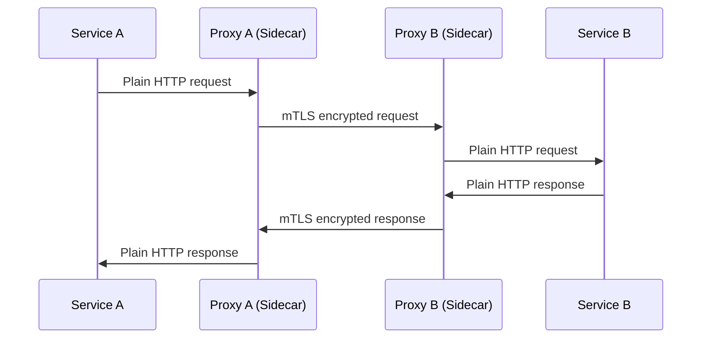

# How to Manage mTLS Configuration with Flux CD

Author: [nawazdhandala](https://github.com/nawazdhandala)

Tags: Flux CD, MTLS, TLS, Service Mesh, GitOps, Kubernetes, Security, Certificates

Description: A comprehensive guide to managing mutual TLS configuration across service meshes using Flux CD for automated certificate lifecycle management.

---

## Introduction

Mutual TLS (mTLS) is a critical security feature in service mesh architectures that ensures both the client and server authenticate each other during communication. Managing mTLS configuration across multiple services and environments can be complex. Flux CD simplifies this by allowing you to define all mTLS settings as code in Git and automatically reconcile them to your clusters.

This guide covers mTLS configuration patterns for Istio, Linkerd, and cert-manager, all managed through Flux CD.

## Prerequisites

Before you begin, ensure you have:

- A Kubernetes cluster with a service mesh installed (Istio, Linkerd, or similar)
- Flux CD bootstrapped and connected to a Git repository
- cert-manager installed (optional, for external certificate management)
- kubectl access to your cluster

## Understanding mTLS in Service Meshes

Service meshes implement mTLS by automatically injecting sidecar proxies that handle TLS handshakes between services. The flow works as follows:



## Deploying cert-manager with Flux CD

Start by deploying cert-manager to manage TLS certificates.

```yaml
# infrastructure/cert-manager/helmrepository.yaml
apiVersion: source.toolkit.fluxcd.io/v1
kind: HelmRepository
metadata:
  name: jetstack
  namespace: flux-system
spec:
  interval: 1h
  url: https://charts.jetstack.io
```

```yaml
# infrastructure/cert-manager/helmrelease.yaml
apiVersion: helm.toolkit.fluxcd.io/v2
kind: HelmRelease
metadata:
  name: cert-manager
  namespace: cert-manager
spec:
  interval: 30m
  chart:
    spec:
      chart: cert-manager
      version: "1.16.x"
      sourceRef:
        kind: HelmRepository
        name: jetstack
        namespace: flux-system
      interval: 12h
  install:
    crds: CreateReplace
    remediation:
      retries: 3
  upgrade:
    crds: CreateReplace
  values:
    # Install CRDs as part of the Helm release
    installCRDs: true
    # Enable Prometheus metrics
    prometheus:
      enabled: true
    # Configure resource limits
    resources:
      requests:
        memory: "128Mi"
        cpu: "100m"
      limits:
        memory: "256Mi"
        cpu: "200m"
```

## Configuring a Certificate Authority

Set up a self-signed CA for issuing mTLS certificates within the mesh.

```yaml
# infrastructure/cert-manager/ca-issuer.yaml
apiVersion: cert-manager.io/v1
kind: ClusterIssuer
metadata:
  name: selfsigned-issuer
spec:
  selfSigned: {}
---
# Create a root CA certificate
apiVersion: cert-manager.io/v1
kind: Certificate
metadata:
  name: mesh-root-ca
  namespace: cert-manager
spec:
  isCA: true
  commonName: mesh-root-ca
  # Certificate validity period
  duration: 87600h # 10 years
  renewBefore: 720h # Renew 30 days before expiry
  secretName: mesh-root-ca-secret
  privateKey:
    algorithm: ECDSA
    size: 256
  issuerRef:
    name: selfsigned-issuer
    kind: ClusterIssuer
---
# Create a CA issuer using the root certificate
apiVersion: cert-manager.io/v1
kind: ClusterIssuer
metadata:
  name: mesh-ca-issuer
spec:
  ca:
    secretName: mesh-root-ca-secret
```

## Configuring mTLS with Istio and Flux CD

If you are using Istio, configure mesh-wide mTLS using PeerAuthentication.

```yaml
# infrastructure/istio/peer-authentication.yaml
apiVersion: security.istio.io/v1
kind: PeerAuthentication
metadata:
  name: default
  # Apply to the entire mesh when in the istio-system namespace
  namespace: istio-system
spec:
  mtls:
    # STRICT mode enforces mTLS for all services
    mode: STRICT
```

Configure namespace-level mTLS overrides for specific namespaces.

```yaml
# apps/legacy-app/peer-authentication.yaml
apiVersion: security.istio.io/v1
kind: PeerAuthentication
metadata:
  name: legacy-app-mtls
  namespace: legacy-app
spec:
  mtls:
    # PERMISSIVE mode allows both plain text and mTLS
    # Use this during migration to mTLS
    mode: PERMISSIVE
```

Configure port-level mTLS exceptions.

```yaml
# apps/mixed-protocol/peer-authentication.yaml
apiVersion: security.istio.io/v1
kind: PeerAuthentication
metadata:
  name: mixed-protocol-mtls
  namespace: mixed-protocol
spec:
  selector:
    matchLabels:
      app: mixed-service
  mtls:
    mode: STRICT
  portLevelMtls:
    # Disable mTLS on the metrics port for Prometheus scraping
    9090:
      mode: DISABLE
    # Keep mTLS strict on the application port
    8080:
      mode: STRICT
```

## Configuring Istio DestinationRule for mTLS

Define how clients connect to services with mTLS.

```yaml
# infrastructure/istio/destination-rule.yaml
apiVersion: networking.istio.io/v1
kind: DestinationRule
metadata:
  name: default-mtls
  namespace: istio-system
spec:
  # Apply to all services in the mesh
  host: "*.local"
  trafficPolicy:
    tls:
      # Use Istio's mutual TLS mode
      mode: ISTIO_MUTUAL
    connectionPool:
      tcp:
        # Maximum number of connections to a destination
        maxConnections: 100
      http:
        # Maximum number of pending HTTP requests
        h2UpgradePolicy: DEFAULT
        maxPendingRequests: 100
```

## Configuring mTLS with Linkerd and Flux CD

Linkerd enables mTLS by default. Manage the trust anchor certificate with Flux.

```yaml
# infrastructure/linkerd/trust-anchor.yaml
apiVersion: cert-manager.io/v1
kind: Certificate
metadata:
  name: linkerd-trust-anchor
  namespace: linkerd
spec:
  isCA: true
  commonName: root.linkerd.cluster.local
  # Trust anchor validity
  duration: 87600h # 10 years
  renewBefore: 8760h # Renew 1 year before expiry
  secretName: linkerd-trust-anchor
  privateKey:
    algorithm: ECDSA
    size: 256
  issuerRef:
    name: selfsigned-issuer
    kind: ClusterIssuer
  usages:
    - cert sign
    - crl sign
    - server auth
    - client auth
```

```yaml
# infrastructure/linkerd/identity-issuer.yaml
apiVersion: cert-manager.io/v1
kind: Certificate
metadata:
  name: linkerd-identity-issuer
  namespace: linkerd
spec:
  isCA: true
  commonName: identity.linkerd.cluster.local
  # Issuer certificate validity (shorter than trust anchor)
  duration: 48h
  renewBefore: 25h
  secretName: linkerd-identity-issuer
  privateKey:
    algorithm: ECDSA
    size: 256
  issuerRef:
    name: linkerd-trust-anchor-issuer
    kind: Issuer
  usages:
    - cert sign
    - crl sign
    - server auth
    - client auth
```

## Issuing Service-Specific Certificates

Create certificates for individual services that need custom TLS settings.

```yaml
# apps/payment-service/certificate.yaml
apiVersion: cert-manager.io/v1
kind: Certificate
metadata:
  name: payment-service-cert
  namespace: payment
spec:
  # Short-lived certificates for security
  duration: 24h
  renewBefore: 8h
  secretName: payment-service-tls
  commonName: payment-service.payment.svc.cluster.local
  dnsNames:
    - payment-service
    - payment-service.payment
    - payment-service.payment.svc
    - payment-service.payment.svc.cluster.local
  privateKey:
    algorithm: ECDSA
    size: 256
    rotationPolicy: Always
  issuerRef:
    name: mesh-ca-issuer
    kind: ClusterIssuer
  usages:
    - server auth
    - client auth
```

## Creating a Flux Kustomization for mTLS Resources

Organize mTLS resources with proper dependencies.

```yaml
# clusters/my-cluster/infrastructure/mtls.yaml
apiVersion: kustomize.toolkit.fluxcd.io/v1
kind: Kustomization
metadata:
  name: mtls-config
  namespace: flux-system
spec:
  interval: 10m
  sourceRef:
    kind: GitRepository
    name: flux-system
  path: ./infrastructure/mtls
  prune: true
  wait: true
  timeout: 5m
  # Ensure cert-manager is deployed first
  dependsOn:
    - name: cert-manager
    - name: istio
  # Use variable substitution for environment-specific values
  postBuild:
    substitute:
      CLUSTER_DOMAIN: "cluster.local"
      CERT_DURATION: "24h"
      CERT_RENEW_BEFORE: "8h"
```

## Monitoring Certificate Expiry

Set up alerts for certificate expiration using Flux notifications.

```yaml
# infrastructure/mtls/certificate-alert.yaml
apiVersion: notification.toolkit.fluxcd.io/v1
kind: Alert
metadata:
  name: cert-expiry-alert
  namespace: flux-system
spec:
  providerRef:
    name: slack-provider
  eventSeverity: warning
  eventSources:
    # Monitor cert-manager Certificate resources
    - kind: HelmRelease
      name: cert-manager
      namespace: cert-manager
    # Monitor Kustomization for mTLS configs
    - kind: Kustomization
      name: mtls-config
```

```yaml
# infrastructure/mtls/slack-provider.yaml
apiVersion: notification.toolkit.fluxcd.io/v1
kind: Provider
metadata:
  name: slack-provider
  namespace: flux-system
spec:
  type: slack
  channel: platform-alerts
  secretRef:
    name: slack-webhook-url
```

## Validating mTLS Configuration

After deployment, verify mTLS is working correctly.

```bash
# Check cert-manager certificates status
kubectl get certificates --all-namespaces

# Verify certificate details
kubectl describe certificate payment-service-cert -n payment

# Check Istio mTLS configuration
kubectl get peerauthentication --all-namespaces

# Verify mTLS is active between services (Istio)
istioctl authn tls-check <pod-name> <service-name>

# Check Linkerd mTLS status
linkerd check --proxy

# Verify Flux reconciliation
flux get kustomizations mtls-config

# Check certificate secrets
kubectl get secrets -n payment -l cert-manager.io/certificate-name=payment-service-cert
```

## Rotating Certificates

cert-manager handles automatic rotation, but you can force rotation.

```bash
# Force certificate renewal by deleting the secret
kubectl delete secret payment-service-tls -n payment

# cert-manager will automatically re-issue the certificate
# Watch for the new certificate
kubectl get certificate payment-service-cert -n payment -w

# Verify the new certificate
kubectl get secret payment-service-tls -n payment -o jsonpath='{.data.tls\.crt}' | base64 -d | openssl x509 -noout -dates
```

## Summary

Managing mTLS configuration with Flux CD provides a secure and automated approach to certificate lifecycle management in Kubernetes. By combining cert-manager for certificate issuance, service mesh PeerAuthentication for enforcement, and Flux CD for GitOps reconciliation, you establish a robust mTLS infrastructure. Key practices include using short-lived certificates, automating rotation, setting up expiry alerts, and enforcing STRICT mTLS mode across the mesh.
