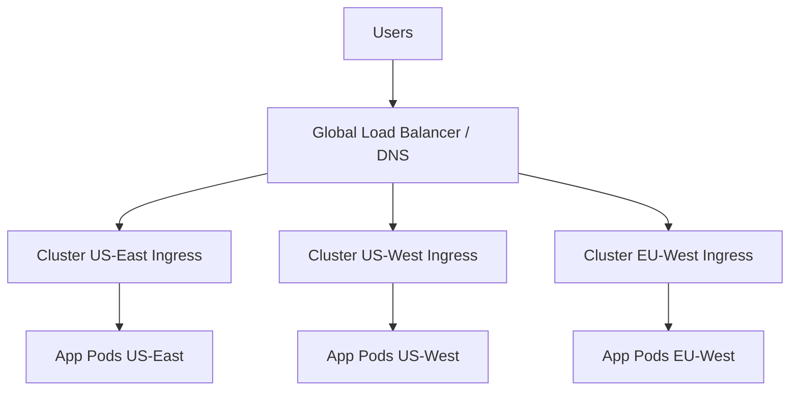

# How to Manage Multi-Cluster Ingress with Flux CD

Author: [nawazdhandala](https://github.com/nawazdhandala)

Tags: flux cd, ingress, multi-cluster, kubernetes, gitops, load balancing

Description: Learn how to configure and manage ingress across multiple Kubernetes clusters using Flux CD for consistent traffic routing.

---

## Introduction

When running applications across multiple Kubernetes clusters, you need a strategy for routing external traffic to the right cluster. Multi-cluster ingress goes beyond single-cluster ingress by distributing traffic across clusters based on geography, health, or load. This guide covers how to use Flux CD to manage multi-cluster ingress configurations using global load balancers and Kubernetes Gateway API.

## Prerequisites

- Two or more Kubernetes clusters in different regions
- Flux CD installed on each cluster or a management cluster
- A DNS provider that supports health-checked records (Route53, Cloud DNS, or Cloudflare)
- A Git repository for your configurations
- kubectl and Flux CLI installed

## Architecture Overview



## Step 1: Deploy Ingress Controller on Each Cluster

Use Flux to deploy an ingress controller consistently across all clusters.

```yaml
# infrastructure/ingress-nginx/namespace.yaml
apiVersion: v1
kind: Namespace
metadata:
  name: ingress-nginx
---
# infrastructure/ingress-nginx/helm-repo.yaml
apiVersion: source.toolkit.fluxcd.io/v1
kind: HelmRepository
metadata:
  name: ingress-nginx
  namespace: ingress-nginx
spec:
  interval: 1h
  url: https://kubernetes.github.io/ingress-nginx
```

```yaml
# infrastructure/ingress-nginx/base-values.yaml
# Base HelmRelease for ingress-nginx shared across clusters
apiVersion: helm.toolkit.fluxcd.io/v2
kind: HelmRelease
metadata:
  name: ingress-nginx
  namespace: ingress-nginx
spec:
  interval: 30m
  chart:
    spec:
      chart: ingress-nginx
      version: "4.9.x"
      sourceRef:
        kind: HelmRepository
        name: ingress-nginx
  values:
    controller:
      # Enable metrics for monitoring
      metrics:
        enabled: true
        serviceMonitor:
          enabled: true
      # Default resource limits
      resources:
        requests:
          cpu: 100m
          memory: 128Mi
        limits:
          cpu: 500m
          memory: 512Mi
      # Enable proxy protocol for preserving client IPs
      config:
        use-proxy-protocol: "true"
        compute-full-forwarded-for: "true"
        use-forwarded-headers: "true"
      # Health check endpoint for global load balancer
      healthCheckPath: /healthz
```

### Cluster-Specific Ingress Overlays

```yaml
# clusters/us-east/ingress-nginx/kustomization.yaml
apiVersion: kustomize.config.k8s.io/v1beta1
kind: Kustomization
resources:
  - ../../../infrastructure/ingress-nginx
patches:
  - target:
      kind: HelmRelease
      name: ingress-nginx
    patch: |
      - op: add
        path: /spec/values/controller/service
        value:
          annotations:
            # AWS NLB annotation for us-east region
            service.beta.kubernetes.io/aws-load-balancer-type: "nlb"
            service.beta.kubernetes.io/aws-load-balancer-scheme: "internet-facing"
            service.beta.kubernetes.io/aws-load-balancer-cross-zone-load-balancing-enabled: "true"
          externalTrafficPolicy: Local
      - op: add
        path: /spec/values/controller/replicaCount
        value: 3
```

```yaml
# clusters/eu-west/ingress-nginx/kustomization.yaml
apiVersion: kustomize.config.k8s.io/v1beta1
kind: Kustomization
resources:
  - ../../../infrastructure/ingress-nginx
patches:
  - target:
      kind: HelmRelease
      name: ingress-nginx
    patch: |
      - op: add
        path: /spec/values/controller/service
        value:
          annotations:
            # AWS NLB annotation for eu-west region
            service.beta.kubernetes.io/aws-load-balancer-type: "nlb"
            service.beta.kubernetes.io/aws-load-balancer-scheme: "internet-facing"
          externalTrafficPolicy: Local
      - op: add
        path: /spec/values/controller/replicaCount
        value: 2
```

## Step 2: Set Up ExternalDNS for Automatic DNS Management

Deploy ExternalDNS to automatically create DNS records pointing to each cluster's ingress.

```yaml
# infrastructure/external-dns/helm-release.yaml
# ExternalDNS automatically manages DNS records based on Ingress resources
apiVersion: helm.toolkit.fluxcd.io/v2
kind: HelmRelease
metadata:
  name: external-dns
  namespace: external-dns
spec:
  interval: 30m
  chart:
    spec:
      chart: external-dns
      version: "1.14.x"
      sourceRef:
        kind: HelmRepository
        name: external-dns
  values:
    provider: aws
    # Only manage records for these domains
    domainFilters:
      - example.com
    # Use TXT records for ownership tracking
    registry: txt
    txtOwnerId: "${CLUSTER_NAME}"
    # Policy determines how records are managed
    policy: upsert-only
    sources:
      - ingress
      - service
    # AWS-specific configuration
    aws:
      region: "${AWS_REGION}"
      zoneType: public
    # Set TTL for DNS records
    interval: 1m
```

## Step 3: Configure Global Load Balancing with Route53

Use weighted or latency-based DNS routing to distribute traffic across clusters.

```yaml
# infrastructure/dns/route53-health-check.yaml
# Deploy a health check endpoint that Route53 can monitor
apiVersion: apps/v1
kind: Deployment
metadata:
  name: health-endpoint
  namespace: ingress-nginx
spec:
  replicas: 1
  selector:
    matchLabels:
      app: health-endpoint
  template:
    metadata:
      labels:
        app: health-endpoint
    spec:
      containers:
        - name: health
          image: nginx:1.25-alpine
          ports:
            - containerPort: 80
          livenessProbe:
            httpGet:
              path: /healthz
              port: 80
            initialDelaySeconds: 5
            periodSeconds: 10
---
apiVersion: v1
kind: Service
metadata:
  name: health-endpoint
  namespace: ingress-nginx
  annotations:
    # ExternalDNS annotation for weighted routing
    external-dns.alpha.kubernetes.io/hostname: "app.example.com"
    # Weight determines traffic distribution (higher = more traffic)
    external-dns.alpha.kubernetes.io/aws-weight: "${CLUSTER_WEIGHT}"
    # Set identifier must be unique per cluster
    external-dns.alpha.kubernetes.io/set-identifier: "${CLUSTER_NAME}"
    # Health check integration
    external-dns.alpha.kubernetes.io/aws-health-check-id: "${HEALTH_CHECK_ID}"
spec:
  selector:
    app: health-endpoint
  ports:
    - port: 80
      targetPort: 80
  type: LoadBalancer
```

## Step 4: Use Kubernetes Gateway API for Multi-Cluster Ingress

The Gateway API provides a more expressive and portable way to configure ingress.

```yaml
# infrastructure/gateway-api/gateway-class.yaml
# GatewayClass definition for multi-cluster ingress
apiVersion: gateway.networking.k8s.io/v1
kind: GatewayClass
metadata:
  name: multi-cluster-gateway
spec:
  controllerName: "example.com/multi-cluster-gateway-controller"
  description: "Gateway class for multi-cluster traffic routing"
---
# infrastructure/gateway-api/gateway.yaml
# Gateway resource that listens for external traffic
apiVersion: gateway.networking.k8s.io/v1
kind: Gateway
metadata:
  name: main-gateway
  namespace: ingress-nginx
  annotations:
    # Attach SSL certificate
    cert-manager.io/cluster-issuer: letsencrypt-prod
spec:
  gatewayClassName: multi-cluster-gateway
  listeners:
    # HTTPS listener on port 443
    - name: https
      protocol: HTTPS
      port: 443
      tls:
        mode: Terminate
        certificateRefs:
          - name: app-tls-cert
            kind: Secret
      allowedRoutes:
        namespaces:
          from: All
    # HTTP listener that redirects to HTTPS
    - name: http
      protocol: HTTP
      port: 80
      allowedRoutes:
        namespaces:
          from: All
```

```yaml
# apps/web-app/http-route.yaml
# HTTPRoute defines how traffic is routed to the application
apiVersion: gateway.networking.k8s.io/v1
kind: HTTPRoute
metadata:
  name: web-app-route
  namespace: production
spec:
  parentRefs:
    - name: main-gateway
      namespace: ingress-nginx
  hostnames:
    - "app.example.com"
  rules:
    # Route /api traffic to the backend service
    - matches:
        - path:
            type: PathPrefix
            value: /api
      backendRefs:
        - name: backend-api
          port: 8080
          weight: 100
    # Route all other traffic to the frontend
    - matches:
        - path:
            type: PathPrefix
            value: /
      backendRefs:
        - name: frontend
          port: 3000
          weight: 100
```

## Step 5: Implement SSL Certificate Management Across Clusters

Use cert-manager with Flux to manage TLS certificates consistently.

```yaml
# infrastructure/cert-manager/cluster-issuer.yaml
# ClusterIssuer for Let's Encrypt production certificates
apiVersion: cert-manager.io/v1
kind: ClusterIssuer
metadata:
  name: letsencrypt-prod
spec:
  acme:
    server: https://acme-v02.api.letsencrypt.org/directory
    email: ops@example.com
    privateKeySecretRef:
      name: letsencrypt-prod-key
    solvers:
      # Use DNS-01 challenge for wildcard certificates
      - dns01:
          route53:
            region: ${AWS_REGION}
            hostedZoneID: ${HOSTED_ZONE_ID}
---
# Certificate request for the application
apiVersion: cert-manager.io/v1
kind: Certificate
metadata:
  name: app-tls-cert
  namespace: ingress-nginx
spec:
  secretName: app-tls-cert
  issuerRef:
    name: letsencrypt-prod
    kind: ClusterIssuer
  # Wildcard certificate covers all subdomains
  dnsNames:
    - "*.example.com"
    - "example.com"
  duration: 2160h    # 90 days
  renewBefore: 720h  # Renew 30 days before expiry
```

## Step 6: Create Flux Kustomizations for Each Cluster

```yaml
# clusters/us-east/kustomization.yaml
# Flux Kustomization for US-East cluster ingress setup
apiVersion: kustomize.toolkit.fluxcd.io/v1
kind: Kustomization
metadata:
  name: ingress-infrastructure
  namespace: flux-system
spec:
  interval: 10m
  path: ./clusters/us-east/ingress-nginx
  prune: true
  sourceRef:
    kind: GitRepository
    name: flux-system
  # Cluster-specific variable substitution
  postBuild:
    substitute:
      CLUSTER_NAME: "us-east-1"
      CLUSTER_WEIGHT: "50"
      AWS_REGION: "us-east-1"
      HOSTED_ZONE_ID: "Z1234567890"
---
apiVersion: kustomize.toolkit.fluxcd.io/v1
kind: Kustomization
metadata:
  name: external-dns
  namespace: flux-system
spec:
  interval: 10m
  path: ./infrastructure/external-dns
  prune: true
  sourceRef:
    kind: GitRepository
    name: flux-system
  postBuild:
    substitute:
      CLUSTER_NAME: "us-east-1"
      AWS_REGION: "us-east-1"
```

## Step 7: Monitor Ingress Health Across Clusters

```yaml
# monitoring/ingress-dashboard.yaml
# PrometheusRule for ingress monitoring
apiVersion: monitoring.coreos.com/v1
kind: PrometheusRule
metadata:
  name: ingress-alerts
  namespace: monitoring
spec:
  groups:
    - name: ingress-health
      rules:
        # Alert when ingress controller has high error rate
        - alert: IngressHighErrorRate
          expr: |
            sum(rate(nginx_ingress_controller_requests{status=~"5.."}[5m]))
            /
            sum(rate(nginx_ingress_controller_requests[5m])) > 0.05
          for: 5m
          labels:
            severity: critical
            cluster: "${CLUSTER_NAME}"
          annotations:
            summary: "High 5xx error rate on ingress in ${CLUSTER_NAME}"
        # Alert when ingress controller latency is high
        - alert: IngressHighLatency
          expr: |
            histogram_quantile(0.99,
              sum(rate(nginx_ingress_controller_request_duration_seconds_bucket[5m])) by (le)
            ) > 5
          for: 5m
          labels:
            severity: warning
            cluster: "${CLUSTER_NAME}"
```

## Troubleshooting

**DNS not resolving to correct cluster**: Verify ExternalDNS logs and check that the DNS records in Route53 match the expected load balancer endpoints.

```bash
# Check ExternalDNS logs
kubectl logs -n external-dns -l app.kubernetes.io/name=external-dns

# Verify DNS records
dig app.example.com +short

# Check ingress controller status
kubectl get svc -n ingress-nginx
```

**Certificate issues**: Ensure cert-manager can access the DNS provider for DNS-01 challenges and that the ClusterIssuer is in a ready state.

```bash
# Check certificate status
kubectl get certificates -A
kubectl describe certificate app-tls-cert -n ingress-nginx
```

**Uneven traffic distribution**: Adjust the weights in ExternalDNS annotations or Route53 policies. Check that health checks are passing for all clusters.

## Conclusion

Managing multi-cluster ingress with Flux CD ensures that your traffic routing configuration is consistent, version-controlled, and automatically reconciled across all clusters. By combining Flux with tools like ExternalDNS, cert-manager, and the Gateway API, you can build a robust global ingress layer that routes traffic intelligently across regions while maintaining operational simplicity through GitOps.
