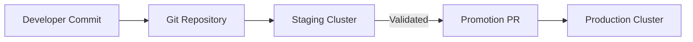

# How to Manage Staging and Production Clusters with Flux CD

Author: [nawazdhandala](https://github.com/nawazdhandala)

Tags: flux cd, staging, production, gitops, kubernetes, cluster management

Description: Learn how to manage staging and production Kubernetes clusters with Flux CD, including environment promotion, gating, and safe rollout strategies.

---

## Introduction

The staging-to-production workflow is the most common multi-cluster pattern in Kubernetes. Staging serves as the final validation gate before changes reach production. Flux CD provides the tools to manage both environments from a single repository with clear separation, safe promotion paths, and automated rollback capabilities. This guide covers the complete setup for managing staging and production clusters.

## Architecture

The two-cluster setup follows a promotion model where changes are first applied to staging, validated, and then promoted to production.



## Prerequisites

- Two Kubernetes clusters: one for staging, one for production
- Flux CD installed on both clusters
- A Git repository bootstrapped with Flux

## Repository Structure

```
fleet-repo/
  base/
    apps/
      api-server/
        deployment.yaml
        service.yaml
        hpa.yaml
        kustomization.yaml
      web-frontend/
        deployment.yaml
        service.yaml
        ingress.yaml
        kustomization.yaml
    infrastructure/
      monitoring/
      logging/
      ingress/
  overlays/
    staging/
      kustomization.yaml
      patches/
        api-server-patch.yaml
        web-frontend-patch.yaml
    production/
      kustomization.yaml
      patches/
        api-server-patch.yaml
        web-frontend-patch.yaml
  clusters/
    staging/
      flux-system/
      infrastructure.yaml
      apps.yaml
    production/
      flux-system/
      infrastructure.yaml
      apps.yaml
```

## Defining Base Application Manifests

Create base manifests that both environments share.

```yaml
# base/apps/api-server/deployment.yaml
# Base API server deployment used by both staging and production
apiVersion: apps/v1
kind: Deployment
metadata:
  name: api-server
  namespace: apps
  labels:
    app: api-server
spec:
  replicas: 1
  selector:
    matchLabels:
      app: api-server
  strategy:
    type: RollingUpdate
    rollingUpdate:
      maxSurge: 1
      maxUnavailable: 0
  template:
    metadata:
      labels:
        app: api-server
    spec:
      containers:
        - name: api-server
          image: your-org/api-server:v2.1.0
          ports:
            - containerPort: 8080
              name: http
          readinessProbe:
            httpGet:
              path: /healthz
              port: http
            initialDelaySeconds: 5
            periodSeconds: 10
          livenessProbe:
            httpGet:
              path: /healthz
              port: http
            initialDelaySeconds: 15
            periodSeconds: 20
          env:
            - name: LOG_LEVEL
              value: info
            - name: DB_HOST
              valueFrom:
                secretKeyRef:
                  name: api-server-db
                  key: host
          resources:
            requests:
              cpu: 100m
              memory: 128Mi
            limits:
              cpu: 500m
              memory: 512Mi
```

```yaml
# base/apps/api-server/service.yaml
# Service for the API server
apiVersion: v1
kind: Service
metadata:
  name: api-server
  namespace: apps
spec:
  selector:
    app: api-server
  ports:
    - port: 80
      targetPort: http
      protocol: TCP
```

```yaml
# base/apps/api-server/hpa.yaml
# Horizontal Pod Autoscaler for the API server
apiVersion: autoscaling/v2
kind: HorizontalPodAutoscaler
metadata:
  name: api-server
  namespace: apps
spec:
  scaleTargetRef:
    apiVersion: apps/v1
    kind: Deployment
    name: api-server
  minReplicas: 1
  maxReplicas: 5
  metrics:
    - type: Resource
      resource:
        name: cpu
        target:
          type: Utilization
          averageUtilization: 70
```

```yaml
# base/apps/api-server/kustomization.yaml
apiVersion: kustomize.config.k8s.io/v1beta1
kind: Kustomization
resources:
  - deployment.yaml
  - service.yaml
  - hpa.yaml
```

## Creating the Staging Overlay

The staging overlay adjusts resource limits and enables verbose logging for debugging.

```yaml
# overlays/staging/kustomization.yaml
# Staging environment overlay
apiVersion: kustomize.config.k8s.io/v1beta1
kind: Kustomization
resources:
  - ../../base/apps/api-server
  - ../../base/apps/web-frontend
patches:
  - path: patches/api-server-patch.yaml
  - path: patches/web-frontend-patch.yaml
# Add staging-specific labels to all resources
commonLabels:
  environment: staging
```

```yaml
# overlays/staging/patches/api-server-patch.yaml
# Staging-specific overrides for the API server
apiVersion: apps/v1
kind: Deployment
metadata:
  name: api-server
  namespace: apps
spec:
  # Staging runs fewer replicas
  replicas: 1
  template:
    spec:
      containers:
        - name: api-server
          # Staging uses the latest build from the staging branch
          image: your-org/api-server:v2.2.0-rc1
          env:
            - name: LOG_LEVEL
              # Verbose logging in staging for debugging
              value: debug
            - name: FEATURE_FLAGS
              # Enable experimental features in staging
              value: "new-dashboard,beta-api"
          resources:
            requests:
              cpu: 100m
              memory: 128Mi
            limits:
              cpu: 250m
              memory: 256Mi
```

## Creating the Production Overlay

The production overlay focuses on high availability, resource allocation, and stability.

```yaml
# overlays/production/kustomization.yaml
# Production environment overlay
apiVersion: kustomize.config.k8s.io/v1beta1
kind: Kustomization
resources:
  - ../../base/apps/api-server
  - ../../base/apps/web-frontend
patches:
  - path: patches/api-server-patch.yaml
  - path: patches/web-frontend-patch.yaml
commonLabels:
  environment: production
```

```yaml
# overlays/production/patches/api-server-patch.yaml
# Production-specific overrides for the API server
apiVersion: apps/v1
kind: Deployment
metadata:
  name: api-server
  namespace: apps
spec:
  # Production runs with high availability
  replicas: 5
  template:
    spec:
      containers:
        - name: api-server
          # Production uses the stable release
          image: your-org/api-server:v2.1.0
          env:
            - name: LOG_LEVEL
              value: warn
            - name: FEATURE_FLAGS
              # Only stable features in production
              value: ""
          resources:
            requests:
              cpu: 500m
              memory: 512Mi
            limits:
              cpu: "1"
              memory: 1Gi
      # Spread pods across availability zones in production
      topologySpreadConstraints:
        - maxSkew: 1
          topologyKey: topology.kubernetes.io/zone
          whenUnsatisfiable: DoNotSchedule
          labelSelector:
            matchLabels:
              app: api-server
```

## Configuring Flux Kustomizations per Cluster

```yaml
# clusters/staging/apps.yaml
# Flux Kustomization for staging applications
apiVersion: kustomize.toolkit.fluxcd.io/v1
kind: Kustomization
metadata:
  name: apps
  namespace: flux-system
spec:
  interval: 5m
  # Staging syncs more frequently for rapid iteration
  retryInterval: 30s
  path: ./overlays/staging
  prune: true
  sourceRef:
    kind: GitRepository
    name: flux-system
  dependsOn:
    - name: infrastructure
  # Health checks to verify staging deployment succeeded
  healthChecks:
    - apiVersion: apps/v1
      kind: Deployment
      name: api-server
      namespace: apps
    - apiVersion: apps/v1
      kind: Deployment
      name: web-frontend
      namespace: apps
  timeout: 5m
```

```yaml
# clusters/production/apps.yaml
# Flux Kustomization for production applications
apiVersion: kustomize.toolkit.fluxcd.io/v1
kind: Kustomization
metadata:
  name: apps
  namespace: flux-system
spec:
  interval: 10m
  # Production uses longer retry intervals
  retryInterval: 2m
  path: ./overlays/production
  prune: true
  sourceRef:
    kind: GitRepository
    name: flux-system
  dependsOn:
    - name: infrastructure
  healthChecks:
    - apiVersion: apps/v1
      kind: Deployment
      name: api-server
      namespace: apps
    - apiVersion: apps/v1
      kind: Deployment
      name: web-frontend
      namespace: apps
  # Longer timeout for production to allow gradual rollouts
  timeout: 10m
```

## Implementing a Promotion Workflow

Automate the promotion of image tags from staging to production using Flux image automation.

```yaml
# clusters/staging/image-automation.yaml
# ImageRepository to scan for new container images
apiVersion: image.toolkit.fluxcd.io/v1beta2
kind: ImageRepository
metadata:
  name: api-server
  namespace: flux-system
spec:
  image: your-org/api-server
  interval: 5m
  secretRef:
    name: registry-credentials
---
# ImagePolicy to select the latest release candidate for staging
apiVersion: image.toolkit.fluxcd.io/v1beta2
kind: ImagePolicy
metadata:
  name: api-server-staging
  namespace: flux-system
spec:
  imageRepositoryRef:
    name: api-server
  # Select the latest RC tag for staging
  filterTags:
    pattern: '^v(?P<version>[0-9]+\.[0-9]+\.[0-9]+-rc[0-9]+)$'
    extract: '$version'
  policy:
    semver:
      range: ">=2.0.0-rc0"
---
# ImageUpdateAutomation to update the staging overlay automatically
apiVersion: image.toolkit.fluxcd.io/v1beta2
kind: ImageUpdateAutomation
metadata:
  name: staging-auto-update
  namespace: flux-system
spec:
  interval: 5m
  sourceRef:
    kind: GitRepository
    name: flux-system
  git:
    checkout:
      ref:
        branch: main
    commit:
      author:
        email: flux@your-org.com
        name: Flux Bot
      messageTemplate: "chore(staging): update images to {{range .Changed.Changes}}{{.NewValue}}{{end}}"
    push:
      branch: main
  update:
    path: ./overlays/staging
    strategy: Setters
```

## Setting Up Production Gates

Add manual approval gates for production deployments using Git branch protection.

```yaml
# clusters/production/gate.yaml
# Production uses a separate branch that requires PR approval
apiVersion: source.toolkit.fluxcd.io/v1
kind: GitRepository
metadata:
  name: flux-system
  namespace: flux-system
spec:
  interval: 10m
  url: https://github.com/your-org/fleet-repo.git
  ref:
    # Production tracks the production branch
    branch: production
  secretRef:
    name: flux-git-credentials
```

The promotion workflow becomes:
1. Changes are automatically applied to staging on the `main` branch.
2. A PR is opened from `main` to `production` branch.
3. The PR requires review approval before merge.
4. Once merged, Flux applies the changes to production.

## Monitoring and Alerting

```yaml
# clusters/production/alerts.yaml
# Alert on any production deployment failures
apiVersion: notification.toolkit.fluxcd.io/v1beta3
kind: Provider
metadata:
  name: pagerduty
  namespace: flux-system
spec:
  type: generic
  address: https://events.pagerduty.com/v2/enqueue
  secretRef:
    name: pagerduty-routing-key
---
apiVersion: notification.toolkit.fluxcd.io/v1beta3
kind: Alert
metadata:
  name: production-failures
  namespace: flux-system
spec:
  providerRef:
    name: pagerduty
  eventSeverity: error
  eventSources:
    - kind: Kustomization
      name: apps
    - kind: HelmRelease
      name: "*"
  summary: "Production deployment failure detected"
```

## Verifying the Setup

```bash
# Compare what is deployed in staging vs production
echo "=== Staging ==="
kubectl --context staging-cluster get deployments -n apps -o wide

echo "=== Production ==="
kubectl --context production-cluster get deployments -n apps -o wide

# Diff the overlays to see environment differences
diff overlays/staging/patches/api-server-patch.yaml overlays/production/patches/api-server-patch.yaml
```

## Best Practices

1. **Never skip staging**: All changes should flow through staging before reaching production.
2. **Use different image tags**: Staging runs release candidates, production runs stable releases.
3. **Automate staging, gate production**: Let staging auto-update but require manual approval for production.
4. **Set longer timeouts for production**: Production rollouts should have generous timeouts.
5. **Alert aggressively on production**: Set up PagerDuty or similar alerts for production failures.
6. **Keep overlays minimal**: Only override what differs between environments.
7. **Use topology spread constraints in production**: Distribute pods across zones for high availability.

## Conclusion

Managing staging and production clusters with Flux CD is about establishing a clear promotion path from development to production. By using Kustomize overlays with a shared base, separate Flux Kustomizations per cluster, and branch-based gating for production, you create a robust deployment pipeline. The key is to automate where safe (staging) and gate where critical (production), with comprehensive monitoring at every stage.
