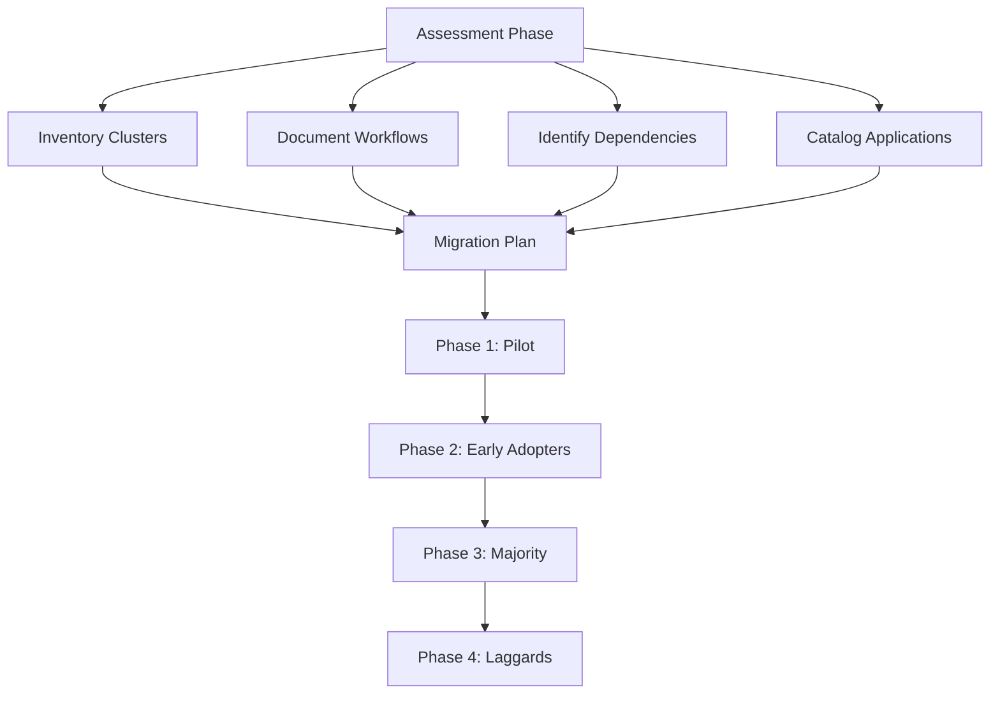

# How to Migrate an Entire Organization to GitOps with Flux CD

Author: [nawazdhandala](https://github.com/nawazdhandala)

Tags: Flux CD, GitOps, Migration, Kubernetes, Organizations, DevOps, Transformation, Strategy

Description: A practical guide to migrating an entire organization from traditional deployment workflows to GitOps with Flux CD, covering planning, phased rollout, team adoption, and common pitfalls.

---

## Introduction

Migrating an entire organization to GitOps is a significant undertaking that goes beyond technology. It requires careful planning, phased rollout, team training, and cultural change. This guide provides a practical roadmap for migrating from traditional deployment workflows (manual kubectl, CI-driven deployments, scripts) to a fully GitOps-driven approach with Flux CD.

## Prerequisites

- Existing Kubernetes clusters in use
- Git hosting platform with organization-level access
- Understanding of current deployment workflows across teams
- Executive sponsorship for the migration

## Assessing the Current State

Before starting the migration, document your current state across all teams:



Create an inventory of what needs to be migrated:

```yaml
# migration-inventory/clusters.yaml
# Document all clusters and their current state
clusters:
  - name: prod-us-east
    provider: AWS EKS
    version: "1.29"
    namespaces: 45
    deployments: 120
    current_deployment_method: "jenkins-pipelines"
    teams_using: ["platform", "payments", "identity"]
    priority: high

  - name: prod-eu-west
    provider: AWS EKS
    version: "1.29"
    namespaces: 30
    deployments: 80
    current_deployment_method: "github-actions-kubectl"
    teams_using: ["platform", "gdpr-compliance"]
    priority: high

  - name: staging
    provider: AWS EKS
    version: "1.29"
    namespaces: 60
    deployments: 150
    current_deployment_method: "mixed"
    teams_using: ["all"]
    priority: medium

  - name: dev
    provider: AWS EKS
    version: "1.30"
    namespaces: 80
    deployments: 200
    current_deployment_method: "manual-kubectl"
    teams_using: ["all"]
    priority: low
```

## Phase 1: Foundation and Pilot

### Step 1: Set Up the Git Repository Structure

```bash
# Create the fleet repository
mkdir -p fleet-infra/{clusters,infrastructure,platform,apps,tenants}

# Create per-cluster directories
for cluster in dev staging prod-us-east prod-eu-west; do
  mkdir -p fleet-infra/clusters/$cluster
done

# Create per-team app directories
for team in platform payments identity gdpr-compliance; do
  mkdir -p fleet-infra/apps/base/$team
  mkdir -p fleet-infra/apps/dev/$team
  mkdir -p fleet-infra/apps/staging/$team
  mkdir -p fleet-infra/apps/production/$team
done
```

### Step 2: Bootstrap Flux on the Dev Cluster

Start with the least critical cluster:

```bash
# Bootstrap Flux on the dev cluster
flux bootstrap github \
  --owner=your-org \
  --repository=fleet-infra \
  --branch=main \
  --path=./clusters/dev \
  --team=platform-team
```

### Step 3: Migrate the Pilot Team

Choose one team with a few well-understood applications. Export their current state:

```bash
# Export existing resources from the cluster
# for a specific namespace
kubectl get deployments,services,configmaps,ingresses \
  -n payment-service -o yaml > payment-service-export.yaml
```

Convert the exported resources to a Flux-managed structure:

```yaml
# apps/base/payments/payment-service/deployment.yaml
apiVersion: apps/v1
kind: Deployment
metadata:
  name: payment-service
  namespace: payments
  labels:
    app: payment-service
    team: payments
spec:
  replicas: 3
  selector:
    matchLabels:
      app: payment-service
  template:
    metadata:
      labels:
        app: payment-service
    spec:
      containers:
        - name: payment-service
          # Image tag managed by Flux image automation
          image: registry.company.com/payment-service:v2.3.1
          ports:
            - containerPort: 8080
          env:
            - name: DATABASE_URL
              valueFrom:
                secretKeyRef:
                  name: payment-db-credentials
                  key: url
          resources:
            requests:
              cpu: 250m
              memory: 256Mi
            limits:
              cpu: "1"
              memory: 1Gi
---
# apps/base/payments/payment-service/service.yaml
apiVersion: v1
kind: Service
metadata:
  name: payment-service
  namespace: payments
spec:
  selector:
    app: payment-service
  ports:
    - port: 80
      targetPort: 8080
---
# apps/base/payments/payment-service/kustomization.yaml
apiVersion: kustomize.config.k8s.io/v1beta1
kind: Kustomization
resources:
  - deployment.yaml
  - service.yaml
```

Create the Flux Kustomization to manage the team:

```yaml
# apps/dev/payments/kustomization.yaml
apiVersion: kustomize.config.k8s.io/v1beta1
kind: Kustomization
resources:
  - ../../base/payments/payment-service
```

### Step 4: Disable Legacy Deployments for the Pilot

Once Flux is managing the resources, disable the old deployment pipeline:

```yaml
# In your Jenkins pipeline or GitHub Actions, add a check:
# .github/workflows/deploy.yaml
name: Deploy (Legacy)
on:
  push:
    branches: [main]
jobs:
  deploy:
    runs-on: ubuntu-latest
    steps:
      - name: Check if GitOps managed
        run: |
          # Check if this service is managed by Flux
          MANAGED=$(kubectl get deployment payment-service \
            -n payments \
            -o jsonpath='{.metadata.labels.kustomize\.toolkit\.fluxcd\.io/name}' \
            2>/dev/null || echo "")
          if [ -n "$MANAGED" ]; then
            echo "This service is managed by Flux CD."
            echo "Deploy by pushing to the fleet-infra repository."
            exit 0
          fi
          # Continue with legacy deployment only if not Flux-managed
```

## Phase 2: Early Adopters

### Migrate Infrastructure Components

Move shared infrastructure to Flux management:

```yaml
# infrastructure/controllers/kustomization.yaml
apiVersion: kustomize.config.k8s.io/v1beta1
kind: Kustomization
resources:
  - cert-manager
  - ingress-nginx
  - external-dns
  - external-secrets
  - kyverno
```

```yaml
# infrastructure/controllers/kyverno/helmrelease.yaml
apiVersion: helm.toolkit.fluxcd.io/v2
kind: HelmRelease
metadata:
  name: kyverno
  namespace: kyverno
spec:
  interval: 30m
  chart:
    spec:
      chart: kyverno
      version: "3.3.x"
      sourceRef:
        kind: HelmRepository
        name: kyverno
        namespace: flux-system
  install:
    createNamespace: true
  values:
    replicaCount: 3
    resources:
      limits:
        cpu: "1"
        memory: 1Gi
```

### Set Up Policy Enforcement

Use policies to enforce GitOps practices:

```yaml
# infrastructure/configs/policies/require-flux-labels.yaml
apiVersion: kyverno.io/v1
kind: ClusterPolicy
metadata:
  name: require-flux-management
  annotations:
    policies.kyverno.io/description: >
      Ensure all production deployments are managed by Flux CD
spec:
  validationFailureAction: Audit
  background: true
  rules:
    - name: check-flux-labels
      match:
        any:
          - resources:
              kinds:
                - Deployment
              namespaces:
                - "prod-*"
      validate:
        message: >
          All production deployments must be managed by Flux CD.
          This resource is missing the Flux CD management labels.
          Please deploy via the fleet-infra Git repository.
        pattern:
          metadata:
            labels:
              kustomize.toolkit.fluxcd.io/name: "?*"
              kustomize.toolkit.fluxcd.io/namespace: "?*"
```

### Onboard Additional Teams

Create a self-service onboarding process:

```yaml
# tenants/onboarding-template/kustomization.yaml
apiVersion: kustomize.config.k8s.io/v1beta1
kind: Kustomization
namespace: TEAM_NAMESPACE
resources:
  - namespace.yaml
  - rbac.yaml
  - resource-quota.yaml
  - network-policy.yaml
  - flux-kustomization.yaml
```

```yaml
# tenants/onboarding-template/flux-kustomization.yaml
# This gives the team their own Flux Kustomization
# pointing to their app directory
apiVersion: kustomize.toolkit.fluxcd.io/v1
kind: Kustomization
metadata:
  name: TEAM_NAME-apps
  namespace: flux-system
spec:
  interval: 10m
  sourceRef:
    kind: GitRepository
    name: flux-system
  path: ./apps/production/TEAM_NAME
  prune: true
  # Restrict to team namespace only
  targetNamespace: TEAM_NAMESPACE
  # Service account with limited permissions
  serviceAccountName: TEAM_NAME-deployer
  dependsOn:
    - name: infrastructure-configs
```

## Phase 3: Majority Migration

### Automate Resource Export

Create a script to bulk-export existing resources:

```bash
#!/bin/bash
# scripts/export-namespace.sh
# Export all resources from a namespace into Flux-compatible format

NAMESPACE=$1
OUTPUT_DIR=$2

mkdir -p "$OUTPUT_DIR"

# Export deployments
kubectl get deployments -n "$NAMESPACE" -o yaml | \
  yq eval 'del(.items[].metadata.resourceVersion,
    .items[].metadata.uid,
    .items[].metadata.creationTimestamp,
    .items[].metadata.generation,
    .items[].metadata.managedFields,
    .items[].status)' > "$OUTPUT_DIR/deployments.yaml"

# Export services
kubectl get services -n "$NAMESPACE" -o yaml | \
  yq eval 'del(.items[].metadata.resourceVersion,
    .items[].metadata.uid,
    .items[].metadata.creationTimestamp,
    .items[].spec.clusterIP,
    .items[].spec.clusterIPs,
    .items[].status)' > "$OUTPUT_DIR/services.yaml"

# Export configmaps (exclude kube-system ones)
kubectl get configmaps -n "$NAMESPACE" \
  --field-selector metadata.name!=kube-root-ca.crt -o yaml | \
  yq eval 'del(.items[].metadata.resourceVersion,
    .items[].metadata.uid,
    .items[].metadata.creationTimestamp)' > "$OUTPUT_DIR/configmaps.yaml"

# Generate kustomization.yaml
cat > "$OUTPUT_DIR/kustomization.yaml" <<EOF
apiVersion: kustomize.config.k8s.io/v1beta1
kind: Kustomization
resources:
  - deployments.yaml
  - services.yaml
  - configmaps.yaml
EOF

echo "Exported $NAMESPACE to $OUTPUT_DIR"
```

### Set Up Image Update Automation

Replace CI-driven image updates with Flux image automation:

```yaml
# clusters/production/image-automation.yaml
apiVersion: image.toolkit.fluxcd.io/v1
kind: ImageUpdateAutomation
metadata:
  name: fleet-infra
  namespace: flux-system
spec:
  interval: 5m
  sourceRef:
    kind: GitRepository
    name: flux-system
  git:
    checkout:
      ref:
        branch: main
    commit:
      author:
        name: flux-bot
        email: flux@company.com
      messageTemplate: |
        chore(images): update {{ range .Updated.Images }}
        - {{.}} {{ end }}
    push:
      branch: main
  update:
    path: ./apps
    strategy: Setters
```

## Phase 4: Final Migration and Cleanup

### Migrate Remaining Services

Track migration progress:

```yaml
# migration-tracking/status.yaml
# Track which teams and services have been migrated
migration_status:
  total_teams: 12
  migrated_teams: 10
  remaining_teams:
    - name: legacy-billing
      blocker: "Uses custom deployment script with database migration"
      target_date: "2026-04-01"
      assignee: "platform-team"
    - name: data-pipeline
      blocker: "Requires Argo Workflows integration"
      target_date: "2026-04-15"
      assignee: "data-platform-team"
```

### Remove Legacy Deployment Pipelines

Once all services are migrated, remove legacy deployment code:

```yaml
# Switch Kyverno policy from Audit to Enforce
# infrastructure/configs/policies/require-flux-labels.yaml
apiVersion: kyverno.io/v1
kind: ClusterPolicy
metadata:
  name: require-flux-management
spec:
  # Change from Audit to Enforce
  validationFailureAction: Enforce
  background: true
  rules:
    - name: check-flux-labels
      match:
        any:
          - resources:
              kinds:
                - Deployment
              namespaces:
                - "prod-*"
      validate:
        message: >
          All production deployments must be managed by Flux CD.
          Deploy via the fleet-infra Git repository.
        pattern:
          metadata:
            labels:
              kustomize.toolkit.fluxcd.io/name: "?*"
```

## Setting Up Monitoring for the Migration

Track migration health with Flux metrics:

```yaml
# platform/monitoring/flux-dashboard.yaml
apiVersion: v1
kind: ConfigMap
metadata:
  name: flux-migration-dashboard
  namespace: monitoring
  labels:
    grafana_dashboard: "1"
data:
  flux-migration.json: |
    {
      "dashboard": {
        "title": "Flux CD Migration Status",
        "panels": [
          {
            "title": "Flux Managed Resources",
            "type": "stat",
            "targets": [
              {
                "expr": "count(kube_deployment_labels{label_kustomize_toolkit_fluxcd_io_name!=''})"
              }
            ]
          },
          {
            "title": "Non-Flux Managed Resources",
            "type": "stat",
            "targets": [
              {
                "expr": "count(kube_deployment_labels{label_kustomize_toolkit_fluxcd_io_name=''})"
              }
            ]
          },
          {
            "title": "Reconciliation Success Rate",
            "type": "gauge",
            "targets": [
              {
                "expr": "sum(rate(gotk_reconcile_condition{status='True'}[1h])) / sum(rate(gotk_reconcile_condition[1h])) * 100"
              }
            ]
          }
        ]
      }
    }
```

## Communication Plan

Keep the organization informed throughout the migration:

```yaml
# migration-plan/communication.yaml
communication_plan:
  kickoff:
    audience: all-engineering
    channel: email, all-hands
    message: "Announcing GitOps migration with Flux CD"
    date: "Week 1"

  weekly_updates:
    audience: team-leads
    channel: slack #gitops-migration
    content:
      - teams migrated this week
      - upcoming migrations
      - blockers and resolutions

  training_sessions:
    schedule: bi-weekly
    topics:
      - "Introduction to GitOps and Flux CD"
      - "How to deploy with Flux CD"
      - "Troubleshooting Flux deployments"
      - "Advanced Flux patterns"

  completion:
    audience: all-engineering
    channel: email, all-hands
    message: "GitOps migration complete - new deployment workflow"
```

## Common Pitfalls to Avoid

1. **Migrating everything at once**: Always use a phased approach. Start with non-critical services.

2. **Ignoring cultural change**: GitOps requires developers to change how they think about deployments. Invest in training.

3. **Not cleaning up legacy pipelines**: Old deployment pipelines left running can conflict with Flux.

4. **Skipping the pilot phase**: The pilot reveals organizational-specific issues that cannot be anticipated.

5. **Underestimating secret management**: Plan your secret management strategy before migrating. Mixing approaches causes confusion.

6. **Not setting up monitoring early**: Without visibility into Flux reconciliation, teams lose confidence in the new system.

## Conclusion

Migrating an entire organization to GitOps with Flux CD is a multi-month effort that requires careful planning, phased execution, and strong communication. By following the phased approach in this guide -- starting with a pilot team, expanding to early adopters, migrating the majority, and finally cleaning up legacy systems -- you can achieve a successful migration while minimizing disruption to your development teams. The result is a consistent, auditable, and scalable deployment platform that benefits the entire organization.
