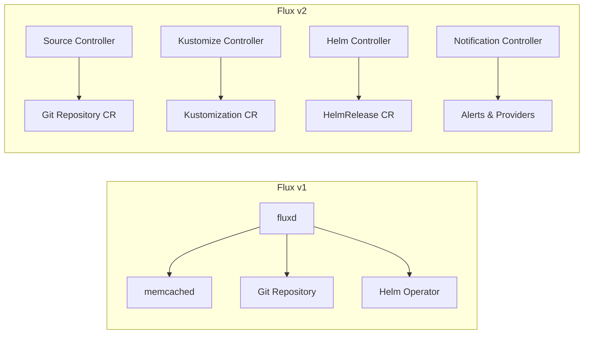

# How to Migrate from Flux v1 to Flux v2

Author: [nawazdhandala](https://github.com/nawazdhandala)

Tags: Flux CD, Migration, Flux v1, Flux v2, GitOps, Kubernetes, Upgrade

Description: A step-by-step guide to migrating from Flux v1 (Flux Legacy) to Flux v2, covering resource mapping, repository restructuring, and cutover strategies.

---

## Introduction

Flux v1 (also known as Flux Legacy) reached end of life and is no longer maintained. Flux v2 is a complete rewrite built on the GitOps Toolkit, offering better performance, multi-tenancy support, and a more modular architecture. Migrating from v1 to v2 requires careful planning because the two versions have fundamentally different architectures, resource types, and repository conventions.

This guide provides a practical migration path with concrete steps, resource mappings, and strategies for minimizing downtime during the transition.

## Prerequisites

- A running Flux v1 installation to migrate from
- kubectl and Flux v2 CLI installed
- A Git repository currently managed by Flux v1
- Access to the cluster with admin privileges
- A maintenance window for the cutover

## Architecture Comparison



## Key Differences Between v1 and v2

| Feature | Flux v1 | Flux v2 |
|---------|---------|---------|
| Architecture | Monolithic (fluxd) | Modular (multiple controllers) |
| Git sync | Built into fluxd | Source Controller + GitRepository CR |
| Kustomize | Built-in with annotations | Kustomize Controller + Kustomization CR |
| Helm | Separate Helm Operator | Helm Controller + HelmRelease CR |
| Multi-tenancy | Limited | First-class support |
| Notifications | None built-in | Notification Controller |
| Image automation | Built into fluxd | Image Reflector + Image Automation controllers |
| CRD API group | flux.weave.works | Various *.toolkit.fluxcd.io |

## Step 1: Audit Your Flux v1 Installation

Before migrating, document everything Flux v1 is currently managing.

```bash
# List all Flux v1 resources
kubectl get all -n flux

# Check Flux v1 configuration
kubectl get deployment flux -n flux -o yaml | grep -A 20 "containers:"

# List all HelmReleases managed by Helm Operator v1
kubectl get helmreleases --all-namespaces

# Check Flux v1 annotations on namespaces
kubectl get namespaces -o json | \
  jq '.items[] | select(.metadata.annotations["fluxcd.io/sync-checksum"]) | .metadata.name'

# Export current HelmRelease resources
kubectl get helmreleases -A -o yaml > flux-v1-helmreleases-backup.yaml

# List all workloads Flux v1 manages
kubectl get deployment,statefulset,daemonset -A \
  -l "fluxcd.io/sync-gc-mark" --show-labels
```

## Step 2: Map Flux v1 Resources to v2 Equivalents

### Git Repository Configuration

```yaml
# Flux v1: Configuration was in the fluxd deployment args
# --git-url=git@github.com:your-org/fleet-config.git
# --git-branch=main
# --git-path=namespaces,workloads

# Flux v2: GitRepository custom resource
apiVersion: source.toolkit.fluxcd.io/v1
kind: GitRepository
metadata:
  name: flux-system
  namespace: flux-system
spec:
  interval: 1m
  url: ssh://git@github.com/your-org/fleet-config.git
  ref:
    branch: main
  secretRef:
    name: flux-system
```

### Kustomize Sync Configuration

```yaml
# Flux v1: Used .flux.yaml or annotations in the repo
# annotations:
#   fluxcd.io/automated: "true"
#   fluxcd.io/tag.app: glob:v*

# Flux v2: Kustomization custom resource
apiVersion: kustomize.toolkit.fluxcd.io/v1
kind: Kustomization
metadata:
  name: workloads
  namespace: flux-system
spec:
  interval: 10m
  # Maps to Flux v1's --git-path flag
  path: ./workloads
  prune: true
  sourceRef:
    kind: GitRepository
    name: flux-system
  # Maps to Flux v1's garbage collection
  # (Flux v1 used --sync-garbage-collection flag)
  timeout: 5m
```

### HelmRelease Migration

```yaml
# Flux v1 HelmRelease (API: flux.weave.works/v1beta1)
apiVersion: flux.weave.works/v1beta1
kind: HelmRelease
metadata:
  name: nginx
  namespace: default
spec:
  releaseName: nginx
  chart:
    repository: https://charts.bitnami.com/bitnami
    name: nginx
    version: 15.0.0
  values:
    replicaCount: 2
    service:
      type: ClusterIP

# Flux v2 HelmRelease (API: helm.toolkit.fluxcd.io/v2)
# Note: In v2, the chart source is defined separately
---
# First, define the HelmRepository source
apiVersion: source.toolkit.fluxcd.io/v1
kind: HelmRepository
metadata:
  name: bitnami
  namespace: flux-system
spec:
  interval: 1h
  url: https://charts.bitnami.com/bitnami
---
# Then define the HelmRelease referencing the source
apiVersion: helm.toolkit.fluxcd.io/v2
kind: HelmRelease
metadata:
  name: nginx
  namespace: default
spec:
  interval: 30m
  releaseName: nginx
  chart:
    spec:
      chart: nginx
      version: "15.0.0"
      # Reference the HelmRepository defined above
      sourceRef:
        kind: HelmRepository
        name: bitnami
        namespace: flux-system
  values:
    replicaCount: 2
    service:
      type: ClusterIP
```

### Image Automation Migration

```yaml
# Flux v1: Annotations on the workload
# annotations:
#   fluxcd.io/automated: "true"
#   fluxcd.io/tag.app: semver:~1.0

# Flux v2: Separate ImageRepository, ImagePolicy, and ImageUpdateAutomation
---
# Scan the container registry for new tags
apiVersion: image.toolkit.fluxcd.io/v1
kind: ImageRepository
metadata:
  name: web-app
  namespace: flux-system
spec:
  image: your-org/web-app
  interval: 5m
  secretRef:
    name: registry-credentials
---
# Define the policy for selecting image tags
apiVersion: image.toolkit.fluxcd.io/v1
kind: ImagePolicy
metadata:
  name: web-app
  namespace: flux-system
spec:
  imageRepositoryRef:
    name: web-app
  policy:
    # Equivalent to Flux v1's semver:~1.0
    semver:
      range: "~1.0"
---
# Automate Git updates when new images are found
apiVersion: image.toolkit.fluxcd.io/v1
kind: ImageUpdateAutomation
metadata:
  name: flux-system
  namespace: flux-system
spec:
  interval: 5m
  sourceRef:
    kind: GitRepository
    name: flux-system
  git:
    checkout:
      ref:
        branch: main
    commit:
      author:
        name: flux
        email: flux@example.com
      messageTemplate: "Update image to {{range .Changed.Changes}}{{.NewValue}}{{end}}"
    push:
      branch: main
  update:
    path: ./workloads
    strategy: Setters
```

In your deployment manifests, replace Flux v1 annotations with Flux v2 image policy markers:

```yaml
# Flux v2 uses inline markers instead of annotations
apiVersion: apps/v1
kind: Deployment
metadata:
  name: web-app
spec:
  template:
    spec:
      containers:
        - name: web-app
          # The marker tells Flux v2 which ImagePolicy to use
          image: your-org/web-app:1.0.5 # {"$imagepolicy": "flux-system:web-app"}
```

## Step 3: Restructure Your Git Repository

Flux v2 works best with a structured repository layout.

```bash
# Flux v1 typical layout (flat structure)
fleet-config/
  namespaces/
    production.yaml
    staging.yaml
  workloads/
    deployment.yaml
    service.yaml
  releases/
    nginx-helmrelease.yaml

# Flux v2 recommended layout (hierarchical)
fleet-config/
  clusters/
    my-cluster/
      flux-system/         # Flux v2 bootstrap files (auto-generated)
      infrastructure.yaml  # Kustomization for infra
      apps.yaml           # Kustomization for apps
  infrastructure/
    sources/              # HelmRepository definitions
      bitnami.yaml
      kustomization.yaml
    cert-manager/
      kustomization.yaml
      helm-release.yaml
  apps/
    production/
      deployment.yaml
      service.yaml
      kustomization.yaml
    staging/
      kustomization.yaml
```

## Step 4: Prepare the Migration

Create all Flux v2 resources in your Git repository before installing Flux v2 on the cluster.

```yaml
# clusters/my-cluster/infrastructure.yaml
# Kustomization for infrastructure components
apiVersion: kustomize.toolkit.fluxcd.io/v1
kind: Kustomization
metadata:
  name: infrastructure
  namespace: flux-system
spec:
  interval: 10m
  path: ./infrastructure
  prune: true
  sourceRef:
    kind: GitRepository
    name: flux-system
  wait: true
---
# clusters/my-cluster/apps.yaml
# Kustomization for application workloads
apiVersion: kustomize.toolkit.fluxcd.io/v1
kind: Kustomization
metadata:
  name: apps
  namespace: flux-system
spec:
  interval: 10m
  path: ./apps/production
  prune: true
  sourceRef:
    kind: GitRepository
    name: flux-system
  dependsOn:
    - name: infrastructure
```

## Step 5: Convert All HelmReleases

Write a script to automate the conversion of HelmRelease resources.

```bash
#!/bin/bash
# convert-helmreleases.sh
# Converts Flux v1 HelmRelease resources to Flux v2 format

INPUT_FILE="flux-v1-helmreleases-backup.yaml"
OUTPUT_DIR="infrastructure/sources"

mkdir -p "$OUTPUT_DIR"

# Extract unique Helm repositories and create HelmRepository resources
echo "Converting Helm repositories..."
kubectl get helmreleases -A -o json | \
  jq -r '.items[].spec.chart.repository' | sort -u | while read repo; do
    # Generate a name from the URL
    name=$(echo "$repo" | sed 's|https\?://||;s|/.*||;s|\..*||')
    cat > "${OUTPUT_DIR}/${name}.yaml" << EOF
apiVersion: source.toolkit.fluxcd.io/v1
kind: HelmRepository
metadata:
  name: ${name}
  namespace: flux-system
spec:
  interval: 1h
  url: ${repo}
EOF
    echo "  Created HelmRepository: ${name}"
done

echo "Conversion complete. Review the generated files in ${OUTPUT_DIR}/"
```

## Step 6: Perform the Cutover

This is the critical step where you switch from Flux v1 to v2.

```bash
# 1. Suspend Flux v1 to stop it from making changes
kubectl scale deployment flux -n flux --replicas=0
kubectl scale deployment helm-operator -n flux --replicas=0

# 2. Verify Flux v1 is stopped
kubectl get pods -n flux

# 3. Commit all Flux v2 resources to Git
cd /path/to/fleet-config
git add clusters/ infrastructure/ apps/
git commit -m "Migration: Add Flux v2 resources"
git push origin main

# 4. Bootstrap Flux v2 on the cluster
flux bootstrap github \
  --owner=your-org \
  --repository=fleet-config \
  --branch=main \
  --path=clusters/my-cluster \
  --personal

# 5. Monitor Flux v2 reconciliation
flux get kustomizations --watch

# 6. Verify all resources are healthy
flux get helmreleases -A
flux get kustomizations -A
```

## Step 7: Verify the Migration

```bash
# Check all Flux v2 sources are synced
flux get sources all

# Verify all Kustomizations are ready
flux get kustomizations -A

# Verify all HelmReleases are reconciled
flux get helmreleases -A

# Compare deployed resources with expected state
flux diff kustomization apps

# Check that workloads are still running
kubectl get deployments -A | head -20
kubectl get pods -A | grep -v Running | grep -v Completed
```

## Step 8: Clean Up Flux v1 Resources

After confirming Flux v2 is working correctly, remove Flux v1 components.

```bash
# Delete Flux v1 namespace and all its resources
kubectl delete namespace flux

# Remove Flux v1 CRDs
kubectl delete crd helmreleases.flux.weave.works
kubectl delete crd fluxhelmreleases.helm.fluxcd.io

# Remove Flux v1 RBAC
kubectl delete clusterrolebinding flux
kubectl delete clusterrole flux

# Remove old annotations from resources
# (Optional: Flux v2 will ignore v1 annotations)
kubectl get deployments -A -o json | \
  jq -r '.items[] | select(.metadata.annotations["fluxcd.io/sync-checksum"]) | "\(.metadata.namespace)/\(.metadata.name)"' | \
  while read dep; do
    ns=$(echo $dep | cut -d/ -f1)
    name=$(echo $dep | cut -d/ -f2)
    kubectl annotate deployment $name -n $ns \
      fluxcd.io/sync-checksum- \
      fluxcd.io/sync-gc-mark- \
      fluxcd.io/automated- 2>/dev/null || true
  done

echo "Flux v1 cleanup complete"
```

## Step 9: Set Up Flux v2 Notifications

Flux v2 has built-in notification support that was not available in v1.

```yaml
# clusters/my-cluster/notifications.yaml
# Slack notification provider
apiVersion: notification.toolkit.fluxcd.io/v1
kind: Provider
metadata:
  name: slack
  namespace: flux-system
spec:
  type: slack
  channel: deployments
  secretRef:
    name: slack-webhook
---
# Alert on reconciliation events
apiVersion: notification.toolkit.fluxcd.io/v1
kind: Alert
metadata:
  name: on-call-alerts
  namespace: flux-system
spec:
  providerRef:
    name: slack
  eventSeverity: error
  eventSources:
    - kind: Kustomization
      namespace: flux-system
      name: "*"
    - kind: HelmRelease
      namespace: "*"
      name: "*"
  summary: "Flux reconciliation issue detected"
```

## Step 10: Post-Migration Checklist

Run through this checklist after migration:

```bash
# 1. All sources are synced
flux get sources git -A
flux get sources helm -A

# 2. All Kustomizations are ready
flux get kustomizations -A | grep -v "True" | grep -v "READY"

# 3. All HelmReleases are reconciled
flux get helmreleases -A | grep -v "True" | grep -v "READY"

# 4. Image automation is working (if used)
flux get image repository -A
flux get image policy -A

# 5. Notifications are configured
flux get alert-providers -A
flux get alerts -A

# 6. Flux v1 is completely removed
kubectl get namespace flux 2>/dev/null && echo "WARNING: Flux v1 namespace still exists" || echo "OK: Flux v1 namespace removed"
kubectl get crd | grep flux.weave.works && echo "WARNING: Flux v1 CRDs still exist" || echo "OK: Flux v1 CRDs removed"

# 7. No orphaned resources
kubectl get all -A -l "fluxcd.io/sync-gc-mark" 2>/dev/null
```

## Rollback Plan

If the migration fails, you can roll back to Flux v1.

```bash
# 1. Uninstall Flux v2
flux uninstall

# 2. Restore Flux v1
kubectl scale deployment flux -n flux --replicas=1
kubectl scale deployment helm-operator -n flux --replicas=1

# 3. Verify Flux v1 is syncing again
kubectl logs -n flux deployment/flux --tail=20
```

## Troubleshooting

**HelmRelease not reconciling**: Check that the HelmRepository source is accessible and the chart version exists. Flux v2 requires explicit HelmRepository resources.

**Kustomization path errors**: Ensure the path in your Kustomization spec matches the actual directory structure. Flux v2 requires a `kustomization.yaml` file in the target directory.

**SSH key issues**: Flux v2 uses a different SSH key format. Re-add the deploy key to your Git repository after bootstrapping.

```bash
# Get the Flux v2 deploy key
flux create secret git flux-system \
  --url=ssh://git@github.com/your-org/fleet-config \
  --export > deploy-key.yaml
```

## Conclusion

Migrating from Flux v1 to Flux v2 is a significant but worthwhile undertaking. Flux v2's modular architecture, better multi-tenancy support, built-in notifications, and active development make it a much more capable GitOps platform. By following this guide and performing the migration methodically, including auditing your v1 setup, converting resources, restructuring your repository, and carefully cutting over, you can complete the migration with minimal disruption to your workloads.
