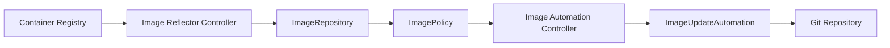

# How to Migrate Image Automation from Flux v1 to v2

Author: [nawazdhandala](https://github.com/nawazdhandala)

Tags: Flux CD, Image Automation, Migration, Kubernetes, GitOps, Container Images, Continuous Deployment

Description: A step-by-step guide to migrating your image update automation workflows from Flux v1 to the Flux v2 Image Automation Controllers.

---

## Introduction

Flux v1 had built-in image scanning and automatic update capabilities that would detect new container images and update your Git repository accordingly. In Flux v2, this functionality has been separated into two dedicated controllers: the **Image Reflector Controller** and the **Image Automation Controller**. This guide covers how to migrate your image automation setup from Flux v1 to v2.

## Architecture Changes

The image automation in Flux v2 is split into distinct components, each with its own set of custom resources.



### Flux v1 Approach

- Image scanning was built into the main Flux daemon
- Annotations on workloads controlled which images to track
- Updates were committed directly by the Flux daemon

### Flux v2 Approach

- **ImageRepository**: scans a container registry for tags
- **ImagePolicy**: selects the desired image tag based on a policy
- **ImageUpdateAutomation**: commits tag updates back to Git
- Marker comments in YAML files indicate which fields to update

## Prerequisites

Ensure you have the following before starting:

```bash
# Install Flux v2 CLI
curl -s https://fluxcd.io/install.sh | sudo bash

# Verify prerequisites
flux check --pre

# Install Flux v2 with image automation controllers
flux install \
  --components-extra=image-reflector-controller,image-automation-controller
```

## Step 1: Identify Flux v1 Image Automation Configuration

In Flux v1, image automation was configured via annotations on Kubernetes workloads.

```yaml
# Flux v1 style: annotations on a Deployment
apiVersion: apps/v1
kind: Deployment
metadata:
  name: my-app
  namespace: default
  annotations:
    # Flux v1 annotation to automate image updates
    fluxcd.io/automated: "true"
    # Filter to select specific image tags
    fluxcd.io/tag.app: semver:~1.0
    # Lock annotation to prevent updates
    # fluxcd.io/locked: "true"
spec:
  replicas: 3
  selector:
    matchLabels:
      app: my-app
  template:
    metadata:
      labels:
        app: my-app
    spec:
      containers:
        - name: app
          image: myregistry/my-app:1.0.5
          ports:
            - containerPort: 8080
```

```bash
# Find all resources with Flux v1 image automation annotations
kubectl get deployments --all-namespaces \
  -o jsonpath='{range .items[?(@.metadata.annotations.fluxcd\.io/automated)]}{.metadata.namespace}/{.metadata.name}{"\n"}{end}'
```

## Step 2: Create ImageRepository Resources

Create an `ImageRepository` for each container image you want to track. This replaces the built-in image scanning of Flux v1.

```yaml
# imagerepository.yaml
# Scans the container registry for available tags
apiVersion: image.toolkit.fluxcd.io/v1
kind: ImageRepository
metadata:
  name: my-app
  namespace: flux-system
spec:
  # The container image to scan (without tag)
  image: myregistry/my-app
  # How often to scan for new tags
  interval: 5m
  # Optional: credentials for private registries
  secretRef:
    name: registry-credentials
```

For registries that require authentication, create a secret:

```bash
# Create a secret for private registry authentication
kubectl create secret docker-registry registry-credentials \
  --namespace=flux-system \
  --docker-server=myregistry.example.com \
  --docker-username=user \
  --docker-password=password
```

### Scanning Multiple Images

If you have multiple images to track, create an ImageRepository for each:

```yaml
# imagerepositories.yaml
# ImageRepository for the frontend application
apiVersion: image.toolkit.fluxcd.io/v1
kind: ImageRepository
metadata:
  name: frontend
  namespace: flux-system
spec:
  image: myregistry/frontend
  interval: 5m
---
# ImageRepository for the backend API
apiVersion: image.toolkit.fluxcd.io/v1
kind: ImageRepository
metadata:
  name: backend-api
  namespace: flux-system
spec:
  image: myregistry/backend-api
  interval: 5m
---
# ImageRepository for the worker service
apiVersion: image.toolkit.fluxcd.io/v1
kind: ImageRepository
metadata:
  name: worker
  namespace: flux-system
spec:
  image: myregistry/worker
  interval: 5m
```

## Step 3: Create ImagePolicy Resources

Replace the Flux v1 tag filter annotations with `ImagePolicy` resources. These define the rules for selecting which image tag to use.

```yaml
# imagepolicy-semver.yaml
# Selects the latest image tag based on semver policy
apiVersion: image.toolkit.fluxcd.io/v1
kind: ImagePolicy
metadata:
  name: my-app
  namespace: flux-system
spec:
  # Reference to the ImageRepository to get tags from
  imageRepositoryRef:
    name: my-app
  # Policy for selecting the desired tag
  policy:
    semver:
      # Select the latest patch version in the 1.x range
      range: ">=1.0.0 <2.0.0"
```

### Common Policy Patterns

Here are policy examples covering the most common Flux v1 annotation patterns:

```yaml
# Semver policy: replaces fluxcd.io/tag.app: semver:~1.0
apiVersion: image.toolkit.fluxcd.io/v1
kind: ImagePolicy
metadata:
  name: my-app-semver
  namespace: flux-system
spec:
  imageRepositoryRef:
    name: my-app
  policy:
    semver:
      range: "~1.0"
---
# Alphabetical policy: selects the latest tag alphabetically
apiVersion: image.toolkit.fluxcd.io/v1
kind: ImagePolicy
metadata:
  name: my-app-alpha
  namespace: flux-system
spec:
  imageRepositoryRef:
    name: my-app
  policy:
    alphabetical:
      order: asc
---
# Numerical policy: selects the highest numerical tag
apiVersion: image.toolkit.fluxcd.io/v1
kind: ImagePolicy
metadata:
  name: my-app-numerical
  namespace: flux-system
spec:
  imageRepositoryRef:
    name: my-app
  policy:
    numerical:
      order: asc
---
# Filter with regex extraction for timestamp-based tags
# Matches tags like main-abc1234-1709712000
apiVersion: image.toolkit.fluxcd.io/v1
kind: ImagePolicy
metadata:
  name: my-app-timestamp
  namespace: flux-system
spec:
  imageRepositoryRef:
    name: my-app
  filterTags:
    # Only consider tags matching this pattern
    pattern: '^main-[a-f0-9]+-(?P<ts>[0-9]+)$'
    # Extract the timestamp for sorting
    extract: '$ts'
  policy:
    numerical:
      order: asc
```

## Step 4: Add Marker Comments to YAML Files

In Flux v2, you must add special marker comments to your YAML files to indicate which image fields should be updated. This replaces the annotation-based approach of Flux v1.

```yaml
# deployment.yaml
# Updated with Flux v2 image automation markers
apiVersion: apps/v1
kind: Deployment
metadata:
  name: my-app
  namespace: default
  # Remove old Flux v1 annotations
  # No more fluxcd.io/automated or fluxcd.io/tag annotations needed
spec:
  replicas: 3
  selector:
    matchLabels:
      app: my-app
  template:
    metadata:
      labels:
        app: my-app
    spec:
      containers:
        - name: app
          # The marker comment tells the automation controller
          # which ImagePolicy to use for updating this field
          # {"$imagepolicy": "flux-system:my-app"}
          image: myregistry/my-app:1.0.5
          ports:
            - containerPort: 8080
```

You can also update just the tag portion:

```yaml
containers:
  - name: app
    # Update the full image reference (registry/image:tag)
    image: myregistry/my-app:1.0.5 # {"$imagepolicy": "flux-system:my-app"}
```

## Step 5: Create ImageUpdateAutomation Resource

This resource replaces the automatic commit functionality of Flux v1. It tells the Image Automation Controller how to commit updates back to your Git repository.

```yaml
# imageupdateautomation.yaml
# Configures automatic commits for image tag updates
apiVersion: image.toolkit.fluxcd.io/v1
kind: ImageUpdateAutomation
metadata:
  name: image-updates
  namespace: flux-system
spec:
  # How often to check for image updates
  interval: 5m
  # Reference to the GitRepository source
  sourceRef:
    kind: GitRepository
    name: flux-config
  # Git configuration for commits
  git:
    # Branch to push commits to
    checkout:
      ref:
        branch: main
    # Commit settings
    commit:
      author:
        name: Flux Image Automation
        email: flux@example.com
      # Commit message template
      messageTemplate: |
        Automated image update

        Automation name: {{ .AutomationObject }}

        Files:
        {{ range $filename, $_ := .Changed.FileChanges -}}
        - {{ $filename }}
        {{ end -}}

        Objects:
        {{ range $resource, $_ := .Changed.Objects -}}
        - {{ $resource.Kind }} {{ $resource.Name }}
        {{ end -}}
    # Push settings
    push:
      branch: main
  # Limit updates to specific paths
  update:
    path: ./clusters/production
    strategy: Setters
```

## Step 6: Set Up the GitRepository Source

Ensure you have a `GitRepository` source configured for the repository where your manifests live.

```yaml
# gitrepository.yaml
# Source for the Git repository containing deployment manifests
apiVersion: source.toolkit.fluxcd.io/v1
kind: GitRepository
metadata:
  name: flux-config
  namespace: flux-system
spec:
  url: ssh://git@github.com/org/flux-config
  ref:
    branch: main
  interval: 1m
  secretRef:
    name: git-credentials
```

## Step 7: Verify the Migration

Apply all the new resources and verify everything works.

```bash
# Apply the image automation resources
kubectl apply -f imagerepository.yaml
kubectl apply -f imagepolicy.yaml
kubectl apply -f imageupdateautomation.yaml

# Check ImageRepository status - should show discovered tags
flux get image repository my-app

# Check ImagePolicy status - should show the selected tag
flux get image policy my-app

# Check ImageUpdateAutomation status
flux get image update image-updates

# Force a reconciliation to test
flux reconcile image repository my-app
flux reconcile image update image-updates
```

## Step 8: Remove Flux v1 Automation Annotations

After verifying that Flux v2 image automation works, remove the old Flux v1 annotations from your workloads.

```bash
# Remove the fluxcd.io/automated annotation
kubectl annotate deployment my-app -n default fluxcd.io/automated-

# Remove any tag filter annotations
kubectl annotate deployment my-app -n default fluxcd.io/tag.app-
```

## Mapping Flux v1 Annotations to v2 Resources

| Flux v1 Annotation | Flux v2 Equivalent |
|---|---|
| `fluxcd.io/automated: "true"` | `ImageUpdateAutomation` resource |
| `fluxcd.io/tag.container: semver:~1.0` | `ImagePolicy` with semver range |
| `fluxcd.io/tag.container: glob:main-*` | `ImagePolicy` with filterTags pattern |
| `fluxcd.io/locked: "true"` | Suspend the `ImageUpdateAutomation` |
| `fluxcd.io/tag.container: regex:^prod-` | `ImagePolicy` with filterTags pattern |

## Troubleshooting

### Images Not Being Scanned

```bash
# Check the Image Reflector Controller logs
kubectl logs -n flux-system deploy/image-reflector-controller --tail=50

# Verify registry authentication
kubectl get secret registry-credentials -n flux-system -o jsonpath='{.data.\.dockerconfigjson}' | base64 -d
```

### Updates Not Being Committed

```bash
# Check the Image Automation Controller logs
kubectl logs -n flux-system deploy/image-automation-controller --tail=50

# Verify Git authentication
flux get sources git flux-config -n flux-system

# Ensure marker comments are correctly formatted in your YAML files
grep -r 'imagepolicy' ./clusters/production/
```

### Suspended Automation

If you need to temporarily stop automation (equivalent to `fluxcd.io/locked`):

```bash
# Suspend image update automation
flux suspend image update image-updates -n flux-system

# Resume when ready
flux resume image update image-updates -n flux-system
```

## Conclusion

Migrating image automation from Flux v1 to v2 requires creating separate resources for scanning, policy selection, and commit automation. While this is more verbose than the annotation-based approach, it provides better observability, more flexible policies, and cleaner separation of concerns. The marker comment system in Flux v2 also gives you precise control over which fields get updated, reducing the risk of unintended changes.
