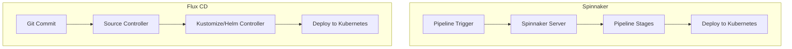

# How to Migrate from Spinnaker to Flux CD

Author: [nawazdhandala](https://github.com/nawazdhandala)

Tags: flux cd, spinnaker, migration, kubernetes, gitops, continuous delivery, deployment pipeline

Description: A comprehensive guide to migrating your Kubernetes deployment workflows from Spinnaker to Flux CD GitOps.

---

## Introduction

Spinnaker is a powerful multi-cloud continuous delivery platform that uses a pipeline-based model for deployments. While it excels at complex deployment strategies, many Kubernetes-focused teams find its operational overhead and complexity unnecessary for their needs. Flux CD offers a lighter-weight, Git-native approach to continuous delivery that is purpose-built for Kubernetes. This guide covers how to migrate your Spinnaker pipelines and deployment workflows to Flux CD.

## Spinnaker vs Flux CD: Architectural Differences

Understanding the fundamental differences helps plan the migration.



| Aspect | Spinnaker | Flux CD |
|---|---|---|
| Model | Pipeline-based (push) | Reconciliation-based (pull) |
| Source of truth | Spinnaker pipelines | Git repository |
| Deployment trigger | Pipeline execution | Git commit |
| Multi-cluster | Built-in | Per-cluster agent |
| UI | Rich web UI | CLI + Git UI |
| Resource footprint | Heavy (multiple services) | Lightweight (few controllers) |

## Step 1: Inventory Spinnaker Pipelines

Document all Spinnaker pipelines and their configurations.

```bash
# Use the Spinnaker API to export pipeline configurations
# List all applications
curl -s http://spinnaker-gate:8084/applications | jq '.[].name'

# Export pipelines for each application
curl -s http://spinnaker-gate:8084/applications/my-app/pipelineConfigs \
  | jq '.' > spinnaker-pipelines/my-app-pipelines.json

# Document pipeline stages for each pipeline
curl -s http://spinnaker-gate:8084/applications/my-app/pipelineConfigs \
  | jq '.[].stages[] | {type: .type, name: .name}'
```

### Common Spinnaker Pipeline Patterns to Migrate

Identify which patterns you need to replicate in Flux:

1. **Simple deploy pipeline**: Trigger on image push, deploy to Kubernetes
2. **Multi-environment promotion**: Dev -> Staging -> Production
3. **Canary deployments**: Gradual traffic shifting
4. **Blue-green deployments**: Switch traffic between versions
5. **Manual approval gates**: Human approval before production
6. **Rollback pipelines**: Automated or manual rollback

## Step 2: Set Up Flux CD

Install Flux CD in your target cluster.

```bash
# Bootstrap Flux with GitHub
flux bootstrap github \
  --owner=your-org \
  --repository=fleet-config \
  --path=clusters/production \
  --branch=main \
  --personal

# Verify Flux is running
flux check

# If you need image automation (to replace Spinnaker image triggers)
flux install \
  --components-extra=image-reflector-controller,image-automation-controller
```

## Step 3: Migrate Simple Deploy Pipelines

A basic Spinnaker pipeline that deploys a manifest on image change maps to Flux Kustomization with image automation.

### Spinnaker Pipeline (Before)

A typical Spinnaker deploy pipeline:
1. Docker Registry trigger on new image tag
2. Deploy Manifest stage
3. Optional: Run tests

### Flux CD Equivalent (After)

```yaml
# sources/git-repo.yaml
# GitRepository source for deployment manifests
apiVersion: source.toolkit.fluxcd.io/v1
kind: GitRepository
metadata:
  name: app-config
  namespace: flux-system
spec:
  url: ssh://git@github.com/org/app-config
  ref:
    branch: main
  interval: 1m
  secretRef:
    name: git-credentials
---
# apps/my-app/kustomization-flux.yaml
# Flux Kustomization to deploy the application
apiVersion: kustomize.toolkit.fluxcd.io/v1
kind: Kustomization
metadata:
  name: my-app
  namespace: flux-system
spec:
  interval: 5m
  sourceRef:
    kind: GitRepository
    name: app-config
  path: ./apps/my-app
  prune: true
  wait: true
  timeout: 5m
```

### Replace Image Triggers

Spinnaker's Docker Registry trigger is replaced by Flux image automation.

```yaml
# image-automation/my-app-repo.yaml
# Scan the container registry for new tags
apiVersion: image.toolkit.fluxcd.io/v1beta2
kind: ImageRepository
metadata:
  name: my-app
  namespace: flux-system
spec:
  image: myregistry/my-app
  interval: 1m
  secretRef:
    name: registry-credentials
---
# image-automation/my-app-policy.yaml
# Select the latest semver tag
apiVersion: image.toolkit.fluxcd.io/v1beta2
kind: ImagePolicy
metadata:
  name: my-app
  namespace: flux-system
spec:
  imageRepositoryRef:
    name: my-app
  policy:
    semver:
      range: ">=1.0.0"
---
# image-automation/automation.yaml
# Commit image updates back to Git
apiVersion: image.toolkit.fluxcd.io/v1beta2
kind: ImageUpdateAutomation
metadata:
  name: my-app-automation
  namespace: flux-system
spec:
  interval: 5m
  sourceRef:
    kind: GitRepository
    name: app-config
  git:
    checkout:
      ref:
        branch: main
    commit:
      author:
        name: Flux Automation
        email: flux@example.com
      messageTemplate: "Update {{ .ImageName }} to {{ .NewTag }}"
    push:
      branch: main
  update:
    path: ./apps/my-app
    strategy: Setters
```

```yaml
# apps/my-app/deployment.yaml
# Add image policy marker for automatic updates
apiVersion: apps/v1
kind: Deployment
metadata:
  name: my-app
  namespace: default
spec:
  replicas: 3
  selector:
    matchLabels:
      app: my-app
  template:
    metadata:
      labels:
        app: my-app
    spec:
      containers:
        - name: my-app
          image: myregistry/my-app:1.2.3 # {"$imagepolicy": "flux-system:my-app"}
          ports:
            - containerPort: 8080
```

## Step 4: Migrate Multi-Environment Promotion

Spinnaker pipelines that promote deployments across environments map to Flux's multi-cluster or multi-path approach.

### Environment Promotion with Flux

```yaml
# Directory structure for multi-environment promotion:
# apps/my-app/
#   base/
#     deployment.yaml
#     service.yaml
#     kustomization.yaml
#   overlays/
#     development/
#       kustomization.yaml
#     staging/
#       kustomization.yaml
#     production/
#       kustomization.yaml

# clusters/development/apps/my-app.yaml
apiVersion: kustomize.toolkit.fluxcd.io/v1
kind: Kustomization
metadata:
  name: my-app
  namespace: flux-system
spec:
  interval: 5m
  sourceRef:
    kind: GitRepository
    name: app-config
  path: ./apps/my-app/overlays/development
  prune: true
  wait: true
---
# clusters/staging/apps/my-app.yaml
apiVersion: kustomize.toolkit.fluxcd.io/v1
kind: Kustomization
metadata:
  name: my-app
  namespace: flux-system
spec:
  interval: 5m
  sourceRef:
    kind: GitRepository
    name: app-config
  path: ./apps/my-app/overlays/staging
  prune: true
  wait: true
---
# clusters/production/apps/my-app.yaml
apiVersion: kustomize.toolkit.fluxcd.io/v1
kind: Kustomization
metadata:
  name: my-app
  namespace: flux-system
spec:
  interval: 5m
  sourceRef:
    kind: GitRepository
    name: app-config
  path: ./apps/my-app/overlays/production
  prune: true
  wait: true
```

### Promotion Workflow

Promotion is done through Git, replacing Spinnaker pipeline triggers:

```bash
# Promote from staging to production by updating the image tag
# in the production overlay
cd apps/my-app/overlays/production
kustomize edit set image myregistry/my-app:1.3.0

git add kustomization.yaml
git commit -m "Promote my-app 1.3.0 to production"
git push origin main

# Flux will automatically apply the update to the production cluster
```

## Step 5: Migrate Helm-Based Pipelines

If Spinnaker deploys Helm charts, convert to Flux HelmRelease resources.

```yaml
# sources/helm-repo.yaml
apiVersion: source.toolkit.fluxcd.io/v1
kind: HelmRepository
metadata:
  name: app-charts
  namespace: flux-system
spec:
  url: https://charts.example.com
  interval: 30m
---
# apps/my-app/helmrelease.yaml
# Replaces the Spinnaker Bake (Helm) + Deploy stage
apiVersion: helm.toolkit.fluxcd.io/v2
kind: HelmRelease
metadata:
  name: my-app
  namespace: default
spec:
  interval: 10m
  chart:
    spec:
      chart: my-app
      version: "1.3.0"
      sourceRef:
        kind: HelmRepository
        name: app-charts
        namespace: flux-system
  install:
    createNamespace: true
    remediation:
      retries: 3
  upgrade:
    cleanupOnFail: true
    remediation:
      retries: 3
      strategy: rollback
  values:
    replicaCount: 3
    image:
      repository: myregistry/my-app
      tag: "1.3.0"
    ingress:
      enabled: true
      hostname: my-app.example.com
```

## Step 6: Replace Manual Approval Gates

Spinnaker supports manual judgment stages for approval before production deployments. In Flux, this is handled through Git pull requests.


```yaml
# Use branch protection and PR reviews as approval gates
# .github/CODEOWNERS
# Require approval from platform team for production changes
/clusters/production/ @platform-team
/apps/*/overlays/production/ @platform-team
```

For cases where you need explicit gates, use Flux suspend/resume:

```bash
# Suspend a Kustomization (equivalent to pausing a pipeline)
flux suspend kustomization my-app -n flux-system

# After approval, resume the Kustomization
flux resume kustomization my-app -n flux-system
```

## Step 7: Set Up Notifications

Replace Spinnaker's notification stages with Flux notifications.

```yaml
# notifications/providers.yaml
# Slack notification provider
apiVersion: notification.toolkit.fluxcd.io/v1beta3
kind: Provider
metadata:
  name: slack
  namespace: flux-system
spec:
  type: slack
  channel: deployments
  secretRef:
    name: slack-webhook
---
# GitHub commit status provider
apiVersion: notification.toolkit.fluxcd.io/v1beta3
kind: Provider
metadata:
  name: github-status
  namespace: flux-system
spec:
  type: github
  address: https://github.com/org/app-config
  secretRef:
    name: github-token
```

```yaml
# notifications/alerts.yaml
# Alert on deployment events
apiVersion: notification.toolkit.fluxcd.io/v1beta3
kind: Alert
metadata:
  name: deployment-alerts
  namespace: flux-system
spec:
  summary: "Deployment notification"
  # Alert on both success and failure
  eventSeverity: info
  eventSources:
    - kind: Kustomization
      name: "*"
    - kind: HelmRelease
      name: "*"
  providerRef:
    name: slack
---
# Update GitHub commit status on reconciliation
apiVersion: notification.toolkit.fluxcd.io/v1beta3
kind: Alert
metadata:
  name: github-status-updates
  namespace: flux-system
spec:
  eventSeverity: info
  eventSources:
    - kind: Kustomization
      name: "*"
  providerRef:
    name: github-status
```

## Step 8: Migrate Rollback Strategies

Spinnaker has built-in rollback pipelines. In Flux, rollbacks are handled through Git reverts or HelmRelease rollback policies.

### Git-Based Rollback

```bash
# Rollback by reverting the Git commit
git revert HEAD
git push origin main

# Flux will automatically reconcile to the previous state
```

### HelmRelease Automatic Rollback

```yaml
# Automatic rollback on failed upgrade
apiVersion: helm.toolkit.fluxcd.io/v2
kind: HelmRelease
metadata:
  name: my-app
  namespace: default
spec:
  interval: 10m
  chart:
    spec:
      chart: my-app
      version: "1.3.0"
      sourceRef:
        kind: HelmRepository
        name: app-charts
        namespace: flux-system
  upgrade:
    remediation:
      retries: 3
      # Rollback to the last successful release on failure
      strategy: rollback
  rollback:
    cleanupOnFail: true
    recreate: true
```

## Step 9: Decommission Spinnaker

After verifying all deployments are managed by Flux, decommission Spinnaker.

```bash
# Disable all Spinnaker pipelines
# Use the Spinnaker API to disable pipelines
curl -X PUT http://spinnaker-gate:8084/pipelines/my-app/deploy-pipeline \
  -H 'Content-Type: application/json' \
  -d '{"disabled": true}'

# Monitor Flux for a few weeks to ensure stability
flux get all -A

# Once confident, remove Spinnaker
# Follow your organization's decommissioning procedures
kubectl delete namespace spinnaker
```

## Migration Checklist

1. Inventory all Spinnaker applications and pipelines
2. Document pipeline triggers, stages, and notification configs
3. Install and bootstrap Flux CD
4. Set up Git repository structure for manifests
5. Migrate simple deploy pipelines to Flux Kustomizations
6. Set up image automation for image-trigger pipelines
7. Migrate Helm-based deployments to HelmRelease resources
8. Configure multi-environment promotion via Git overlays
9. Replace approval gates with PR reviews and CODEOWNERS
10. Set up Flux notifications to replace Spinnaker notifications
11. Configure rollback policies on HelmReleases
12. Test all deployment workflows end to end
13. Run both systems in parallel for a transition period
14. Disable Spinnaker pipelines
15. Decommission Spinnaker after stability verification

## Conclusion

Migrating from Spinnaker to Flux CD simplifies your deployment infrastructure by replacing pipeline-based push deployments with Git-based pull reconciliation. While Spinnaker offers a rich UI and complex pipeline features, Flux CD provides a more Kubernetes-native approach with lower operational overhead. The migration should be done incrementally, starting with simple deploy pipelines and progressively migrating more complex workflows. Run both systems in parallel during the transition to ensure no disruption to your delivery process.
