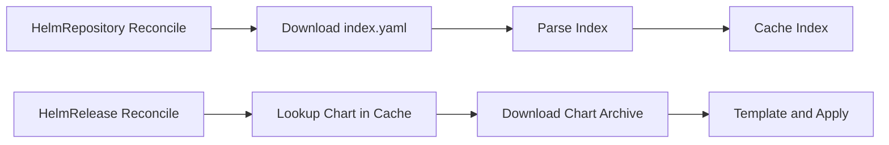

# How to Optimize HelmRepository Fetch Performance in Flux CD

Author: [nawazdhandala](https://github.com/nawazdhandala)

Tags: flux cd, kubernetes, gitops, helm, performance tuning, helm repository, chart caching

Description: A practical guide to optimizing HelmRepository fetch performance in Flux CD through caching, OCI registries, interval tuning, and index optimization.

---

Flux CD uses the source-controller to fetch Helm chart indexes and charts from Helm repositories. For clusters managing many HelmReleases across multiple repositories, these fetch operations can consume significant time, bandwidth, and CPU. This guide covers techniques to optimize HelmRepository performance.

## Understanding HelmRepository Fetch Operations

When Flux reconciles a HelmRepository, it performs these steps:

1. Downloads the repository index file (`index.yaml`)
2. Parses the index to discover available chart versions
3. Caches the parsed index for HelmRelease lookups
4. When a HelmRelease is reconciled, downloads the specific chart archive



Large Helm repositories with hundreds of charts produce massive index files that are slow to download and parse.

## Using OCI-Based Helm Repositories

OCI-based Helm repositories eliminate the index download entirely. Instead of downloading a monolithic index, Flux fetches only the specific chart version needed.

```yaml
# OCI-based HelmRepository - no index download required
apiVersion: source.toolkit.fluxcd.io/v1
kind: HelmRepository
metadata:
  name: bitnami-oci
  namespace: flux-system
spec:
  type: oci
  # OCI registries serve charts directly without index files
  url: oci://registry-1.docker.io/bitnamicharts
  interval: 60m
  provider: generic
---
# HelmRelease using OCI-based repository
apiVersion: helm.toolkit.fluxcd.io/v2
kind: HelmRelease
metadata:
  name: redis
  namespace: apps
spec:
  interval: 30m
  chart:
    spec:
      chart: redis
      version: "18.x"
      sourceRef:
        kind: HelmRepository
        name: bitnami-oci
        namespace: flux-system
      # Flux fetches only this specific chart, not the entire index
      reconcileStrategy: ChartVersion
```

The performance benefit of OCI is substantial for large repositories:

| Repository Type | Index Size (Bitnami) | Fetch Time |
|---|---|---|
| Traditional (HTTPS) | ~50MB compressed | 10-30 seconds |
| OCI | No index needed | < 1 second per chart |

## Increasing Reconciliation Intervals

Helm repository indexes rarely change. Use longer intervals to reduce fetch frequency.

```yaml
# Stable repositories with infrequent updates
apiVersion: source.toolkit.fluxcd.io/v1
kind: HelmRepository
metadata:
  name: stable-charts
  namespace: flux-system
spec:
  interval: 6h
  url: https://charts.example.com/stable
---
# Frequently updated repositories (internal charts)
apiVersion: source.toolkit.fluxcd.io/v1
kind: HelmRepository
metadata:
  name: internal-charts
  namespace: flux-system
spec:
  # Internal repos may update more often
  interval: 30m
  url: https://charts.internal.example.com
---
# Public community repositories
apiVersion: source.toolkit.fluxcd.io/v1
kind: HelmRepository
metadata:
  name: prometheus-community
  namespace: flux-system
spec:
  # Community charts update infrequently
  interval: 2h
  url: https://prometheus-community.github.io/helm-charts
```

## Pinning Chart Versions

When HelmReleases pin exact chart versions, Flux can skip chart downloads if the version is already cached.

```yaml
# Pin to exact version to maximize cache hits
apiVersion: helm.toolkit.fluxcd.io/v2
kind: HelmRelease
metadata:
  name: nginx-ingress
  namespace: ingress-system
spec:
  interval: 1h
  chart:
    spec:
      chart: ingress-nginx
      # Exact version pin - Flux skips download if already cached
      version: "4.8.3"
      sourceRef:
        kind: HelmRepository
        name: ingress-nginx
        namespace: flux-system
      # Only re-fetch when chart version changes
      reconcileStrategy: ChartVersion
```

Compare with version ranges:

```yaml
# Version range - may trigger unnecessary downloads on index refresh
apiVersion: helm.toolkit.fluxcd.io/v2
kind: HelmRelease
metadata:
  name: nginx-ingress-range
  namespace: ingress-system
spec:
  interval: 1h
  chart:
    spec:
      chart: ingress-nginx
      # Semver range means Flux must check for new matching versions
      # on every HelmRepository index refresh
      version: ">=4.8.0 <5.0.0"
      sourceRef:
        kind: HelmRepository
        name: ingress-nginx
        namespace: flux-system
      # Revision strategy checks chart content hash, which requires download
      reconcileStrategy: Revision
```

## Consolidating Helm Repositories

Reduce the number of HelmRepository resources by consolidating charts into fewer repositories.

```yaml
# Instead of many small repositories:
# - repo-a (1 chart)
# - repo-b (1 chart)
# - repo-c (1 chart)
# ... each requiring its own index fetch

# Use a consolidated OCI registry for internal charts
apiVersion: source.toolkit.fluxcd.io/v1
kind: HelmRepository
metadata:
  name: internal-oci
  namespace: flux-system
spec:
  type: oci
  # Single OCI registry hosting all internal charts
  url: oci://registry.internal.example.com/helm-charts
  interval: 1h
  provider: generic
---
# All internal HelmReleases reference the same repository
apiVersion: helm.toolkit.fluxcd.io/v2
kind: HelmRelease
metadata:
  name: app-a
  namespace: apps
spec:
  interval: 30m
  chart:
    spec:
      chart: app-a
      version: "1.2.3"
      sourceRef:
        kind: HelmRepository
        name: internal-oci
        namespace: flux-system
---
apiVersion: helm.toolkit.fluxcd.io/v2
kind: HelmRelease
metadata:
  name: app-b
  namespace: apps
spec:
  interval: 30m
  chart:
    spec:
      chart: app-b
      version: "2.0.1"
      sourceRef:
        kind: HelmRepository
        name: internal-oci
        namespace: flux-system
```

## Configuring Authentication for Performance

Use efficient authentication methods to reduce connection overhead.

```yaml
# HTTPS authentication with token (faster TLS negotiation)
apiVersion: source.toolkit.fluxcd.io/v1
kind: HelmRepository
metadata:
  name: private-charts
  namespace: flux-system
spec:
  interval: 1h
  url: https://charts.private.example.com
  secretRef:
    name: helm-repo-creds
  # Pass credentials only in the header, not via query params
  passCredentials: true
---
apiVersion: v1
kind: Secret
metadata:
  name: helm-repo-creds
  namespace: flux-system
type: Opaque
stringData:
  username: helm-reader
  password: "token-value-here"
```

For OCI registries with cloud provider authentication:

```yaml
# OCI HelmRepository with cloud provider auth
apiVersion: source.toolkit.fluxcd.io/v1
kind: HelmRepository
metadata:
  name: ecr-charts
  namespace: flux-system
spec:
  type: oci
  url: oci://123456789.dkr.ecr.us-east-1.amazonaws.com/charts
  interval: 1h
  # Use cloud provider IRSA/workload identity for automatic token refresh
  provider: aws
```

## Tuning Source Controller for Helm Performance

Configure the source-controller with Helm-specific optimizations.

```yaml
# source-controller-helm-patch.yaml
# Optimized for clusters with many HelmRepositories
apiVersion: apps/v1
kind: Deployment
metadata:
  name: source-controller
  namespace: flux-system
spec:
  template:
    spec:
      containers:
        - name: manager
          args:
            - --storage-path=/data
            - --storage-adv-addr=source-controller.$(RUNTIME_NAMESPACE).svc.cluster.local.
            # Increase concurrency for parallel index and chart fetches
            - --concurrent=8
            # Reduce artifact retention for Helm charts
            - --artifact-retention-ttl=60m
            - --artifact-retention-records=3
            # Increase Helm index cache size
            - --helm-cache-max-size=256
            # Set timeouts for slow repositories
            - --helm-cache-ttl=30m
            - --helm-cache-purge-interval=10m
          resources:
            requests:
              cpu: "250m"
              memory: "512Mi"
            limits:
              # Parsing large indexes needs memory
              cpu: "1000m"
              memory: "1.5Gi"
          env:
            # Reduce GC overhead during index parsing
            - name: GOGC
              value: "75"
            - name: GOMEMLIMIT
              value: "1200MiB"
```

## Using HelmChart Resources Efficiently

The HelmChart resource controls how individual charts are fetched. Use the `reconcileStrategy` field to minimize unnecessary downloads.

```yaml
# HelmRelease with optimized chart fetch strategy
apiVersion: helm.toolkit.fluxcd.io/v2
kind: HelmRelease
metadata:
  name: grafana
  namespace: monitoring
spec:
  interval: 1h
  chart:
    spec:
      chart: grafana
      version: "7.0.17"
      sourceRef:
        kind: HelmRepository
        name: grafana
        namespace: flux-system
      # ChartVersion strategy only re-fetches when version changes
      # This is more efficient than Revision strategy
      reconcileStrategy: ChartVersion
      # Validate chart integrity
      verify:
        provider: cosign
  # Longer interval for stable releases
  install:
    timeout: 10m
  upgrade:
    timeout: 10m
    # Skip CRD updates for faster upgrades
    crds: Skip
```

## Monitoring HelmRepository Performance

Track fetch latency and failures for Helm repositories.

```yaml
# PrometheusRule for HelmRepository performance monitoring
apiVersion: monitoring.coreos.com/v1
kind: PrometheusRule
metadata:
  name: flux-helm-repo-alerts
  namespace: flux-system
spec:
  groups:
    - name: flux-helm-repos
      rules:
        # Alert on slow Helm index fetches
        - alert: FluxHelmRepoFetchSlow
          expr: |
            gotk_reconcile_duration_seconds{
              kind="HelmRepository"
            } > 120
          for: 5m
          labels:
            severity: warning
          annotations:
            summary: "HelmRepository {{ $labels.name }} fetch taking {{ $value }}s"
            description: "Consider switching to OCI registry or increasing interval."

        # Alert on Helm repository fetch failures
        - alert: FluxHelmRepoFailing
          expr: |
            gotk_reconcile_condition{
              kind="HelmRepository",
              type="Ready",
              status="False"
            } == 1
          for: 30m
          labels:
            severity: critical
          annotations:
            summary: "HelmRepository {{ $labels.name }} failing for 30m"
```

## Summary

Key strategies for optimizing HelmRepository fetch performance:

1. Migrate to OCI-based Helm repositories to eliminate index file downloads
2. Increase reconciliation intervals for stable, rarely-updated repositories
3. Pin exact chart versions and use ChartVersion reconcile strategy for maximum cache efficiency
4. Consolidate charts into fewer repositories to reduce total index fetches
5. Use efficient authentication methods (cloud provider workload identity, token auth)
6. Tune source-controller Helm cache settings for your workload
7. Monitor fetch duration and set alerts for slow or failing repositories

Migrating to OCI registries provides the single largest performance improvement, especially for large repositories like Bitnami where the traditional index can be tens of megabytes.
