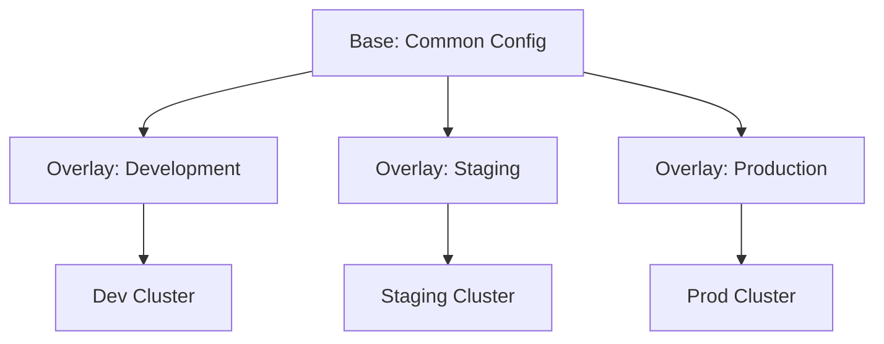

# How to Organize Base and Overlays in a Flux CD Repository

Author: [nawazdhandala](https://github.com/nawazdhandala)

Tags: Flux CD, Kustomize, Base, Overlay, Repository Structure, GitOps, Kubernetes

Description: A practical guide to organizing Kustomize base and overlay directories in a Flux CD repository for clean, maintainable multi-environment deployments.

---

## Introduction

The base and overlay pattern is the foundation of Kustomize and a core strategy for managing multi-environment deployments with Flux CD. Bases define the common configuration shared across all environments, while overlays contain environment-specific modifications. Getting this structure right is critical for maintainability, reducing duplication, and preventing configuration drift.

This guide covers practical patterns for organizing bases and overlays in a Flux CD repository, including layered bases, component reuse, and strategies for managing complexity.

## How Base and Overlays Work



The base contains the canonical resource definitions. Overlays reference the base and apply patches, add resources, or modify configurations for specific environments.

## Basic Directory Structure

```text
repository/
├── apps/
│   ├── base/
│   │   ├── my-app/
│   │   │   ├── kustomization.yaml
│   │   │   ├── deployment.yaml
│   │   │   ├── service.yaml
│   │   │   └── configmap.yaml
│   │   └── api-service/
│   │       ├── kustomization.yaml
│   │       ├── deployment.yaml
│   │       └── service.yaml
│   ├── development/
│   │   ├── kustomization.yaml
│   │   └── patches/
│   ├── staging/
│   │   ├── kustomization.yaml
│   │   └── patches/
│   └── production/
│       ├── kustomization.yaml
│       └── patches/
└── infrastructure/
    ├── base/
    ├── development/
    ├── staging/
    └── production/
```

## Creating a Base

A well-structured base should contain the minimal, complete configuration that works in any environment:

```yaml
# apps/base/my-app/kustomization.yaml
apiVersion: kustomize.config.k8s.io/v1beta1
kind: Kustomization
resources:
  - deployment.yaml
  - service.yaml
  - configmap.yaml
  - serviceaccount.yaml
```

```yaml
# apps/base/my-app/deployment.yaml
apiVersion: apps/v1
kind: Deployment
metadata:
  name: my-app
spec:
  # Use a sensible default replica count
  replicas: 1
  selector:
    matchLabels:
      app: my-app
  template:
    metadata:
      labels:
        app: my-app
    spec:
      serviceAccountName: my-app
      containers:
        - name: my-app
          image: registry.example.com/my-app:latest
          ports:
            - name: http
              containerPort: 8080
          # Define minimal resource requests
          resources:
            requests:
              cpu: 100m
              memory: 128Mi
          # Include health checks in the base
          livenessProbe:
            httpGet:
              path: /healthz
              port: http
          readinessProbe:
            httpGet:
              path: /readyz
              port: http
```

```yaml
# apps/base/my-app/service.yaml
apiVersion: v1
kind: Service
metadata:
  name: my-app
spec:
  selector:
    app: my-app
  ports:
    - name: http
      port: 80
      targetPort: http
```

```yaml
# apps/base/my-app/configmap.yaml
apiVersion: v1
kind: ConfigMap
metadata:
  name: my-app-config
data:
  # Use variable substitution for environment-specific values
  LOG_LEVEL: "${LOG_LEVEL:=info}"
  METRICS_ENABLED: "true"
```

## Creating Overlays

### Development Overlay

```yaml
# apps/development/kustomization.yaml
apiVersion: kustomize.config.k8s.io/v1beta1
kind: Kustomization
resources:
  - ../base/my-app
  - ../base/api-service
namespace: development
patches:
  # Enable debug mode in development
  - path: patches/my-app-debug.yaml
    target:
      kind: Deployment
      name: my-app
```

```yaml
# apps/development/patches/my-app-debug.yaml
apiVersion: apps/v1
kind: Deployment
metadata:
  name: my-app
spec:
  template:
    spec:
      containers:
        - name: my-app
          env:
            - name: DEBUG
              value: "true"
            - name: LOG_LEVEL
              value: "debug"
```

### Production Overlay

```yaml
# apps/production/kustomization.yaml
apiVersion: kustomize.config.k8s.io/v1beta1
kind: Kustomization
resources:
  - ../base/my-app
  - ../base/api-service
  # Production-only resources
  - additional/pod-disruption-budget.yaml
  - additional/network-policy.yaml
namespace: production
patches:
  - path: patches/my-app-production.yaml
    target:
      kind: Deployment
      name: my-app
  - path: patches/my-app-hpa.yaml
```

```yaml
# apps/production/patches/my-app-production.yaml
apiVersion: apps/v1
kind: Deployment
metadata:
  name: my-app
spec:
  replicas: 5
  template:
    spec:
      containers:
        - name: my-app
          resources:
            requests:
              cpu: 250m
              memory: 256Mi
            limits:
              cpu: 1000m
              memory: 512Mi
      # Production: spread pods across nodes
      topologySpreadConstraints:
        - maxSkew: 1
          topologyKey: kubernetes.io/hostname
          whenUnsatisfiable: DoNotSchedule
          labelSelector:
            matchLabels:
              app: my-app
```

```yaml
# apps/production/additional/pod-disruption-budget.yaml
apiVersion: policy/v1
kind: PodDisruptionBudget
metadata:
  name: my-app
spec:
  minAvailable: 2
  selector:
    matchLabels:
      app: my-app
```

## Layered Bases Pattern

For complex applications, you can create intermediate bases that layer on top of each other:

```text
apps/
├── base/
│   └── my-app/              # Core application resources
│       ├── kustomization.yaml
│       ├── deployment.yaml
│       └── service.yaml
├── base-with-monitoring/
│   └── my-app/              # Adds monitoring to the base
│       ├── kustomization.yaml
│       └── service-monitor.yaml
├── base-with-ingress/
│   └── my-app/              # Adds ingress to the base
│       ├── kustomization.yaml
│       └── ingress.yaml
├── staging/
│   ├── kustomization.yaml   # Uses base-with-monitoring
│   └── patches/
└── production/
    ├── kustomization.yaml   # Uses base-with-monitoring + base-with-ingress
    └── patches/
```

```yaml
# apps/base-with-monitoring/my-app/kustomization.yaml
apiVersion: kustomize.config.k8s.io/v1beta1
kind: Kustomization
resources:
  - ../../base/my-app
  - service-monitor.yaml
```

```yaml
# apps/base-with-monitoring/my-app/service-monitor.yaml
apiVersion: monitoring.coreos.com/v1
kind: ServiceMonitor
metadata:
  name: my-app
spec:
  selector:
    matchLabels:
      app: my-app
  endpoints:
    - port: http
      path: /metrics
      interval: 30s
```

## Using Kustomize Components

Kustomize components allow you to define reusable configuration fragments:

```yaml
# components/enable-hpa/kustomization.yaml
apiVersion: kustomize.config.k8s.io/v1alpha1
kind: Component
patches:
  # Remove the static replicas field since HPA will manage it
  - target:
      kind: Deployment
    patch: |
      - op: remove
        path: /spec/replicas
resources:
  - hpa.yaml
```

```yaml
# components/enable-hpa/hpa.yaml
apiVersion: autoscaling/v2
kind: HorizontalPodAutoscaler
metadata:
  name: placeholder
spec:
  scaleTargetRef:
    apiVersion: apps/v1
    kind: Deployment
    name: placeholder
  minReplicas: 3
  maxReplicas: 10
  metrics:
    - type: Resource
      resource:
        name: cpu
        target:
          type: Utilization
          averageUtilization: 70
```

```yaml
# components/enable-network-policy/kustomization.yaml
apiVersion: kustomize.config.k8s.io/v1alpha1
kind: Component
resources:
  - network-policy.yaml
```

Reference components in overlays:

```yaml
# apps/production/kustomization.yaml
apiVersion: kustomize.config.k8s.io/v1beta1
kind: Kustomization
resources:
  - ../base/my-app
namespace: production
components:
  - ../../components/enable-hpa
  - ../../components/enable-network-policy
patches:
  - path: patches/my-app-production.yaml
```

## Strategic Merge Patch vs JSON Patch

Kustomize supports two patch strategies. Choose the right one for your use case:

### Strategic Merge Patch (for adding or modifying fields)

```yaml
# patches/add-sidecar.yaml
apiVersion: apps/v1
kind: Deployment
metadata:
  name: my-app
spec:
  template:
    spec:
      containers:
        - name: log-forwarder
          image: fluent/fluent-bit:latest
          volumeMounts:
            - name: logs
              mountPath: /var/log/app
      volumes:
        - name: logs
          emptyDir: {}
```

### JSON Patch (for removing fields or precise operations)

```yaml
# patches/remove-replicas.yaml
# Use in kustomization.yaml with:
#   patches:
#     - path: patches/remove-replicas.yaml
#       target:
#         kind: Deployment
#         name: my-app
- op: remove
  path: /spec/replicas
```

## Flux Kustomization Resources

Wire everything together with Flux Kustomization resources:

```yaml
# clusters/production/apps.yaml
apiVersion: kustomize.toolkit.fluxcd.io/v1
kind: Kustomization
metadata:
  name: apps
  namespace: flux-system
spec:
  interval: 10m
  sourceRef:
    kind: GitRepository
    name: flux-system
  path: ./apps/production
  prune: true
  postBuild:
    substitute:
      LOG_LEVEL: "warn"
      ENVIRONMENT: "production"
    substituteFrom:
      - kind: ConfigMap
        name: cluster-settings
  dependsOn:
    - name: infrastructure
```

## Validation

Always validate your base and overlay builds before committing:

```bash
#!/bin/bash
# validate-overlays.sh
# Validates all overlay builds produce valid manifests

set -euo pipefail

BASE_DIR="apps"
OVERLAYS=("development" "staging" "production")

for overlay in "${OVERLAYS[@]}"; do
  OVERLAY_DIR="${BASE_DIR}/${overlay}"
  if [ -d "$OVERLAY_DIR" ]; then
    echo "Validating overlay: ${overlay}"

    # Build the kustomization
    OUTPUT=$(kustomize build "$OVERLAY_DIR" 2>&1)
    if [ $? -ne 0 ]; then
      echo "FAIL: ${overlay}"
      echo "$OUTPUT"
      exit 1
    fi

    # Count the resources produced
    RESOURCE_COUNT=$(echo "$OUTPUT" | grep -c "^kind:" || true)
    echo "OK: ${overlay} (${RESOURCE_COUNT} resources)"
  fi
done

echo "All overlays validated successfully"
```

## Common Mistakes to Avoid

1. **Duplicating resources across overlays** - If a resource is the same in all environments, it belongs in the base.
2. **Overriding too much in overlays** - If an overlay replaces most of the base, the base is too specific.
3. **Missing namespace in overlays** - Always set the namespace in the overlay kustomization to avoid deploying to the wrong namespace.
4. **Not validating builds** - A valid base does not guarantee valid overlays, especially after patches.
5. **Deep nesting** - Keep the directory structure shallow. More than 3 levels of base references becomes hard to debug.

## Best Practices

1. **Keep bases minimal and generic** - The base should work in any environment with sensible defaults.
2. **Use variable substitution** - Prefer Flux post-build substitution over hard-coded environment values.
3. **Organize patches by concern** - One patch file per concern (replicas, resources, env vars) for clarity.
4. **Use components for cross-cutting concerns** - HPA, network policies, and monitoring are good candidates for components.
5. **Test overlay builds in CI** - Run `kustomize build` for every overlay on every pull request.
6. **Document patch intent** - Add comments in patch files explaining why the change is needed.

## Conclusion

A well-organized base and overlay structure is the backbone of maintainable Flux CD deployments. By keeping bases generic, overlays focused, and leveraging Kustomize features like components and strategic merge patches, you can manage multiple environments with minimal duplication. The key is to start simple, validate thoroughly, and refactor as patterns emerge.
