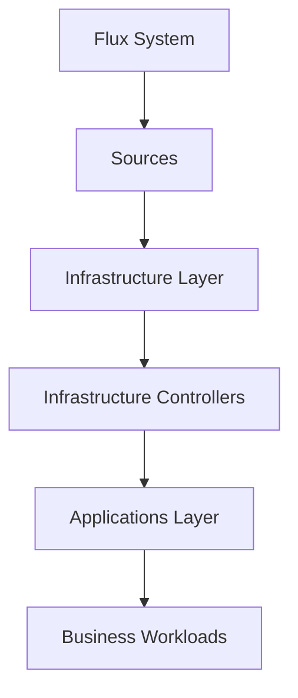

# How to Organize Infrastructure and Applications in a Flux CD Repository

Author: [nawazdhandala](https://github.com/nawazdhandala)

Tags: Flux CD, Infrastructure, Application, Repository Structure, GitOps, Kubernetes, Separation of concerns

Description: A practical guide to separating infrastructure and application layers in a Flux CD repository for clear ownership, ordered deployments, and maintainable GitOps.

---

## Introduction

One of the most important architectural decisions in a Flux CD repository is how to separate infrastructure components from application workloads. Infrastructure includes cluster-wide services like ingress controllers, cert-manager, monitoring stacks, and storage provisioners. Applications are the business workloads that run on top of that infrastructure. Properly separating these layers ensures ordered deployments, clear ownership, and independent lifecycle management.

This guide covers practical patterns for organizing infrastructure and applications in your Flux CD repository.

## Why Separate Infrastructure from Applications

The separation provides several key benefits:

- **Deployment ordering** - Infrastructure must be ready before applications can deploy
- **Different change velocity** - Infrastructure changes less frequently than applications
- **Different ownership** - Platform teams own infrastructure; application teams own apps
- **Risk isolation** - Infrastructure changes should not accidentally affect app deployments
- **Independent testing** - Each layer can be validated independently

## Dependency Flow



## Repository Structure

```text
flux-repo/
├── clusters/
│   ├── production/
│   │   ├── flux-system/
│   │   ├── sources.yaml
│   │   ├── infrastructure.yaml
│   │   └── apps.yaml
│   └── staging/
│       ├── flux-system/
│       ├── sources.yaml
│       ├── infrastructure.yaml
│       └── apps.yaml
├── infrastructure/
│   ├── sources/
│   │   ├── kustomization.yaml
│   │   └── helm-repositories.yaml
│   ├── controllers/
│   │   ├── base/
│   │   │   ├── cert-manager/
│   │   │   ├── ingress-nginx/
│   │   │   ├── external-dns/
│   │   │   └── kustomization.yaml
│   │   ├── production/
│   │   │   ├── kustomization.yaml
│   │   │   └── patches/
│   │   └── staging/
│   │       ├── kustomization.yaml
│   │       └── patches/
│   └── configs/
│       ├── base/
│       │   ├── cluster-issuers/
│       │   ├── storage-classes/
│       │   └── kustomization.yaml
│       ├── production/
│       └── staging/
└── apps/
    ├── base/
    │   ├── frontend/
    │   ├── backend-api/
    │   ├── worker/
    │   └── kustomization.yaml
    ├── production/
    │   ├── kustomization.yaml
    │   └── patches/
    └── staging/
        ├── kustomization.yaml
        └── patches/
```

## Setting Up the Deployment Pipeline

### Step 1: Sources Kustomization

Sources must be available before anything else can be deployed:

```yaml
# clusters/production/sources.yaml
apiVersion: kustomize.toolkit.fluxcd.io/v1
kind: Kustomization
metadata:
  name: sources
  namespace: flux-system
spec:
  interval: 10m
  sourceRef:
    kind: GitRepository
    name: flux-system
  path: ./infrastructure/sources
  prune: true
```

```yaml
# infrastructure/sources/helm-repositories.yaml
apiVersion: source.toolkit.fluxcd.io/v1
kind: HelmRepository
metadata:
  name: jetstack
  namespace: flux-system
spec:
  interval: 24h
  url: https://charts.jetstack.io
---
apiVersion: source.toolkit.fluxcd.io/v1
kind: HelmRepository
metadata:
  name: ingress-nginx
  namespace: flux-system
spec:
  interval: 24h
  url: https://kubernetes.github.io/ingress-nginx
---
apiVersion: source.toolkit.fluxcd.io/v1
kind: HelmRepository
metadata:
  name: prometheus-community
  namespace: flux-system
spec:
  interval: 24h
  url: https://prometheus-community.github.io/helm-charts
---
apiVersion: source.toolkit.fluxcd.io/v1
kind: HelmRepository
metadata:
  name: external-dns
  namespace: flux-system
spec:
  interval: 24h
  url: https://kubernetes-sigs.github.io/external-dns
```

```yaml
# infrastructure/sources/kustomization.yaml
apiVersion: kustomize.config.k8s.io/v1beta1
kind: Kustomization
resources:
  - helm-repositories.yaml
```

### Step 2: Infrastructure Controllers

Deploy infrastructure controllers with a dependency on sources:

```yaml
# clusters/production/infrastructure.yaml
apiVersion: kustomize.toolkit.fluxcd.io/v1
kind: Kustomization
metadata:
  name: infrastructure-controllers
  namespace: flux-system
spec:
  interval: 10m
  retryInterval: 1m
  timeout: 5m
  sourceRef:
    kind: GitRepository
    name: flux-system
  path: ./infrastructure/controllers/production
  prune: true
  wait: true
  dependsOn:
    - name: sources
---
apiVersion: kustomize.toolkit.fluxcd.io/v1
kind: Kustomization
metadata:
  name: infrastructure-configs
  namespace: flux-system
spec:
  interval: 10m
  sourceRef:
    kind: GitRepository
    name: flux-system
  path: ./infrastructure/configs/production
  prune: true
  dependsOn:
    # Configs depend on controllers being ready
    # (e.g., ClusterIssuer requires cert-manager CRDs)
    - name: infrastructure-controllers
```

### Step 3: Applications

Deploy applications with a dependency on infrastructure:

```yaml
# clusters/production/apps.yaml
apiVersion: kustomize.toolkit.fluxcd.io/v1
kind: Kustomization
metadata:
  name: apps
  namespace: flux-system
spec:
  interval: 10m
  retryInterval: 1m
  timeout: 5m
  sourceRef:
    kind: GitRepository
    name: flux-system
  path: ./apps/production
  prune: true
  dependsOn:
    # Apps depend on infrastructure being fully ready
    - name: infrastructure-controllers
    - name: infrastructure-configs
```

## Infrastructure Layer Details

### Cert-Manager

```yaml
# infrastructure/controllers/base/cert-manager/namespace.yaml
apiVersion: v1
kind: Namespace
metadata:
  name: cert-manager
```

```yaml
# infrastructure/controllers/base/cert-manager/helmrelease.yaml
apiVersion: helm.toolkit.fluxcd.io/v2
kind: HelmRelease
metadata:
  name: cert-manager
  namespace: cert-manager
spec:
  interval: 1h
  chart:
    spec:
      chart: cert-manager
      version: "1.14.x"
      sourceRef:
        kind: HelmRepository
        name: jetstack
        namespace: flux-system
  install:
    crds: CreateReplace
  upgrade:
    crds: CreateReplace
  values:
    installCRDs: true
    prometheus:
      enabled: true
```

```yaml
# infrastructure/controllers/base/cert-manager/kustomization.yaml
apiVersion: kustomize.config.k8s.io/v1beta1
kind: Kustomization
resources:
  - namespace.yaml
  - helmrelease.yaml
```

### Ingress Controller

```yaml
# infrastructure/controllers/base/ingress-nginx/namespace.yaml
apiVersion: v1
kind: Namespace
metadata:
  name: ingress-system
```

```yaml
# infrastructure/controllers/base/ingress-nginx/helmrelease.yaml
apiVersion: helm.toolkit.fluxcd.io/v2
kind: HelmRelease
metadata:
  name: ingress-nginx
  namespace: ingress-system
spec:
  interval: 1h
  chart:
    spec:
      chart: ingress-nginx
      version: "4.9.x"
      sourceRef:
        kind: HelmRepository
        name: ingress-nginx
        namespace: flux-system
  values:
    controller:
      metrics:
        enabled: true
```

### Production Overrides

```yaml
# infrastructure/controllers/production/kustomization.yaml
apiVersion: kustomize.config.k8s.io/v1beta1
kind: Kustomization
resources:
  - ../base/cert-manager
  - ../base/ingress-nginx
  - ../base/external-dns
patches:
  - path: patches/ingress-ha.yaml
    target:
      kind: HelmRelease
      name: ingress-nginx
```

```yaml
# infrastructure/controllers/production/patches/ingress-ha.yaml
apiVersion: helm.toolkit.fluxcd.io/v2
kind: HelmRelease
metadata:
  name: ingress-nginx
spec:
  values:
    controller:
      replicaCount: 3
      resources:
        requests:
          cpu: 200m
          memory: 256Mi
      autoscaling:
        enabled: true
        minReplicas: 3
        maxReplicas: 10
```

## Infrastructure Configs

Configs are resources that depend on controllers being installed first:

```yaml
# infrastructure/configs/base/cluster-issuers/letsencrypt.yaml
apiVersion: cert-manager.io/v1
kind: ClusterIssuer
metadata:
  name: letsencrypt-prod
spec:
  acme:
    server: https://acme-v02.api.letsencrypt.org/directory
    email: platform@example.com
    privateKeySecretRef:
      name: letsencrypt-prod-key
    solvers:
      - http01:
          ingress:
            class: nginx
```

```yaml
# infrastructure/configs/base/cluster-issuers/kustomization.yaml
apiVersion: kustomize.config.k8s.io/v1beta1
kind: Kustomization
resources:
  - letsencrypt.yaml
```

## Applications Layer

```yaml
# apps/base/frontend/deployment.yaml
apiVersion: apps/v1
kind: Deployment
metadata:
  name: frontend
  namespace: apps
spec:
  replicas: 2
  selector:
    matchLabels:
      app: frontend
  template:
    metadata:
      labels:
        app: frontend
    spec:
      containers:
        - name: frontend
          image: registry.example.com/frontend:latest
          ports:
            - containerPort: 3000
          resources:
            requests:
              cpu: 100m
              memory: 128Mi
```

```yaml
# apps/base/frontend/ingress.yaml
# This depends on ingress-nginx and cert-manager being available
apiVersion: networking.k8s.io/v1
kind: Ingress
metadata:
  name: frontend
  namespace: apps
  annotations:
    cert-manager.io/cluster-issuer: letsencrypt-prod
spec:
  ingressClassName: nginx
  tls:
    - hosts:
        - "${FRONTEND_HOST}"
      secretName: frontend-tls
  rules:
    - host: "${FRONTEND_HOST}"
      http:
        paths:
          - path: /
            pathType: Prefix
            backend:
              service:
                name: frontend
                port:
                  number: 3000
```

## Splitting Infrastructure into Sub-Layers

For large clusters, you may need finer-grained dependency ordering:

```yaml
# clusters/production/infrastructure-crds.yaml
# Layer 1: CRD-providing controllers
apiVersion: kustomize.toolkit.fluxcd.io/v1
kind: Kustomization
metadata:
  name: infra-crds
  namespace: flux-system
spec:
  interval: 10m
  sourceRef:
    kind: GitRepository
    name: flux-system
  path: ./infrastructure/crds/production
  prune: true
  wait: true
  dependsOn:
    - name: sources
---
# Layer 2: Controllers that depend on CRDs
apiVersion: kustomize.toolkit.fluxcd.io/v1
kind: Kustomization
metadata:
  name: infra-controllers
  namespace: flux-system
spec:
  interval: 10m
  sourceRef:
    kind: GitRepository
    name: flux-system
  path: ./infrastructure/controllers/production
  prune: true
  wait: true
  dependsOn:
    - name: infra-crds
---
# Layer 3: Configuration resources
apiVersion: kustomize.toolkit.fluxcd.io/v1
kind: Kustomization
metadata:
  name: infra-configs
  namespace: flux-system
spec:
  interval: 10m
  sourceRef:
    kind: GitRepository
    name: flux-system
  path: ./infrastructure/configs/production
  prune: true
  dependsOn:
    - name: infra-controllers
```

## Monitoring the Dependency Chain

Verify that all layers are healthy and ordered correctly:

```bash
# Check all Kustomizations and their dependency status
flux get kustomizations

# Expected output showing dependency order:
# NAME                  REVISION    READY   MESSAGE
# sources               main/abc    True    Applied revision: main/abc
# infra-crds            main/abc    True    Applied revision: main/abc
# infra-controllers     main/abc    True    Applied revision: main/abc
# infra-configs         main/abc    True    Applied revision: main/abc
# apps                  main/abc    True    Applied revision: main/abc

# Check for dependency issues
flux events --for Kustomization/apps -n flux-system | grep -i depend
```

## Best Practices

1. **Use `wait: true` for infrastructure** - Ensure infrastructure controllers are fully ready before dependent layers deploy.
2. **Separate CRDs from controllers** - CRD installation can be a separate layer to handle ordering with custom resources.
3. **Keep sources independent** - HelmRepository and GitRepository definitions should not depend on other layers.
4. **Use consistent naming** - Name infrastructure Kustomizations clearly (e.g., `infra-controllers`, `infra-configs`).
5. **Limit cross-layer references** - Applications should reference infrastructure through well-defined interfaces (ingress classes, cluster issuers) not internal details.
6. **Test layers independently** - Validate that each layer builds successfully on its own with `kustomize build`.
7. **Document the dependency chain** - Make it clear which layers depend on which, especially for on-call engineers.

## Conclusion

Separating infrastructure and applications in your Flux CD repository creates a clear, ordered deployment pipeline. Infrastructure components deploy first and reach a healthy state before applications that depend on them are deployed. This layered approach prevents race conditions, makes debugging easier, and allows different teams to own different parts of the stack. Start with a simple two-layer split (infrastructure and apps) and add sub-layers only when the dependency ordering demands it.
