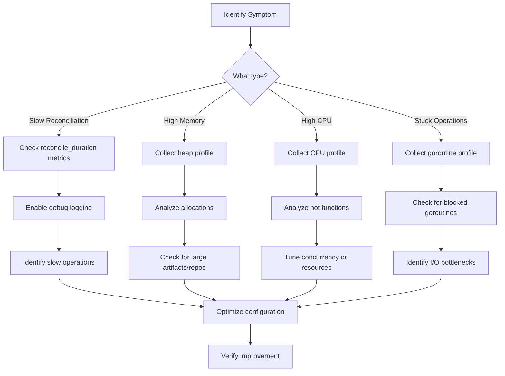

# How to Profile Flux CD Controller Performance

Author: [nawazdhandala](https://github.com/nawazdhandala)

Tags: Flux CD, GitOps, Performance Profiling, Prometheus, Go pprof, Optimization, Kubernetes

Description: A hands-on guide to profiling Flux CD controller performance using Go pprof, Prometheus metrics, and Kubernetes resource analysis to identify and resolve bottlenecks.

---

## Introduction

Flux CD controllers are Go applications running in your Kubernetes cluster. When reconciliation becomes slow or controllers consume excessive resources, profiling helps pinpoint the root cause. This guide covers how to use Go's built-in pprof profiler, Prometheus metrics, and Kubernetes tools to diagnose and optimize Flux CD controller performance.

## Understanding Flux CD Controller Architecture

Each Flux CD controller is a Go binary built on the controller-runtime library. Performance bottlenecks typically fall into these categories:

- **CPU-bound** - Complex Kustomize overlays, large Helm charts, or many concurrent reconciliations
- **Memory-bound** - Large Git repositories, many cached artifacts, or memory leaks
- **I/O-bound** - Slow Git clones, registry pulls, or API server responses
- **Concurrency-bound** - Too few workers for the number of resources to reconcile

## Enabling Go pprof on Flux Controllers

### Patch Controllers to Enable pprof

```yaml
# enable-pprof-patch.yaml
# Apply this patch to enable the pprof endpoint on Flux controllers
apiVersion: kustomize.config.k8s.io/v1beta1
kind: Kustomization
resources:
  - gotk-components.yaml
  - gotk-sync.yaml
patches:
  # Enable pprof on source-controller
  - target:
      kind: Deployment
      name: source-controller
    patch: |
      - op: add
        path: /spec/template/spec/containers/0/args/-
        value: --enable-pprof=true
      - op: add
        path: /spec/template/spec/containers/0/args/-
        value: --pprof-addr=:6060
      - op: add
        path: /spec/template/spec/containers/0/ports/-
        value:
          containerPort: 6060
          name: pprof
          protocol: TCP
  # Enable pprof on kustomize-controller
  - target:
      kind: Deployment
      name: kustomize-controller
    patch: |
      - op: add
        path: /spec/template/spec/containers/0/args/-
        value: --enable-pprof=true
      - op: add
        path: /spec/template/spec/containers/0/args/-
        value: --pprof-addr=:6060
  # Enable pprof on helm-controller
  - target:
      kind: Deployment
      name: helm-controller
    patch: |
      - op: add
        path: /spec/template/spec/containers/0/args/-
        value: --enable-pprof=true
      - op: add
        path: /spec/template/spec/containers/0/args/-
        value: --pprof-addr=:6060
```

## Collecting CPU Profiles

### Port-Forward to the Controller

```bash
# Forward the pprof port for the source-controller
kubectl port-forward -n flux-system deploy/source-controller 6060:6060 &

# Verify pprof is accessible
curl -s http://localhost:6060/debug/pprof/ | head -20
```

### Capture a CPU Profile

```bash
# Capture a 30-second CPU profile
# This samples the CPU usage to identify hot functions
go tool pprof -http=:8081 http://localhost:6060/debug/pprof/profile?seconds=30

# Save the profile to a file for later analysis
curl -o cpu-profile.pb.gz http://localhost:6060/debug/pprof/profile?seconds=30

# Analyze the saved profile
go tool pprof -http=:8081 cpu-profile.pb.gz
```

### Capture a Memory Profile

```bash
# Capture current heap allocation profile
# Shows where memory is being allocated
go tool pprof -http=:8081 http://localhost:6060/debug/pprof/heap

# Save heap profile
curl -o heap-profile.pb.gz http://localhost:6060/debug/pprof/heap

# Analyze with focus on in-use memory
go tool pprof -inuse_space -http=:8081 heap-profile.pb.gz

# Analyze with focus on allocated memory (even if freed)
go tool pprof -alloc_space -http=:8081 heap-profile.pb.gz
```

### Capture Goroutine Profile

```bash
# Check goroutine count and state
# High goroutine count may indicate leaks or blocked operations
curl -s http://localhost:6060/debug/pprof/goroutine?debug=2 | head -100

# Get goroutine profile for visualization
go tool pprof -http=:8081 http://localhost:6060/debug/pprof/goroutine
```

### Capture Block and Mutex Profiles

```bash
# Block profile shows where goroutines are blocked waiting
# Useful for identifying I/O bottlenecks
go tool pprof -http=:8081 http://localhost:6060/debug/pprof/block

# Mutex profile shows lock contention
# Useful for identifying concurrency bottlenecks
go tool pprof -http=:8081 http://localhost:6060/debug/pprof/mutex
```

## Using Prometheus Metrics for Performance Analysis

### Key Performance Metrics

```yaml
# prometheus-recording-rules.yaml
apiVersion: monitoring.coreos.com/v1
kind: PrometheusRule
metadata:
  name: flux-performance-recording
  namespace: flux-system
spec:
  groups:
    - name: flux-performance
      # Recording rules pre-compute expensive queries
      rules:
        # Average reconciliation duration by controller
        - record: flux:reconcile_duration:avg
          expr: |
            rate(gotk_reconcile_duration_seconds_sum[5m])
            /
            rate(gotk_reconcile_duration_seconds_count[5m])

        # P95 reconciliation duration by controller
        - record: flux:reconcile_duration:p95
          expr: |
            histogram_quantile(0.95,
              rate(gotk_reconcile_duration_seconds_bucket[5m])
            )

        # Reconciliation throughput (reconciliations per second)
        - record: flux:reconcile_throughput:rate5m
          expr: |
            rate(gotk_reconcile_duration_seconds_count[5m])

        # Controller memory usage
        - record: flux:controller_memory:bytes
          expr: |
            container_memory_working_set_bytes{
              namespace="flux-system",
              container!="POD",
              container!=""
            }

        # Controller CPU usage
        - record: flux:controller_cpu:rate5m
          expr: |
            rate(container_cpu_usage_seconds_total{
              namespace="flux-system",
              container!="POD",
              container!=""
            }[5m])
```

### Performance Alerting

```yaml
# flux-performance-alerts.yaml
apiVersion: monitoring.coreos.com/v1
kind: PrometheusRule
metadata:
  name: flux-performance-alerts
  namespace: flux-system
spec:
  groups:
    - name: flux-performance-alerts
      rules:
        # Alert when reconciliation is consistently slow
        - alert: FluxReconciliationSlow
          expr: |
            flux:reconcile_duration:p95 > 120
          for: 15m
          labels:
            severity: warning
          annotations:
            summary: "Flux reconciliation P95 latency exceeds 2 minutes"
            description: >
              Controller {{ $labels.kind }} has P95 reconciliation latency
              of {{ $value }}s. Investigate with pprof profiling.

        # Alert on high memory usage
        - alert: FluxControllerHighMemory
          expr: |
            flux:controller_memory:bytes > 1e9
          for: 10m
          labels:
            severity: warning
          annotations:
            summary: "Flux controller using over 1GB memory"
            description: >
              {{ $labels.pod }} is using {{ $value | humanize1024 }} of memory.
              Consider collecting a heap profile.

        # Alert on high CPU usage
        - alert: FluxControllerHighCPU
          expr: |
            flux:controller_cpu:rate5m > 0.8
          for: 10m
          labels:
            severity: warning
          annotations:
            summary: "Flux controller CPU usage above 80%"
            description: >
              {{ $labels.pod }} CPU usage is {{ $value | humanizePercentage }}.
              Consider collecting a CPU profile.
```

## Analyzing Reconciliation Performance

### Identify Slow Reconciliations

```bash
# Find GitRepository objects with slow reconciliation
kubectl get gitrepositories -A -o jsonpath='{range .items[*]}{.metadata.namespace}/{.metadata.name}: last={.status.artifact.lastUpdateTime}{"\n"}{end}'

# Find Kustomizations that take longest to reconcile
kubectl get kustomizations -A -o jsonpath='{range .items[*]}{.metadata.namespace}/{.metadata.name}: ready={.status.conditions[?(@.type=="Ready")].status} msg={.status.conditions[?(@.type=="Ready")].message}{"\n"}{end}'

# Check HelmRelease reconciliation times
kubectl get helmreleases -A -o jsonpath='{range .items[*]}{.metadata.namespace}/{.metadata.name}: ready={.status.conditions[?(@.type=="Ready")].status}{"\n"}{end}'
```

### Benchmark Reconciliation with Trace Logging

```yaml
# enable-trace-logging.yaml
# Temporarily enable verbose logging for performance analysis
apiVersion: kustomize.config.k8s.io/v1beta1
kind: Kustomization
resources:
  - gotk-components.yaml
  - gotk-sync.yaml
patches:
  - target:
      kind: Deployment
      name: source-controller
    patch: |
      - op: add
        path: /spec/template/spec/containers/0/args/-
        value: --log-level=debug
  - target:
      kind: Deployment
      name: kustomize-controller
    patch: |
      - op: add
        path: /spec/template/spec/containers/0/args/-
        value: --log-level=debug
```

```bash
# Analyze source-controller debug logs for timing information
kubectl logs -n flux-system deploy/source-controller --since=5m | \
  grep -E "reconcil|fetch|clone|checkout" | head -50

# Look for slow Git operations
kubectl logs -n flux-system deploy/source-controller --since=5m | \
  grep -E "duration|elapsed|took" | head -50
```

## Optimizing Controller Performance

### Tune Controller Resources Based on Profile Results

```yaml
# optimized-controller-resources.yaml
apiVersion: kustomize.config.k8s.io/v1beta1
kind: Kustomization
resources:
  - gotk-components.yaml
  - gotk-sync.yaml
patches:
  # Source controller - often needs more memory for large repos
  - target:
      kind: Deployment
      name: source-controller
    patch: |
      - op: replace
        path: /spec/template/spec/containers/0/resources
        value:
          requests:
            cpu: 250m
            memory: 512Mi
          limits:
            cpu: "1"
            memory: 2Gi
  # Kustomize controller - CPU intensive for complex overlays
  - target:
      kind: Deployment
      name: kustomize-controller
    patch: |
      - op: replace
        path: /spec/template/spec/containers/0/resources
        value:
          requests:
            cpu: 500m
            memory: 256Mi
          limits:
            cpu: "2"
            memory: 1Gi
  # Helm controller - needs memory for large charts
  - target:
      kind: Deployment
      name: helm-controller
    patch: |
      - op: replace
        path: /spec/template/spec/containers/0/resources
        value:
          requests:
            cpu: 250m
            memory: 512Mi
          limits:
            cpu: "1"
            memory: 2Gi
```

### Optimize Concurrency Settings

```yaml
# concurrency-tuning.yaml
apiVersion: kustomize.config.k8s.io/v1beta1
kind: Kustomization
resources:
  - gotk-components.yaml
  - gotk-sync.yaml
patches:
  - target:
      kind: Deployment
      name: source-controller
    patch: |
      - op: add
        path: /spec/template/spec/containers/0/args/-
        # Allow 10 concurrent Git fetches
        value: --concurrent=10
  - target:
      kind: Deployment
      name: kustomize-controller
    patch: |
      - op: add
        path: /spec/template/spec/containers/0/args/-
        # Allow 10 concurrent Kustomize builds
        value: --concurrent=10
      - op: add
        path: /spec/template/spec/containers/0/args/-
        # Requeue dependency check interval
        value: --requeue-dependency=5s
```

## Profiling Workflow

A systematic approach to profiling Flux CD controllers:



## Best Practices Summary

1. **Enable pprof in staging first** - Test profiling configuration before production
2. **Collect baseline profiles** - Profile when things are working well for comparison
3. **Use recording rules** - Pre-compute expensive Prometheus queries for dashboards
4. **Profile one controller at a time** - Isolate the bottleneck before optimizing
5. **Check goroutine counts** - Growing goroutine counts indicate leaks
6. **Monitor memory trends** - Steadily growing memory usage suggests a leak
7. **Tune concurrency carefully** - More concurrency needs more CPU and memory
8. **Remove debug logging after profiling** - Verbose logging adds overhead

## Conclusion

Profiling Flux CD controllers is essential for maintaining high-performance GitOps pipelines. By combining Go pprof for deep runtime analysis with Prometheus metrics for continuous monitoring, you can identify bottlenecks, optimize resource allocation, and ensure your controllers keep up with reconciliation demands. Always profile in a systematic way: identify the symptom, collect the right profile, analyze the data, and verify the fix.
