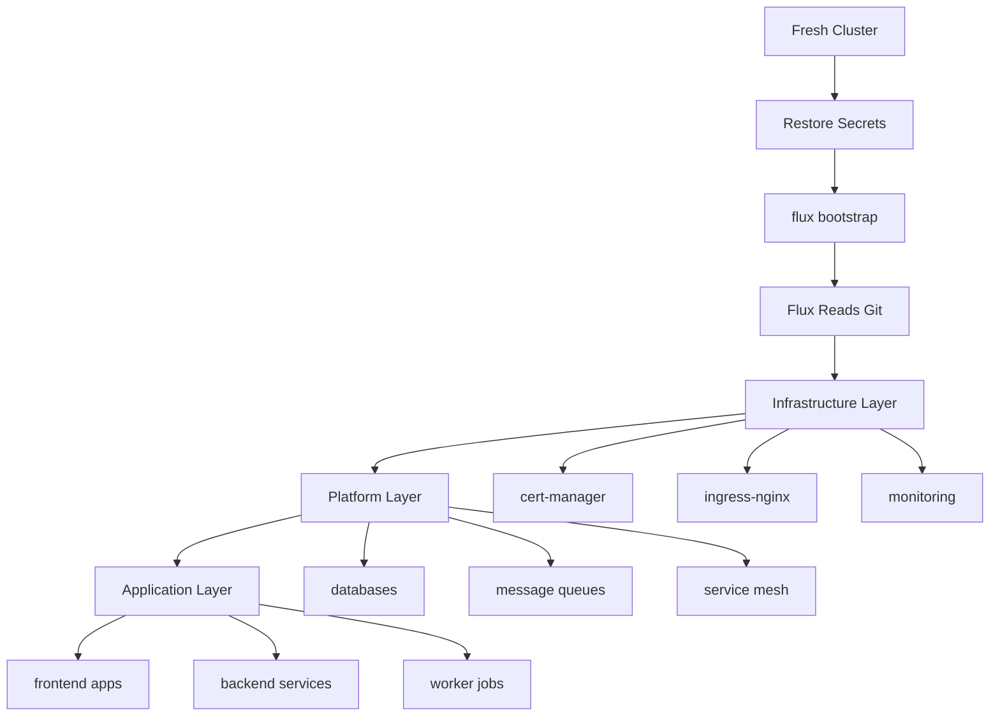

# How to Rebuild a Kubernetes Cluster from Git with Flux CD

Author: [nawazdhandala](https://github.com/nawazdhandala)

Tags: Flux CD, Kubernetes, GitOps, Cluster rebuild, Infrastructure as Code, Disaster Recovery

Description: A complete guide to rebuilding an entire Kubernetes cluster from scratch using only your Git repository and Flux CD.

---

## Introduction

One of the most powerful promises of GitOps is the ability to rebuild your entire infrastructure from Git. With Flux CD, your Git repository serves as the single source of truth for everything running in your cluster. This guide demonstrates how to take a bare Kubernetes cluster and fully reconstruct all infrastructure components, applications, and configurations using only your Git repository and Flux CD.

## Prerequisites

- A fresh Kubernetes cluster (any provider)
- Access to the Git repository containing your Flux CD configuration
- Backup of critical secrets (SOPS keys, deploy keys)
- kubectl and Flux CLI installed
- DNS access for updating records

## The Rebuild Philosophy

A properly structured GitOps repository should allow you to recreate your cluster with a single bootstrap command plus secret restoration. Everything else should reconcile automatically.



## Repository Structure for Full Rebuild

A well-organized repository ensures that resources are deployed in the correct order.

```yaml
# fleet-repo/
#   infrastructure/
#     controllers/            # Cluster-wide controllers
#       cert-manager/
#       ingress-nginx/
#       external-dns/
#       sealed-secrets/
#     configs/                # Cluster-wide configurations
#       cluster-issuers/
#       storage-classes/
#       priority-classes/
#   platform/
#     monitoring/             # Observability stack
#       prometheus/
#       grafana/
#       loki/
#     databases/              # Data stores
#       postgresql/
#       redis/
#     messaging/              # Message brokers
#       rabbitmq/
#   apps/
#     production/             # Production applications
#       frontend/
#       backend/
#       workers/
#     staging/                # Staging applications
#   clusters/
#     production/             # Cluster-specific entry point
#       infrastructure.yaml
#       platform.yaml
#       apps.yaml
```

## Step 1: Provision the Cluster

Create a fresh Kubernetes cluster using your infrastructure-as-code tooling.

```bash
# Example with Terraform
cd terraform/production
terraform init
terraform apply -auto-approve

# Or with a cloud provider CLI
# AWS EKS
eksctl create cluster -f cluster-config.yaml

# GCP GKE
gcloud container clusters create production \
  --region us-central1 \
  --num-nodes 3 \
  --machine-type e2-standard-4

# Verify the cluster is ready
kubectl get nodes
kubectl get ns
```

## Step 2: Restore Pre-Bootstrap Secrets

Before Flux can operate, certain secrets must be in place.

```bash
#!/bin/bash
# scripts/pre-bootstrap.sh
# Prepares the cluster with required secrets before Flux bootstrap

set -e

echo "=== Pre-Bootstrap Setup ==="

# Create the flux-system namespace
kubectl create namespace flux-system --dry-run=client -o yaml | kubectl apply -f -

# Restore SOPS Age key for secret decryption
echo "Restoring SOPS decryption key..."
kubectl create secret generic sops-age \
  --namespace flux-system \
  --from-file=age.agekey="$HOME/.config/sops/age/keys.txt" \
  --dry-run=client -o yaml | kubectl apply -f -

# Restore any external secret store credentials
echo "Restoring external secret credentials..."
kubectl create namespace external-secrets --dry-run=client -o yaml | kubectl apply -f -

# If using Sealed Secrets, restore the sealing key
echo "Restoring Sealed Secrets key..."
kubectl create namespace sealed-secrets --dry-run=client -o yaml | kubectl apply -f -
kubectl apply -f /path/to/backup/sealed-secrets-key.yaml 2>/dev/null || \
  echo "No Sealed Secrets key backup found - new key will be generated"

echo "Pre-bootstrap setup complete"
```

## Step 3: Bootstrap Flux CD

Bootstrap Flux CD pointing to your repository. This single command starts the entire rebuild.

```bash
# Bootstrap Flux CD
flux bootstrap github \
  --owner=myorg \
  --repository=fleet-repo \
  --branch=main \
  --path=clusters/production \
  --components-extra=image-reflector-controller,image-automation-controller

# Flux will now:
# 1. Install Flux controllers
# 2. Create a GitRepository source pointing to your repo
# 3. Create a Kustomization for clusters/production/
# 4. Begin reconciling everything defined in that path
```

## Step 4: The Reconciliation Chain

Your cluster entry point defines the order of reconciliation using dependencies.

```yaml
# clusters/production/infrastructure.yaml
apiVersion: kustomize.toolkit.fluxcd.io/v1
kind: Kustomization
metadata:
  name: infrastructure-controllers
  namespace: flux-system
spec:
  interval: 10m
  sourceRef:
    kind: GitRepository
    name: flux-system
  path: ./infrastructure/controllers
  prune: true
  wait: true
  timeout: 10m
  # Decrypt SOPS-encrypted secrets
  decryption:
    provider: sops
    secretRef:
      name: sops-age

---
apiVersion: kustomize.toolkit.fluxcd.io/v1
kind: Kustomization
metadata:
  name: infrastructure-configs
  namespace: flux-system
spec:
  interval: 10m
  dependsOn:
    # Wait for controllers to be installed first
    - name: infrastructure-controllers
  sourceRef:
    kind: GitRepository
    name: flux-system
  path: ./infrastructure/configs
  prune: true
  wait: true
  decryption:
    provider: sops
    secretRef:
      name: sops-age
```

```yaml
# clusters/production/platform.yaml
apiVersion: kustomize.toolkit.fluxcd.io/v1
kind: Kustomization
metadata:
  name: platform
  namespace: flux-system
spec:
  interval: 10m
  dependsOn:
    # Platform depends on infrastructure being ready
    - name: infrastructure-controllers
    - name: infrastructure-configs
  sourceRef:
    kind: GitRepository
    name: flux-system
  path: ./platform
  prune: true
  wait: true
  timeout: 15m
  decryption:
    provider: sops
    secretRef:
      name: sops-age
```

```yaml
# clusters/production/apps.yaml
apiVersion: kustomize.toolkit.fluxcd.io/v1
kind: Kustomization
metadata:
  name: apps
  namespace: flux-system
spec:
  interval: 10m
  dependsOn:
    # Apps depend on platform services being available
    - name: platform
  sourceRef:
    kind: GitRepository
    name: flux-system
  path: ./apps/production
  prune: true
  wait: true
  timeout: 15m
  decryption:
    provider: sops
    secretRef:
      name: sops-age
```

## Infrastructure Layer Examples

### Cert-Manager

```yaml
# infrastructure/controllers/cert-manager/helmrelease.yaml
apiVersion: helm.toolkit.fluxcd.io/v2
kind: HelmRelease
metadata:
  name: cert-manager
  namespace: cert-manager
spec:
  interval: 30m
  chart:
    spec:
      chart: cert-manager
      version: ">=1.14.0 <2.0.0"
      sourceRef:
        kind: HelmRepository
        name: jetstack
        namespace: cert-manager
  values:
    installCRDs: true
    # Enable DNS01 challenge for wildcard certificates
    dns01RecursiveNameserversOnly: true
    resources:
      limits:
        cpu: 200m
        memory: 256Mi
      requests:
        cpu: 50m
        memory: 64Mi
```

### Ingress Controller

```yaml
# infrastructure/controllers/ingress-nginx/helmrelease.yaml
apiVersion: helm.toolkit.fluxcd.io/v2
kind: HelmRelease
metadata:
  name: ingress-nginx
  namespace: ingress-nginx
spec:
  interval: 30m
  chart:
    spec:
      chart: ingress-nginx
      version: ">=4.9.0 <5.0.0"
      sourceRef:
        kind: HelmRepository
        name: ingress-nginx
        namespace: ingress-nginx
  values:
    controller:
      replicaCount: 2
      resources:
        limits:
          cpu: 500m
          memory: 512Mi
        requests:
          cpu: 100m
          memory: 128Mi
      # Enable metrics for monitoring
      metrics:
        enabled: true
        serviceMonitor:
          enabled: true
```

## Platform Layer Examples

### PostgreSQL

```yaml
# platform/databases/postgresql/helmrelease.yaml
apiVersion: helm.toolkit.fluxcd.io/v2
kind: HelmRelease
metadata:
  name: postgresql
  namespace: databases
spec:
  interval: 30m
  chart:
    spec:
      chart: postgresql
      version: ">=15.0.0 <16.0.0"
      sourceRef:
        kind: HelmRepository
        name: bitnami
        namespace: databases
  values:
    auth:
      existingSecret: postgresql-credentials
    primary:
      persistence:
        enabled: true
        size: 50Gi
        storageClass: gp3
      resources:
        limits:
          cpu: "2"
          memory: 4Gi
        requests:
          cpu: 500m
          memory: 1Gi
    # Enable metrics
    metrics:
      enabled: true
      serviceMonitor:
        enabled: true
```

## Application Layer Example

```yaml
# apps/production/backend/deployment.yaml
apiVersion: apps/v1
kind: Deployment
metadata:
  name: backend-api
  namespace: production
  labels:
    app.kubernetes.io/name: backend-api
    app.kubernetes.io/version: "2.5.0"
    app.kubernetes.io/component: backend
    team: team-backend
    environment: production
spec:
  replicas: 3
  selector:
    matchLabels:
      app.kubernetes.io/name: backend-api
  template:
    metadata:
      labels:
        app.kubernetes.io/name: backend-api
        app.kubernetes.io/component: backend
        team: team-backend
    spec:
      containers:
        - name: api
          image: ghcr.io/myorg/backend-api:v2.5.0
          ports:
            - containerPort: 8080
          resources:
            limits:
              cpu: "1"
              memory: 512Mi
            requests:
              cpu: 250m
              memory: 256Mi
          # Health checks for proper orchestration
          livenessProbe:
            httpGet:
              path: /healthz
              port: 8080
            initialDelaySeconds: 10
          readinessProbe:
            httpGet:
              path: /ready
              port: 8080
            initialDelaySeconds: 5
          env:
            - name: DATABASE_URL
              valueFrom:
                secretKeyRef:
                  name: backend-secrets
                  key: database-url
```

## Monitoring the Rebuild

Track the progress of the full cluster rebuild.

```bash
#!/bin/bash
# scripts/monitor-rebuild.sh
# Monitors the rebuild progress of all Flux resources

echo "=== Cluster Rebuild Progress ==="

while true; do
  clear
  echo "=== Cluster Rebuild Progress - $(date -u) ==="
  echo ""

  # Infrastructure status
  echo "--- Infrastructure ---"
  flux get kustomization infrastructure-controllers 2>/dev/null || echo "Not started"
  flux get kustomization infrastructure-configs 2>/dev/null || echo "Not started"

  # Platform status
  echo ""
  echo "--- Platform ---"
  flux get kustomization platform 2>/dev/null || echo "Not started"

  # Application status
  echo ""
  echo "--- Applications ---"
  flux get kustomization apps 2>/dev/null || echo "Not started"

  # HelmRelease status
  echo ""
  echo "--- Helm Releases ---"
  flux get helmreleases -A 2>/dev/null

  # Pod status summary
  echo ""
  echo "--- Pod Summary ---"
  kubectl get pods -A --no-headers 2>/dev/null | \
    awk '{status[$4]++} END {for (s in status) printf "%s: %d  ", s, status[s]}'
  echo ""

  # Check if everything is ready
  NOT_READY=$(flux get kustomizations -A --no-header 2>/dev/null | grep -v True | wc -l)
  if [ "$NOT_READY" -eq 0 ]; then
    echo ""
    echo "ALL KUSTOMIZATIONS ARE READY - Rebuild complete!"
    break
  fi

  sleep 15
done
```

## Post-Rebuild Verification

```bash
#!/bin/bash
# scripts/verify-rebuild.sh
# Comprehensive verification after cluster rebuild

echo "=== Post-Rebuild Verification ==="

# Verify Flux health
echo ""
echo "1. Flux Health Check"
flux check

# Verify all sources are synced
echo ""
echo "2. Source Sync Status"
flux get sources all -A

# Verify all reconciliations succeeded
echo ""
echo "3. Reconciliation Status"
flux get all -A

# Verify critical services
echo ""
echo "4. Critical Services"
echo "Ingress Controller:"
kubectl get pods -n ingress-nginx
echo ""
echo "Cert Manager:"
kubectl get pods -n cert-manager
echo ""
echo "Monitoring:"
kubectl get pods -n monitoring

# Verify TLS certificates
echo ""
echo "5. TLS Certificates"
kubectl get certificates -A

# Verify persistent volumes
echo ""
echo "6. Persistent Volumes"
kubectl get pv
kubectl get pvc -A

# Run application health checks
echo ""
echo "7. Application Health"
kubectl get pods -n production -o wide
kubectl get ingress -n production

echo ""
echo "=== Verification Complete ==="
```

## Restoring Stateful Data

After the cluster is rebuilt, restore data for stateful services.

```bash
# Restore database from backup
echo "Restoring PostgreSQL data..."
kubectl exec -n databases deployment/postgresql -- \
  pg_restore -U postgres -d production \
  --clean --if-exists \
  /backup/production-latest.dump

# Restore Redis data if needed
echo "Restoring Redis data..."
kubectl cp backup/dump.rdb databases/redis-master-0:/data/dump.rdb
kubectl exec -n databases redis-master-0 -- redis-cli BGSAVE

# Restore object storage state
echo "Syncing object storage..."
# aws s3 sync s3://backup-bucket/uploads s3://production-bucket/uploads
```

## Conclusion

Rebuilding a Kubernetes cluster from Git with Flux CD proves the value of GitOps in its most dramatic form. A properly structured Git repository with clear dependency chains allows you to go from a bare cluster to a fully operational production environment with a single bootstrap command. The key ingredients are a layered repository structure with explicit dependencies, proper secret management with SOPS or Sealed Secrets, comprehensive infrastructure-as-code for all cluster components, and automated verification scripts. Regular rebuild drills from scratch validate that your Git repository truly represents the complete state of your cluster, giving you confidence that recovery from any disaster is predictable and repeatable.
