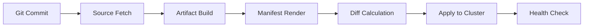

# How to Reduce Flux CD Reconciliation Time

Author: [nawazdhandala](https://github.com/nawazdhandala)

Tags: flux cd, kubernetes, gitops, reconciliation, performance tuning, latency optimization

Description: A practical guide to reducing Flux CD reconciliation time through source optimization, parallel processing, dependency management, and caching strategies.

---

Reconciliation time is the duration between when a change is committed to Git and when that change is fully applied to the cluster. Long reconciliation times slow down deployments and degrade the developer experience. This guide covers practical techniques to minimize reconciliation latency in Flux CD.

## Understanding the Reconciliation Pipeline

A typical Flux CD reconciliation involves several stages, each contributing to total latency:



Each stage can be optimized independently. The total reconciliation time is the sum of all stages plus any wait time between reconciliation intervals.

## Enabling Webhook Receivers for Instant Triggers

By default, Flux polls sources at fixed intervals. Webhooks eliminate polling delay entirely.

```yaml
# Receiver that triggers reconciliation on Git push events
apiVersion: notification.toolkit.fluxcd.io/v1
kind: Receiver
metadata:
  name: github-receiver
  namespace: flux-system
spec:
  type: github
  # Events that should trigger reconciliation
  events:
    - "ping"
    - "push"
  secretRef:
    name: receiver-token
  resources:
    # Trigger these resources immediately on push
    - kind: GitRepository
      name: my-app
      namespace: flux-system
---
# Secret containing the webhook token
apiVersion: v1
kind: Secret
metadata:
  name: receiver-token
  namespace: flux-system
type: Opaque
stringData:
  # Use a strong, randomly generated token
  token: "your-webhook-secret-token-here"
```

Expose the receiver endpoint:

```yaml
# Ingress to expose the webhook receiver endpoint
apiVersion: networking.k8s.io/v1
kind: Ingress
metadata:
  name: flux-receiver
  namespace: flux-system
  annotations:
    # Use your ingress controller's annotations
    nginx.ingress.kubernetes.io/ssl-redirect: "true"
spec:
  rules:
    - host: flux-webhook.example.com
      http:
        paths:
          - path: /
            pathType: Prefix
            backend:
              service:
                name: webhook-receiver
                port:
                  number: 80
```

## Optimizing Source Fetch Time

### Use Shallow Clones

Shallow clones fetch only recent history, dramatically reducing clone time for repositories with long histories.

```yaml
# GitRepository configured for fast shallow clones
apiVersion: source.toolkit.fluxcd.io/v1
kind: GitRepository
metadata:
  name: my-app
  namespace: flux-system
spec:
  interval: 5m
  url: https://github.com/example/my-app
  ref:
    branch: main
  ignore: |
    # Exclude everything except deployment manifests
    /*
    !/deploy/
    !/base/
```

### Use Specific References

Pinning to a specific branch or tag avoids unnecessary ref resolution.

```yaml
# GitRepository pinned to a specific commit for deterministic fetches
apiVersion: source.toolkit.fluxcd.io/v1
kind: GitRepository
metadata:
  name: my-app-pinned
  namespace: flux-system
spec:
  interval: 10m
  url: https://github.com/example/my-app
  ref:
    # Using a specific tag reduces ref resolution time
    tag: "v1.2.3"
```

## Increasing Controller Concurrency

Allow controllers to process multiple reconciliations in parallel.

```yaml
# Increase concurrency on kustomize-controller for faster throughput
apiVersion: apps/v1
kind: Deployment
metadata:
  name: kustomize-controller
  namespace: flux-system
spec:
  template:
    spec:
      containers:
        - name: manager
          args:
            # Increase from default of 4 to 8 for faster parallel processing
            # Requires sufficient CPU and memory headroom
            - --concurrent=8
            # Reduce requeue delay for dependent resources
            - --requeue-dependency=5s
---
# Increase concurrency on source-controller for faster fetches
apiVersion: apps/v1
kind: Deployment
metadata:
  name: source-controller
  namespace: flux-system
spec:
  template:
    spec:
      containers:
        - name: manager
          args:
            - --storage-path=/data
            - --storage-adv-addr=source-controller.$(RUNTIME_NAMESPACE).svc.cluster.local.
            # Allow more concurrent source fetches
            - --concurrent=8
---
# Increase concurrency on helm-controller
apiVersion: apps/v1
kind: Deployment
metadata:
  name: helm-controller
  namespace: flux-system
spec:
  template:
    spec:
      containers:
        - name: manager
          args:
            # More concurrent Helm releases
            - --concurrent=8
```

## Optimizing Kustomization Dependencies

Poorly structured dependencies create serialization bottlenecks. Minimize the dependency chain depth.

```yaml
# Bad: Deep dependency chain (each waits for the previous)
# infra -> cert-manager -> ingress -> apps -> monitoring
# Total time = sum of all reconciliation times

# Good: Shallow dependency tree with parallel branches
# infra -> cert-manager
# infra -> ingress-controller
# cert-manager + ingress-controller -> apps
# infra -> monitoring (independent branch)

# Infrastructure base - no dependencies, reconciles immediately
apiVersion: kustomize.toolkit.fluxcd.io/v1
kind: Kustomization
metadata:
  name: infrastructure
  namespace: flux-system
spec:
  interval: 30m
  path: ./infrastructure/base
  prune: true
  sourceRef:
    kind: GitRepository
    name: fleet-infra
---
# Cert-manager depends only on infrastructure
apiVersion: kustomize.toolkit.fluxcd.io/v1
kind: Kustomization
metadata:
  name: cert-manager
  namespace: flux-system
spec:
  interval: 30m
  dependsOn:
    - name: infrastructure
  path: ./infrastructure/cert-manager
  prune: true
  sourceRef:
    kind: GitRepository
    name: fleet-infra
---
# Ingress also depends only on infrastructure (parallel with cert-manager)
apiVersion: kustomize.toolkit.fluxcd.io/v1
kind: Kustomization
metadata:
  name: ingress-controller
  namespace: flux-system
spec:
  interval: 30m
  dependsOn:
    - name: infrastructure
  path: ./infrastructure/ingress
  prune: true
  sourceRef:
    kind: GitRepository
    name: fleet-infra
---
# Monitoring is independent - no need to wait for anything else
apiVersion: kustomize.toolkit.fluxcd.io/v1
kind: Kustomization
metadata:
  name: monitoring
  namespace: flux-system
spec:
  interval: 30m
  dependsOn:
    - name: infrastructure
  path: ./infrastructure/monitoring
  prune: true
  sourceRef:
    kind: GitRepository
    name: fleet-infra
```

## Reducing Health Check Timeout

Health checks can add significant time if resources take long to become ready. Tune the timeout and configure targeted health checks.

```yaml
# Kustomization with optimized health checking
apiVersion: kustomize.toolkit.fluxcd.io/v1
kind: Kustomization
metadata:
  name: my-app
  namespace: flux-system
spec:
  interval: 10m
  path: ./deploy
  prune: true
  sourceRef:
    kind: GitRepository
    name: my-app
  # Reduce timeout from default 5m to 3m
  timeout: 3m
  # Only check health on critical resources
  healthChecks:
    - apiVersion: apps/v1
      kind: Deployment
      name: my-app
      namespace: my-app
  # Wait for health checks before marking as ready
  wait: true
```

For resources that do not need health checking, disable it:

```yaml
# Kustomization without health checks for config-only resources
apiVersion: kustomize.toolkit.fluxcd.io/v1
kind: Kustomization
metadata:
  name: config-maps
  namespace: flux-system
spec:
  interval: 10m
  path: ./config
  prune: true
  sourceRef:
    kind: GitRepository
    name: fleet-infra
  # Skip health checks for ConfigMaps and Secrets
  wait: false
```

## Using OCI Artifacts Instead of Git

OCI artifacts can be faster to fetch than Git repositories, especially for large codebases.

```yaml
# OCIRepository for faster artifact delivery
apiVersion: source.toolkit.fluxcd.io/v1
kind: OCIRepository
metadata:
  name: my-app
  namespace: flux-system
spec:
  # OCI pulls are typically faster than git clones
  interval: 5m
  url: oci://registry.example.com/my-app-manifests
  ref:
    tag: latest
  provider: generic
---
# Kustomization referencing OCI source
apiVersion: kustomize.toolkit.fluxcd.io/v1
kind: Kustomization
metadata:
  name: my-app
  namespace: flux-system
spec:
  interval: 10m
  path: ./
  prune: true
  sourceRef:
    kind: OCIRepository
    name: my-app
```

## Measuring Reconciliation Time

Track reconciliation duration with Prometheus queries.

```yaml
# ServiceMonitor to scrape Flux controller metrics
apiVersion: monitoring.coreos.com/v1
kind: ServiceMonitor
metadata:
  name: flux-controllers
  namespace: flux-system
spec:
  selector:
    matchLabels:
      app.kubernetes.io/part-of: flux
  endpoints:
    - port: http-prom
      interval: 15s
      path: /metrics
```

Useful Prometheus queries for tracking reconciliation latency:

```promql
# Average reconciliation duration by controller
histogram_quantile(0.95,
  rate(gotk_reconcile_duration_seconds_bucket[5m])
)

# Count of reconciliations exceeding 60 seconds
sum(rate(gotk_reconcile_duration_seconds_count[5m]))
- sum(rate(gotk_reconcile_duration_seconds_bucket{le="60"}[5m]))
```

## Summary

Key strategies for reducing Flux CD reconciliation time:

1. Use webhook receivers to eliminate polling delay
2. Optimize source fetches with shallow clones and ignore patterns
3. Increase controller concurrency for parallel processing
4. Flatten dependency chains to minimize serialization
5. Tune health check timeouts and scope
6. Consider OCI artifacts for faster source delivery
7. Monitor reconciliation duration with Prometheus metrics

The biggest wins typically come from webhook receivers (eliminating polling wait) and increasing concurrency (parallel processing). Apply these optimizations based on your specific bottlenecks.
