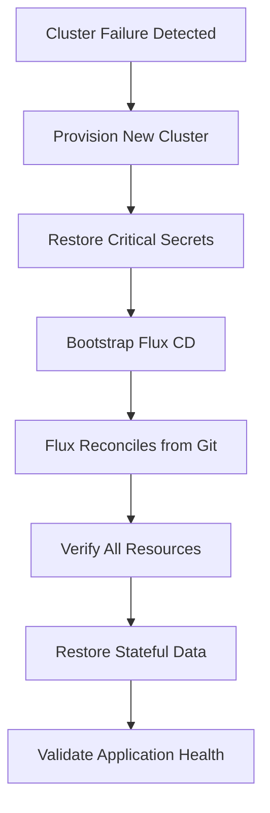

# How to Restore Flux CD After Cluster Failure

Author: [nawazdhandala](https://github.com/nawazdhandala)

Tags: Flux CD, Restore, Disaster Recovery, Kubernetes, GitOps, Cluster Recovery

Description: A step-by-step guide to restoring Flux CD and all managed workloads after a complete or partial Kubernetes cluster failure.

---

## Introduction

Cluster failures happen. Hardware issues, cloud provider outages, misconfigured upgrades, or accidental deletions can all take down your Kubernetes cluster. The good news is that Flux CD's GitOps model stores your desired state in Git, making recovery straightforward. However, restoring Flux CD itself requires careful attention to secrets, bootstrap configuration, and reconciliation order.

This guide walks through the complete process of restoring Flux CD after a cluster failure, from bootstrapping to full workload recovery.

## Prerequisites

- A new or repaired Kubernetes cluster
- Access to the Git repository used by Flux CD
- Backup of Flux CD secrets (deploy keys, SOPS keys)
- kubectl configured for the new cluster
- Flux CLI installed

## Recovery Overview

The restoration process follows these steps.



## Step 1: Provision the New Cluster

Ensure your new cluster matches the requirements of your workloads.

```bash
# Example: Create a new cluster with the same configuration
# Using eksctl for AWS EKS
eksctl create cluster \
  --name production-restored \
  --region us-east-1 \
  --version 1.29 \
  --nodegroup-name workers \
  --node-type m5.xlarge \
  --nodes 3 \
  --nodes-min 3 \
  --nodes-max 10

# Verify the cluster is ready
kubectl get nodes
kubectl cluster-info
```

## Step 2: Restore Critical Secrets Before Bootstrap

Certain secrets must exist before Flux CD is bootstrapped, especially SOPS decryption keys.

### Restore the SOPS Age Key

```bash
# If you backed up the SOPS age key, restore it first
# This is needed before Flux can decrypt any secrets in Git

# Create the flux-system namespace
kubectl create namespace flux-system

# Restore the SOPS age key from backup
kubectl create secret generic sops-age \
  --namespace flux-system \
  --from-file=age.agekey=/path/to/backup/age.key

# Verify the secret was created
kubectl get secret sops-age -n flux-system
```

### Restore Image Pull Secrets

```bash
# If your Git repository or Helm charts require authentication,
# restore those secrets before bootstrap

# Restore Docker registry credentials
kubectl create secret docker-registry registry-credentials \
  --namespace flux-system \
  --docker-server=ghcr.io \
  --docker-username=flux \
  --docker-password="${GHCR_TOKEN}"
```

## Step 3: Bootstrap Flux CD

Bootstrap Flux CD using the same configuration as the original cluster.

### Option A: Bootstrap with Existing Deploy Key

If you saved the original deploy key, you can reuse it to avoid updating repository settings.

```bash
# Restore the deploy key secret first
kubectl apply -f /path/to/backup/git-deploy-key.yaml

# Bootstrap Flux using the existing key
flux bootstrap git \
  --url=ssh://git@github.com/myorg/fleet-repo.git \
  --branch=main \
  --path=clusters/production \
  --components-extra=image-reflector-controller,image-automation-controller \
  --secret-ref=flux-system
```

### Option B: Bootstrap with New Deploy Key

If the original deploy key is lost, generate a new one.

```bash
# Bootstrap Flux CD - this generates a new deploy key
flux bootstrap github \
  --owner=myorg \
  --repository=fleet-repo \
  --branch=main \
  --path=clusters/production \
  --personal \
  --token-auth \
  --components-extra=image-reflector-controller,image-automation-controller

# The new deploy key will be added to the repository automatically
# Flux will begin reconciling immediately
```

### Option C: Bootstrap with Token Authentication

```bash
# Use a GitHub token instead of SSH keys
export GITHUB_TOKEN="ghp_your_token_here"

flux bootstrap github \
  --owner=myorg \
  --repository=fleet-repo \
  --branch=main \
  --path=clusters/production \
  --token-auth
```

## Step 4: Monitor the Reconciliation

After bootstrap, Flux CD begins reconciling all resources defined in Git.

```bash
# Watch Flux reconcile all resources
flux get all --watch

# Check the status of each component
flux get sources git
flux get kustomizations
flux get helmreleases -A

# Monitor the flux-system namespace for controller readiness
kubectl get pods -n flux-system -w

# Check for any reconciliation errors
flux get kustomizations --status-selector ready=false
flux get helmreleases -A --status-selector ready=false
```

## Step 5: Restore Secrets Not Managed by Git

Some secrets may not be stored in Git (even encrypted). Restore them from backup.

```bash
#!/bin/bash
# scripts/restore-external-secrets.sh
# Restores secrets that are not managed through Git

echo "Restoring external secrets..."

# Restore webhook receiver tokens
kubectl apply -f /path/to/backup/webhook-token.yaml

# Restore notification provider secrets (Slack webhooks, etc.)
kubectl apply -f /path/to/backup/notification-secrets.yaml

# Restore any custom TLS certificates
kubectl apply -f /path/to/backup/tls-certificates.yaml 2>/dev/null || true

# Restore external secret store credentials
kubectl apply -f /path/to/backup/external-secrets-credentials.yaml 2>/dev/null || true

echo "External secrets restored"
```

## Step 6: Restore Helm Release State

If Helm releases had multiple revisions, you may want to restore their state for proper rollback capability.

```bash
# Restore Helm release history secrets
kubectl apply -f /path/to/backup/helm-state.yaml

# Verify Helm releases are recognized
helm list -A

# If Helm releases are out of sync, force reconciliation
flux reconcile helmrelease -A --all
```

## Step 7: Handle Stuck Reconciliations

Sometimes resources get stuck during restoration. Here is how to handle common issues.

```bash
# Check for suspended resources
flux get kustomizations --status-selector suspended=true

# Resume any suspended kustomizations
flux resume kustomization --all

# If a HelmRelease is stuck, try resetting it
flux suspend helmrelease <name> -n <namespace>
flux resume helmrelease <name> -n <namespace>

# If source is not available, check the source status
flux get sources git
flux get sources helm

# Force a source refresh
flux reconcile source git flux-system

# Check events for detailed error messages
kubectl events -n flux-system --types=Warning
```

## Step 8: Verify Application Health

After reconciliation completes, verify that all applications are healthy.

```bash
#!/bin/bash
# scripts/verify-restoration.sh
# Verifies that all workloads are restored and healthy

echo "=== Flux CD Restoration Verification ==="
echo ""

# Check Flux components
echo "--- Flux Components ---"
flux check

# Check all Flux resources
echo ""
echo "--- Flux Resources Status ---"
flux get all -A

# Check for any failed resources
echo ""
echo "--- Failed Resources ---"
FAILED_KS=$(flux get kustomizations -A --status-selector ready=false --no-header 2>/dev/null | wc -l)
FAILED_HR=$(flux get helmreleases -A --status-selector ready=false --no-header 2>/dev/null | wc -l)
echo "Failed Kustomizations: $FAILED_KS"
echo "Failed HelmReleases: $FAILED_HR"

# Check pod health across all namespaces
echo ""
echo "--- Pod Health ---"
TOTAL_PODS=$(kubectl get pods -A --no-headers | wc -l)
RUNNING_PODS=$(kubectl get pods -A --no-headers --field-selector=status.phase=Running | wc -l)
FAILED_PODS=$(kubectl get pods -A --no-headers --field-selector=status.phase=Failed | wc -l)
echo "Total: $TOTAL_PODS | Running: $RUNNING_PODS | Failed: $FAILED_PODS"

# List any pods not in Running state
echo ""
echo "--- Non-Running Pods ---"
kubectl get pods -A --field-selector=status.phase!=Running,status.phase!=Succeeded --no-headers

# Check ingress endpoints
echo ""
echo "--- Ingress Status ---"
kubectl get ingress -A

# Check persistent volume claims
echo ""
echo "--- PVC Status ---"
kubectl get pvc -A --no-headers | grep -v Bound || echo "All PVCs are bound"

echo ""
if [ "$FAILED_KS" -eq 0 ] && [ "$FAILED_HR" -eq 0 ] && [ "$FAILED_PODS" -eq 0 ]; then
  echo "RESTORATION SUCCESSFUL: All resources are healthy"
else
  echo "RESTORATION INCOMPLETE: Some resources need attention"
  exit 1
fi
```

## Step 9: Restore Stateful Data

For stateful applications, you need to restore data from backups separately.

```bash
# Restore PersistentVolume data using Velero
velero restore create production-data-restore \
  --from-backup production-daily-backup-latest \
  --include-namespaces production \
  --include-resources persistentvolumeclaims,persistentvolumes

# Monitor the restore progress
velero restore describe production-data-restore

# For database restores, you may need application-specific restore procedures
# Example: Restore a PostgreSQL database
kubectl exec -n production deployment/postgresql -- \
  pg_restore -d mydb /backup/latest.dump
```

## Step 10: Update DNS and Load Balancers

If the new cluster has different external IPs, update DNS records.

```bash
# Get the new LoadBalancer IPs
kubectl get svc -A -o wide | grep LoadBalancer

# Get ingress controller external IP
kubectl get svc -n ingress-nginx ingress-nginx-controller \
  -o jsonpath='{.status.loadBalancer.ingress[0]}'

# Update DNS records to point to the new IPs
# This depends on your DNS provider
```

## Recovery Checklist

Use this checklist to ensure nothing is missed during restoration.

```bash
# Recovery verification checklist
# 1. [ ] New cluster provisioned and accessible
# 2. [ ] SOPS/Age decryption keys restored
# 3. [ ] Flux CD bootstrapped successfully
# 4. [ ] All GitRepositories synced
# 5. [ ] All Kustomizations reconciled
# 6. [ ] All HelmReleases deployed
# 7. [ ] External secrets restored
# 8. [ ] Helm release state restored
# 9. [ ] All pods running and healthy
# 10. [ ] Persistent data restored
# 11. [ ] Ingress and DNS configured
# 12. [ ] Monitoring and alerting verified
# 13. [ ] SSL/TLS certificates valid
# 14. [ ] Webhook receivers operational
```

## Conclusion

Restoring Flux CD after a cluster failure leverages the fundamental advantage of GitOps: your desired state is always available in Git. The restoration process involves provisioning a new cluster, restoring critical secrets that live outside Git, bootstrapping Flux CD, and letting it reconcile everything from the Git repository. By maintaining proper backups of secrets and Helm state, and by following a systematic verification process, you can recover from cluster failures with confidence. Regular disaster recovery drills using this process ensure your team is prepared when a real failure occurs.
