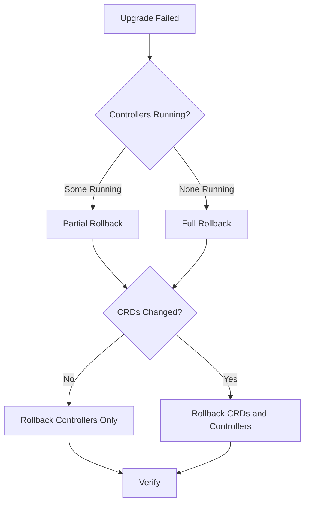

# How to Roll Back a Failed Flux CD Upgrade

Author: [nawazdhandala](https://github.com/nawazdhandala)

Tags: Flux CD, Rollback, Upgrade, Kubernetes, GitOps, Disaster Recovery, Troubleshooting

Description: A practical guide to diagnosing and rolling back failed Flux CD upgrades to restore your GitOps platform to a working state.

---

## Introduction

Flux CD upgrades can sometimes fail due to CRD incompatibilities, resource constraint issues, configuration changes, or unforeseen bugs. When an upgrade goes wrong, you need to act quickly to restore your GitOps platform. This guide covers how to diagnose upgrade failures, roll back to the previous working version, and prevent future upgrade issues.

## Recognizing a Failed Upgrade

A failed Flux CD upgrade can manifest in several ways:

- Controller pods stuck in `CrashLoopBackOff` or `ImagePullBackOff`
- Reconciliation loops failing across multiple resources
- CRD validation errors on existing resources
- Missing or degraded controller functionality
- Increased error rates in controller logs

```bash
# Quick health check to identify failure
flux check

# Check pod status in the flux-system namespace
kubectl get pods -n flux-system

# Look for error events
kubectl get events -n flux-system --sort-by=.lastTimestamp --field-selector type=Warning
```

## Step 1: Assess the Damage

Before rolling back, understand the scope and nature of the failure.

```bash
# Check which controllers are affected
kubectl get deployments -n flux-system -o wide

# Example output showing a failed upgrade:
# NAME                       READY   UP-TO-DATE   AVAILABLE
# source-controller          0/1     1            0
# kustomize-controller       1/1     1            1
# helm-controller            0/1     1            0
# notification-controller    1/1     1            1

# Check detailed pod status for failing controllers
kubectl describe pod -n flux-system -l app=source-controller

# Review controller logs for specific errors
kubectl logs -n flux-system deploy/source-controller --previous --tail=50
kubectl logs -n flux-system deploy/helm-controller --previous --tail=50

# Check if CRDs were partially updated
kubectl get crds | grep fluxcd.io
```

### Common Failure Scenarios

```bash
# Scenario 1: Image pull failure
# Look for ImagePullBackOff or ErrImagePull
kubectl get pods -n flux-system -o jsonpath='{range .items[*]}{.metadata.name}{"\t"}{.status.containerStatuses[0].state}{"\n"}{end}'

# Scenario 2: CRD schema conflicts
# Check for validation errors
kubectl get events -n flux-system | grep -i "validation\|invalid\|rejected"

# Scenario 3: RBAC permission errors
# Check for authorization failures
kubectl logs -n flux-system deploy/source-controller --tail=50 | grep -i "forbidden\|unauthorized"

# Scenario 4: Resource limit issues
kubectl describe pod -n flux-system -l app=source-controller | grep -A5 "OOMKilled\|Reason"
```

## Step 2: Decide on Rollback Strategy

Based on the assessment, choose the appropriate rollback strategy.



## Step 3: Rollback Controllers to Previous Version

### Method A: CLI Rollback

Roll back using the Flux CLI to reinstall the previous version.

```bash
# Reinstall the previous working version
# Replace v2.3.0 with your last known working version
flux install --version=v2.3.0

# If you used extra components, include them
flux install --version=v2.3.0 \
  --components=source-controller,kustomize-controller,helm-controller,notification-controller \
  --components-extra=image-reflector-controller,image-automation-controller

# Verify the rollback
flux check
flux version
```

### Method B: Manual Deployment Rollback

If the CLI is unavailable or the rollback command fails, manually revert the deployments.

```bash
# Roll back each controller deployment to the previous revision
kubectl rollout undo deployment/source-controller -n flux-system
kubectl rollout undo deployment/kustomize-controller -n flux-system
kubectl rollout undo deployment/helm-controller -n flux-system
kubectl rollout undo deployment/notification-controller -n flux-system

# If you have image automation controllers
kubectl rollout undo deployment/image-reflector-controller -n flux-system
kubectl rollout undo deployment/image-automation-controller -n flux-system

# Verify the rollback
kubectl rollout status deployment/source-controller -n flux-system
kubectl rollout status deployment/kustomize-controller -n flux-system
kubectl rollout status deployment/helm-controller -n flux-system

# Check that pods are running
kubectl get pods -n flux-system
```

### Method C: Restore from Backup Manifests

If you saved your manifests before the upgrade, apply them to restore.

```bash
# Apply the backed-up deployment manifests
kubectl apply -f backup/deployments.yaml

# Wait for all pods to be ready
kubectl wait --for=condition=available --timeout=120s \
  deployment --all -n flux-system

# Verify controllers are running
kubectl get pods -n flux-system
```

## Step 4: Rollback CRDs (If Needed)

If the upgrade changed CRDs and caused schema validation issues, you may need to roll back CRDs as well.

```bash
# Check current CRD versions
kubectl get crds -o custom-columns=NAME:.metadata.name,CREATED:.metadata.creationTimestamp \
  | grep fluxcd

# If you have a CRD backup, restore it
kubectl replace -f backup/crds.yaml

# If you do not have a backup, extract CRDs from the previous Flux version
# Download the previous version manifests
curl -sL https://github.com/fluxcd/flux2/releases/download/v2.3.0/install.yaml \
  -o flux-v2.3.0-install.yaml

# Extract and apply only the CRDs
# CRDs are at the beginning of the install manifest
kubectl apply -f flux-v2.3.0-install.yaml --selector=app.kubernetes.io/component=crd
```

### Handling CRD Conversion Issues

If CRDs have conversion webhooks that prevent rollback:

```bash
# Temporarily remove conversion webhook from CRD
kubectl patch crd kustomizations.kustomize.toolkit.fluxcd.io \
  --type=json -p='[{"op": "remove", "path": "/spec/conversion"}]'

# Apply the old CRD version
kubectl replace -f backup/crds.yaml

# Verify resources are still accessible
kubectl get kustomizations -A
```

## Step 5: Verify Resource Integrity After Rollback

Ensure all Flux resources are intact and functioning after the rollback.

```bash
# Check all Flux sources
flux get sources all -A

# Check all Kustomizations
flux get kustomizations -A

# Check all HelmReleases
flux get helmreleases -A

# Check image automation resources
flux get image repository -A
flux get image policy -A

# Force reconciliation of the root Kustomization
flux reconcile kustomization flux-system -n flux-system

# Verify that workloads are not affected
kubectl get deployments -A | head -20
kubectl get pods -A --field-selector status.phase!=Running
```

## Step 6: Restore Lost Resources

If the failed upgrade caused resources to be deleted or corrupted, restore them from backup.

```bash
# Check if any Flux resources are missing
flux get all -A 2>&1 | grep -i "not found\|error"

# Restore from exported backups
kubectl apply -f backup/git-sources.yaml
kubectl apply -f backup/helm-sources.yaml
kubectl apply -f backup/kustomizations.yaml
kubectl apply -f backup/helmreleases.yaml
kubectl apply -f backup/alerts.yaml
kubectl apply -f backup/alert-providers.yaml

# If using image automation
kubectl apply -f backup/image-repos.yaml
kubectl apply -f backup/image-policies.yaml
kubectl apply -f backup/image-updates.yaml

# Verify restored resources are reconciling
flux get all -A
```

## Step 7: GitOps-Managed Rollback

If Flux manages its own installation via GitOps, revert the Git commit that triggered the upgrade.

```bash
# Find the commit that introduced the upgrade
git log --oneline -10

# Revert the upgrade commit
git revert <upgrade-commit-hash>

# Push the revert
git push origin main

# If Flux controllers are down and cannot self-heal,
# manually apply the reverted manifests
kubectl apply -f clusters/production/flux-system/gotk-components.yaml
```

## Step 8: Post-Rollback Diagnostics

After a successful rollback, investigate the root cause of the failure.

```bash
# Collect diagnostic information
flux check > diagnostics/flux-check.txt
kubectl get events -n flux-system --sort-by=.lastTimestamp > diagnostics/events.txt
kubectl logs -n flux-system deploy/source-controller --tail=100 > diagnostics/source-controller.txt
kubectl logs -n flux-system deploy/kustomize-controller --tail=100 > diagnostics/kustomize-controller.txt
kubectl logs -n flux-system deploy/helm-controller --tail=100 > diagnostics/helm-controller.txt

# Check Kubernetes version compatibility
kubectl version --short

# Check node resource availability
kubectl top nodes
kubectl top pods -n flux-system
```

## Prevention Strategies

### Pre-Upgrade Backup Script

```bash
#!/bin/bash
# pre-upgrade-backup.sh
# Run this before every Flux upgrade

BACKUP_DIR="flux-backup-$(date +%Y%m%d-%H%M%S)"
mkdir -p "$BACKUP_DIR"

echo "Backing up Flux resources to $BACKUP_DIR..."

# Export all Flux resources
flux export source git --all > "$BACKUP_DIR/git-sources.yaml" 2>/dev/null
flux export source helm --all > "$BACKUP_DIR/helm-sources.yaml" 2>/dev/null
flux export kustomization --all > "$BACKUP_DIR/kustomizations.yaml" 2>/dev/null
flux export helmrelease --all > "$BACKUP_DIR/helmreleases.yaml" 2>/dev/null
flux export alert --all > "$BACKUP_DIR/alerts.yaml" 2>/dev/null
flux export alert-provider --all > "$BACKUP_DIR/providers.yaml" 2>/dev/null
flux export image repository --all > "$BACKUP_DIR/image-repos.yaml" 2>/dev/null
flux export image policy --all > "$BACKUP_DIR/image-policies.yaml" 2>/dev/null
flux export image update --all > "$BACKUP_DIR/image-updates.yaml" 2>/dev/null

# Export deployment specs
kubectl get deployments -n flux-system -o yaml > "$BACKUP_DIR/deployments.yaml"

# Export CRDs
kubectl get crds -o yaml | grep -A 100 'fluxcd.io' > "$BACKUP_DIR/crds.yaml"

# Record current versions
flux version > "$BACKUP_DIR/versions.txt"

echo "Backup complete: $BACKUP_DIR"
```

### Health Check Script for Post-Upgrade Validation

```bash
#!/bin/bash
# post-upgrade-check.sh
# Run this after every Flux upgrade

echo "Running post-upgrade health checks..."

# Check Flux system health
if ! flux check; then
  echo "FAIL: Flux health check failed"
  exit 1
fi

# Verify all pods are running
NOT_RUNNING=$(kubectl get pods -n flux-system --field-selector status.phase!=Running -o name 2>/dev/null)
if [ -n "$NOT_RUNNING" ]; then
  echo "FAIL: Some pods are not running: $NOT_RUNNING"
  exit 1
fi

# Check for failed reconciliations
FAILED=$(flux get all -A --status-selector ready=false 2>/dev/null | grep -v "^$")
if [ -n "$FAILED" ]; then
  echo "WARNING: Some resources are not ready:"
  echo "$FAILED"
fi

echo "All health checks passed."
```

## Conclusion

Rolling back a failed Flux CD upgrade requires quick diagnosis and decisive action. By maintaining regular backups of your Flux resources and deployment manifests, you can recover from most upgrade failures within minutes. The key is to assess the failure scope, choose the right rollback strategy, and verify that all resources are intact after the rollback. Incorporate pre-upgrade backups and post-upgrade validation into your standard upgrade process to minimize the impact of future failures.
