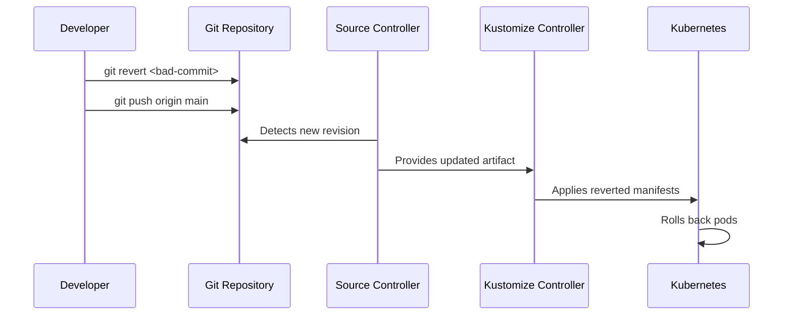

# How to Roll Back to a Previous Git Commit with Flux CD

Author: [nawazdhandala](https://github.com/nawazdhandala)

Tags: Flux CD, Rollback, Git Revert, Kubernetes, GitOps, Deployments

Description: A step-by-step guide to rolling back Flux CD deployments by reverting to a previous Git commit.

---

When a deployment goes wrong, the fastest fix in a GitOps workflow is reverting Git to a known-good state. Flux CD will automatically detect the change and reconcile your cluster back to the previous configuration. This guide covers multiple ways to roll back using Git commits.

## Understanding the Rollback Flow

When you revert a commit in Git, the following happens:

1. You create a new commit that undoes the bad changes
2. You push the revert commit to the remote repository
3. Flux source-controller detects the new commit
4. Flux kustomize-controller or helm-controller applies the reverted state
5. Kubernetes rolls back the workloads



## Method 1: Revert a Single Commit

This is the cleanest approach when a single commit caused the issue.

### Step 1: Identify the Bad Commit

```bash
# View recent commits to find the problematic one
git log --oneline --graph -20

# Example output:
# * f8a2c1d (HEAD -> main) Update my-app to v1.3.0 (broken)
# * b7e9d3a Add monitoring dashboards
# * a1c5f2e Update my-app to v1.2.3 (last known good)
# * 9d4b8c1 Update ingress configuration

# Check what the bad commit changed
git show f8a2c1d --stat

# View the full diff to understand the change
git diff f8a2c1d~1..f8a2c1d
```

### Step 2: Revert the Commit

```bash
# Revert creates a new commit that undoes the changes
git revert f8a2c1d --no-edit

# The resulting commit message will be:
# "Revert 'Update my-app to v1.3.0 (broken)'"

# Verify the revert looks correct
git diff HEAD~1..HEAD

# Push the revert
git push origin main
```

### Step 3: Trigger Flux Reconciliation

```bash
# Wait for Flux to detect the change automatically (default: 1-10 min)
# Or force immediate reconciliation:
flux reconcile source git flux-system -n flux-system

# Watch the reconciliation progress
flux get kustomization -n flux-system -w

# Verify the workload is rolled back
kubectl get deployment my-app -n default -o jsonpath='{.spec.template.spec.containers[0].image}'
# Should show: registry.example.com/my-app:v1.2.3
```

## Method 2: Revert Multiple Commits

When several commits need to be undone.

```bash
# Revert a range of commits (oldest to newest order)
# This reverts commits from b7e9d3a through f8a2c1d
git revert --no-commit b7e9d3a..f8a2c1d

# Review the staged changes before committing
git diff --staged

# Commit all reverts as a single commit
git commit -m "Rollback: revert commits b7e9d3a through f8a2c1d due to deployment failure"

# Push the rollback
git push origin main

# Trigger Flux reconciliation
flux reconcile source git flux-system -n flux-system
```

## Method 3: Reset to a Specific Commit Using a New Branch

When you want to go back to an exact point in history without reverting individual commits.

```bash
# CAUTION: This rewrites history. Only use on branches where
# force-push is acceptable, or create a new branch.

# Option A: Create a rollback commit that matches a previous state
# (preserves history, no force push needed)
git checkout a1c5f2e -- .
git commit -m "Rollback: restore state from commit a1c5f2e"
git push origin main

# Option B: Use a temporary branch (safer for teams)
git checkout -b rollback-20260306 a1c5f2e
git checkout main
git merge rollback-20260306 --strategy-option theirs \
  -m "Rollback: merge state from a1c5f2e to fix broken deployment"
git push origin main
git branch -d rollback-20260306
```

## Method 4: Pin Flux to a Specific Git Commit

Instead of reverting in Git, tell Flux to use a specific commit.

```yaml
# clusters/production/flux-system/gotk-sync.yaml
apiVersion: source.toolkit.fluxcd.io/v1
kind: GitRepository
metadata:
  name: flux-system
  namespace: flux-system
spec:
  interval: 5m
  url: https://github.com/org/fleet-infra
  ref:
    # Pin to the last known good commit
    commit: a1c5f2e4b8d9c0a1b2c3d4e5f6a7b8c9d0e1f2a3
  secretRef:
    name: flux-system
```

```bash
# Apply the pinned commit
kubectl apply -f clusters/production/flux-system/gotk-sync.yaml

# Force reconciliation with the pinned commit
flux reconcile source git flux-system -n flux-system

# Verify Flux is using the pinned commit
flux get sources git flux-system -n flux-system

# IMPORTANT: Remember to unpin once the issue is fixed
# Change ref back to branch: main
```

## Method 5: Use Git Tags for Rollback Points

Create tags before deployments so you always have a clean rollback target.

### Setting Up Pre-Deployment Tags

```yaml
# .github/workflows/pre-deploy-tag.yaml
name: Pre-Deploy Tag
on:
  push:
    branches: [main]
    paths:
      - "clusters/production/**"

jobs:
  tag:
    runs-on: ubuntu-latest
    steps:
      - uses: actions/checkout@v4
        with:
          fetch-depth: 0

      - name: Tag pre-deployment state
        run: |
          # Tag the commit before this push
          PREV_COMMIT=$(git rev-parse HEAD~1)
          TAG="pre-deploy-$(date +%Y%m%d-%H%M%S)"
          git tag "$TAG" "$PREV_COMMIT"
          git push origin "$TAG"
          echo "Pre-deployment tag: $TAG at $PREV_COMMIT"
```

### Rolling Back to a Tag

```bash
# List available pre-deployment tags
git tag -l "pre-deploy-*" --sort=-creatordate | head -10

# Roll back by checking out the tag contents
git checkout pre-deploy-20260306-093000 -- clusters/production/
git commit -m "Rollback: restore production state from pre-deploy-20260306-093000"
git push origin main

# Trigger reconciliation
flux reconcile source git flux-system -n flux-system
```

## Verifying the Rollback

### Check Flux Status

```bash
# Verify the source has the correct revision
flux get sources git -n flux-system

# Check all Kustomizations are reconciled
flux get kustomizations -A

# Check all HelmReleases are healthy
flux get helmreleases -A

# Look for any reconciliation errors
flux logs --level=error --since=10m
```

### Check Workload Status

```bash
# Verify deployment images are correct
kubectl get deployments -n default \
  -o custom-columns="NAME:.metadata.name,IMAGE:.spec.template.spec.containers[0].image"

# Check pod status
kubectl get pods -n default

# Verify rollout status
kubectl rollout status deployment/my-app -n default

# Check recent events for any issues
kubectl get events -n default --sort-by=.lastTimestamp | tail -20
```

### Validate Application Health

```bash
# Run a health check against the application
curl -s -o /dev/null -w "%{http_code}" https://app.example.com/health

# Check application logs for errors after rollback
kubectl logs deployment/my-app -n default --tail=50

# Run smoke tests
kubectl exec -it deployment/my-app -n default -- \
  wget -q -O- http://localhost:8080/health
```

## Emergency Rollback Procedure

For critical production incidents, use this combined approach.

```bash
#!/bin/bash
# emergency-rollback.sh
set -euo pipefail

ROLLBACK_COMMIT=$1
REPO_DIR="/path/to/fleet-infra"

echo "=== EMERGENCY ROLLBACK PROCEDURE ==="
echo "Rolling back to commit: $ROLLBACK_COMMIT"

# Step 1: Suspend Flux to prevent further changes
echo "Step 1: Suspending Flux..."
flux suspend kustomization --all -n flux-system

# Step 2: Revert in Git
echo "Step 2: Reverting in Git..."
cd "$REPO_DIR"
git fetch origin main
git checkout main
git pull origin main

# Restore the state from the target commit
git checkout "$ROLLBACK_COMMIT" -- clusters/production/
git commit -m "EMERGENCY ROLLBACK: restore from $ROLLBACK_COMMIT"
git push origin main

# Step 3: Resume Flux and force reconciliation
echo "Step 3: Resuming Flux and reconciling..."
flux resume kustomization --all -n flux-system
flux reconcile source git flux-system -n flux-system

# Step 4: Wait for reconciliation
echo "Step 4: Waiting for reconciliation..."
kubectl wait --for=condition=Ready kustomization/apps \
  -n flux-system --timeout=300s

# Step 5: Verify workloads
echo "Step 5: Verifying workloads..."
kubectl get deployments -n default
kubectl get pods -n default

echo "=== ROLLBACK COMPLETE ==="
echo "Verify application health manually."
```

## Common Pitfalls

### Pitfall 1: Pruning Deletes New Resources

When you roll back, Flux may prune resources that were added by the reverted commits.

```yaml
# To prevent accidental deletion during rollback, use labels
apiVersion: kustomize.toolkit.fluxcd.io/v1
kind: Kustomization
metadata:
  name: apps
  namespace: flux-system
spec:
  prune: true
  # Resources with this annotation will not be pruned
  # Add to resources you want to keep during rollback
  # kustomize.toolkit.fluxcd.io/prune: disabled
```

### Pitfall 2: Database Migrations Are Not Reversible

Rolling back application code does not undo database migrations. Always ensure migrations are backward-compatible.

```yaml
# Use init containers for migrations with rollback support
apiVersion: apps/v1
kind: Deployment
metadata:
  name: my-app
spec:
  template:
    spec:
      initContainers:
        - name: migrate
          image: registry.example.com/my-app:v1.2.3
          command: ["./migrate", "--direction=up"]
          # Ensure migrations are idempotent and backward-compatible
```

### Pitfall 3: ConfigMap and Secret Changes

Rolling back may revert ConfigMaps and Secrets. Verify dependent pods restart.

```bash
# After rollback, restart pods that depend on changed ConfigMaps
kubectl rollout restart deployment/my-app -n default
```

## Summary

Rolling back to a previous Git commit with Flux CD follows these steps:

1. **Identify** the bad commit using `git log`
2. **Revert** using `git revert`, branch merge, or tag checkout
3. **Push** the revert commit to trigger Flux reconciliation
4. **Verify** that all Kustomizations, HelmReleases, and workloads are healthy
5. **Validate** application health with smoke tests

For emergencies, suspend Flux first, then revert, then resume. Always use Git operations rather than direct cluster changes to maintain the GitOps single source of truth.
