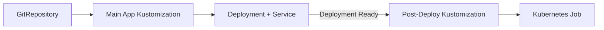

# How to Run Kubernetes Jobs After Deployments with Flux CD

Author: [nawazdhandala](https://github.com/nawazdhandala)

Tags: Flux CD, kubernetes jobs, Post-Deployment, Hooks, GitOps, Kubernetes

Description: A practical guide to running Kubernetes Jobs as post-deployment tasks using Flux CD dependencies and health checks.

---

Post-deployment tasks are essential in many workflows: running smoke tests, sending notifications, warming caches, registering services with API gateways, or cleaning up old resources. This guide shows how to use Flux CD's dependency system to run Kubernetes Jobs after a deployment completes successfully.

## Post-Deployment Job Patterns

Common post-deployment tasks include:

- Smoke tests to verify the deployment is working
- Cache warming to avoid cold-start performance issues
- API gateway registration for new service versions
- Cleanup of old resources or temporary data
- Integration test runs against the new deployment
- Notification to external systems about the new version

## Architecture Overview

The approach mirrors pre-deployment Jobs but reverses the dependency direction:



## Step 1: Create the Main Deployment

Start with a standard deployment that Flux manages.

```yaml
# apps/my-app/deploy/deployment.yaml
apiVersion: apps/v1
kind: Deployment
metadata:
  name: my-app
  namespace: production
spec:
  replicas: 3
  selector:
    matchLabels:
      app: my-app
  template:
    metadata:
      labels:
        app: my-app
    spec:
      containers:
        - name: my-app
          image: registry.example.com/my-app:2.0.0
          ports:
            - containerPort: 8080
          readinessProbe:
            httpGet:
              path: /ready
              port: 8080
            initialDelaySeconds: 10
            periodSeconds: 5
          livenessProbe:
            httpGet:
              path: /health
              port: 8080
            initialDelaySeconds: 15
            periodSeconds: 10
```

```yaml
# apps/my-app/deploy/service.yaml
apiVersion: v1
kind: Service
metadata:
  name: my-app
  namespace: production
spec:
  selector:
    app: my-app
  ports:
    - port: 80
      targetPort: 8080
```

```yaml
# apps/my-app/deploy/kustomization.yaml
apiVersion: kustomize.config.k8s.io/v1beta1
kind: Kustomization
resources:
  - deployment.yaml
  - service.yaml
```

## Step 2: Create the Post-Deployment Smoke Test Job

```yaml
# apps/my-app/post-deploy/smoke-test/job.yaml
apiVersion: batch/v1
kind: Job
metadata:
  name: my-app-smoke-test
  namespace: production
  labels:
    app: my-app
    phase: post-deploy
spec:
  activeDeadlineSeconds: 120
  backoffLimit: 2
  # Automatically clean up completed Jobs after 1 hour
  ttlSecondsAfterFinished: 3600
  template:
    metadata:
      labels:
        app: my-app
        phase: post-deploy
    spec:
      containers:
        - name: smoke-test
          image: curlimages/curl:latest
          command:
            - /bin/sh
            - -c
            - |
              echo "Running smoke tests against my-app..."

              # Wait for the service to be fully available
              echo "Test 1: Health endpoint"
              response=$(curl -sf -o /dev/null -w "%{http_code}" \
                http://my-app.production.svc.cluster.local/health)
              if [ "$response" != "200" ]; then
                echo "FAIL: Health check returned $response"
                exit 1
              fi
              echo "PASS: Health check returned 200"

              # Test the main API endpoint
              echo "Test 2: API endpoint"
              response=$(curl -sf -o /dev/null -w "%{http_code}" \
                http://my-app.production.svc.cluster.local/api/v1/status)
              if [ "$response" != "200" ]; then
                echo "FAIL: API status returned $response"
                exit 1
              fi
              echo "PASS: API status returned 200"

              # Test response body
              echo "Test 3: API response content"
              body=$(curl -sf http://my-app.production.svc.cluster.local/api/v1/version)
              echo "Version response: $body"

              echo "All smoke tests passed"
      restartPolicy: Never
```

```yaml
# apps/my-app/post-deploy/smoke-test/kustomization.yaml
apiVersion: kustomize.config.k8s.io/v1beta1
kind: Kustomization
resources:
  - job.yaml
```

## Step 3: Create Flux Kustomizations with Post-Deploy Dependency

```yaml
# clusters/production/apps/my-app-deploy.yaml
apiVersion: kustomize.toolkit.fluxcd.io/v1
kind: Kustomization
metadata:
  name: my-app-deploy
  namespace: flux-system
spec:
  interval: 10m
  path: ./apps/my-app/deploy
  prune: true
  sourceRef:
    kind: GitRepository
    name: flux-system
  # Wait for deployment to be fully ready before marking as complete
  wait: true
  timeout: 10m
  healthChecks:
    - apiVersion: apps/v1
      kind: Deployment
      name: my-app
      namespace: production
```

```yaml
# clusters/production/apps/my-app-post-deploy.yaml
apiVersion: kustomize.toolkit.fluxcd.io/v1
kind: Kustomization
metadata:
  name: my-app-post-deploy
  namespace: flux-system
spec:
  interval: 10m
  path: ./apps/my-app/post-deploy/smoke-test
  prune: true
  sourceRef:
    kind: GitRepository
    name: flux-system
  # Key: depend on the main deployment being ready
  dependsOn:
    - name: my-app-deploy
  # Wait for the Job to complete
  wait: true
  timeout: 5m
  # Force recreate the Job each time
  force: true
  healthChecks:
    - apiVersion: batch/v1
      kind: Job
      name: my-app-smoke-test
      namespace: production
```

## Step 4: Cache Warming Post-Deployment Job

```yaml
# apps/my-app/post-deploy/cache-warm/job.yaml
apiVersion: batch/v1
kind: Job
metadata:
  name: my-app-cache-warm
  namespace: production
  labels:
    app: my-app
    phase: post-deploy
spec:
  activeDeadlineSeconds: 300
  backoffLimit: 1
  ttlSecondsAfterFinished: 3600
  template:
    spec:
      containers:
        - name: cache-warm
          image: registry.example.com/my-app:2.0.0
          command:
            - /bin/sh
            - -c
            - |
              echo "Warming application caches..."

              # Warm the product catalog cache
              echo "Warming product catalog..."
              curl -sf http://my-app.production.svc.cluster.local/api/v1/cache/warm/products

              # Warm the user preferences cache
              echo "Warming user preferences..."
              curl -sf http://my-app.production.svc.cluster.local/api/v1/cache/warm/preferences

              # Warm search index
              echo "Warming search index..."
              curl -sf http://my-app.production.svc.cluster.local/api/v1/cache/warm/search

              echo "Cache warming completed"
          resources:
            requests:
              cpu: 200m
              memory: 256Mi
      restartPolicy: Never
```

## Step 5: Multiple Post-Deployment Tasks in Sequence

Run multiple post-deployment tasks in a specific order.

```yaml
# clusters/production/apps/my-app-post-1-smoke.yaml
apiVersion: kustomize.toolkit.fluxcd.io/v1
kind: Kustomization
metadata:
  name: my-app-smoke-test
  namespace: flux-system
spec:
  interval: 10m
  path: ./apps/my-app/post-deploy/smoke-test
  prune: true
  sourceRef:
    kind: GitRepository
    name: flux-system
  # Run after the deployment is ready
  dependsOn:
    - name: my-app-deploy
  wait: true
  timeout: 5m
  force: true
```

```yaml
# clusters/production/apps/my-app-post-2-cache.yaml
apiVersion: kustomize.toolkit.fluxcd.io/v1
kind: Kustomization
metadata:
  name: my-app-cache-warm
  namespace: flux-system
spec:
  interval: 10m
  path: ./apps/my-app/post-deploy/cache-warm
  prune: true
  sourceRef:
    kind: GitRepository
    name: flux-system
  # Run after smoke tests pass
  dependsOn:
    - name: my-app-smoke-test
  wait: true
  timeout: 10m
  force: true
```

```yaml
# clusters/production/apps/my-app-post-3-notify.yaml
apiVersion: kustomize.toolkit.fluxcd.io/v1
kind: Kustomization
metadata:
  name: my-app-notify
  namespace: flux-system
spec:
  interval: 10m
  path: ./apps/my-app/post-deploy/notify
  prune: true
  sourceRef:
    kind: GitRepository
    name: flux-system
  # Run after cache warming completes
  dependsOn:
    - name: my-app-cache-warm
  wait: true
  timeout: 2m
  force: true
```

## Step 6: External Notification Post-Deploy Job

```yaml
# apps/my-app/post-deploy/notify/job.yaml
apiVersion: batch/v1
kind: Job
metadata:
  name: my-app-deploy-notify
  namespace: production
spec:
  activeDeadlineSeconds: 60
  backoffLimit: 1
  ttlSecondsAfterFinished: 1800
  template:
    spec:
      containers:
        - name: notify
          image: curlimages/curl:latest
          command:
            - /bin/sh
            - -c
            - |
              # Get the deployed version
              VERSION=$(curl -sf http://my-app.production.svc.cluster.local/api/v1/version \
                | grep -o '"version":"[^"]*"' | cut -d'"' -f4)

              # Notify Slack
              curl -sf -X POST "$SLACK_WEBHOOK_URL" \
                -H "Content-Type: application/json" \
                -d "{\"text\": \"my-app deployed successfully. Version: $VERSION\"}"

              # Register with API gateway
              curl -sf -X PUT "http://api-gateway.infra.svc.cluster.local/routes/my-app" \
                -H "Content-Type: application/json" \
                -d "{\"version\": \"$VERSION\", \"status\": \"active\"}"

              # Update deployment tracking system
              curl -sf -X POST "https://deployments.example.com/api/events" \
                -H "Authorization: Bearer $DEPLOY_TRACKER_TOKEN" \
                -H "Content-Type: application/json" \
                -d "{\"service\": \"my-app\", \"version\": \"$VERSION\", \"environment\": \"production\"}"

              echo "All notifications sent"
          env:
            - name: SLACK_WEBHOOK_URL
              valueFrom:
                secretKeyRef:
                  name: notification-secrets
                  key: slack-webhook-url
            - name: DEPLOY_TRACKER_TOKEN
              valueFrom:
                secretKeyRef:
                  name: notification-secrets
                  key: deploy-tracker-token
      restartPolicy: Never
```

## Step 7: Integration Test Post-Deploy Job

Run a comprehensive integration test suite after deployment.

```yaml
# apps/my-app/post-deploy/integration-test/job.yaml
apiVersion: batch/v1
kind: Job
metadata:
  name: my-app-integration-test
  namespace: production
spec:
  activeDeadlineSeconds: 600
  backoffLimit: 1
  ttlSecondsAfterFinished: 7200
  template:
    spec:
      containers:
        - name: integration-test
          image: registry.example.com/my-app-tests:2.0.0
          command:
            - /bin/sh
            - -c
            - |
              # Run the integration test suite against the live service
              echo "Starting integration tests..."

              # Set the target URL
              export TARGET_URL="http://my-app.production.svc.cluster.local"

              # Run tests with output
              ./run-tests.sh --suite=integration --target=$TARGET_URL --output=/tmp/results

              # Print results summary
              cat /tmp/results/summary.txt

              # Exit with the test exit code
              exit_code=$?
              if [ $exit_code -ne 0 ]; then
                echo "Integration tests FAILED"
                # Upload results to test reporting system
                curl -sf -X POST "https://test-reports.example.com/api/results" \
                  -F "file=@/tmp/results/report.xml" \
                  -F "service=my-app" \
                  -F "status=failed"
              else
                echo "Integration tests PASSED"
              fi
              exit $exit_code
          env:
            - name: DATABASE_URL
              valueFrom:
                secretKeyRef:
                  name: db-credentials
                  key: url
          resources:
            requests:
              cpu: 500m
              memory: 512Mi
            limits:
              cpu: 1
              memory: 1Gi
      restartPolicy: Never
```

## Step 8: Handle Post-Deploy Failures

When a post-deploy Job fails, you need to decide on the response.

```bash
# Check post-deploy Job status
flux get kustomization my-app-post-deploy

# View Job logs for error details
kubectl logs -n production job/my-app-smoke-test

# If the smoke test fails, you may want to rollback
# Revert the deployment change in Git
git revert HEAD
git push origin main

# Flux will reconcile to the previous state
flux reconcile kustomization my-app-deploy --with-source
```

Set up alerts specifically for post-deployment failures:

```yaml
# clusters/production/notifications/post-deploy-alert.yaml
apiVersion: notification.toolkit.fluxcd.io/v1beta3
kind: Alert
metadata:
  name: post-deploy-failures
  namespace: flux-system
spec:
  providerRef:
    name: slack
  eventSeverity: error
  eventSources:
    - kind: Kustomization
      name: "my-app-smoke-test"
    - kind: Kustomization
      name: "my-app-cache-warm"
    - kind: Kustomization
      name: "my-app-notify"
  summary: "Post-deployment task failed. Review and consider rollback."
```

## Using Helm Post-Install Hooks

If your application is deployed via HelmRelease, use Helm hooks instead.

```yaml
# charts/my-app/templates/post-deploy-test.yaml
apiVersion: batch/v1
kind: Job
metadata:
  name: {{ .Release.Name }}-post-deploy-test
  annotations:
    # Helm post-install and post-upgrade hooks
    "helm.sh/hook": post-install,post-upgrade
    "helm.sh/hook-weight": "5"
    "helm.sh/hook-delete-policy": before-hook-creation
spec:
  backoffLimit: 2
  ttlSecondsAfterFinished: 3600
  template:
    spec:
      containers:
        - name: smoke-test
          image: curlimages/curl:latest
          command:
            - /bin/sh
            - -c
            - |
              # Wait for the service to be available
              sleep 10
              # Run smoke test
              curl -sf http://{{ .Release.Name }}.{{ .Release.Namespace }}.svc.cluster.local/health
      restartPolicy: Never
```

```yaml
# clusters/production/releases/my-app.yaml
apiVersion: helm.toolkit.fluxcd.io/v2
kind: HelmRelease
metadata:
  name: my-app
  namespace: flux-system
spec:
  interval: 10m
  targetNamespace: production
  chart:
    spec:
      chart: my-app
      sourceRef:
        kind: HelmRepository
        name: company-charts
  # Increase timeout to allow for post-deploy hooks
  timeout: 15m
  install:
    remediation:
      retries: 3
  upgrade:
    remediation:
      retries: 3
```

## Complete Pipeline: Pre-Deploy, Deploy, Post-Deploy

Here is the full dependency chain combining pre and post-deployment Jobs:

```yaml
# clusters/production/apps/pipeline.yaml
---
# Step 1: Pre-deployment database migration
apiVersion: kustomize.toolkit.fluxcd.io/v1
kind: Kustomization
metadata:
  name: my-app-pre-deploy
  namespace: flux-system
spec:
  interval: 10m
  path: ./apps/my-app/pre-deploy
  prune: true
  sourceRef:
    kind: GitRepository
    name: flux-system
  wait: true
  timeout: 10m
  force: true
---
# Step 2: Main application deployment
apiVersion: kustomize.toolkit.fluxcd.io/v1
kind: Kustomization
metadata:
  name: my-app-deploy
  namespace: flux-system
spec:
  interval: 10m
  path: ./apps/my-app/deploy
  prune: true
  sourceRef:
    kind: GitRepository
    name: flux-system
  dependsOn:
    - name: my-app-pre-deploy
  wait: true
  timeout: 10m
---
# Step 3: Post-deployment smoke test
apiVersion: kustomize.toolkit.fluxcd.io/v1
kind: Kustomization
metadata:
  name: my-app-post-deploy
  namespace: flux-system
spec:
  interval: 10m
  path: ./apps/my-app/post-deploy/smoke-test
  prune: true
  sourceRef:
    kind: GitRepository
    name: flux-system
  dependsOn:
    - name: my-app-deploy
  wait: true
  timeout: 5m
  force: true
```

## Summary

Running Kubernetes Jobs after deployments with Flux CD uses the same dependency mechanism as pre-deployment Jobs, but with the direction reversed. The post-deploy Kustomization declares `dependsOn` pointing to the main deployment Kustomization. Use `wait: true` and health checks on the deployment to ensure it is fully ready before post-deployment Jobs start. Chain multiple post-deployment tasks with sequential dependencies, and set up alerts to catch failures quickly so you can decide whether to roll back.
