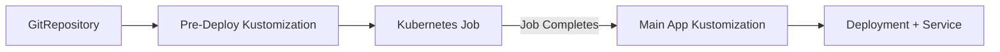

# How to Run Kubernetes Jobs Before Deployments with Flux CD

Author: [nawazdhandala](https://github.com/nawazdhandala)

Tags: Flux CD, kubernetes jobs, Pre-Deployment, Hooks, GitOps, Kubernetes

Description: A practical guide to running Kubernetes Jobs as pre-deployment tasks using Flux CD dependencies and health checks.

---

Many deployments require pre-flight tasks: database migrations, cache warming, configuration validation, or secret rotation. In traditional CD tools, these are pre-deployment hooks. In Flux CD, you achieve this by structuring Kustomizations with dependencies so that Jobs run and complete before the main deployment reconciles.

## The Challenge with Pre-Deployment Jobs

Flux CD does not have built-in hook mechanisms like Helm's pre-install or pre-upgrade hooks. Instead, Flux uses a dependency system between Kustomizations. By splitting your pre-deployment Job and your main deployment into separate Kustomizations and linking them with `dependsOn`, you ensure the Job completes before the deployment starts.

## Architecture Overview

The approach uses two Flux Kustomizations linked by a dependency:



## Step 1: Create the Pre-Deployment Job

Define a Kubernetes Job that performs the pre-deployment task.

```yaml
# apps/my-app/pre-deploy/job.yaml
apiVersion: batch/v1
kind: Job
metadata:
  name: my-app-pre-deploy
  namespace: production
  labels:
    app: my-app
    phase: pre-deploy
spec:
  # Time limit for the job
  activeDeadlineSeconds: 300
  # Number of retry attempts
  backoffLimit: 3
  template:
    metadata:
      labels:
        app: my-app
        phase: pre-deploy
    spec:
      containers:
        - name: pre-deploy
          image: registry.example.com/my-app-migrations:1.0.0
          command:
            - /bin/sh
            - -c
            - |
              echo "Running pre-deployment checks..."
              # Run database migrations
              ./migrate.sh up
              # Validate configuration
              ./validate-config.sh
              # Warm caches if needed
              ./warm-cache.sh
              echo "Pre-deployment tasks completed successfully"
          env:
            - name: DATABASE_URL
              valueFrom:
                secretKeyRef:
                  name: db-credentials
                  key: url
          resources:
            requests:
              cpu: 100m
              memory: 128Mi
            limits:
              cpu: 500m
              memory: 512Mi
      restartPolicy: Never
      # Use a service account with appropriate permissions
      serviceAccountName: pre-deploy-sa
```

```yaml
# apps/my-app/pre-deploy/kustomization.yaml
apiVersion: kustomize.config.k8s.io/v1beta1
kind: Kustomization
resources:
  - job.yaml
```

## Step 2: Create the Main Deployment

```yaml
# apps/my-app/deploy/deployment.yaml
apiVersion: apps/v1
kind: Deployment
metadata:
  name: my-app
  namespace: production
spec:
  replicas: 3
  selector:
    matchLabels:
      app: my-app
  template:
    metadata:
      labels:
        app: my-app
    spec:
      containers:
        - name: my-app
          image: registry.example.com/my-app:1.0.0
          ports:
            - containerPort: 8080
          readinessProbe:
            httpGet:
              path: /ready
              port: 8080
            initialDelaySeconds: 5
            periodSeconds: 10
          env:
            - name: DATABASE_URL
              valueFrom:
                secretKeyRef:
                  name: db-credentials
                  key: url
```

```yaml
# apps/my-app/deploy/service.yaml
apiVersion: v1
kind: Service
metadata:
  name: my-app
  namespace: production
spec:
  selector:
    app: my-app
  ports:
    - port: 80
      targetPort: 8080
```

```yaml
# apps/my-app/deploy/kustomization.yaml
apiVersion: kustomize.config.k8s.io/v1beta1
kind: Kustomization
resources:
  - deployment.yaml
  - service.yaml
```

## Step 3: Create Flux Kustomizations with Dependencies

This is the key step. The pre-deploy Kustomization must complete before the main deployment starts.

```yaml
# clusters/production/apps/my-app-pre-deploy.yaml
apiVersion: kustomize.toolkit.fluxcd.io/v1
kind: Kustomization
metadata:
  name: my-app-pre-deploy
  namespace: flux-system
spec:
  interval: 10m
  path: ./apps/my-app/pre-deploy
  prune: true
  sourceRef:
    kind: GitRepository
    name: flux-system
  # Wait for the Job to complete before marking as ready
  wait: true
  # Timeout should be longer than the Job's activeDeadlineSeconds
  timeout: 10m
  # Force recreate the Job on each reconciliation
  # This is important because Jobs are immutable
  force: true
  healthChecks:
    - apiVersion: batch/v1
      kind: Job
      name: my-app-pre-deploy
      namespace: production
```

```yaml
# clusters/production/apps/my-app-deploy.yaml
apiVersion: kustomize.toolkit.fluxcd.io/v1
kind: Kustomization
metadata:
  name: my-app-deploy
  namespace: flux-system
spec:
  interval: 10m
  path: ./apps/my-app/deploy
  prune: true
  sourceRef:
    kind: GitRepository
    name: flux-system
  wait: true
  timeout: 5m
  # This is the critical dependency: wait for pre-deploy to succeed
  dependsOn:
    - name: my-app-pre-deploy
  healthChecks:
    - apiVersion: apps/v1
      kind: Deployment
      name: my-app
      namespace: production
```

## Step 4: Handle Job Immutability

Kubernetes Jobs are immutable once created. To rerun a pre-deploy Job on each deployment, you need to handle cleanup.

```yaml
# Option 1: Use force: true in the Kustomization (shown above)
# This deletes and recreates the Job on each reconciliation

# Option 2: Use a unique job name with a hash or timestamp
# apps/my-app/pre-deploy/job.yaml
apiVersion: batch/v1
kind: Job
metadata:
  # Include a version or hash that changes with each deployment
  name: my-app-pre-deploy-v1-0-0
  namespace: production
spec:
  ttlSecondsAfterFinished: 3600
  backoffLimit: 3
  template:
    spec:
      containers:
        - name: pre-deploy
          image: registry.example.com/my-app-migrations:1.0.0
          command: ["./migrate.sh", "up"]
      restartPolicy: Never
```

```yaml
# Option 3: Use a CronJob-like pattern with suspend
# This creates a Job template that Flux manages
apiVersion: batch/v1
kind: Job
metadata:
  name: my-app-pre-deploy
  namespace: production
  annotations:
    # Tell Flux to replace instead of patch
    kustomize.toolkit.fluxcd.io/force: enabled
spec:
  ttlSecondsAfterFinished: 600
  backoffLimit: 3
  template:
    spec:
      containers:
        - name: pre-deploy
          image: registry.example.com/my-app-migrations:1.0.0
          command: ["./migrate.sh", "up"]
      restartPolicy: Never
```

## Step 5: Multiple Pre-Deployment Jobs

If you need multiple pre-deployment tasks to run in sequence:

```yaml
# clusters/production/apps/my-app-pre-deploy-1-migrate.yaml
apiVersion: kustomize.toolkit.fluxcd.io/v1
kind: Kustomization
metadata:
  name: my-app-migrate-db
  namespace: flux-system
spec:
  interval: 10m
  path: ./apps/my-app/pre-deploy/migrate-db
  prune: true
  sourceRef:
    kind: GitRepository
    name: flux-system
  wait: true
  timeout: 10m
  force: true
```

```yaml
# clusters/production/apps/my-app-pre-deploy-2-seed.yaml
apiVersion: kustomize.toolkit.fluxcd.io/v1
kind: Kustomization
metadata:
  name: my-app-seed-data
  namespace: flux-system
spec:
  interval: 10m
  path: ./apps/my-app/pre-deploy/seed-data
  prune: true
  sourceRef:
    kind: GitRepository
    name: flux-system
  wait: true
  timeout: 10m
  force: true
  # Run after database migration
  dependsOn:
    - name: my-app-migrate-db
```

```yaml
# clusters/production/apps/my-app-deploy.yaml
apiVersion: kustomize.toolkit.fluxcd.io/v1
kind: Kustomization
metadata:
  name: my-app-deploy
  namespace: flux-system
spec:
  interval: 10m
  path: ./apps/my-app/deploy
  prune: true
  sourceRef:
    kind: GitRepository
    name: flux-system
  wait: true
  timeout: 5m
  # Wait for all pre-deployment tasks
  dependsOn:
    - name: my-app-migrate-db
    - name: my-app-seed-data
```

## Step 6: Configuration Validation Job

A common pre-deployment task is validating that configuration and secrets are correct.

```yaml
# apps/my-app/pre-deploy/validate-config/job.yaml
apiVersion: batch/v1
kind: Job
metadata:
  name: my-app-validate-config
  namespace: production
spec:
  activeDeadlineSeconds: 60
  backoffLimit: 1
  template:
    spec:
      containers:
        - name: validate
          image: registry.example.com/my-app:1.0.0
          command:
            - /bin/sh
            - -c
            - |
              echo "Validating database connectivity..."
              # Test database connection
              if ! ./check-db.sh; then
                echo "ERROR: Cannot connect to database"
                exit 1
              fi

              echo "Validating required secrets..."
              # Verify all required secrets exist
              if [ -z "$API_KEY" ]; then
                echo "ERROR: API_KEY secret is missing"
                exit 1
              fi

              echo "Validating external service connectivity..."
              # Test external dependencies
              if ! curl -sf https://api.external-service.com/health; then
                echo "WARNING: External service unreachable"
                # Decide whether this should block deployment
              fi

              echo "All validations passed"
          envFrom:
            - secretRef:
                name: my-app-secrets
      restartPolicy: Never
```

## Step 7: Monitor Pre-Deployment Job Status

```bash
# Check the pre-deploy Kustomization status
flux get kustomization my-app-pre-deploy

# Watch the Job execution
kubectl get jobs -n production -l phase=pre-deploy --watch

# View Job logs
kubectl logs -n production job/my-app-pre-deploy -f

# Check if the main deployment is waiting
flux get kustomization my-app-deploy
# Status should show "dependency 'flux-system/my-app-pre-deploy' is not ready"
```

## Step 8: Handle Pre-Deployment Failures

When a pre-deployment Job fails, the main deployment will not proceed due to the dependency.

```bash
# Check why the pre-deploy failed
kubectl describe job my-app-pre-deploy -n production

# View the pod logs for error details
kubectl logs -n production -l job-name=my-app-pre-deploy --tail=50

# After fixing the issue, trigger re-reconciliation
flux reconcile kustomization my-app-pre-deploy --with-source
```

Set up alerts for pre-deployment failures:

```yaml
# clusters/production/notifications/pre-deploy-alert.yaml
apiVersion: notification.toolkit.fluxcd.io/v1beta3
kind: Alert
metadata:
  name: pre-deploy-failures
  namespace: flux-system
spec:
  providerRef:
    name: slack
  eventSeverity: error
  eventSources:
    # Only alert on pre-deploy Kustomizations
    - kind: Kustomization
      name: "my-app-pre-deploy"
    - kind: Kustomization
      name: "my-app-migrate-db"
```

## Using Helm Hooks as an Alternative

If you use HelmRelease, you can leverage Helm's built-in pre-install and pre-upgrade hooks.

```yaml
# charts/my-app/templates/pre-deploy-job.yaml
apiVersion: batch/v1
kind: Job
metadata:
  name: {{ .Release.Name }}-pre-deploy
  annotations:
    # Helm hook annotations
    "helm.sh/hook": pre-install,pre-upgrade
    "helm.sh/hook-weight": "-5"
    "helm.sh/hook-delete-policy": before-hook-creation
spec:
  backoffLimit: 3
  template:
    spec:
      containers:
        - name: pre-deploy
          image: "{{ .Values.migrations.image }}:{{ .Values.migrations.tag }}"
          command: ["./migrate.sh", "up"]
          env:
            - name: DATABASE_URL
              valueFrom:
                secretKeyRef:
                  name: {{ .Release.Name }}-db-credentials
                  key: url
      restartPolicy: Never
```

```yaml
# clusters/production/releases/my-app.yaml
apiVersion: helm.toolkit.fluxcd.io/v2
kind: HelmRelease
metadata:
  name: my-app
  namespace: flux-system
spec:
  interval: 10m
  targetNamespace: production
  chart:
    spec:
      chart: my-app
      sourceRef:
        kind: HelmRepository
        name: company-charts
  values:
    migrations:
      image: registry.example.com/my-app-migrations
      tag: "1.0.0"
  # Increase timeout to account for pre-deploy Job duration
  timeout: 15m
  install:
    remediation:
      retries: 3
  upgrade:
    remediation:
      retries: 3
```

## Summary

Running Kubernetes Jobs before deployments with Flux CD relies on the Kustomization dependency system. Create separate Kustomizations for pre-deployment Jobs and main deployments, link them with `dependsOn`, and use `wait: true` with health checks to ensure Jobs complete successfully before the deployment proceeds. Use `force: true` to handle Job immutability, and set up alerts for pre-deployment failures to catch issues early.
