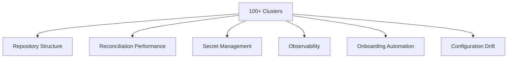

# How to Scale GitOps to 100+ Clusters with Flux CD

Author: [nawazdhandala](https://github.com/nawazdhandala)

Tags: Flux CD, Scaling, Multi-Cluster, GitOps, Kubernetes, Fleet Management

Description: Strategies and best practices for scaling Flux CD GitOps operations to manage over 100 Kubernetes clusters efficiently.

---

## Introduction

Managing a handful of Kubernetes clusters with GitOps is straightforward, but scaling to 100 or more clusters introduces unique challenges around repository structure, reconciliation performance, secret management, and operational visibility. This guide shares proven strategies for scaling Flux CD to large cluster fleets without sacrificing reliability or developer experience.

## Prerequisites

- Experience with Flux CD fundamentals
- A Git hosting platform that supports large repositories (GitHub, GitLab)
- A management cluster or CI/CD pipeline for fleet orchestration
- kubectl and Flux CLI installed

## Challenges at Scale



## Strategy 1: Repository Structure for Scale

A monolithic repository becomes unwieldy at scale. Use a multi-repo approach with clear separation of concerns.

### Recommended Multi-Repo Layout

```text
# Repository 1: fleet-platform
# Contains platform-level configurations shared across all clusters
fleet-platform/
  global/
    namespaces/
    rbac/
    network-policies/
  addons/
    monitoring/
    logging/
    cert-manager/
    ingress-nginx/

# Repository 2: fleet-apps
# Contains application deployments
fleet-apps/
  base/
    app-1/
    app-2/
  overlays/
    production/
    staging/

# Repository 3: fleet-clusters
# Contains cluster-specific configurations and cluster registry
fleet-clusters/
  clusters/
    cluster-001/
      config.yaml       # Cluster metadata
      kustomization.yaml
    cluster-002/
      config.yaml
      kustomization.yaml
    ...
    cluster-150/
      config.yaml
      kustomization.yaml
  templates/             # Templates for new clusters
    standard-cluster/
    edge-cluster/
```

### Step 1: Define Cluster Templates

Use templates to onboard new clusters quickly.

```yaml
# fleet-clusters/templates/standard-cluster/kustomization.yaml
# Template for a standard production cluster
apiVersion: kustomize.config.k8s.io/v1beta1
kind: Kustomization
resources:
  - flux-system.yaml
  - platform.yaml
  - apps.yaml
```

```yaml
# fleet-clusters/templates/standard-cluster/flux-system.yaml
# GitRepository sources for the cluster
apiVersion: source.toolkit.fluxcd.io/v1
kind: GitRepository
metadata:
  name: fleet-platform
  namespace: flux-system
spec:
  interval: 5m
  url: https://github.com/your-org/fleet-platform.git
  ref:
    branch: main
  secretRef:
    name: git-credentials
---
apiVersion: source.toolkit.fluxcd.io/v1
kind: GitRepository
metadata:
  name: fleet-apps
  namespace: flux-system
spec:
  interval: 5m
  url: https://github.com/your-org/fleet-apps.git
  ref:
    branch: main
  secretRef:
    name: git-credentials
```

```yaml
# fleet-clusters/templates/standard-cluster/platform.yaml
# Kustomization for platform components
apiVersion: kustomize.toolkit.fluxcd.io/v1
kind: Kustomization
metadata:
  name: platform-global
  namespace: flux-system
spec:
  interval: 30m
  path: ./global
  prune: true
  sourceRef:
    kind: GitRepository
    name: fleet-platform
  # Longer interval for stable platform components
  retryInterval: 5m
  timeout: 10m
---
apiVersion: kustomize.toolkit.fluxcd.io/v1
kind: Kustomization
metadata:
  name: platform-addons
  namespace: flux-system
spec:
  interval: 30m
  path: ./addons
  prune: true
  sourceRef:
    kind: GitRepository
    name: fleet-platform
  dependsOn:
    - name: platform-global
  # Substitute cluster-specific values
  postBuild:
    substituteFrom:
      - kind: ConfigMap
        name: cluster-config
```

## Strategy 2: Automated Cluster Onboarding

### Step 2: Create an Onboarding Script

```bash
#!/bin/bash
# onboard-cluster.sh - Automate new cluster onboarding
# Usage: ./onboard-cluster.sh <cluster-name> <region> <environment>

CLUSTER_NAME=$1
REGION=$2
ENVIRONMENT=$3
REPO_PATH="/tmp/fleet-clusters"

# Clone the fleet-clusters repository
git clone git@github.com:your-org/fleet-clusters.git $REPO_PATH
cd $REPO_PATH

# Create cluster directory from template
cp -r templates/standard-cluster "clusters/${CLUSTER_NAME}"

# Create cluster-specific ConfigMap
cat > "clusters/${CLUSTER_NAME}/cluster-config.yaml" << EOF
apiVersion: v1
kind: ConfigMap
metadata:
  name: cluster-config
  namespace: flux-system
data:
  CLUSTER_NAME: "${CLUSTER_NAME}"
  CLUSTER_REGION: "${REGION}"
  CLUSTER_ENVIRONMENT: "${ENVIRONMENT}"
  CLUSTER_ID: "$(uuidgen | tr '[:upper:]' '[:lower:]')"
EOF

# Commit and push
git add "clusters/${CLUSTER_NAME}"
git commit -m "Onboard cluster: ${CLUSTER_NAME} (${REGION}, ${ENVIRONMENT})"
git push origin main

echo "Cluster ${CLUSTER_NAME} onboarded. Bootstrap Flux on the cluster:"
echo "flux bootstrap github --owner=your-org --repository=fleet-clusters \\"
echo "  --branch=main --path=clusters/${CLUSTER_NAME}"
```

### Step 3: Bootstrap Flux on Each Cluster

```bash
# Bootstrap Flux pointing to the cluster-specific path
flux bootstrap github \
  --owner=your-org \
  --repository=fleet-clusters \
  --branch=main \
  --path="clusters/${CLUSTER_NAME}" \
  --personal
```

## Strategy 3: Optimize Reconciliation Performance

### Step 4: Tune Flux Controller Resources

At scale, Flux controllers need more resources and tuned concurrency.

```yaml
# flux-system/kustomization.yaml
# Patch Flux controllers for high-scale operation
apiVersion: kustomize.config.k8s.io/v1beta1
kind: Kustomization
resources:
  - gotk-components.yaml
  - gotk-sync.yaml
patches:
  # Increase source-controller resources and concurrency
  - target:
      kind: Deployment
      name: source-controller
    patch: |
      - op: replace
        path: /spec/template/spec/containers/0/resources
        value:
          requests:
            cpu: 500m
            memory: 512Mi
          limits:
            cpu: "2"
            memory: 2Gi
      - op: add
        path: /spec/template/spec/containers/0/args/-
        value: "--concurrent=10"
      - op: add
        path: /spec/template/spec/containers/0/args/-
        value: "--requeue-dependency=15s"
  # Increase kustomize-controller concurrency
  - target:
      kind: Deployment
      name: kustomize-controller
    patch: |
      - op: replace
        path: /spec/template/spec/containers/0/resources
        value:
          requests:
            cpu: 500m
            memory: 1Gi
          limits:
            cpu: "2"
            memory: 4Gi
      - op: add
        path: /spec/template/spec/containers/0/args/-
        value: "--concurrent=10"
  # Increase helm-controller concurrency
  - target:
      kind: Deployment
      name: helm-controller
    patch: |
      - op: replace
        path: /spec/template/spec/containers/0/resources
        value:
          requests:
            cpu: 500m
            memory: 512Mi
          limits:
            cpu: "2"
            memory: 2Gi
      - op: add
        path: /spec/template/spec/containers/0/args/-
        value: "--concurrent=10"
```

### Step 5: Use Appropriate Reconciliation Intervals

```yaml
# Different intervals for different resource types
# Stable platform components: reconcile less frequently
apiVersion: kustomize.toolkit.fluxcd.io/v1
kind: Kustomization
metadata:
  name: platform-global
  namespace: flux-system
spec:
  # Platform resources rarely change, check every 30 minutes
  interval: 30m
  path: ./global
  prune: true
  sourceRef:
    kind: GitRepository
    name: fleet-platform
---
# Application deployments: reconcile more frequently
apiVersion: kustomize.toolkit.fluxcd.io/v1
kind: Kustomization
metadata:
  name: apps
  namespace: flux-system
spec:
  # Apps change frequently, check every 5 minutes
  interval: 5m
  path: ./overlays/production
  prune: true
  sourceRef:
    kind: GitRepository
    name: fleet-apps
```

## Strategy 4: Centralized Secret Management

### Step 6: Use External Secrets Operator

At scale, managing secrets per cluster is impractical. Use a centralized secret store.

```yaml
# addons/external-secrets/helm-release.yaml
apiVersion: helm.toolkit.fluxcd.io/v2
kind: HelmRelease
metadata:
  name: external-secrets
  namespace: external-secrets
spec:
  interval: 30m
  chart:
    spec:
      chart: external-secrets
      version: "0.9.x"
      sourceRef:
        kind: HelmRepository
        name: external-secrets
  values:
    installCRDs: true
---
# ClusterSecretStore connecting to AWS Secrets Manager
apiVersion: external-secrets.io/v1beta1
kind: ClusterSecretStore
metadata:
  name: aws-secrets-manager
spec:
  provider:
    aws:
      service: SecretsManager
      region: ${CLUSTER_REGION}
      auth:
        jwt:
          serviceAccountRef:
            name: external-secrets-sa
            namespace: external-secrets
---
# ExternalSecret that pulls credentials from the central store
apiVersion: external-secrets.io/v1beta1
kind: ExternalSecret
metadata:
  name: git-credentials
  namespace: flux-system
spec:
  refreshInterval: 1h
  secretStoreRef:
    kind: ClusterSecretStore
    name: aws-secrets-manager
  target:
    name: git-credentials
    creationPolicy: Owner
  data:
    - secretKey: username
      remoteRef:
        key: fleet/git-credentials
        property: username
    - secretKey: password
      remoteRef:
        key: fleet/git-credentials
        property: password
```

## Strategy 5: Fleet-Wide Observability

### Step 7: Centralized Monitoring with Prometheus Federation

```yaml
# addons/monitoring/prometheus-values.yaml
# Prometheus configuration for fleet monitoring
apiVersion: helm.toolkit.fluxcd.io/v2
kind: HelmRelease
metadata:
  name: kube-prometheus-stack
  namespace: monitoring
spec:
  interval: 30m
  chart:
    spec:
      chart: kube-prometheus-stack
      version: "56.x"
      sourceRef:
        kind: HelmRepository
        name: prometheus-community
  values:
    prometheus:
      prometheusSpec:
        # Add external labels for cluster identification
        externalLabels:
          cluster: "${CLUSTER_NAME}"
          region: "${CLUSTER_REGION}"
        # Enable remote write to central Thanos/Mimir
        remoteWrite:
          - url: "https://mimir.example.com/api/v1/push"
            headers:
              X-Scope-OrgID: "${CLUSTER_NAME}"
    # Flux-specific metrics
    additionalServiceMonitors:
      - name: flux-system
        namespaceSelector:
          matchNames:
            - flux-system
        selector:
          matchLabels:
            app.kubernetes.io/part-of: flux
        endpoints:
          - port: http-prom
```

### Step 8: Create a Fleet Dashboard

```yaml
# addons/monitoring/flux-fleet-dashboard.yaml
# Grafana dashboard ConfigMap for fleet-wide Flux monitoring
apiVersion: v1
kind: ConfigMap
metadata:
  name: flux-fleet-dashboard
  namespace: monitoring
  labels:
    grafana_dashboard: "1"
data:
  flux-fleet.json: |
    {
      "dashboard": {
        "title": "Flux Fleet Overview",
        "panels": [
          {
            "title": "Clusters with Failed Reconciliation",
            "type": "stat",
            "targets": [
              {
                "expr": "count(gotk_reconcile_condition{type='Ready',status='False'}) by (cluster)"
              }
            ]
          },
          {
            "title": "Reconciliation Duration by Cluster",
            "type": "heatmap",
            "targets": [
              {
                "expr": "histogram_quantile(0.99, sum(rate(gotk_reconcile_duration_seconds_bucket[5m])) by (le, cluster))"
              }
            ]
          }
        ]
      }
    }
```

## Strategy 6: Progressive Rollouts Across Clusters

### Step 9: Implement Canary Cluster Deployment

```yaml
# fleet-clusters/rollout-groups.yaml
# Define rollout groups for progressive deployment
# Group 1: Canary clusters (deployed first)
# Group 2: Staging clusters (deployed second)
# Group 3: Production clusters (deployed last)

# Canary cluster references a specific branch
# fleet-clusters/clusters/canary-001/apps.yaml
apiVersion: kustomize.toolkit.fluxcd.io/v1
kind: Kustomization
metadata:
  name: apps
  namespace: flux-system
spec:
  interval: 5m
  path: ./overlays/production
  prune: true
  sourceRef:
    kind: GitRepository
    name: fleet-apps
  # Canary clusters track the release-candidate branch
  postBuild:
    substitute:
      APP_VERSION: "v2.1.0-rc1"
---
# Production cluster references the stable tag
# fleet-clusters/clusters/prod-001/apps.yaml
apiVersion: kustomize.toolkit.fluxcd.io/v1
kind: Kustomization
metadata:
  name: apps
  namespace: flux-system
spec:
  interval: 5m
  path: ./overlays/production
  prune: true
  sourceRef:
    kind: GitRepository
    name: fleet-apps
  # Production clusters track the stable branch
  postBuild:
    substitute:
      APP_VERSION: "v2.0.5"
```

## Strategy 7: Handling Git Rate Limits

### Step 10: Use Git Mirrors and Caching

At 100+ clusters, each polling Git can hit API rate limits.

```yaml
# Deploy a Git mirror on the management cluster
# infrastructure/git-mirror/deployment.yaml
apiVersion: apps/v1
kind: Deployment
metadata:
  name: git-mirror
  namespace: flux-system
spec:
  replicas: 2
  selector:
    matchLabels:
      app: git-mirror
  template:
    metadata:
      labels:
        app: git-mirror
    spec:
      containers:
        - name: git-mirror
          image: your-org/git-mirror:v1.0.0
          args:
            - "--repos=your-org/fleet-platform,your-org/fleet-apps,your-org/fleet-clusters"
            - "--interval=60s"
            - "--listen=:8080"
          ports:
            - containerPort: 8080
          resources:
            requests:
              cpu: 200m
              memory: 256Mi
---
apiVersion: v1
kind: Service
metadata:
  name: git-mirror
  namespace: flux-system
spec:
  selector:
    app: git-mirror
  ports:
    - port: 80
      targetPort: 8080
```

Then point cluster GitRepository sources to the mirror:

```yaml
# Use the internal mirror instead of hitting GitHub directly
apiVersion: source.toolkit.fluxcd.io/v1
kind: GitRepository
metadata:
  name: fleet-platform
  namespace: flux-system
spec:
  interval: 5m
  # Point to the internal mirror
  url: http://git-mirror.flux-system.svc.cluster.local/your-org/fleet-platform.git
  ref:
    branch: main
```

## Monitoring Your Fleet

```bash
# Quick health check across all clusters
for cluster in $(kubectl config get-contexts -o name | grep prod); do
  echo "--- $cluster ---"
  flux get kustomizations --context=$cluster --no-header | \
    awk '{printf "%-40s %s\n", $1, $3}'
done

# Count clusters with issues
kubectl config get-contexts -o name | while read ctx; do
  failed=$(flux get kustomizations --context=$ctx --no-header 2>/dev/null | \
    grep -c "False" || true)
  if [ "$failed" -gt 0 ]; then
    echo "ALERT: $ctx has $failed failed kustomizations"
  fi
done
```

## Conclusion

Scaling Flux CD to 100+ clusters requires deliberate architectural decisions around repository structure, reconciliation tuning, secret management, and observability. By using multi-repo strategies, automated onboarding, progressive rollouts, and centralized monitoring, you can maintain operational efficiency even as your fleet grows. The key principles are: automate everything, standardize through templates, monitor centrally, and roll out changes progressively.
