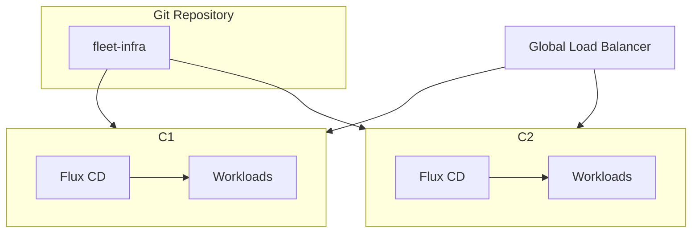

# How to Set Up Active-Active Clusters with Flux CD

Author: [nawazdhandala](https://github.com/nawazdhandala)

Tags: Flux CD, Active-Active, Multi-Cluster, High Availability, Kubernetes, GitOps

Description: A practical guide to setting up active-active Kubernetes clusters with Flux CD for zero-downtime deployments.

---

An active-active cluster setup runs production workloads across multiple clusters simultaneously. Unlike active-passive, both clusters serve traffic at all times. With Flux CD managing both clusters through GitOps, you get consistent deployments and built-in redundancy. This guide covers the complete setup.

## Architecture Overview

In an active-active configuration:

- Both clusters serve production traffic simultaneously
- A global load balancer distributes requests across clusters
- Both clusters reconcile from the same Git repository
- If one cluster fails, the other absorbs all traffic automatically



## Step 1: Structure the Git Repository

```bash
# Repository structure for active-active
fleet-infra/
  clusters/
    base/                         # Shared configurations
      apps/
        kustomization.yaml
        my-app/
          deployment.yaml
          service.yaml
          hpa.yaml
      infrastructure/
        kustomization.yaml
        ingress-nginx/
        cert-manager/
    cluster-a/                    # Cluster A (US-East)
      flux-system/
        gotk-components.yaml
        gotk-sync.yaml
        kustomization.yaml
      apps.yaml
      infrastructure.yaml
      cluster-config.yaml         # Cluster-specific settings
    cluster-b/                    # Cluster B (US-West)
      flux-system/
        gotk-components.yaml
        gotk-sync.yaml
        kustomization.yaml
      apps.yaml
      infrastructure.yaml
      cluster-config.yaml
```

### Shared Base Application

```yaml
# clusters/base/apps/my-app/deployment.yaml
apiVersion: apps/v1
kind: Deployment
metadata:
  name: my-app
  namespace: default
spec:
  # Replica count will be overridden per cluster
  replicas: 3
  selector:
    matchLabels:
      app: my-app
  template:
    metadata:
      labels:
        app: my-app
    spec:
      containers:
        - name: my-app
          image: registry.example.com/my-app:v1.2.3
          ports:
            - containerPort: 8080
          env:
            # Cluster identity injected per-cluster
            - name: CLUSTER_NAME
              valueFrom:
                configMapKeyRef:
                  name: cluster-config
                  key: cluster-name
            - name: CLUSTER_REGION
              valueFrom:
                configMapKeyRef:
                  name: cluster-config
                  key: cluster-region
          readinessProbe:
            httpGet:
              path: /health
              port: 8080
            initialDelaySeconds: 5
            periodSeconds: 10
          resources:
            requests:
              cpu: 200m
              memory: 256Mi
            limits:
              cpu: "1"
              memory: 512Mi
---
# clusters/base/apps/my-app/service.yaml
apiVersion: v1
kind: Service
metadata:
  name: my-app
  namespace: default
spec:
  selector:
    app: my-app
  ports:
    - port: 80
      targetPort: 8080
---
# clusters/base/apps/my-app/hpa.yaml
apiVersion: autoscaling/v2
kind: HorizontalPodAutoscaler
metadata:
  name: my-app
  namespace: default
spec:
  scaleTargetRef:
    apiVersion: apps/v1
    kind: Deployment
    name: my-app
  minReplicas: 3
  maxReplicas: 20
  metrics:
    - type: Resource
      resource:
        name: cpu
        target:
          type: Utilization
          averageUtilization: 70
```

## Step 2: Configure Cluster-Specific Settings

### Cluster A Configuration

```yaml
# clusters/cluster-a/cluster-config.yaml
apiVersion: v1
kind: ConfigMap
metadata:
  name: cluster-config
  namespace: default
data:
  cluster-name: "cluster-a"
  cluster-region: "us-east-1"
  cluster-role: "active"
---
# clusters/cluster-a/apps.yaml
apiVersion: kustomize.toolkit.fluxcd.io/v1
kind: Kustomization
metadata:
  name: apps
  namespace: flux-system
spec:
  interval: 10m
  sourceRef:
    kind: GitRepository
    name: flux-system
  path: ./clusters/base/apps
  prune: true
  wait: true
  timeout: 5m
  # Cluster A specific patches
  patches:
    # Each cluster runs enough replicas to handle full load
    # in case the other cluster goes down
    - target:
        kind: Deployment
      patch: |
        apiVersion: apps/v1
        kind: Deployment
        metadata:
          name: any
        spec:
          replicas: 3
    # Cluster-specific ingress annotations
    - target:
        kind: Ingress
      patch: |
        apiVersion: networking.k8s.io/v1
        kind: Ingress
        metadata:
          name: any
          annotations:
            external-dns.alpha.kubernetes.io/set-identifier: "cluster-a"
            external-dns.alpha.kubernetes.io/aws-weight: "50"
```

### Cluster B Configuration

```yaml
# clusters/cluster-b/cluster-config.yaml
apiVersion: v1
kind: ConfigMap
metadata:
  name: cluster-config
  namespace: default
data:
  cluster-name: "cluster-b"
  cluster-region: "us-west-2"
  cluster-role: "active"
---
# clusters/cluster-b/apps.yaml
apiVersion: kustomize.toolkit.fluxcd.io/v1
kind: Kustomization
metadata:
  name: apps
  namespace: flux-system
spec:
  interval: 10m
  sourceRef:
    kind: GitRepository
    name: flux-system
  path: ./clusters/base/apps
  prune: true
  wait: true
  timeout: 5m
  patches:
    - target:
        kind: Deployment
      patch: |
        apiVersion: apps/v1
        kind: Deployment
        metadata:
          name: any
        spec:
          replicas: 3
    - target:
        kind: Ingress
      patch: |
        apiVersion: networking.k8s.io/v1
        kind: Ingress
        metadata:
          name: any
          annotations:
            external-dns.alpha.kubernetes.io/set-identifier: "cluster-b"
            external-dns.alpha.kubernetes.io/aws-weight: "50"
```

## Step 3: Bootstrap Both Clusters

```bash
# Bootstrap Cluster A
export KUBECONFIG=~/.kube/cluster-a.yaml
flux bootstrap github \
  --owner=my-org \
  --repository=fleet-infra \
  --path=clusters/cluster-a \
  --personal=false \
  --branch=main

# Bootstrap Cluster B
export KUBECONFIG=~/.kube/cluster-b.yaml
flux bootstrap github \
  --owner=my-org \
  --repository=fleet-infra \
  --path=clusters/cluster-b \
  --personal=false \
  --branch=main
```

## Step 4: Configure Global Load Balancing

### AWS Global Accelerator with Route53

```yaml
# clusters/base/infrastructure/external-dns/helmrelease.yaml
apiVersion: helm.toolkit.fluxcd.io/v2
kind: HelmRelease
metadata:
  name: external-dns
  namespace: kube-system
spec:
  interval: 30m
  chart:
    spec:
      chart: external-dns
      version: "1.14.x"
      sourceRef:
        kind: HelmRepository
        name: external-dns
        namespace: flux-system
  values:
    provider: aws
    aws:
      zoneType: public
    domainFilters:
      - example.com
    policy: upsert-only
```

### Weighted DNS Records per Cluster

```yaml
# clusters/cluster-a/dns-records.yaml
apiVersion: externaldns.k8s.io/v1alpha1
kind: DNSEndpoint
metadata:
  name: app-cluster-a
  namespace: default
spec:
  endpoints:
    - dnsName: app.example.com
      recordType: A
      targets:
        - 10.0.1.100  # Cluster A ingress IP
      setIdentifier: cluster-a
      providerSpecific:
        # Weighted routing - 50/50 split
        - name: aws/weight
          value: "50"
        # Health check ensures unhealthy cluster
        # gets removed from rotation
        - name: aws/health-check-id
          value: cluster-a-health-check
---
# clusters/cluster-b/dns-records.yaml
apiVersion: externaldns.k8s.io/v1alpha1
kind: DNSEndpoint
metadata:
  name: app-cluster-b
  namespace: default
spec:
  endpoints:
    - dnsName: app.example.com
      recordType: A
      targets:
        - 10.0.2.100  # Cluster B ingress IP
      setIdentifier: cluster-b
      providerSpecific:
        - name: aws/weight
          value: "50"
        - name: aws/health-check-id
          value: cluster-b-health-check
```

## Step 5: Handle Stateful Workloads

Active-active is straightforward for stateless apps. For stateful workloads, you need shared or replicated data stores.

### External Database Configuration

```yaml
# clusters/base/apps/my-app/database-config.yaml
apiVersion: v1
kind: ConfigMap
metadata:
  name: database-config
  namespace: default
data:
  # Use a globally available database (e.g., Aurora Global Database)
  DATABASE_HOST: "my-db.cluster-global.us-east-1.rds.amazonaws.com"
  DATABASE_PORT: "5432"
  DATABASE_NAME: "myapp"
  # Read replicas per region for read-heavy workloads
  DATABASE_READ_HOST: "my-db.cluster-ro-regional.rds.amazonaws.com"
```

### Redis with Cross-Region Replication

```yaml
# clusters/base/infrastructure/redis/helmrelease.yaml
apiVersion: helm.toolkit.fluxcd.io/v2
kind: HelmRelease
metadata:
  name: redis
  namespace: cache-system
spec:
  interval: 30m
  chart:
    spec:
      chart: redis
      version: "18.x"
      sourceRef:
        kind: HelmRepository
        name: bitnami
        namespace: flux-system
  values:
    # Use AWS ElastiCache Global Datastore instead of in-cluster Redis
    # for active-active scenarios
    architecture: standalone
    auth:
      existingSecret: redis-credentials
    master:
      persistence:
        enabled: true
        size: 10Gi
```

## Step 6: Implement Health Checks

```yaml
# clusters/base/apps/health-check/deployment.yaml
apiVersion: apps/v1
kind: Deployment
metadata:
  name: health-endpoint
  namespace: default
spec:
  replicas: 2
  selector:
    matchLabels:
      app: health-endpoint
  template:
    metadata:
      labels:
        app: health-endpoint
    spec:
      containers:
        - name: health
          image: nginx:alpine
          ports:
            - containerPort: 80
          readinessProbe:
            httpGet:
              path: /healthz
              port: 80
          volumeMounts:
            - name: health-config
              mountPath: /etc/nginx/conf.d
      volumes:
        - name: health-config
          configMap:
            name: health-nginx-config
---
apiVersion: v1
kind: ConfigMap
metadata:
  name: health-nginx-config
  namespace: default
data:
  default.conf: |
    server {
      listen 80;
      location /healthz {
        # Returns 200 when the cluster is healthy
        return 200 'OK';
        add_header Content-Type text/plain;
      }
    }
---
apiVersion: networking.k8s.io/v1
kind: Ingress
metadata:
  name: health-endpoint
  namespace: default
spec:
  ingressClassName: nginx
  rules:
    - host: health.example.com
      http:
        paths:
          - path: /healthz
            pathType: Prefix
            backend:
              service:
                name: health-endpoint
                port:
                  number: 80
```

## Step 7: Monitoring Across Clusters

### Cross-Cluster Flux Monitoring

```yaml
# monitoring/multi-cluster-alerts.yaml
apiVersion: monitoring.coreos.com/v1
kind: PrometheusRule
metadata:
  name: multi-cluster-flux
  namespace: flux-system
spec:
  groups:
    - name: multi-cluster
      rules:
        # Alert when clusters are out of sync
        - alert: ClusterConfigDrift
          expr: |
            abs(
              gotk_resource_info{kind="Kustomization", name="apps", cluster="cluster-a"} -
              gotk_resource_info{kind="Kustomization", name="apps", cluster="cluster-b"}
            ) > 0
          for: 15m
          labels:
            severity: warning
          annotations:
            summary: "Clusters are out of sync"

        # Alert when one cluster has fewer ready pods
        - alert: ClusterCapacityImbalance
          expr: |
            abs(
              sum(kube_deployment_status_replicas_ready{cluster="cluster-a"}) -
              sum(kube_deployment_status_replicas_ready{cluster="cluster-b"})
            ) > 5
          for: 10m
          labels:
            severity: warning
```

## Step 8: Handling Cluster Failures

When one cluster fails in an active-active setup, the remaining cluster automatically absorbs all traffic through DNS health checks.

```bash
# Verify cluster health
for cluster in cluster-a cluster-b; do
  echo "=== $cluster ==="
  KUBECONFIG=~/.kube/$cluster.yaml flux get kustomizations -A
  KUBECONFIG=~/.kube/$cluster.yaml kubectl get pods -A --field-selector status.phase!=Running
done

# If a cluster needs maintenance, drain it gradually
# Step 1: Reduce DNS weight to shift traffic
kubectl patch dnsendpoint app-cluster-a -n default \
  --type=merge -p '{"spec":{"endpoints":[{"dnsName":"app.example.com","providerSpecific":[{"name":"aws/weight","value":"10"}]}]}}'

# Step 2: Wait for connections to drain (based on your TTL)
sleep 120

# Step 3: Perform maintenance
# ...

# Step 4: Restore DNS weight
kubectl patch dnsendpoint app-cluster-a -n default \
  --type=merge -p '{"spec":{"endpoints":[{"dnsName":"app.example.com","providerSpecific":[{"name":"aws/weight","value":"50"}]}]}}'
```

## Verification Checklist

```bash
# 1. Verify both clusters have identical Flux resources
diff \
  <(KUBECONFIG=~/.kube/cluster-a.yaml flux get all -A 2>/dev/null) \
  <(KUBECONFIG=~/.kube/cluster-b.yaml flux get all -A 2>/dev/null)

# 2. Verify DNS is resolving to both clusters
dig app.example.com +short

# 3. Test failover by stopping one cluster's ingress
KUBECONFIG=~/.kube/cluster-a.yaml kubectl scale deployment ingress-nginx-controller \
  -n ingress-nginx --replicas=0
# Verify all traffic goes to cluster-b
curl -v https://app.example.com

# 4. Restore and verify traffic rebalancing
KUBECONFIG=~/.kube/cluster-a.yaml kubectl scale deployment ingress-nginx-controller \
  -n ingress-nginx --replicas=2
```

## Summary

Setting up active-active clusters with Flux CD requires:

1. **Shared Git repository** with cluster-specific overlays for each cluster
2. **Both clusters bootstrapped** and reconciling continuously
3. **Global load balancing** with weighted DNS and health checks
4. **Stateful data strategy** using globally replicated databases
5. **Health endpoints** for automated traffic shifting
6. **Cross-cluster monitoring** to detect drift and capacity imbalances

This setup provides zero-downtime deployments and automatic failover, with both clusters sharing the production load at all times.
