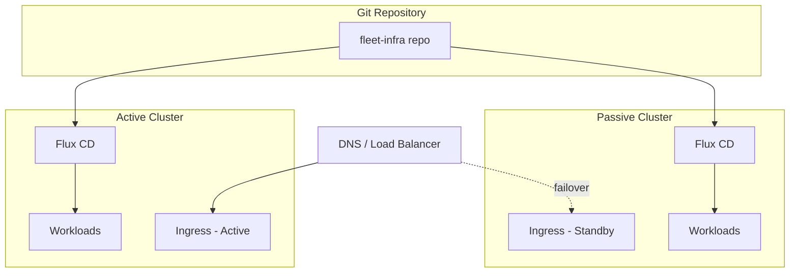

# How to Set Up Active-Passive Clusters with Flux CD

Author: [nawazdhandala](https://github.com/nawazdhandala)

Tags: flux cd, active-passive, disaster recovery, multi-cluster, kubernetes, gitops

Description: A practical guide to setting up active-passive Kubernetes clusters with Flux CD for disaster recovery.

---

An active-passive cluster setup ensures you have a standby environment ready to take over when your primary cluster fails. With Flux CD, both clusters stay in sync through GitOps, making failover fast and reliable. This guide walks you through the complete setup.

## Architecture Overview

In an active-passive configuration:

- The **active cluster** handles all production traffic
- The **passive cluster** continuously reconciles the same Git repository but does not receive traffic
- Both clusters run identical workloads
- A DNS or load balancer switch directs traffic to the passive cluster during failover



## Step 1: Organize the Git Repository

Structure your repository to support both clusters while sharing common configurations.

```bash
# Repository structure
fleet-infra/
  clusters/
    base/                    # Shared configurations
      apps/
        kustomization.yaml
        my-app/
          deployment.yaml
          service.yaml
      infrastructure/
        kustomization.yaml
        ingress-nginx/
          helmrelease.yaml
    active/                  # Active cluster overrides
      flux-system/
        gotk-components.yaml
        gotk-sync.yaml
        kustomization.yaml
      apps.yaml
      infrastructure.yaml
    passive/                 # Passive cluster overrides
      flux-system/
        gotk-components.yaml
        gotk-sync.yaml
        kustomization.yaml
      apps.yaml
      infrastructure.yaml
```

### Shared Base Configuration

```yaml
# clusters/base/apps/my-app/deployment.yaml
apiVersion: apps/v1
kind: Deployment
metadata:
  name: my-app
  namespace: default
spec:
  replicas: 3
  selector:
    matchLabels:
      app: my-app
  template:
    metadata:
      labels:
        app: my-app
    spec:
      containers:
        - name: my-app
          image: registry.example.com/my-app:v1.2.3
          ports:
            - containerPort: 8080
          # Use IfNotPresent to avoid registry dependency
          imagePullPolicy: IfNotPresent
          readinessProbe:
            httpGet:
              path: /health
              port: 8080
            initialDelaySeconds: 5
            periodSeconds: 10
```

## Step 2: Bootstrap Both Clusters

### Bootstrap the Active Cluster

```bash
# Set kubeconfig to the active cluster
export KUBECONFIG=~/.kube/active-cluster.yaml

# Bootstrap Flux pointing to the active cluster path
flux bootstrap github \
  --owner=my-org \
  --repository=fleet-infra \
  --path=clusters/active \
  --personal=false \
  --branch=main
```

### Bootstrap the Passive Cluster

```bash
# Set kubeconfig to the passive cluster
export KUBECONFIG=~/.kube/passive-cluster.yaml

# Bootstrap Flux pointing to the passive cluster path
flux bootstrap github \
  --owner=my-org \
  --repository=fleet-infra \
  --path=clusters/passive \
  --personal=false \
  --branch=main
```

## Step 3: Configure Active Cluster Kustomizations

```yaml
# clusters/active/apps.yaml
apiVersion: kustomize.toolkit.fluxcd.io/v1
kind: Kustomization
metadata:
  name: apps
  namespace: flux-system
spec:
  interval: 10m
  sourceRef:
    kind: GitRepository
    name: flux-system
  path: ./clusters/base/apps
  prune: true
  wait: true
  timeout: 5m
  # Active cluster-specific patches
  patches:
    # Full replica count for the active cluster
    - target:
        kind: Deployment
      patch: |
        apiVersion: apps/v1
        kind: Deployment
        metadata:
          name: any
        spec:
          replicas: 3
```

```yaml
# clusters/active/infrastructure.yaml
apiVersion: kustomize.toolkit.fluxcd.io/v1
kind: Kustomization
metadata:
  name: infrastructure
  namespace: flux-system
spec:
  interval: 10m
  sourceRef:
    kind: GitRepository
    name: flux-system
  path: ./clusters/base/infrastructure
  prune: true
  wait: true
  timeout: 5m
```

## Step 4: Configure Passive Cluster Kustomizations

```yaml
# clusters/passive/apps.yaml
apiVersion: kustomize.toolkit.fluxcd.io/v1
kind: Kustomization
metadata:
  name: apps
  namespace: flux-system
spec:
  interval: 10m
  sourceRef:
    kind: GitRepository
    name: flux-system
  path: ./clusters/base/apps
  prune: true
  wait: true
  timeout: 5m
  patches:
    # Reduced replica count for passive cluster to save resources
    # Scale up happens during failover
    - target:
        kind: Deployment
      patch: |
        apiVersion: apps/v1
        kind: Deployment
        metadata:
          name: any
        spec:
          replicas: 1

    # Mark the ingress as standby
    - target:
        kind: Ingress
      patch: |
        apiVersion: networking.k8s.io/v1
        kind: Ingress
        metadata:
          name: any
          annotations:
            # Do not serve traffic in passive mode
            external-dns.alpha.kubernetes.io/exclude: "true"
```

## Step 5: Configure DNS-Based Failover

### Using External-DNS with Health Checks

```yaml
# clusters/base/infrastructure/external-dns/helmrelease.yaml
apiVersion: helm.toolkit.fluxcd.io/v1
kind: HelmRelease
metadata:
  name: external-dns
  namespace: kube-system
spec:
  interval: 30m
  chart:
    spec:
      chart: external-dns
      version: "1.14.x"
      sourceRef:
        kind: HelmRepository
        name: external-dns
        namespace: flux-system
  values:
    provider: aws
    # Configure Route53 health checks for automatic failover
    aws:
      zoneType: public
      evaluateTargetHealth: true
    domainFilters:
      - example.com
```

### Route53 Failover Configuration

```yaml
# clusters/active/dns-failover.yaml
apiVersion: externaldns.k8s.io/v1alpha1
kind: DNSEndpoint
metadata:
  name: app-active
  namespace: default
spec:
  endpoints:
    - dnsName: app.example.com
      recordType: A
      targets:
        - 10.0.1.100  # Active cluster ingress IP
      setIdentifier: active
      providerSpecific:
        - name: aws/failover
          value: PRIMARY
        - name: aws/health-check-id
          value: active-health-check-id
---
# clusters/passive/dns-failover.yaml
apiVersion: externaldns.k8s.io/v1alpha1
kind: DNSEndpoint
metadata:
  name: app-passive
  namespace: default
spec:
  endpoints:
    - dnsName: app.example.com
      recordType: A
      targets:
        - 10.0.2.100  # Passive cluster ingress IP
      setIdentifier: passive
      providerSpecific:
        - name: aws/failover
          value: SECONDARY
        - name: aws/health-check-id
          value: passive-health-check-id
```

## Step 6: Create the Failover Procedure

### Manual Failover Script

```bash
#!/bin/bash
# failover.sh - Switch traffic from active to passive cluster

set -euo pipefail

ACTIVE_KUBECONFIG="$HOME/.kube/active-cluster.yaml"
PASSIVE_KUBECONFIG="$HOME/.kube/passive-cluster.yaml"

echo "Starting failover to passive cluster..."

# Step 1: Scale up passive cluster workloads
echo "Scaling up passive cluster..."
KUBECONFIG=$PASSIVE_KUBECONFIG kubectl get deployments -A \
  -l app.kubernetes.io/managed-by=flux \
  -o name | while read deploy; do
    KUBECONFIG=$PASSIVE_KUBECONFIG kubectl scale "$deploy" --replicas=3 -A
done

# Step 2: Wait for passive cluster pods to be ready
echo "Waiting for pods to be ready..."
KUBECONFIG=$PASSIVE_KUBECONFIG kubectl wait --for=condition=available \
  deployment --all -n default --timeout=300s

# Step 3: Update DNS to point to passive cluster
echo "Updating DNS records..."
aws route53 change-resource-record-sets \
  --hosted-zone-id Z123456789 \
  --change-batch '{
    "Changes": [{
      "Action": "UPSERT",
      "ResourceRecordSet": {
        "Name": "app.example.com",
        "Type": "A",
        "TTL": 60,
        "ResourceRecords": [{"Value": "10.0.2.100"}]
      }
    }]
  }'

# Step 4: Verify traffic is flowing to passive cluster
echo "Verifying failover..."
sleep 30
curl -s -o /dev/null -w "%{http_code}" https://app.example.com

echo "Failover complete."
```

### Automated Failover with Flux

```yaml
# clusters/passive/failover-watcher.yaml
apiVersion: batch/v1
kind: CronJob
metadata:
  name: failover-watcher
  namespace: flux-system
spec:
  schedule: "*/1 * * * *"
  jobTemplate:
    spec:
      template:
        spec:
          serviceAccountName: failover-controller
          containers:
            - name: watcher
              image: curlimages/curl:latest
              command:
                - /bin/sh
                - -c
                - |
                  # Check if active cluster health endpoint is responding
                  HTTP_CODE=$(curl -s -o /dev/null -w "%{http_code}" \
                    --connect-timeout 5 \
                    https://health.active.example.com/readyz || echo "000")

                  if [ "$HTTP_CODE" != "200" ]; then
                    FAIL_COUNT_FILE="/tmp/failover-count"
                    CURRENT_COUNT=$(cat $FAIL_COUNT_FILE 2>/dev/null || echo "0")
                    NEW_COUNT=$((CURRENT_COUNT + 1))
                    echo $NEW_COUNT > $FAIL_COUNT_FILE

                    # Trigger failover after 3 consecutive failures
                    if [ "$NEW_COUNT" -ge 3 ]; then
                      echo "Active cluster unreachable. Initiating failover..."
                      # Scale up workloads on this (passive) cluster
                      kubectl scale deployment --all --replicas=3 -n default
                    fi
                  fi
          restartPolicy: OnFailure
```

## Step 7: Failback Procedure

After the active cluster recovers, fail back gracefully.

```bash
#!/bin/bash
# failback.sh - Return traffic to the active cluster

set -euo pipefail

ACTIVE_KUBECONFIG="$HOME/.kube/active-cluster.yaml"
PASSIVE_KUBECONFIG="$HOME/.kube/passive-cluster.yaml"

echo "Starting failback to active cluster..."

# Step 1: Force Flux reconciliation on active cluster
echo "Reconciling active cluster..."
KUBECONFIG=$ACTIVE_KUBECONFIG flux reconcile source git flux-system
KUBECONFIG=$ACTIVE_KUBECONFIG flux reconcile kustomization flux-system

# Step 2: Wait for all workloads to be ready on active
echo "Waiting for active cluster workloads..."
KUBECONFIG=$ACTIVE_KUBECONFIG kubectl wait --for=condition=available \
  deployment --all -n default --timeout=300s

# Step 3: Update DNS to point back to active cluster
echo "Updating DNS to active cluster..."
aws route53 change-resource-record-sets \
  --hosted-zone-id Z123456789 \
  --change-batch '{
    "Changes": [{
      "Action": "UPSERT",
      "ResourceRecordSet": {
        "Name": "app.example.com",
        "Type": "A",
        "TTL": 60,
        "ResourceRecords": [{"Value": "10.0.1.100"}]
      }
    }]
  }'

# Step 4: Scale down passive cluster
echo "Scaling down passive cluster..."
KUBECONFIG=$PASSIVE_KUBECONFIG kubectl get deployments -A \
  -l app.kubernetes.io/managed-by=flux \
  -o name | while read deploy; do
    KUBECONFIG=$PASSIVE_KUBECONFIG kubectl scale "$deploy" --replicas=1 -A
done

echo "Failback complete."
```

## Testing the Setup

Regularly test your failover procedures.

```bash
# Verify both clusters are synced
KUBECONFIG=~/.kube/active-cluster.yaml flux get kustomizations -A
KUBECONFIG=~/.kube/passive-cluster.yaml flux get kustomizations -A

# Compare deployed versions
KUBECONFIG=~/.kube/active-cluster.yaml kubectl get deployments -A -o wide
KUBECONFIG=~/.kube/passive-cluster.yaml kubectl get deployments -A -o wide

# Simulate active cluster failure (in a test environment)
KUBECONFIG=~/.kube/active-cluster.yaml kubectl cordon --all
# Then run the failover script and verify

# Run a failover drill monthly
```

## Summary

Setting up active-passive clusters with Flux CD involves:

1. **Shared Git repository** with cluster-specific overlays
2. **Both clusters bootstrapped** with Flux pointing to their respective paths
3. **Passive cluster** runs with reduced replicas to save resources
4. **DNS-based failover** using Route53 or similar health-checked DNS
5. **Automated or manual failover** scripts to scale up passive and switch DNS
6. **Regular testing** of failover and failback procedures

This setup gives you a warm standby environment that can take over production traffic within minutes when your primary cluster fails.
