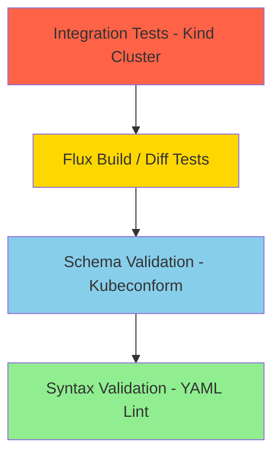

# How to Set Up Automated Testing in CI/CD for Flux CD Manifests

Author: [nawazdhandala](https://github.com/nawazdhandala)

Tags: flux cd, ci/cd, automated testing, github actions, kubernetes, gitops, validation

Description: A complete guide to setting up automated testing pipelines for Flux CD manifests using GitHub Actions, covering syntax, schema, build, and integration testing.

---

Automated testing in CI/CD pipelines ensures that every change to your Flux CD manifests is validated before reaching your Kubernetes clusters. This guide walks through building a comprehensive testing pipeline that catches errors at multiple levels, from basic syntax to full integration testing.

## Prerequisites

- A GitHub repository with Flux CD configurations
- GitHub Actions enabled
- Basic understanding of Flux CD, Kustomize, and Helm
- Familiarity with CI/CD concepts

## Testing Pyramid for Flux CD

Testing Flux CD manifests follows a pyramid structure, where fast and cheap tests run first, and slower integration tests run last.



## Layer 1: Syntax Validation

The fastest tests check YAML syntax and formatting.

```yaml
# .github/workflows/flux-ci.yaml
name: Flux CD CI/CD Testing
on:
  pull_request:
    branches: [main]
    paths:
      - "clusters/**"
      - "infrastructure/**"
      - "apps/**"
      - "tenants/**"
  push:
    branches: [main]
    paths:
      - "clusters/**"
      - "infrastructure/**"
      - "apps/**"
      - "tenants/**"

jobs:
  # Layer 1: YAML syntax and linting
  syntax:
    name: YAML Syntax
    runs-on: ubuntu-latest
    steps:
      - name: Checkout
        uses: actions/checkout@v4

      - name: Install yamllint
        run: pip install yamllint

      - name: Lint YAML files
        run: |
          # Create yamllint config for Kubernetes manifests
          cat > /tmp/yamllint-config.yaml << 'EOF'
          extends: default
          rules:
            line-length:
              max: 200
            comments:
              min-spaces-from-content: 1
            truthy:
              check-keys: false
            document-start:
              present: false
          EOF

          yamllint -c /tmp/yamllint-config.yaml \
            clusters/ infrastructure/ apps/

      - name: Check for duplicate keys
        run: |
          # Python script to detect duplicate YAML keys
          python3 << 'PYTHON_EOF'
          import yaml
          import sys
          import glob

          class DuplicateKeyError(Exception):
              pass

          def check_duplicates(loader, node, deep=False):
              mapping = {}
              for key_node, value_node in node.value:
                  key = loader.construct_object(key_node, deep=deep)
                  if key in mapping:
                      raise DuplicateKeyError(f"Duplicate key: {key}")
                  mapping[key] = loader.construct_object(value_node, deep=deep)
              return mapping

          yaml.add_constructor(
              yaml.resolver.BaseResolver.DEFAULT_MAPPING_TAG,
              check_duplicates,
              Loader=yaml.SafeLoader
          )

          errors = 0
          for pattern in ['clusters/**/*.yaml', 'infrastructure/**/*.yaml', 'apps/**/*.yaml']:
              for filepath in glob.glob(pattern, recursive=True):
                  try:
                      with open(filepath) as f:
                          for doc in yaml.safe_load_all(f):
                              pass
                  except DuplicateKeyError as e:
                      print(f"ERROR: {filepath}: {e}")
                      errors += 1
                  except yaml.YAMLError:
                      pass  # Handled by yamllint

          if errors > 0:
              print(f"\nFound {errors} file(s) with duplicate keys")
              sys.exit(1)
          print("No duplicate keys found")
          PYTHON_EOF
```

## Layer 2: Schema Validation

Validate manifests against Kubernetes API schemas and Flux CRD schemas.

```yaml
  # Layer 2: Kubernetes and Flux schema validation
  schema:
    name: Schema Validation
    runs-on: ubuntu-latest
    needs: syntax
    steps:
      - name: Checkout
        uses: actions/checkout@v4

      - name: Install kubeconform
        run: |
          curl -sL https://github.com/yannh/kubeconform/releases/latest/download/kubeconform-linux-amd64.tar.gz | \
            tar xz -C /usr/local/bin

      - name: Download Flux CRD schemas
        run: |
          mkdir -p /tmp/flux-schemas
          curl -sL https://github.com/fluxcd/flux2/releases/latest/download/crd-schemas.tar.gz | \
            tar xz -C /tmp/flux-schemas

      - name: Validate all manifests
        run: |
          ERRORS=0

          # Validate each directory separately for clear reporting
          for dir in clusters infrastructure apps; do
            [ -d "$dir" ] || continue

            echo "Validating $dir/..."
            if find "$dir" -name "*.yaml" -type f | \
              xargs kubeconform \
                -strict \
                -ignore-missing-schemas \
                -schema-location default \
                -schema-location "/tmp/flux-schemas/{{ .ResourceKind }}_{{ .ResourceAPIVersion }}.json" \
                -summary; then
              echo "  PASSED"
            else
              echo "  FAILED"
              ERRORS=$((ERRORS + 1))
            fi
          done

          [ "$ERRORS" -eq 0 ] || exit 1
```

## Layer 3: Flux Build Validation

Use `flux build` to validate Kustomization rendering and variable substitution.

```yaml
  # Layer 3: Flux build validation
  flux-build:
    name: Flux Build
    runs-on: ubuntu-latest
    needs: syntax
    strategy:
      matrix:
        cluster: [staging, production]
      fail-fast: false
    steps:
      - name: Checkout
        uses: actions/checkout@v4

      - name: Install Flux CLI
        uses: fluxcd/flux2/action@main

      - name: Install yq
        run: |
          sudo wget -qO /usr/local/bin/yq \
            https://github.com/mikefarah/yq/releases/latest/download/yq_linux_amd64
          sudo chmod +x /usr/local/bin/yq

      - name: Build all Kustomizations
        run: |
          ERRORS=0
          TOTAL=0

          for ks_file in clusters/${{ matrix.cluster }}/*.yaml; do
            [ -f "$ks_file" ] || continue

            KIND=$(yq '.kind' "$ks_file")
            [ "$KIND" = "Kustomization" ] || continue

            NAME=$(yq '.metadata.name' "$ks_file")
            PATH_FIELD=$(yq '.spec.path' "$ks_file")
            [ "$PATH_FIELD" = "null" ] && continue

            TOTAL=$((TOTAL + 1))
            echo "Building: $NAME"

            if flux build kustomization "$NAME" \
              --path ".${PATH_FIELD}" \
              --kustomization-file "$ks_file" > /tmp/build-output.yaml 2>&1; then
              RESOURCES=$(grep -c "^kind:" /tmp/build-output.yaml || echo 0)
              echo "  OK: $RESOURCES resources rendered"
            else
              echo "  FAILED:"
              cat /tmp/build-output.yaml
              ERRORS=$((ERRORS + 1))
            fi
          done

          echo ""
          echo "Results: $((TOTAL - ERRORS))/$TOTAL passed"
          [ "$ERRORS" -eq 0 ] || exit 1
```

## Layer 4: Helm Template Validation

Validate HelmRelease resources by rendering their templates.

```yaml
  # Layer 4: HelmRelease template rendering
  helm-template:
    name: Helm Template
    runs-on: ubuntu-latest
    needs: syntax
    steps:
      - name: Checkout
        uses: actions/checkout@v4

      - name: Install tools
        run: |
          curl https://raw.githubusercontent.com/helm/helm/main/scripts/get-helm-3 | bash
          sudo wget -qO /usr/local/bin/yq \
            https://github.com/mikefarah/yq/releases/latest/download/yq_linux_amd64
          sudo chmod +x /usr/local/bin/yq

      - name: Discover and add Helm repositories
        run: |
          # Find all HelmRepository definitions and add them
          find . -name "*.yaml" -type f | while read -r file; do
            KIND=$(yq '.kind' "$file" 2>/dev/null)
            if [ "$KIND" = "HelmRepository" ]; then
              NAME=$(yq '.metadata.name' "$file")
              URL=$(yq '.spec.url' "$file")
              [ "$URL" = "null" ] && continue
              echo "Adding repo: $NAME -> $URL"
              helm repo add "$NAME" "$URL" 2>/dev/null || true
            fi
          done
          helm repo update

      - name: Render HelmRelease templates
        run: |
          ERRORS=0

          find . -name "*.yaml" -type f | while read -r file; do
            KIND=$(yq '.kind' "$file" 2>/dev/null)
            [ "$KIND" = "HelmRelease" ] || continue

            NAME=$(yq '.metadata.name' "$file")
            NS=$(yq '.metadata.namespace' "$file")
            CHART=$(yq '.spec.chart.spec.chart' "$file")
            VERSION=$(yq '.spec.chart.spec.version' "$file")
            REPO=$(yq '.spec.chart.spec.sourceRef.name' "$file")

            echo "Rendering: $NAME ($CHART@$VERSION)"

            # Extract values to temp file
            yq '.spec.values // {}' "$file" > /tmp/values.yaml

            if helm template "$NAME" "$REPO/$CHART" \
              --version "$VERSION" \
              --namespace "$NS" \
              --values /tmp/values.yaml > /dev/null 2>&1; then
              echo "  OK"
            else
              echo "  FAILED:"
              helm template "$NAME" "$REPO/$CHART" \
                --version "$VERSION" \
                --namespace "$NS" \
                --values /tmp/values.yaml 2>&1 || true
              ERRORS=$((ERRORS + 1))
            fi
          done

          [ "$ERRORS" -eq 0 ] || exit 1
```

## Layer 5: Integration Testing with Kind

Spin up a local Kubernetes cluster and test the actual deployment.

```yaml
  # Layer 5: Integration testing with Kind
  integration:
    name: Integration Test
    runs-on: ubuntu-latest
    needs: [schema, flux-build, helm-template]
    if: github.event_name == 'pull_request'
    steps:
      - name: Checkout
        uses: actions/checkout@v4

      - name: Create Kind cluster
        uses: helm/kind-action@v1
        with:
          cluster_name: flux-test
          config: |
            kind: Cluster
            apiVersion: kind.x-k8s.io/v1alpha4
            nodes:
              - role: control-plane
              - role: worker

      - name: Install Flux CLI
        uses: fluxcd/flux2/action@main

      - name: Install Flux controllers
        run: |
          flux install --components-extra=image-reflector-controller,image-automation-controller

      - name: Apply infrastructure manifests
        run: |
          # Apply base infrastructure to the test cluster
          for ks_file in clusters/staging/*.yaml; do
            [ -f "$ks_file" ] || continue

            KIND=$(yq '.kind' "$ks_file")
            [ "$KIND" = "Kustomization" ] || continue

            PATH_FIELD=$(yq '.spec.path' "$ks_file")
            [ "$PATH_FIELD" = "null" ] && continue

            echo "Applying: $PATH_FIELD"
            # Use kustomize build and kubectl apply for testing
            kustomize build ".${PATH_FIELD}" | \
              kubectl apply --dry-run=server -f - || true
          done

      - name: Verify Flux resource health
        run: |
          # Check that all Flux resources can be created
          kubectl get crds | grep fluxcd || true

          echo "Integration test completed successfully"

      - name: Cleanup
        if: always()
        run: kind delete cluster --name flux-test
```

## Layer 6: Security Scanning

Scan manifests for security issues.

```yaml
  # Layer 6: Security scanning
  security:
    name: Security Scan
    runs-on: ubuntu-latest
    needs: syntax
    steps:
      - name: Checkout
        uses: actions/checkout@v4

      - name: Run Trivy config scan
        uses: aquasecurity/trivy-action@master
        with:
          scan-type: config
          scan-ref: .
          severity: HIGH,CRITICAL
          exit-code: 1

      - name: Detect unencrypted secrets
        run: |
          ERRORS=0

          find . -name "*.yaml" -type f | while read -r file; do
            if grep -q "kind: Secret" "$file" 2>/dev/null; then
              if ! grep -q "sops:" "$file"; then
                echo "ERROR: Unencrypted Secret: $file"
                ERRORS=$((ERRORS + 1))
              fi
            fi
          done

          [ "$ERRORS" -eq 0 ] || exit 1
          echo "No unencrypted secrets found"
```

## Test Results Summary

```yaml
  # Post test results summary to PR
  summary:
    name: Test Summary
    runs-on: ubuntu-latest
    needs: [syntax, schema, flux-build, helm-template, security]
    if: always() && github.event_name == 'pull_request'
    permissions:
      pull-requests: write
    steps:
      - name: Post summary
        uses: actions/github-script@v7
        with:
          script: |
            const results = {
              'YAML Syntax': '${{ needs.syntax.result }}',
              'Schema Validation': '${{ needs.schema.result }}',
              'Flux Build': '${{ needs.flux-build.result }}',
              'Helm Template': '${{ needs.helm-template.result }}',
              'Security Scan': '${{ needs.security.result }}',
            };

            let body = '## Flux CD CI Test Results\n\n';
            body += '| Test | Result |\n|------|--------|\n';

            let allPassed = true;
            for (const [name, result] of Object.entries(results)) {
              const icon = result === 'success' ? 'PASS' : result === 'failure' ? 'FAIL' : 'SKIP';
              body += `| ${name} | ${icon} |\n`;
              if (result === 'failure') allPassed = false;
            }

            body += allPassed
              ? '\nAll tests passed. Safe to merge.'
              : '\nSome tests failed. Please fix before merging.';

            await github.rest.issues.createComment({
              owner: context.repo.owner,
              repo: context.repo.repo,
              issue_number: context.issue.number,
              body: body,
            });
```

## Local Test Runner

Run the same tests locally before pushing.

```bash
#!/bin/bash
# scripts/run-tests.sh
# Run all CI tests locally

set -euo pipefail

echo "=========================================="
echo "  Flux CD Manifest Test Suite (Local)"
echo "=========================================="

FAILURES=0

# Layer 1: YAML syntax
echo ""
echo "[1/5] YAML Syntax..."
if yamllint -d relaxed clusters/ infrastructure/ apps/ 2>/dev/null; then
  echo "  PASSED"
else
  echo "  FAILED"
  FAILURES=$((FAILURES + 1))
fi

# Layer 2: Schema validation
echo "[2/5] Schema Validation..."
if command -v kubeconform &>/dev/null; then
  if find clusters/ infrastructure/ apps/ -name "*.yaml" -type f | \
    xargs kubeconform -strict -ignore-missing-schemas -summary 2>/dev/null; then
    echo "  PASSED"
  else
    echo "  FAILED"
    FAILURES=$((FAILURES + 1))
  fi
else
  echo "  SKIPPED (kubeconform not installed)"
fi

# Layer 3: Flux build
echo "[3/5] Flux Build..."
if command -v flux &>/dev/null; then
  BUILD_ERRORS=0
  for cluster in staging production; do
    for ks_file in clusters/$cluster/*.yaml; do
      [ -f "$ks_file" ] || continue
      NAME=$(yq '.metadata.name' "$ks_file" 2>/dev/null)
      PATH_FIELD=$(yq '.spec.path' "$ks_file" 2>/dev/null)
      [ "$NAME" = "null" ] || [ "$PATH_FIELD" = "null" ] && continue

      if ! flux build kustomization "$NAME" \
        --path ".${PATH_FIELD}" \
        --kustomization-file "$ks_file" > /dev/null 2>&1; then
        echo "  FAILED: $NAME ($cluster)"
        BUILD_ERRORS=$((BUILD_ERRORS + 1))
      fi
    done
  done

  if [ "$BUILD_ERRORS" -eq 0 ]; then
    echo "  PASSED"
  else
    FAILURES=$((FAILURES + 1))
  fi
else
  echo "  SKIPPED (flux CLI not installed)"
fi

# Layer 4: Kustomize builds
echo "[4/5] Kustomize Builds..."
KS_ERRORS=0
find . -path "*/overlays/*/kustomization.yaml" | while read -r ks_file; do
  DIR=$(dirname "$ks_file")
  if ! kustomize build "$DIR" > /dev/null 2>&1; then
    echo "  FAILED: $DIR"
    KS_ERRORS=$((KS_ERRORS + 1))
  fi
done
if [ "$KS_ERRORS" -eq 0 ]; then
  echo "  PASSED"
else
  FAILURES=$((FAILURES + 1))
fi

# Layer 5: Secret detection
echo "[5/5] Secret Detection..."
SECRET_ERRORS=0
find . -name "*.yaml" -type f | while read -r file; do
  if grep -q "kind: Secret" "$file" 2>/dev/null && ! grep -q "sops:" "$file"; then
    echo "  ALERT: Unencrypted secret: $file"
    SECRET_ERRORS=$((SECRET_ERRORS + 1))
  fi
done
if [ "$SECRET_ERRORS" -eq 0 ]; then
  echo "  PASSED"
else
  FAILURES=$((FAILURES + 1))
fi

echo ""
echo "=========================================="
if [ "$FAILURES" -gt 0 ]; then
  echo "RESULT: $FAILURES test layer(s) failed"
  exit 1
fi
echo "RESULT: All tests passed"
```

## Summary

A comprehensive CI/CD testing pipeline for Flux CD manifests should include YAML syntax validation, Kubernetes schema checking, Flux build verification, Helm template rendering, integration testing with Kind clusters, and security scanning. Layer these tests from fast to slow, and run them on every pull request. Use the local test runner for quick feedback during development before pushing changes.
