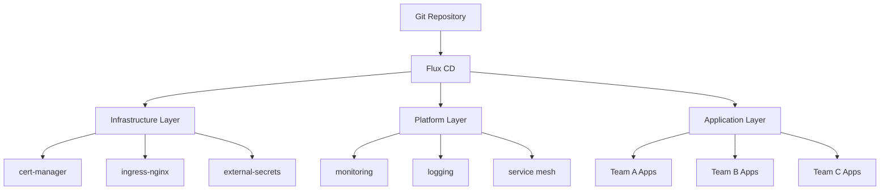

# How to Set Up a Complete GitOps Platform with Flux CD from Scratch

Author: [nawazdhandala](https://github.com/nawazdhandala)

Tags: Flux CD, GitOps, Kubernetes, Platform Engineering, Infrastructure, Helm, Kustomize, Monitoring

Description: A comprehensive guide to building a production-ready GitOps platform with Flux CD from scratch, covering cluster bootstrap, repository structure, secrets, monitoring, and multi-environment management.

---

## Introduction

Setting up a complete GitOps platform requires more than just installing Flux CD. You need a well-organized repository structure, secret management, monitoring, multi-environment support, and operational procedures. This guide walks through building a production-ready GitOps platform from scratch, covering every layer from cluster bootstrap to application delivery.

## Prerequisites

- Two or more Kubernetes clusters (development and production)
- A Git hosting platform (GitHub, GitLab, or Bitbucket)
- kubectl and flux CLI installed
- Helm CLI installed
- A container registry

## Platform Architecture



## Step 1: Repository Structure

Create a well-organized repository structure that separates concerns:

```bash
# Create the repository structure
mkdir -p fleet-infra/{clusters,infrastructure,platform,apps,tenants}

# Cluster-specific configurations
mkdir -p fleet-infra/clusters/{dev,staging,production}

# Infrastructure components (installed first)
mkdir -p fleet-infra/infrastructure/{controllers,configs}
mkdir -p fleet-infra/infrastructure/controllers/{cert-manager,ingress-nginx,external-secrets,sealed-secrets}

# Platform services (installed second)
mkdir -p fleet-infra/platform/{monitoring,logging,service-mesh}

# Application definitions (installed last)
mkdir -p fleet-infra/apps/{base,dev,staging,production}

# Tenant configurations
mkdir -p fleet-infra/tenants/{base,dev,staging,production}
```

## Step 2: Bootstrap Flux CD

Bootstrap Flux CD on your development cluster first:

```bash
# Export your Git credentials
export GITHUB_TOKEN=<your-token>
export GITHUB_USER=<your-username>

# Bootstrap Flux on the dev cluster
flux bootstrap github \
  --owner=$GITHUB_USER \
  --repository=fleet-infra \
  --branch=main \
  --path=./clusters/dev \
  --personal
```

This creates the base Flux system components. Now configure the cluster entry point:

```yaml
# clusters/dev/infrastructure.yaml
apiVersion: kustomize.toolkit.fluxcd.io/v1
kind: Kustomization
metadata:
  name: infrastructure-controllers
  namespace: flux-system
spec:
  interval: 1h
  retryInterval: 1m
  timeout: 5m
  sourceRef:
    kind: GitRepository
    name: flux-system
  path: ./infrastructure/controllers
  prune: true
  wait: true
---
# clusters/dev/infrastructure-configs.yaml
apiVersion: kustomize.toolkit.fluxcd.io/v1
kind: Kustomization
metadata:
  name: infrastructure-configs
  namespace: flux-system
spec:
  interval: 1h
  retryInterval: 1m
  timeout: 5m
  sourceRef:
    kind: GitRepository
    name: flux-system
  path: ./infrastructure/configs
  prune: true
  # Wait for controllers to be ready first
  dependsOn:
    - name: infrastructure-controllers
---
# clusters/dev/platform.yaml
apiVersion: kustomize.toolkit.fluxcd.io/v1
kind: Kustomization
metadata:
  name: platform
  namespace: flux-system
spec:
  interval: 1h
  retryInterval: 1m
  timeout: 10m
  sourceRef:
    kind: GitRepository
    name: flux-system
  path: ./platform
  prune: true
  dependsOn:
    - name: infrastructure-configs
---
# clusters/dev/apps.yaml
apiVersion: kustomize.toolkit.fluxcd.io/v1
kind: Kustomization
metadata:
  name: apps
  namespace: flux-system
spec:
  interval: 1h
  retryInterval: 1m
  timeout: 10m
  sourceRef:
    kind: GitRepository
    name: flux-system
  path: ./apps/dev
  prune: true
  dependsOn:
    - name: platform
```

## Step 3: Infrastructure Layer

### cert-manager

```yaml
# infrastructure/controllers/cert-manager/helmrelease.yaml
apiVersion: source.toolkit.fluxcd.io/v1
kind: HelmRepository
metadata:
  name: jetstack
  namespace: flux-system
spec:
  interval: 24h
  url: https://charts.jetstack.io
---
apiVersion: helm.toolkit.fluxcd.io/v2
kind: HelmRelease
metadata:
  name: cert-manager
  namespace: cert-manager
spec:
  interval: 30m
  chart:
    spec:
      chart: cert-manager
      version: "1.16.x"
      sourceRef:
        kind: HelmRepository
        name: jetstack
        namespace: flux-system
  install:
    createNamespace: true
    crds: CreateReplace
  upgrade:
    crds: CreateReplace
  values:
    # Install CRDs with Helm
    installCRDs: true
    # Enable Prometheus metrics
    prometheus:
      enabled: true
      servicemonitor:
        enabled: true
```

### ingress-nginx

```yaml
# infrastructure/controllers/ingress-nginx/helmrelease.yaml
apiVersion: source.toolkit.fluxcd.io/v1
kind: HelmRepository
metadata:
  name: ingress-nginx
  namespace: flux-system
spec:
  interval: 24h
  url: https://kubernetes.github.io/ingress-nginx
---
apiVersion: helm.toolkit.fluxcd.io/v2
kind: HelmRelease
metadata:
  name: ingress-nginx
  namespace: ingress-nginx
spec:
  interval: 30m
  chart:
    spec:
      chart: ingress-nginx
      version: "4.11.x"
      sourceRef:
        kind: HelmRepository
        name: ingress-nginx
        namespace: flux-system
  install:
    createNamespace: true
  values:
    controller:
      # Enable metrics for monitoring
      metrics:
        enabled: true
        serviceMonitor:
          enabled: true
      # Resource limits
      resources:
        requests:
          cpu: 100m
          memory: 128Mi
        limits:
          cpu: 500m
          memory: 256Mi
```

### external-secrets

```yaml
# infrastructure/controllers/external-secrets/helmrelease.yaml
apiVersion: source.toolkit.fluxcd.io/v1
kind: HelmRepository
metadata:
  name: external-secrets
  namespace: flux-system
spec:
  interval: 24h
  url: https://charts.external-secrets.io
---
apiVersion: helm.toolkit.fluxcd.io/v2
kind: HelmRelease
metadata:
  name: external-secrets
  namespace: external-secrets
spec:
  interval: 30m
  chart:
    spec:
      chart: external-secrets
      version: "0.12.x"
      sourceRef:
        kind: HelmRepository
        name: external-secrets
        namespace: flux-system
  install:
    createNamespace: true
  values:
    # Enable webhook for validation
    webhook:
      port: 9443
    # Enable cert controller
    certController:
      enabled: true
```

### Infrastructure Kustomization

```yaml
# infrastructure/controllers/kustomization.yaml
apiVersion: kustomize.config.k8s.io/v1beta1
kind: Kustomization
resources:
  - cert-manager
  - ingress-nginx
  - external-secrets
```

## Step 4: Infrastructure Configs

Configure infrastructure resources like ClusterIssuers and SecretStores:

```yaml
# infrastructure/configs/cluster-issuer.yaml
apiVersion: cert-manager.io/v1
kind: ClusterIssuer
metadata:
  name: letsencrypt-prod
spec:
  acme:
    server: https://acme-v02.api.letsencrypt.org/directory
    email: platform@company.com
    privateKeySecretRef:
      name: letsencrypt-prod-key
    solvers:
      - http01:
          ingress:
            className: nginx
---
# infrastructure/configs/secret-store.yaml
apiVersion: external-secrets.io/v1beta1
kind: ClusterSecretStore
metadata:
  name: aws-secrets-manager
spec:
  provider:
    aws:
      service: SecretsManager
      region: us-east-1
      auth:
        jwt:
          serviceAccountRef:
            name: external-secrets-sa
            namespace: external-secrets
---
# infrastructure/configs/kustomization.yaml
apiVersion: kustomize.config.k8s.io/v1beta1
kind: Kustomization
resources:
  - cluster-issuer.yaml
  - secret-store.yaml
```

## Step 5: Platform Layer - Monitoring

```yaml
# platform/monitoring/helmrelease.yaml
apiVersion: source.toolkit.fluxcd.io/v1
kind: HelmRepository
metadata:
  name: prometheus-community
  namespace: flux-system
spec:
  interval: 24h
  url: https://prometheus-community.github.io/helm-charts
---
apiVersion: helm.toolkit.fluxcd.io/v2
kind: HelmRelease
metadata:
  name: kube-prometheus-stack
  namespace: monitoring
spec:
  interval: 30m
  chart:
    spec:
      chart: kube-prometheus-stack
      version: "65.x"
      sourceRef:
        kind: HelmRepository
        name: prometheus-community
        namespace: flux-system
  install:
    createNamespace: true
    crds: CreateReplace
  upgrade:
    crds: CreateReplace
  values:
    # Grafana configuration
    grafana:
      adminPassword: "" # Use external-secrets in production
      dashboardProviders:
        dashboardproviders.yaml:
          apiVersion: 1
          providers:
            - name: flux
              folder: Flux
              type: file
              options:
                path: /var/lib/grafana/dashboards/flux
    # Prometheus configuration
    prometheus:
      prometheusSpec:
        retention: 30d
        storageSpec:
          volumeClaimTemplate:
            spec:
              accessModes: ["ReadWriteOnce"]
              resources:
                requests:
                  storage: 50Gi
    # Alert manager
    alertmanager:
      alertmanagerSpec:
        storage:
          volumeClaimTemplate:
            spec:
              accessModes: ["ReadWriteOnce"]
              resources:
                requests:
                  storage: 10Gi
```

## Step 6: Flux Notifications

Set up notifications for the platform:

```yaml
# clusters/dev/notifications.yaml
apiVersion: notification.toolkit.fluxcd.io/v1
kind: Provider
metadata:
  name: slack-notifications
  namespace: flux-system
spec:
  type: slack
  channel: flux-dev
  secretRef:
    name: slack-webhook-url
---
apiVersion: notification.toolkit.fluxcd.io/v1
kind: Alert
metadata:
  name: flux-system-alerts
  namespace: flux-system
spec:
  eventSeverity: error
  eventSources:
    - kind: GitRepository
      name: "*"
    - kind: Kustomization
      name: "*"
    - kind: HelmRelease
      name: "*"
    - kind: HelmRepository
      name: "*"
  providerRef:
    name: slack-notifications
```

## Step 7: Tenant Onboarding

Create a base tenant template:

```yaml
# tenants/base/namespace.yaml
apiVersion: v1
kind: Namespace
metadata:
  name: "" # Patched per tenant
  labels:
    toolkit.fluxcd.io/tenant: "true"
---
# tenants/base/rbac.yaml
apiVersion: rbac.authorization.k8s.io/v1
kind: RoleBinding
metadata:
  name: tenant-admin
  namespace: "" # Patched per tenant
roleRef:
  apiGroup: rbac.authorization.k8s.io
  kind: ClusterRole
  name: admin
subjects:
  - kind: Group
    name: "" # Patched per tenant
    apiGroup: rbac.authorization.k8s.io
---
# tenants/base/resource-quota.yaml
apiVersion: v1
kind: ResourceQuota
metadata:
  name: tenant-quota
  namespace: "" # Patched per tenant
spec:
  hard:
    requests.cpu: "4"
    requests.memory: "8Gi"
    limits.cpu: "8"
    limits.memory: "16Gi"
    pods: "50"
---
# tenants/base/network-policy.yaml
apiVersion: networking.k8s.io/v1
kind: NetworkPolicy
metadata:
  name: default-deny
  namespace: "" # Patched per tenant
spec:
  podSelector: {}
  policyTypes:
    - Ingress
    - Egress
  # Allow DNS and within-namespace traffic
  egress:
    - to:
        - namespaceSelector: {}
      ports:
        - protocol: UDP
          port: 53
    - to:
        - podSelector: {}
  ingress:
    - from:
        - podSelector: {}
```

Create a specific tenant:

```yaml
# tenants/dev/team-alpha/kustomization.yaml
apiVersion: kustomize.config.k8s.io/v1beta1
kind: Kustomization
namespace: team-alpha
resources:
  - ../../base
patches:
  - target:
      kind: Namespace
      name: ""
    patch: |
      - op: replace
        path: /metadata/name
        value: team-alpha
  - target:
      kind: RoleBinding
    patch: |
      - op: replace
        path: /subjects/0/name
        value: team-alpha-devs
```

## Step 8: Application Deployment

Define application base and environment overlays:

```yaml
# apps/base/sample-app/deployment.yaml
apiVersion: apps/v1
kind: Deployment
metadata:
  name: sample-app
spec:
  selector:
    matchLabels:
      app: sample-app
  template:
    metadata:
      labels:
        app: sample-app
    spec:
      containers:
        - name: app
          image: registry.company.com/sample-app:latest # {"$imagepolicy": "flux-system:sample-app"}
          ports:
            - containerPort: 8080
          env:
            - name: ENV
              value: "${ENV:=dev}"
          resources:
            requests:
              cpu: 100m
              memory: 128Mi
            limits:
              cpu: 500m
              memory: 256Mi
---
# apps/base/sample-app/service.yaml
apiVersion: v1
kind: Service
metadata:
  name: sample-app
spec:
  selector:
    app: sample-app
  ports:
    - port: 80
      targetPort: 8080
---
# apps/base/sample-app/kustomization.yaml
apiVersion: kustomize.config.k8s.io/v1beta1
kind: Kustomization
resources:
  - deployment.yaml
  - service.yaml
```

Environment-specific overlay:

```yaml
# apps/dev/kustomization.yaml
apiVersion: kustomize.config.k8s.io/v1beta1
kind: Kustomization
resources:
  - ../base/sample-app
patches:
  - target:
      kind: Deployment
      name: sample-app
    patch: |
      - op: replace
        path: /spec/replicas
        value: 1
```

## Step 9: Production Cluster Bootstrap

Bootstrap the production cluster with the same repository:

```bash
# Switch kubectl context to production
kubectl config use-context production

# Bootstrap Flux on production
flux bootstrap github \
  --owner=$GITHUB_USER \
  --repository=fleet-infra \
  --branch=main \
  --path=./clusters/production \
  --personal
```

Create the production cluster entry point:

```yaml
# clusters/production/infrastructure.yaml
apiVersion: kustomize.toolkit.fluxcd.io/v1
kind: Kustomization
metadata:
  name: infrastructure-controllers
  namespace: flux-system
spec:
  interval: 1h
  retryInterval: 1m
  timeout: 5m
  sourceRef:
    kind: GitRepository
    name: flux-system
  path: ./infrastructure/controllers
  prune: true
  wait: true
---
# clusters/production/apps.yaml
apiVersion: kustomize.toolkit.fluxcd.io/v1
kind: Kustomization
metadata:
  name: apps
  namespace: flux-system
spec:
  interval: 1h
  sourceRef:
    kind: GitRepository
    name: flux-system
  path: ./apps/production
  prune: true
  dependsOn:
    - name: platform
```

## Verifying the Platform

```bash
# Check all Flux resources
flux get all -A

# Check infrastructure health
flux get kustomizations

# Check Helm releases
flux get helmreleases -A

# Verify source synchronization
flux get sources all

# Run a full reconciliation
flux reconcile kustomization flux-system --with-source
```

## Best Practices

1. **Dependency ordering**: Always use `dependsOn` to ensure infrastructure is ready before platform services, and platform before applications.

2. **Prune carefully**: Enable `prune: true` to remove orphaned resources, but test in dev first.

3. **Pin versions**: Always pin Helm chart versions to avoid unexpected upgrades.

4. **Use health checks**: Add health checks to Kustomizations to prevent cascading failures.

5. **Separate concerns**: Keep infrastructure, platform, and application configurations in separate directories.

6. **Git branch protection**: Protect the main branch with required reviews and CI checks.

## Conclusion

A well-structured GitOps platform with Flux CD provides a scalable, auditable, and reliable foundation for Kubernetes operations. By following the layered approach outlined in this guide, you create clear separation between infrastructure, platform, and application concerns, making it easy for teams to work independently while maintaining consistency across environments.
